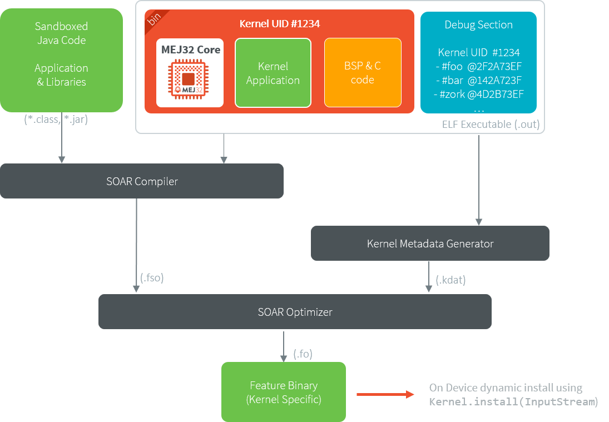
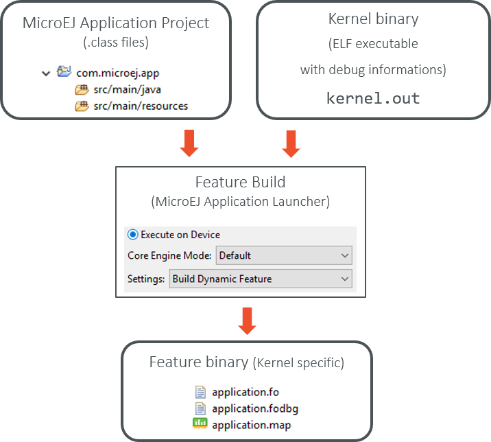
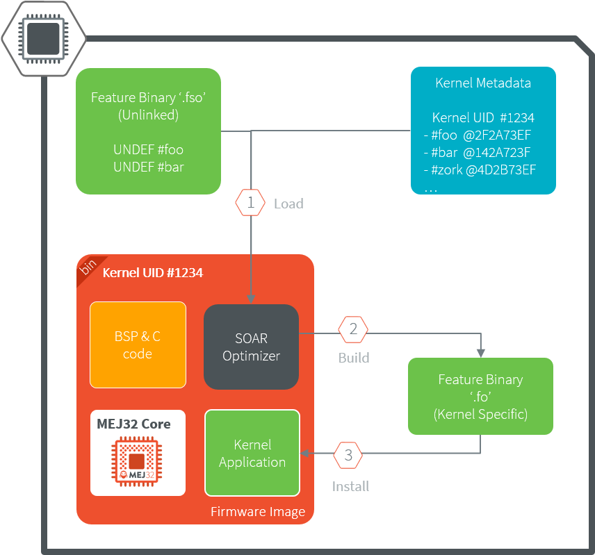
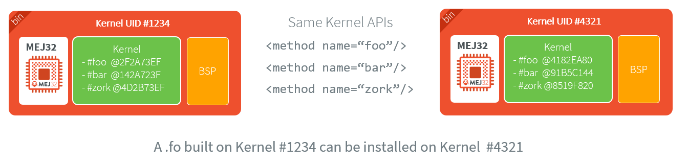

.. _application_link:

Application Linking
===================

This chapter describes how a Sandboxed Application is built so that it can be (dynamically) installed on a Kernel.
The build output file of a Sandboxed Application against a Kernel is called a Feature, hence the ``f`` letter used in the extension name of the related files (``.fso`` and ``.fo`` files).

.. _soar_build_phases:

SOAR Build Phases
-----------------

When building a Sandboxed Application to a Feature, SOAR processing is divided in two phases:

1. **SOAR Compiler**: loads and compiles the set of application ``.class`` files and resources. Among the various steps, mention may be made of:

   - Computing the transitive closure from the application entry points of all required elements (types, methods, fields, strings, immutables, resources, system properties),
   - Computing the :ref:`clinit order <soar_clinit>`.

   The result is an object file that ends with ``.fso`` extension. 
   The ``.fso`` file is a portable file that can be linked on any compatible Kernel (see :ref:`fso_compatibility`).

2. **SOAR Optimizer**: links a ``.fso`` file against a specific Kernel. Among the various steps, mention may be made of:

   - Linking to the expected Kernel APIs (types, methods, fields) according to the JVM specification [1]_,
   - Generating the MEJ32 instructions,
   - Building the virtualization tables.

   The result is an object file that ends with the ``.fo`` extension.
   By default, the ``.fo`` file is specific to a Kernel: it can only be installed on the Kernel it has been linked to. 
   Rebuilding a Kernel implies to run this phase again, unless the application has been built for the previous Kernel (see :ref:`feature_portability`).   

   Sandboxed Application Build Flow

The Feature ``.fo`` file can be deployed in the following ways:

-  Downloaded and installed on Device by software. Refer to the :ref:`[KF]
   specification <kf_specification>` for `Kernel.install() <https://repository.microej.com/javadoc/microej_5.x/apis/ej/kf/Kernel.html#install-java.io.InputStream->`_ method.

-  Installed at build-time into the Multi-Sandboxed Firmware using the :ref:`firmware_linker` tool.

.. _build_feature_off_board:

Feature Build Off Board
-----------------------

A Sandboxed Application can be built to a Feature (``.fo`` file) 
using a :ref:`MicroEJ Application Launch <concepts-microejlaunches>` configured as follows:

-  Set the :guilabel:`Settings` field in the :guilabel:`Execution` tab to :guilabel:`Build Dynamic Feature`.
-  Set the :guilabel:`Kernel` field in the :guilabel:`Configuration` tab to a Multi-Sandboxed Firmware (``.out`` ELF executable file).

   Feature Build Flow using MicroEJ Launch

.. _build_feature_on_device:

Feature Build On Device
-----------------------

.. note::

   This is a new functionality that requires a custom Architecture configuration.
   Please contact :ref:`our support team <get_support>` for more details.
   
The SOAR Optimizer is packaged to a Foundation Library named ``SOAR``, thus this phase can be executed directly on Device.

General Workflow
~~~~~~~~~~~~~~~~

Here are the typical steps to achieve:

- Build the Sandboxed Application on any compatible Kernel to get the ``.fso`` file,
- Transfer the ``.fso`` file on Device by any mean,
- Generate the :ref:`Kernel Metadata <kernel_metadata_generation>` for the Kernel on which the ``.fso`` file is being linked,
- Transfer the ``.kdat`` file on Device by any mean,
- Write a MicroEJ Standalone Application for building the ``.fso`` file:
  
  - implement a ``com.microej.soar.KernelMetadataProvider`` to provide an InputStream to load the ``.kdat`` file,
  - provide an InputStream to load the ``.fso`` file,
  - provide an OutputStream to store the ``.fo`` file,
  - call ``FeatureOptimizer.build()`` method.

Then the ``.fo`` file can be dynamically installed using `Kernel.install() <https://repository.microej.com/javadoc/microej_5.x/apis/ej/kf/Kernel.html#install-java.io.InputStream->`_.

   Sandboxed Application Build on Device

.. note::

   Although this is common, it is not required to run the SOAR Optimizer phase on the Kernel that will dynamically install the ``.fo``. 
   There is no relationship between ``SOAR`` and ``KF`` Foundation Libraries.

Implement the Kernel 
~~~~~~~~~~~~~~~~~~~~

SOAR Optimizer can be integrated on any Standalone Application providing the following :ref:`module dependencies <mmm_module_dependencies>`:

.. code-block:: xml
   
   <dependency org="ej.api" name="edc" rev="1.3.3" />
   <dependency org="com.microej.api" name="soar" rev="1.0.0" />
   <dependency org="ej.library.eclasspath" name="collections" rev="1.4.0" />

The following code template illustrates the usage of the ``SOAR`` Foundation Library:

.. code-block:: java

   package com.microej.example;

   import java.io.IOException;
   import java.io.InputStream;
   import java.io.OutputStream;

   import com.microej.soar.FeatureOptimizer;
   import com.microej.soar.FeatureOptimizerException;
   import com.microej.soar.KernelMetadataProvider;

   /**
   * This is a template code that shows the typical steps to follow for building a
   * .fo file from a .fso file on Device.
   */
   public class TemplateFSOBuild {

      /**
      * Your Platform specific {@link KernelMetadataProvider} implementation.
      */
      private static final class MyKernelMetadataProvider implements KernelMetadataProvider {

         @Override
         public InputStream openInputStream(int offset) throws IOException {
            // Return an InputStream to the Kernel Metadata resource (.kdat file) at the given offset in bytes.
            return null; // TODO
         }

         @Override
         public String toString() {
            // Here, return a printable representation of this Kernel Metadata Provider (for debug purpose only)
            return "Kernel Metadata loaded from ..."; // TODO
         }
      }

      /**
      * A method that builds a .fso file to a .fo file.
      */
      public static void build() {
         // Create the KernelMetadataProvider instance
         KernelMetadataProvider kernelMetadataProvider = new MyKernelMetadataProvider();

         // Load the .fso InputStream
         InputStream fsoInputStream = null; // TODO

         // Prepare the target OutputStream where to store the .fo
         OutputStream foOutputStream = null; // TODO

         // Create the FeatureOptimizer instance
         FeatureOptimizer featureOptimizer;
         try {
            featureOptimizer = new FeatureOptimizer(kernelMetadataProvider);
         } catch (FeatureOptimizerException e) {
            // Handle Kernel Metadata cannot be loaded
            e.printStackTrace(); // TODO
            return;
         }

         // Build
         try {
            featureOptimizer.build(fsoInputStream, foOutputStream);
         } catch (FeatureOptimizerException e) {
            // Handle .fso cannot be built to .fo
            e.printStackTrace(); // TODO
         }
      }
   }

.. _fso_compatibility:

FSO Compatibility
-----------------

A ``.fso`` file can be linked on any Kernel providing all the following conditions:

- its Architecture has the same endianness than the Architecture on which the ``.fso`` file has been produced,
- its Architecture version is compatible [#compatible_def]_ with the Architecture version on which the ``.fso`` file has been produced,
- it provides the required APIs according to the JVM specification [1]_.

.. [1]
   Tim Lindholm & Frank Yellin, The Java™ Virtual Machine Specification, Second Edition, 1999

.. [#compatible_def] New version is greater than or equals to the old one within the same major version.

.. _feature_portability:

Feature Portability
-------------------

By default, a ``.fo`` file can only be installed on the Kernel on which it has been linked. 

Starting from Architecture version ``8.0.0``, the same Feature file can be installed on different Kernels. This is called `Feature Portability`.
Thus it is not required to rebuild the ``.fo`` file in the following cases:

- Relinking the executable (memory layout changes),
- Recompiling the C code,
- Rebuilding the Kernel Application, if :ref:`Feature Portability Control <feature_portability_control>` has been enabled.

   Feature Portability Overview

..
   | Copyright 2008-2022, MicroEJ Corp. Content in this space is free 
   for read and redistribute. Except if otherwise stated, modification 
   is subject to MicroEJ Corp prior approval.
   | MicroEJ is a trademark of MicroEJ Corp. All other trademarks and 
   copyrights are the property of their respective owners.
