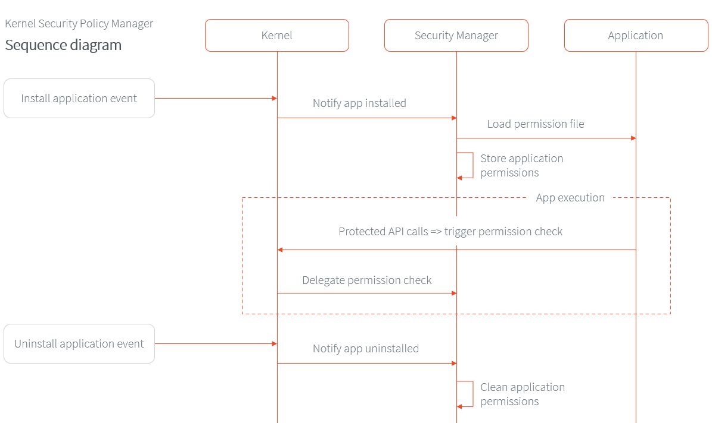

.. _applicationSecurityPolicy:

Define a Security Policy
========================

A security policy allows the Kernel to prevent an Application from accessing resources or calling specific APIs. 
Whereas APIs :ref:`exposed by the Kernel <kernel.api>` allows to control at build-time, the security policy here controls the APIs called at runtime.

Defining a security policy is done by implementing the standard `SecurityManager`_ class.
Basically, all sensitive APIs exposed by the Kernel have already been protected by a :ref:`Permission Check <securitymanager_permission_check>`.
Each time an Application calls such API, the Security Manager `SecurityManager.checkPermission(Permission)`_ implementation verifies that the requested permission has been granted to the Application.

Register a Security Manager
---------------------------

The first step for the Kernel is to register a `SecurityManager`_ implementation.
Usually this is done in the Kernel boot sequence, before starting to run Applications.
However, the Security Manager can be updated at any-time, and a Kernel can also register different implementations during its execution.

For the purpose of ROM footprint optimization, permission checks calls are disabled by default to avoid extra code processing if the system owner does not want to use the Security Manager.
In order to activate this feature, set the :ref:`option_enable_security_manager` option.

Once the Security Manager checks are enabled, you can then implement your own security policy.

To apply a security policy, instantiate a `SecurityManager`_ and register it with `System.setSecurityManager(SecurityManager)`_ method.

.. code-block:: java

      // create an instance of SecurityManager
      SecurityManager sm = new SecurityManager() {
         @Override
         public void checkPermission(java.security.Permission perm) {
            // implement here the Application Security Policy
         };
      };
      // set the Security Manager
      System.setSecurityManager(sm);

The next section will guide you to implement the desired security policy.

Implement a Security Manager
----------------------------

The implementation of the `SecurityManager.checkPermission(Permission)`_ method first retrieves the owner of the requested Permission,
then checks if it is a Feature (not the Kernel), and finally, checks the permission according to the given Feature.

The following code snippet shows the typical implementation:

.. code-block:: java

    public class MyKernelSecurityManager extends SecurityManager {

      @Override
      public void checkPermission(Permission perm) {
        Module caller = Kernel.getContextOwner();
        if(caller == Kernel.getInstance()) {
          // Kernel has all the rights: no checks
        }
        else{
          Feature callerApp = (Feature)caller;
          Kernel.enter();
          if(!isAllowed(callerApp, perm)) {
            throw new SecurityException();
          }
        }
      }

      private boolean isAllowed(Feature callerApp, Permission perm) {
        // implement here the Application Security Policy
      }

    }

You are now ready to implement your policy to decide whether the given permission is granted to the given Application.

The `KF-Util module <https://repository.microej.com/modules/com/microej/library/util/kf-util/>`_ provides ready-to-use implementations, described in the next sections.
Examples of integration are also available in the `Kernel-GREEN`_ project on GitHub.

Security Manager with Application Declared Permissions
~~~~~~~~~~~~~~~~~~~~~~~~~~~~~~~~~~~~~~~~~~~~~~~~~~~~~~

This Security Manager provides a ready-to-use implementation based on permissions declared by the Application itself.
It assumes the application and its permissions file have been approved beforehand by a moderator.

Principle
^^^^^^^^^

Basically, Applications embed a policy resource file that describes the permissions they need at runtime.
This file is then loaded when the Application is installed.
Finally, this Security Manager checks if the permission has been granted to the calling Application.
If a permission check is reached but has not been declared, it throws a `SecurityException`_.

Here is a sequence diagram to describe the entire flow from Feature installation to uninstallation:

Policy File Format
^^^^^^^^^^^^^^^^^^

An Application must define its Application policy file as a :ref:`resource <section.classpath.elements.raw_resources>`. 
By default, the resource name must be ``/feature.policy.json``. 

The policy file format is described in JSON, which is the default syntax supported by this Security Manager. 

Before going further we strongly advise to take a look to the `java.security.Permission`_ specification and its class hierarchy to fully understand the way permissions work (name, action).

The Application policy file declares the list of required `java.security.Permission`_ classes, names and actions as following:

.. code-block:: json

    {
      "permissions": {
        "<permissionClassName1>":{
          "<permissionName1>":["<permissionAction1>","<permissionAction2>"],
          "<permissionName2>":["<permissionAction1>"]
        },
        "<permissionClassName2>":{
          "<permissionName3>":["<permissionAction3>"]
        }
      }
    }

The permission ``name`` and ``action`` attributes are specific to the permission implementation.
Therefore each permission has its own definition of what a name is.

The following keywords allow more flexibility over the content of the file:

* the ``*`` (wildcard) symbol means "any". It can be used for permission class name, permission name and permission actions.
* the ``null`` keyword represents a Java ``null`` value. It can be used for permission name and permission actions.

Policy File Example
^^^^^^^^^^^^^^^^^^^

Here is now an example of what a real JSON Application policy file can look like:

.. code-block:: json

    {
      "permissions": {
        "ej.microui.display.DisplayPermission":{
          "*":[]
        },
        "ej.microui.event.EventPermission":{
          "null":["null"]
        },
        "ej.microui.display.FontPermission":{},
        "ej.microui.display.ImagePermission":{
          "null":["*"]
        },"ej.microui.MicroUIPermission":{
          "*":["start"]
        },"java.net.SocketPermission":{
          "www.microej.com":["connect","resolve"]
        },"java.util.PropertyPermission":{
          "property":["write","read"]
        },"java.lang.RuntimePermission":{
          "exit":[]
        }
      }
    }

To simplify the file structure you can also choose to have an empty object value for permission class name or/and permission actions such as shown in the example above:

.. code-block:: json

    {
      "permissions": {
        "ej.microui.display.DisplayPermission":{
          "*":[]
        },
        "ej.microui.display.FontPermission":{},
        "java.lang.RuntimePermission":{
          "exit":[]
          }
        }
    }

This example:

* allows the usage of any permission name and any actions for the ``ej.microui.display.DisplayPermission`` permission.
* allows the usage of any permission name and any actions for the ``ej.microui.display.FontPermission`` permission.
* allows the ``exit`` permission name and any actions for the ``java.lang.RuntimePermission`` permission. 

Using an empty value or the ``*`` wildcard is left to the developer preference and should be processed in the exact same way by the security policy resource loader.

Kernel Implementation
^^^^^^^^^^^^^^^^^^^^^

Here are the steps to integrate this Security Manager in your Kernel:

#. Add the dependency to the `KF-Util library <https://repository.microej.com/modules/com/microej/library/util/kf-util/>`_ in the Kernel build file

  .. tabs::

    .. tab:: Gradle (build.gradle.kts)

        .. code-block:: kotlin

          implementation("com.microej.library.util:kf-util:2.8.0")

    .. tab:: MMM (module.ivy)

        .. code-block:: xml

          <dependency org="com.microej.library.util" name="kf-util" rev="2.8.0"/>

#. Make sure to embed `java.security.Permission`_ class names
    
    If the Kernel does not embed all class names (see :ref:`Stripping Class Names from an Application <stripclassnames>`),
    the specified Permission class names must be embedded by declaring them as :ref:`Required Types <section.classpath.elements.types>`.
    Any permission check done on a permission class without embedded name will result in a `SecurityException`_.

#. Create the policy resource loader. By default, the library comes with a policy resource loader for the JSON format.
 
   .. code-block:: java
		
		  SecurityPolicyResourceLoader loader = new JsonSecurityPolicyLoader();

   You can also define your own format for the policy resource file by implementing the `_SecurityPolicyResourceLoader`` interface.
   Optionally, you can change the Application file policy name, by setting the :ref:`System Property <system_properties>` ``feature.policy.name`` (defaults to ``/feature.policy.json``).

#. Create the `KernelSecurityPolicyManager`_ instance with the policy resource loader
  
   .. code-block:: java
		  
      SecurityManager sm =  new KernelSecurityPolicyManager(loader);
		
#. Register this instance as the current Security Manager
  
   .. code-block:: java

      System.setSecurityManager(sm);

.. note::
    To log every authorized access, change the logger level to ``FINE`` in the Kernel system properties such as
    ``.level=FINE``.

Security Manager with Permission Dispatch
~~~~~~~~~~~~~~~~~~~~~~~~~~~~~~~~~~~~~~~~~

This Security Manager provides a template for dispatching the permission check per kind of `java.security.Permission`_ class.
The Kernel implementation must provide instances of `FeaturePermissionCheckDelegate`_ to specify the behavior of the `SecurityManager.checkPermission(Permission)`_ for each permission class.
If a permission check is done and no delegate for its permission is found, a `SecurityException`_ is thrown.
The policy grants all applications the permission for a list of permission classes and logs all protected accesses by Applications.

Here are the steps to integrate this Security Manager in your Kernel:

#. Add the dependency to the `KF-Util library <https://repository.microej.com/modules/com/microej/library/util/kf-util/>`_ in the Kernel build file

  .. tabs::

    .. tab:: Gradle (build.gradle.kts)

        .. code-block:: kotlin

          implementation("com.microej.library.util:kf-util:2.8.0")

    .. tab:: MMM (module.ivy)

        .. code-block:: xml

          <dependency org="com.microej.library.util" name="kf-util" rev="2.8.0"/>

#. Create the `KernelSecurityManager`_ instance
  
   .. code-block:: java
		  
      KernelSecurityManager sm = new KernelSecurityManager(loader);

#. Create a new class that implements the `FeaturePermissionCheckDelegate`_ interface like ``MySocketPermissionCheckDelegate`` below.

    .. code-block:: java

      public class CustomPermissionCheckDelegate implements FeaturePermissionCheckDelegate {

          @Override
          public void checkPermission(Permission permission, Feature feature) {
              SocketPermission sPerm = (SocketPermission)permission;
              
              // implement here the SocketPermission check for this Application

          }

      }

#. Associate an instance of this `FeaturePermissionCheckDelegate`_ subclass with the `java.security.Permission`_ to be checked (like ``SocketPermission`` in the example below) by means of the Security Manager.

    .. code-block:: java

        sm.setFeaturePermissionDelegate(SocketPermission.class, new MySocketPermissionCheckDelegate());
  
   This code will apply the logic inside of the ``MySocketPermissionCheckDelegate#checkPermission(Permission permission, Feature feature)`` method to all mapped permissions (such as ``SocketPermission.class`` for this specific example).

#. Repeat the two previous steps for each supported `java.security.Permission`_ class.
		
#. Register this instance as the current Security Manager
  
   .. code-block:: java

      System.setSecurityManager(sm);

.. note::

  The `Kernel-GREEN`_ uses this Security Manager template to log all the Permission checks on the standard output.

.. _SecurityManager: https://repository.microej.com/javadoc/microej_5.x/apis/java/lang/SecurityManager.html
.. _SecurityManager.checkPermission(Permission): https://repository.microej.com/javadoc/microej_5.x/apis/java/lang/SecurityManager.html#checkPermission-java.security.Permission-
.. _System.setSecurityManager(SecurityManager): https://repository.microej.com/javadoc/microej_5.x/apis/java/lang/System.html#setSecurityManager-java.lang.SecurityManager-
.. _Kernel-GREEN: https://github.com/MicroEJ/Kernel-GREEN
.. _FeaturePermissionCheckDelegate: https://repository.microej.com/javadoc/microej_5.x/apis/com/microej/kf/util/security/FeaturePermissionCheckDelegate.html
.. _SecurityException: https://repository.microej.com/javadoc/microej_5.x/apis/java/lang/SecurityException.html
.. _FeaturePolicyPermission: https://repository.microej.com/javadoc/microej_5.x/apis/com/microej/kf/util/security/FeaturePolicyPermission.html
.. _SecurityPolicyResourceLoader: https://repository.microej.com/javadoc/microej_5.x/apis/com/microej/kf/util/security/SecurityPolicyResourceLoader.html
.. _java.security.Permission: https://repository.microej.com/javadoc/microej_5.x/apis/java/security/Permission.html
.. _com.microej.library.util.kf-util: https://repository.microej.com/javadoc/microej_5.x/apis/com/microej/kf/util/security/package-summary.html
.. _KernelSecurityManager: https://repository.microej.com/javadoc/microej_5.x/apis/com/microej/kf/util/security/KernelSecurityManager.html
.. _KernelSecurityPolicyManager: https://repository.microej.com/javadoc/microej_5.x/apis/com/microej/kf/util/security/KernelSecurityPolicyManager.html

..
   | Copyright 2024, MicroEJ Corp. Content in this space is free
   for read and redistribute. Except if otherwise stated, modification
   is subject to MicroEJ Corp prior approval.
   | MicroEJ is a trademark of MicroEJ Corp. All other trademarks and
   copyrights are the property of their respective owners.