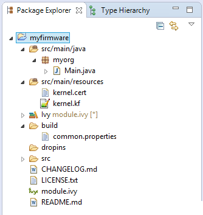
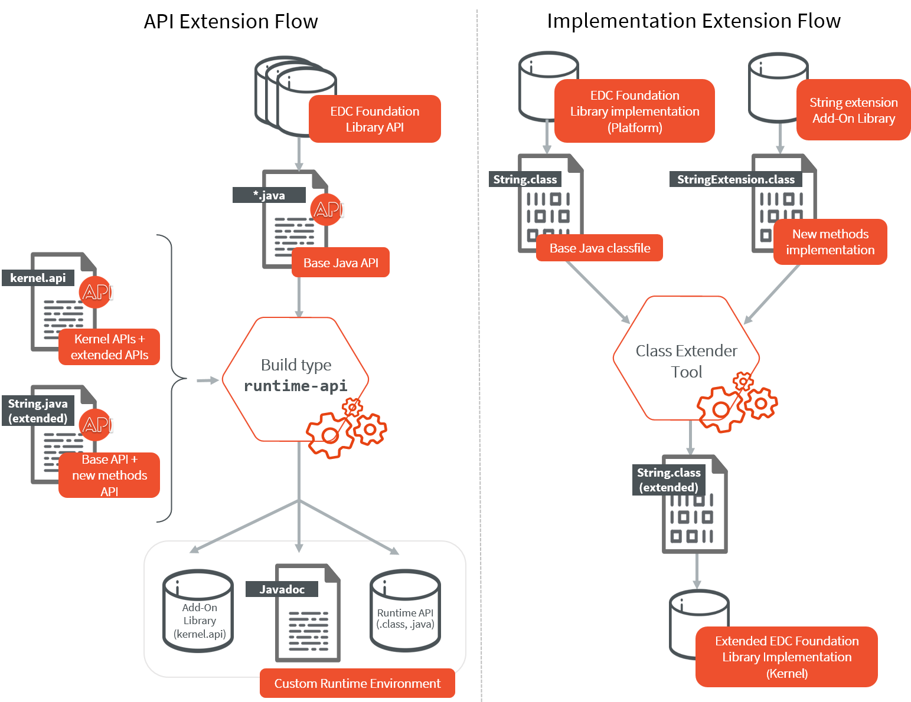
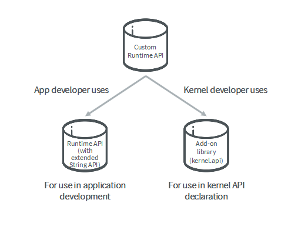
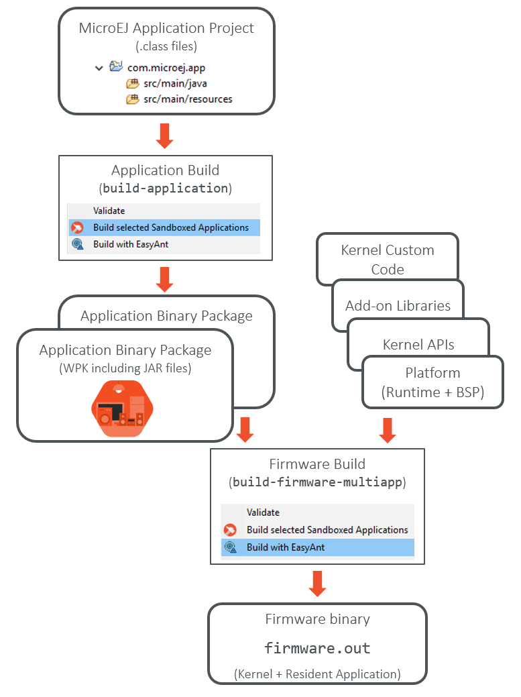

.. _multisandbox_firmware_creation:

Multi-Sandbox Firmware Creation
===============================

This chapter requires a minimum understanding of :ref:`mmm` and :ref:`module_natures`. 

Create a new Firmware Project
-----------------------------

First create a new :ref:`module project <mmm_module_skeleton>` using the ``build-firmware-multiapp`` skeleton.

A new project is generated into the workspace:

.. _fms-project:

Configure a Platform
--------------------

Before building the firmware, a target platform must be configured. The
easiest way to do it is to copy a platform file into the
:guilabel:`myfirmware` > :guilabel:`dropins` folder. Such file usually ends with ``.jpf``.
For other ways to setup the input platform to build a firmware see
:ref:`platform_selection`.

Build the Firmware and Virtual Device
-------------------------------------

In the Package Explorer, right-click on the project and select
:guilabel:`Build Module`. The build of the Firmware and Virtual
Device may take several minutes. When the build is succeed, the folder
:guilabel:`myfirmware` > :guilabel:`target~` > :guilabel:`artifacts` contains the firmware output artifacts
(see :ref:`in_out_artifacts`) :

-  ``mymodule.out``: The Firmware Binary to be programmed on device.

-  ``mymodule.kpk``: The Firmware Package to be imported in a MicroEJ
   Forge instance.

-  ``mymodule.vde``: The Virtual Device to be imported in the SDK.

-  ``mymodule-workingEnv.zip``: This file contains all files produced by
   the build phasis (intermediate, debug and report files).

.. _fms-artifacts:
.. image:: png/firmware-multiapp-skeleton-artifacts.png
   :align: center
   :width: 335px
   :height: 866px

.. _runtime_environment:

Define a Runtime Environment
----------------------------

A Multi-Sandbox Firmware must define a runtime environment which is the set of classes,
methods and fields all applications are allowed to use. In most of the
cases the runtime environment is an aggregation of several :ref:`Kernel APIs <kernel.api>`.

.. note::

   According to the :ref:`Kernel and Features specification <kf_specification>`, no API is open by default to Sandboxed Applications.

Specify Kernel APIs
~~~~~~~~~~~~~~~~~~~

A Kernel API module is added as a dependency with the configuration ``kernelapi->default``.

.. code:: xml

   <dependency org="com.microej.kernelapi" name="edc" rev="1.0.6" conf="kernelapi->default"/>

The build options ``runtime.api.name`` and ``runtime.api.version`` must be set unless declaring a dependency to a Runtime API module.

Create a Runtime API Module
~~~~~~~~~~~~~~~~~~~~~~~~~~~

A Runtime API module is a module that aggregates a set of Kernel APIs modules.

It is be built with :ref:`module project <mmm_module_skeleton>` ``build-runtime-api`` skeleton.

.. code:: xml

   <info organisation="myorg" module="mymodule" status="integration" revision="1.0.0">
      <ea:build organisation="com.is2t.easyant.buildtypes" module="build-runtime-api" revision="2.+">
      <ea:property name="runtime.api.name" value="RUNTIME"/>
      <ea:property name="runtime.api.version" value="1.0"/>
      </ea:build>
   </info>

The build option ``runtime.api.name`` defines the name of the runtime environment (required). 
The build option ``runtime.api.version`` defines its version. If not set, it takes the declared module version.

For example, the following dependencies declare a runtime environment that aggregates all classes, methods and fields
defined by ``edc,kf,bon,wadapps,components`` Kernel APIs modules.

.. code:: xml

   <dependencies>
      <dependency org="com.microej.kernelapi" name="edc" rev="1.0.4"/>
      <dependency org="com.microej.kernelapi" name="kf" rev="2.0.1"/>
      <dependency org="com.microej.kernelapi" name="bon" rev="1.0.4"/>
      <dependency org="com.microej.kernelapi" name="wadapps" rev="1.2.2"/>
      <dependency org="com.microej.kernelapi" name="components" rev="1.2.2"/>
   </dependencies>

Extend a Runtime Environment
~~~~~~~~~~~~~~~~~~~~~~~~~~~~

Foundation and Add-on libraries can be extended by adding new methods to their existing classes thanks to `Class Extender
tool <https://repository.microej.com/modules/com/microej/tool/class-extender/1.0.1/>`_. This tool works at binary level
and is able to inject methods from one class to another. Extensions can thus be independently compiled and be retrieved
by the Kernel and applied during a Multi-Sandbox Firmware build.

To make the extensions available to Application developers, Kernel APIs must be updated too. The ``runtuime-api``
build-type takes base Java APIs, extended APIs and new Kernel API and builds a custom Runtime API.

The following diagram illustrates the process of extending `String` class from EDC from a Kernel developer point of view:

Two processes are taking place to apply extensions:

   1. A Custom Runtime API is built using the `runtime-api` build type. It takes three components

      - EDC foundation library which contains String class we want to extend
      - a :ref:`kernel.api` file definition which includes new methods
      - a new ``String.java`` API source file which includes new methods

      It builds a custom runtime API composed of three componentes:

      - an Add-on library containing the new ``kernel.api``
      - the Runtime API containing the extended String API
      - the corresponding Javadoc including the extended methods

   2. An extended EDC implementation is build during Firmware build calling Class Extender tool. It takes two components:

      - the original EDC Foundation library implementation jar file
      - the String extension Add-on librarty jar file

      It overrides the original EDC Foundation library implementation jar file.

From an application developper perspective, the application only depends on custom APIs that include orginial APIs and
extensions.

Refer to `Class Extender tool README <https://repository.microej.com/modules/com/microej/tool/class-extender/1.0.0/README-1.0.0.md>`_ for more information about class extension and integration to Firmware.

.. _system_application_input_ways:

Add System Applications
-----------------------

A MicroEJ Sandboxed Application can be dynamically installed using 
`Kernel.install() <https://repository.microej.com/javadoc/microej_5.x/apis/ej/kf/Kernel.html#install-java.io.InputStream->`_ 
or can be directly linked into the Firmware binary at built-time. 
In this case, it is called a System Application.

The user can specify the System Applications in two different ways:

-  Set the property ``build-systemapps.dropins.dir`` to a folder which
   contains System Applications (``.wpk`` files).

-  Add a new dependency for each System Application with the configuration ``systemapp->application``:

   .. code:: xml

      <dependency org="com.microej.app.wadapps" name="management" rev="2.2.2" conf="systemapp->application"/>

All System Applications are also included to the Virtual Device.
If a System Application must only be linked to the Firmware,
declare the dependency with the configuration ``systemapp-fw`` instead of ``systemapp``:

.. code:: xml

   <dependency org="com.microej.app.wadapps" name="management" rev="2.2.2" conf="systemapp-fw->application"/>

Build Firmware using Meta Build
-------------------------------

A :ref:`Meta build project <module_natures.meta_build>` can be useful to automatically build Sandboxed Applications 
that will be linked as System Application in the Firmware.

The following figure shows the overall build flow (Sandboxed Application build prior to the Firmware build):

.. _build_flow_buildtype:

   Firmware Build Flow using MicroEJ Module Manager

Build Firmware using MicroEJ Launches
-------------------------------------

It is still possible to build the Firmware using :ref:`concepts-microejlaunches` rather than the regular module build.
This speeds-up the build time thanks to MicroEJ Module Manager workspace resolution and Eclipse incremental compilation.

- Import the Firmware project and all System Application projects in the same workspace,
- Prepare a MicroEJ Application for the Kernel as a regular :ref:`standalone_application`,
- Prepare a MicroEJ Application launch for each System Application using `Build Dynamic Feature` settings,
- Prepare a MicroEJ Tool launch for each System Application using the `Firmware Linker` settings.

The following figure shows the overall build flow:

.. _build_flow_workspace:
.. figure:: png/build_flow_zoom_workspace.png
   :alt: Firmware Build Flow using MicroEJ Launches
   :align: center
   :scale: 80%

   Firmware Build Flow using MicroEJ Launches

Advanced
--------

MicroEJ Firmware ``module.ivy``
~~~~~~~~~~~~~~~~~~~~~~~~~~~~~~~

The following section describes :ref:`module description file <mmm_module_description>` (``module.ivy``) generated by the ``build-firmware-multiapp`` skeleton.

Ivy info
^^^^^^^^

.. code:: xml

   <info organisation="org" module="module" status="integration" 
   revision="1.0.0">
       <ea:build organisation="com.is2t.easyant.buildtypes" module="build-firmware-multiapp" revision="2.+"/>
       <ea:property name="application.main.class" value="org.Main" />
       <ea:property name="runtime.api.name" value="RUNTIME" />
       <ea:property name="runtime.api.version" value="0.1.0" />
   </info>
               

The property ``application.main.class`` is set to the fully qualified
name of the main java class. The firmware generated from the skeleton 
defines its own runtime environment by using ivy dependencies
on several ``kernel API`` instead of relying on a runtime environment
module. As consequence, the ``runtime.api.name`` and
``runtime.api.version`` properties are specified in the firmware project
itself.

.. _ivy_confs:

Ivy Configurations
^^^^^^^^^^^^^^^^^^

The ``build-firmware-multiapp`` build type requires the following
configurations, used to specify the different kind of firmware inputs
(see :ref:`in_out_artifacts`) as Ivy dependencies.

.. code:: xml

   <configurations defaultconfmapping="default->default;provided->provided">
       <conf name="default" visibility="public"/>
       <conf name="provided" visibility="public"/>
       <conf name="platform" visibility="public"/>
       <conf name="vdruntime" visibility="public"/>
       <conf name="kernelapi" visibility="private"/>
       <conf name="systemapp" visibility="private"/>
       <conf name="systemapp-fw" visibility="private"/>
   </configurations>            

The following table lists the different configuration mapping usage
where a dependency line is declared:

::

   <dependency org="..." name="..." rev="..." conf="[Configuration Mapping]"/>

.. tabularcolumns:: |p{4.3cm}|p{3cm}|p{8cm}|
.. table:: Configurations Mapping for ``build-firmware-multiapp`` Build Type

   +-------------------------------+-------------------------------+---------------------------------------------------------------------------------------------------------------------------------------------------------------------------------+
   | Configuration Mapping         | Dependency Kind               | Usage                                                                                                                                                                           |
   +===============================+===============================+=================================================================================================================================================================================+
   | ``provided->provided``        | Foundation Library (``JAR``)  | Expected to be provided by the platform. (e.g. ``ej.api.*`` module)                                                                                                             |
   +-------------------------------+-------------------------------+---------------------------------------------------------------------------------------------------------------------------------------------------------------------------------+
   | ``default->default``          | Add-On Library (``JAR``)      | Embedded in the firmware only, not in the Virtual Device                                                                                                                        |
   +-------------------------------+-------------------------------+---------------------------------------------------------------------------------------------------------------------------------------------------------------------------------+
   | ``vdruntime->default``        | Add-On Library (``JAR``)      | Embedded in the Virtual Device only, not in the firmware                                                                                                                        |
   +-------------------------------+-------------------------------+---------------------------------------------------------------------------------------------------------------------------------------------------------------------------------+
   | ``default->default;``         | Add-On Library (``JAR``)      | Embedded in both the firmware and the Virtual Device                                                                                                                            |
   | ``vdruntime->default``        |                               |                                                                                                                                                                                 |
   +-------------------------------+-------------------------------+---------------------------------------------------------------------------------------------------------------------------------------------------------------------------------+
   | ``platform->platformDev``     | Platform (``JPF``)            | Platform dependency used to build the firmware and the Virtual Device. There are other ways to select the platform (see :ref:`platform_selection`)                              |
   +-------------------------------+-------------------------------+---------------------------------------------------------------------------------------------------------------------------------------------------------------------------------+
   | ``kernelapi->default``        | Runtime Environment (``JAR``) | See :ref:`runtime_environment`                                                                                                                                                  |
   +-------------------------------+-------------------------------+---------------------------------------------------------------------------------------------------------------------------------------------------------------------------------+
   | ``systemapp->application``    | Application (``WPK``)         | Linked into both the firmware and the Virtual Device as System Application. There are other ways to select System Applications (see :ref:`system_application_input_ways`)       |
   +-------------------------------+-------------------------------+---------------------------------------------------------------------------------------------------------------------------------------------------------------------------------+
   | ``systemapp-fw->application`` | Application (``WPK``)         | Linked into the firmware only as System Application.                                                                                                                            |
   +-------------------------------+-------------------------------+---------------------------------------------------------------------------------------------------------------------------------------------------------------------------------+

**Example of minimal firmware dependencies.**

The following example firmware contains one System App (``management``),
and defines an API that contains all types, methods, and fields from
``edc,kf,wadapps,components``.

.. code:: xml

   <dependencies>
       <dependency org="ej.api" name="edc" rev="1.2.0" conf="provided" />
       <dependency org="ej.api" name="kf" rev="1.4.0" conf="provided" />
       <dependency org="ej.library.wadapps" name="framework" rev="1.11.0" />
       <dependency org="com.microej.library.wadapps.kernel" name="common-impl" rev="3.0.0" />
       <dependency org="com.microej.library.wadapps" name="admin-kf-default" rev="1.2.0" />
       <!-- Runtime API (set of Kernel API files) -->
       <dependency org="com.microej.kernelapi" name="edc" rev="1.0.0" conf="kernelapi->default"/>
       <dependency org="com.microej.kernelapi" name="kf" rev="2.0.0" conf="kernelapi->default"/>
       <dependency org="com.microej.kernelapi" name="wadapps" rev="1.0.0" conf="kernelapi->default"/>
       <dependency org="com.microej.kernelapi" name="components" rev="1.0.0" conf="kernelapi->default"/>
       <!-- System Applications -->
       <dependency org="com.microej.app.wadapps" name="management" rev="2.2.2" conf="systemapp->application"/>
   </dependencies>
                           
Build only a Firmware
~~~~~~~~~~~~~~~~~~~~~

Set the property ``skip.build.virtual.device``

.. code:: xml

   <ea:property name="skip.build.virtual.device" value="SET" />

Build only a Virtual Device
~~~~~~~~~~~~~~~~~~~~~~~~~~~

Set the property ``virtual.device.sim.only``

.. code:: xml

   <ea:property name="virtual.device.sim.only" value="SET" />

Build only a Virtual Device with a pre-existing Firmware
~~~~~~~~~~~~~~~~~~~~~~~~~~~~~~~~~~~~~~~~~~~~~~~~~~~~~~~~

Copy/Paste the ``.kpk`` file into the folder ``dropins``

..
   | Copyright 2008-2022, MicroEJ Corp. Content in this space is free 
   for read and redistribute. Except if otherwise stated, modification 
   is subject to MicroEJ Corp prior approval.
   | MicroEJ is a trademark of MicroEJ Corp. All other trademarks and 
   copyrights are the property of their respective owners.
