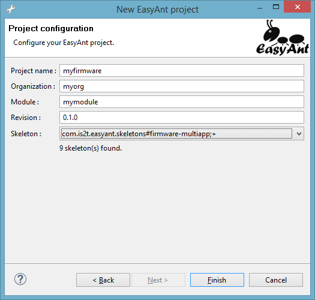

Getting Started
===============

Online Getting Started
----------------------

The MicroEJ Multi-Sandbox Firmware Getting Started is available on MicroEJ
GitHub repository, at
`<https://github.com/MicroEJ/Example-MinimalMultiAppFirmware>`_.

The file ``README.md`` provides a step by step guide to produce a
minimal firmware on an evaluation board on which new applications can be
dynamically deployed through a serial or a TCP/IP connection.

Create an Empty Firmware from Scratch
-------------------------------------

Create a new Firmware Project
~~~~~~~~~~~~~~~~~~~~~~~~~~~~~

First create a new :ref:`module project <mmm_module_skeleton>` using the ``build-firmware-multiapp`` skeleton.

.. _fms:

A new project is generated into the workspace:

.. _fms-project:
.. image:: png/firmware-multiapp-skeleton-project.png
   :align: center
   :width: 334px
   :height: 353px

Setup a Platform
~~~~~~~~~~~~~~~~

Before building the firmware, a target platform must be configured. The
easiest way to do it is to copy a platform file into the
``myfirmware > dropins`` folder. Such file usually ends with ``.jpf``.
For other ways to setup the input platform to build a firmware see
:ref:`module_natures_platform_selection`.

Build the Firmware
~~~~~~~~~~~~~~~~~~

In the Package Explorer, right-click on the firmware project and select
:guilabel:`Build Module`. The build of the Firmware and Virtual
Device may take several minutes. When the build is succeed, the folder
``myfirmware > target~ > artifacts`` contains the firmware output artifacts
(see :ref:`in_out_artifacts`) :

-  ``mymodule.out``: The Firmware Binary to be programmed on device.

-  ``mymodule.kpk``: The Firmware Package to be imported in a MicroEJ
   Forge instance.

-  ``mymodule.vde``: The Virtual Device to be imported in MicroEJ
   Studio.

-  ``mymodule-workingEnv.zip``: This file contains all files produced by
   the build phasis (intermediate, debug and report files).

.. _fms-artifacts:
.. image:: png/firmware-multiapp-skeleton-artifacts.png
   :align: center
   :width: 335px
   :height: 866px

.. |x| image:: ../images/check.png
   :width: 10pt
   :height: 10pt

.. role:: fwgre
.. role:: fwblu
.. role:: fwred
.. role:: fwpur
.. role:: fwbla

MicroEJ Demo VEE Flavors
------------------------
This set of APIs is proposed as examples of industrial or commercial typical products APIs.

What is a MicroEJ Demo Runtime Environment?
~~~~~~~~~~~~~~~~~~~~~~~~~~~~~~~~~~~~~~~~~~~

A MicroEJ Runtime Environment defines a set of MicroEJ APIs exposed to a MicroEJ Sandboxed Application. Here are the default runtimes provided for evaluation by MicroEJ. Any runtime can be customized with MicroEJ SDK for a specific product.

+----------------------------------+-------------+--------------+-------------+--------------+-----------------+-----+-----+-----------+
| MicroEJ Demo Runtime Environment | EDC/B-ON/KF | COMP/WADAPPS | MICROUI/MWT | LEDS/BUTTONS | NET/CONNECT/SSL | BLE | HAL | ECOM/COMM |
+==================================+=============+==============+=============+==============+=================+=====+=====+===========+
| MicroEJ-Developer                | |x|         | |x|          | |x|         | |x|          | |x|             |     | |x| | |x|       |
+----------------------------------+-------------+--------------+-------------+--------------+-----------------+-----+-----+-----------+
| MicroEJ-UI                       | |x|         | |x|          | |x|         | |x|          |                 |     | |x| | |x|       |
+----------------------------------+-------------+--------------+-------------+--------------+-----------------+-----+-----+-----------+
| MicroEJ-Headless                 | |x|         | |x|          |             | |x|          | |x|             |     | |x| | |x|       |
+----------------------------------+-------------+--------------+-------------+--------------+-----------------+-----+-----+-----------+
| MicroEJ-BLE                      | |x|         | |x|          | |x|         | |x|          | |x|             | |x| | |x| | |x|       |
+----------------------------------+-------------+--------------+-------------+--------------+-----------------+-----+-----+-----------+								

You can find below what are the different APIs included in the Runtime Environment:

+----------------------------+--------------------------------------------------------------------------------------------------+
| API                        | Purpose                                                                                          |
+============================+==================================================================================================+
| EDC                        | Core APIs for the execution.                                                                     |
+----------------------------+--------------------------------------------------------------------------------------------------+
| B-ON                       | Memory Usage control and Sequences start-up.                                                     |
+----------------------------+--------------------------------------------------------------------------------------------------+
| KF                         | Required by the implementation of Shared Interfaces, an inter-application communication process. |
+----------------------------+--------------------------------------------------------------------------------------------------+
| COMP or COMPONENTS         | Lightweight Services Framework.                                                                  |
+----------------------------+--------------------------------------------------------------------------------------------------+
| WADAPPS                    | Wadapps Application Framework.                                                                   |
+----------------------------+--------------------------------------------------------------------------------------------------+
| MICROUI/MWT                | Main UI library for MicroEJ and the Widgets framework based on MicroUI.                          |
+----------------------------+--------------------------------------------------------------------------------------------------+
| LEDS or MICROUI-LEDS       | UI library specific to LEDs.                                                                     |
+----------------------------+--------------------------------------------------------------------------------------------------+
| BUTTONS or MICROUI-BUTTONS | UI library specfic to buttons.                                                                   |
+----------------------------+--------------------------------------------------------------------------------------------------+
| NET                        | Socket (TCP/UDP) library.                                                                        |
+----------------------------+--------------------------------------------------------------------------------------------------+
| CONNECT or CONNECTIVITY    | Network connectivity detection library.                                                          |
+----------------------------+--------------------------------------------------------------------------------------------------+
| SSL                        | Secure Socket Layer.                                                                             |
+----------------------------+--------------------------------------------------------------------------------------------------+
| BLE                        | Bluetooth Low Energy support.                                                                    |
+----------------------------+--------------------------------------------------------------------------------------------------+
| HAL                        | GPIO Access (digital and analog)                                                                 |
+----------------------------+--------------------------------------------------------------------------------------------------+
| ECOM                       | Device access framework.                                                                         |
+----------------------------+--------------------------------------------------------------------------------------------------+
| COMM or ECOM-COMM          | Serial ports support for the ECOM.                                                               |
+----------------------------+--------------------------------------------------------------------------------------------------+

What is a MicroEJ Demo Flavor?
~~~~~~~~~~~~~~~~~~~~~~~~~~~~~~

A MicroEJ Demo Flavor is a composition of a set of runtime services, resident applications and a given MicroEJ Runtime Environment. Any flavor can be customized with MicroEJ SDK for a specific product.

+---------------------+-----------------------------+----------------------------------------------------------------+---------------------------------+
| MicroEJ Demo Flavor | MicroEJ Runtime Environment | Services Resident Apps                                         | UI Resident Apps                |
+---------------------+-----------------------------+------------+----------------------+----------------------+-----+-------+---------+---------------+
|                                                   | Management | App-Metadata-Storage | CommandServer-Socket | NTP | About | AppList | Forge Connect |
+=====================+=============================+============+======================+======================+=====+=======+=========+===============+
| :fwgre:`Green`      | MicroEJ-Developer           | |x|        | |x|                  | |x|                  | |x| |       |         |               |
+---------------------+-----------------------------+------------+----------------------+----------------------+-----+-------+---------+---------------+
| :fwblu:`Blue`       | MicroEJ-Developer           | |x|        | |x|                  | |x|                  | |x| | |x|   | |x|     | |x|           |
+---------------------+-----------------------------+------------+----------------------+----------------------+-----+-------+---------+---------------+
| :fwred:`Red`        | MicroEJ-UI                  | |x|        | |x|                  |                      |     | |x|   | |x|     |               |
+---------------------+-----------------------------+------------+----------------------+----------------------+-----+-------+---------+---------------+
| :fwpur:`Purple`     | MicroEJ-Headless            | |x|        | |x|                  | |x|                  | |x| |       |         |               |
+---------------------+-----------------------------+------------+----------------------+----------------------+-----+-------+---------+---------------+
| :fwbla:`Black`      | MicroEJ-BLE                 | |x|        | |x|                  | |x|                  | |x| |       |         | |x|           |
+---------------------+-----------------------------+------------+----------------------+----------------------+-----+-------+---------+---------------+

You can find below what are the different System Apps included in the Flavor:

+------------------------------+------------------------------------------------------------------------------------------------------------------------------------------+
| System Apps                  | Purpose                                                                                                                                  |
+==============================+==========================================================================================================================================+
| Management                   | Contains the implementation of Wadapps framework services, required by all VEE.                                                          |
+------------------------------+------------------------------------------------------------------------------------------------------------------------------------------+
| App-Metadata-Storage         | Stores some Applications Metadata (icons, descriptions) so that it can be locally used by a MicroEJ Companion.                           |
+------------------------------+------------------------------------------------------------------------------------------------------------------------------------------+
| CommandServer-Socket         | Allows the deployment of MicroEJ Applications through a local network connection.                                                        |
+------------------------------+------------------------------------------------------------------------------------------------------------------------------------------+
| NTP                          | Synchronizes the time of the device.                                                                                                     |
+------------------------------+------------------------------------------------------------------------------------------------------------------------------------------+
| About                        | Displays version information about the VEE.                                                                                              |
+------------------------------+------------------------------------------------------------------------------------------------------------------------------------------+
| AppList                      | An application browser, can be used to start, stop or uninstall the applications, or display their descriptions and version information. |
+------------------------------+------------------------------------------------------------------------------------------------------------------------------------------+
| Forge Connect                | Displays a desktop that allows the management of MicroEJ Applications using a connection to MICROEJ FORGE.                               |
+------------------------------+------------------------------------------------------------------------------------------------------------------------------------------+
| Settings                     | Displays the VEE parameters and settings.                                                                                                |
+------------------------------+------------------------------------------------------------------------------------------------------------------------------------------+

..
   | Copyright 2008-2020, MicroEJ Corp. Content in this space is free 
   for read and redistribute. Except if otherwise stated, modification 
   is subject to MicroEJ Corp prior approval.
   | MicroEJ is a trademark of MicroEJ Corp. All other trademarks and 
   copyrights are the property of their respective owners.
