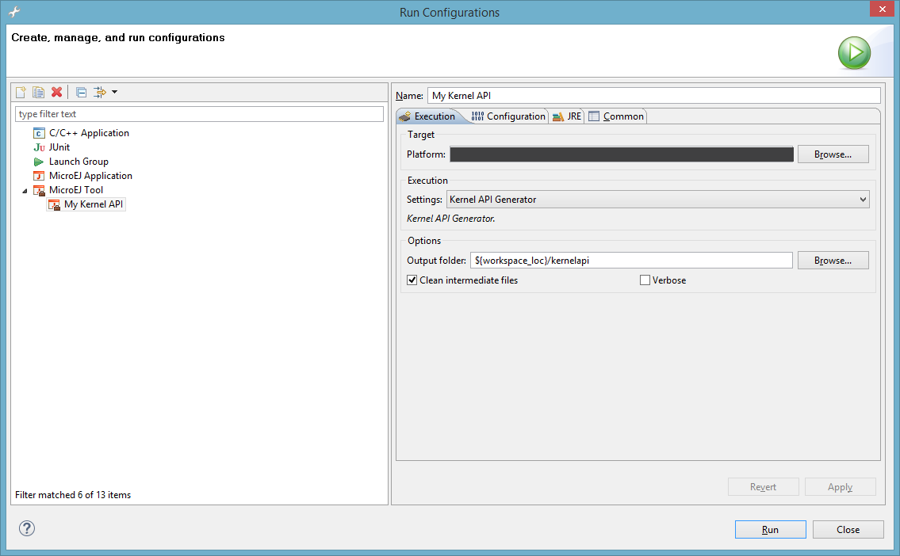

.. _kernel.api:

===========
Kernel APIs
===========

Kernel API files (``kernel.api``) specify among all types owned by the Kernel which ones **must** be used by
Features, and for those types which members (method, and static fields) are allowed to be accessed by
Features. When a type is not declared in a Kernel API, the Kernel and each Feature **can** have their own version of that type,
but if a type is declared in a Kernel API file only the Kernel version will be used by the Kernel and all the Features.

For mode details refer to the `Class Spaces` chapter of the :ref:`kf_specification`. 

.. _kernel.api.def:

Kernel API Definition
=====================

A Kernel API file is an XML file named ``kernel.api`` declared at the root of one or more path composing the :ref:`Application classpath <chapter.microej.classpath>`.

.. _fig_kf-api-xsd:
.. code-block:: xml
   :caption: Kernel API Example for exposing ``System.out.println`` API

    <require>
        <type name="java.io.PrintStream"/>
        <type name="java.lang.String"/>
        <type name="java.lang.System"/>
        <field name="java.lang.System.out"/>
        <method name="java.io.PrintStream.println(java.lang.String)void"/>
    </require>

The table below describes the format of the XML elements. The full XML schema is available in the :ref:`kf_specification`. 

.. _table_kf-api-tags:
.. tabularcolumns:: |p{1cm}|p{1.5cm}|p{12.5cm}|
.. table:: XML elements specification

    +---------+------------+---------------------------------------------------------------------------------------------------------------------------------------------------------------------------------------------------------------------------------------------------------------------------------------------------------------------------------------------------------------------------------------------------------------------------------+
    | Tag     | Attributes | Description                                                                                                                                                                                                                                                                                                                                                                                                                     |
    +=========+============+=================================================================================================================================================================================================================================================================================================================================================================================================================================+
    | require |            | The root element                                                                                                                                                                                                                                                                                                                                                                                                                |
    +---------+------------+---------------------------------------------------------------------------------------------------------------------------------------------------------------------------------------------------------------------------------------------------------------------------------------------------------------------------------------------------------------------------------------------------------------------------------+
    |         |            | Static field declaration. Declaring a field as a Kernel API automatically sets the declaring type as a Kernel API                                                                                                                                                                                                                                                                                                               |
    | field   +------------+---------------------------------------------------------------------------------------------------------------------------------------------------------------------------------------------------------------------------------------------------------------------------------------------------------------------------------------------------------------------------------------------------------------------------------+
    |         | name       | Fully qualified name on the form ``[type].[fieldName]``                                                                                                                                                                                                                                                                                                                                                                         |
    +---------+------------+---------------------------------------------------------------------------------------------------------------------------------------------------------------------------------------------------------------------------------------------------------------------------------------------------------------------------------------------------------------------------------------------------------------------------------+
    |         |            | Method or constructor declaration. Declaring a method or a constructor as a Kernel API automatically sets the declaring type as a Kernel API                                                                                                                                                                                                                                                                                    |
    | method  +------------+---------------------------------------------------------------------------------------------------------------------------------------------------------------------------------------------------------------------------------------------------------------------------------------------------------------------------------------------------------------------------------------------------------------------------------+
    |         | name       | Fully qualified name on the form ``[type].[methodName]([typeArg1,...,typeArgN) typeReturned``. Types are fully qualified names or one of a base type as described by the Java language (``boolean``, ``byte``, ``char``, ``short``, ``int``, ``long``, ``float``, ``double``) When declaring a constructor, ``methodName`` is the single type name. When declaring a void method or a constructor, ``typeReturned`` is ``void`` |
    +---------+------------+---------------------------------------------------------------------------------------------------------------------------------------------------------------------------------------------------------------------------------------------------------------------------------------------------------------------------------------------------------------------------------------------------------------------------------+
    |         |            | Type declaration, allowed to be loaded from a Feature using ``Class.forName()``                                                                                                                                                                                                                                                                                                                                                 |
    | type    +------------+---------------------------------------------------------------------------------------------------------------------------------------------------------------------------------------------------------------------------------------------------------------------------------------------------------------------------------------------------------------------------------------------------------------------------------+
    |         | name       | Fully qualified name on the form ``[package].[package].[typeName]``                                                                                                                                                                                                                                                                                                                                                             |
    +---------+------------+---------------------------------------------------------------------------------------------------------------------------------------------------------------------------------------------------------------------------------------------------------------------------------------------------------------------------------------------------------------------------------------------------------------------------------+

Writing Kernel APIs
===================

This section lists different ways to help to write ``kernel.api`` files.

Default Kernel APIs Derivation
------------------------------

MicroEJ Corp. provides predefined kernel API files for the most common libraries provided by a Kernel. 
These files are packaged as MicroEJ modules in the :ref:`developer_repository` under the `com/microej/kernelapi <https://forge.microej.com/artifactory/microej-developer-repository-release/com/microej/kernelapi/>`_ organisation.

The packaged file ``kernel.api`` can be extracted from the JAR file and edited
in order to keep only desired types, methods and fields.

Kernel API Generator
--------------------

MicroEJ Kernel API Generator is a tool that help to generate a ``kernel.api`` file based on a
Java classpath.

In MicroEJ SDK, create a new MicroEJ Tool launch,
:guilabel:`Run` > :guilabel:`Run Configurations` > :guilabel:`MicroEJ Tool`, choose your Platform,
select :guilabel:`Kernel API Generator` for the :guilabel:`Settings` options, and don't
forget to set the output folder.

.. _kapi-launch:

Define the classpath to use in the
:guilabel:`Configuration` tab, and Press :guilabel:`Run`. 
A ``kernel.api`` file is
generated in the output folder and it contains all classes, methods and
fields found in the given classpath.

.. include:: kernelAPIgenerator_use.rst

Extend Kernel APIs
------------------

New methods can be added to existing APIs in order to create a custom API. Read :ref:`class-extender` for more 
information. 

..
   | Copyright 2008-2022, MicroEJ Corp. Content in this space is free 
   for read and redistribute. Except if otherwise stated, modification 
   is subject to MicroEJ Corp prior approval.
   | MicroEJ is a trademark of MicroEJ Corp. All other trademarks and 
   copyrights are the property of their respective owners.