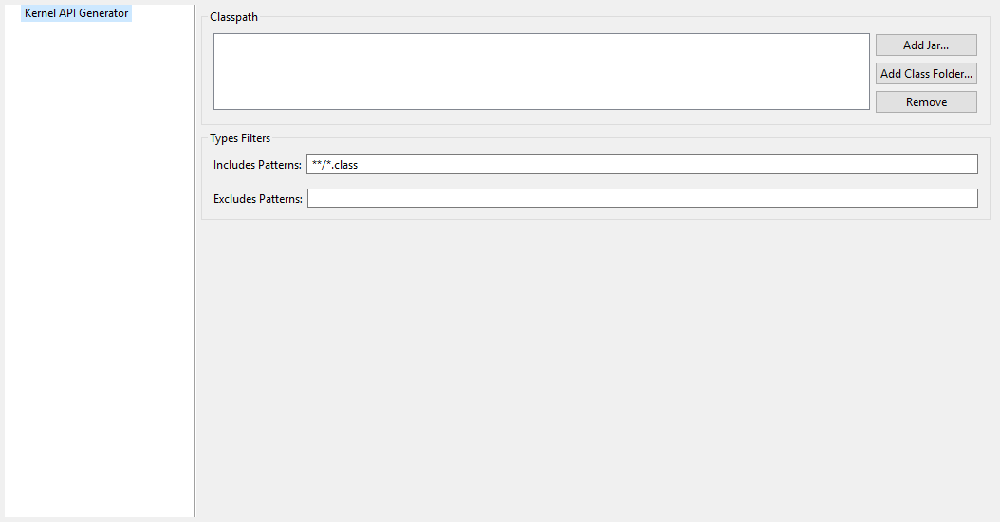

Category: Kernel API Generator
~~~~~~~~~~~~~~~~~~~~~~~~~~~~~~

Group: Classpath
^^^^^^^^^^^^^^^^

Option(list):
'''''''''''''

*Option Name*: ``kernel.api.generator.classpath``

*Default value*: ``(empty)``

Group: Types Filters
^^^^^^^^^^^^^^^^^^^^

Option(text): Includes Patterns
'''''''''''''''''''''''''''''''

*Option Name*: ``kernel.api.generator.includes.patterns``

*Default value*: ``**/*.class``

*Description*: Comma separated list of ANT Patterns for types to include.

Option(text): Excludes Patterns
'''''''''''''''''''''''''''''''

*Option Name*: ``kernel.api.generator.excludes.patterns``

*Default value*: ``(empty)``

*Description*: Comma separated list of ANT Patterns for types to exclude.

..
   | Copyright 2008-2022, MicroEJ Corp. Content in this space is free 
   for read and redistribute. Except if otherwise stated, modification 
   is subject to MicroEJ Corp prior approval.
   | MicroEJ is a trademark of MicroEJ Corp. All other trademarks and 
   copyrights are the property of their respective owners.
