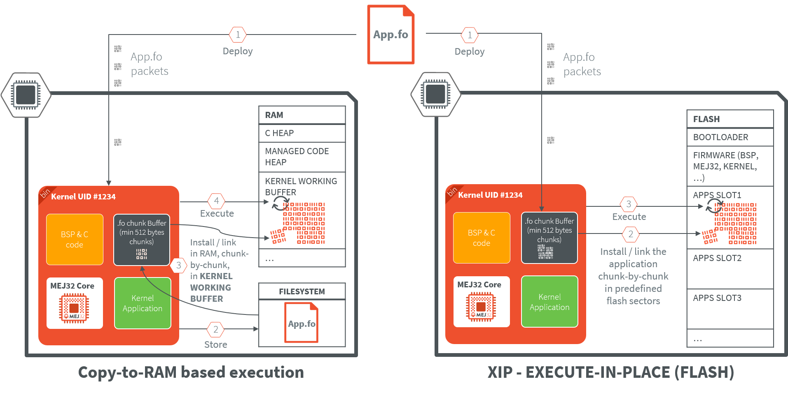
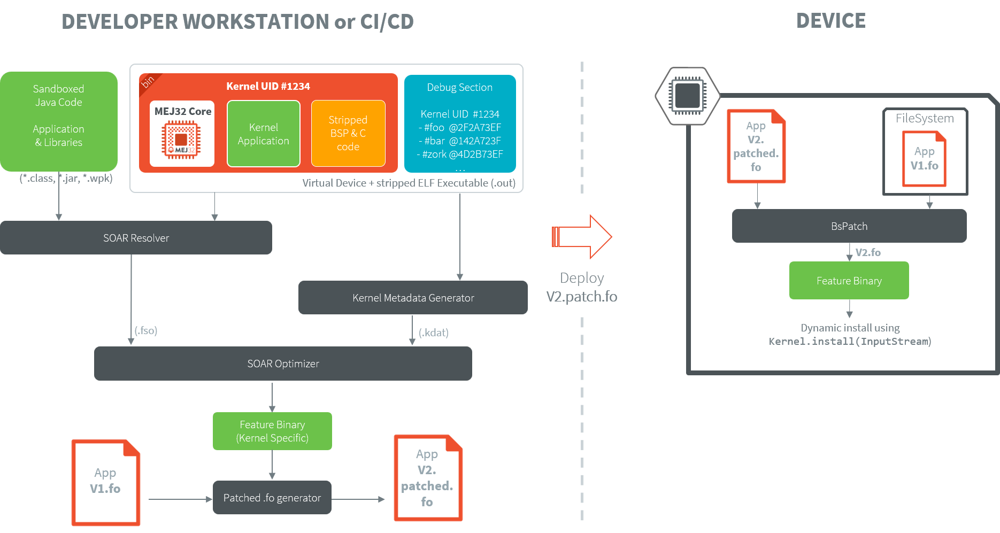

Considerations for Developing a Kernel
======================================

This document outlines the topics to consider when designing a software architecture using MICROEJ VEE Multi-Sandbox capability.

Prerequisites
-------------

This document assumes that the reader is familiar with:

- :ref:`training_getting_started_sandboxed_applications_imxrt1170`,
- :ref:`training_getting_started_kernel_green_imxrt1170`
- :ref:`training_sandboxed_applications_imxrt1170`
- :ref:`training_kernel_development`

Glossary
--------

.. glossary::

  OTA
    Over-the-Air (OTA) Update is a method for delivering firmware updates to remote devices using a network connection.
  
  App(s) / Application(s)
    Short for ``Sandboxed Application``.

See also :ref:`chapter-glossary`.

Application Installation Flow
-----------------------------

This section outlines the considerations from application deployment to target memory installation.

Get familiar with :ref:`feature_memory_installation` before moving on.

The diagram below shows the available application installation and execution modes:

Communication Channel
~~~~~~~~~~~~~~~~~~~~~

Applications can be deployed using various communication channels such as BLE, mesh, TLS, or other communication protocols. 

These channels must ensure secure data transmission and support the required bandwidth for applications deployment.

Application Code Storage and Execution Strategies
~~~~~~~~~~~~~~~~~~~~~~~~~~~~~~~~~~~~~~~~~~~~~~~~~

Applications files (``.fo``) are managed differently depending on whether the hardware architecture supports
**Execute-In-Place (XIP)** or requires **Copy-to-RAM execution**. 
The choice between these two methods impacts boot time, memory overhead, and system flexibility.

Copy-to-RAM Mode (Non-XIP)
^^^^^^^^^^^^^^^^^^^^^^^^^^

In Copy-to-RAM mode, the application is stored in a non-volatile memory and executed from RAM memory.

This method is mandatory for systems with storage media that do not
support direct CPU addressing (like SD cards, NAND Flash, or standard File Systems).

- **Deployment:** The application file (``.fo``) is stored as a persistent blob on a file system.
- **Execution:** Upon startup, the MicroEJ Core Engine allocates a block of **RAM** memory, 
  and performs the application linking into it.
- **Best For:** Systems with abundant RAM that require high-speed execution. 
  Since RAM typically has lower latency and higher throughput than External Flash, code may run faster in this mode.
- **Constraint:** The ``.fo`` file **must be kept** on the device's storage. 
  Because RAM is volatile, the Core Engine must reinstall (re-copy) the application into RAM every time the device restarts.

XIP (Execute-In-Place) Mode
^^^^^^^^^^^^^^^^^^^^^^^^^^^

In XIP mode, the application is stored and executed directly from non-volatile memory
(typically **Internal Flash** or **QSPI/OctoSPI External Flash**). This memory must be addressable by the CPU.

- **Deployment:** The application is downloaded and installed directly at a fixed execution address in the Flash memory map.
- **Execution:** The CPU fetches instructions directly from the Flash.
  Because the code is never moved, the original ``.fo`` file does not need to be retained on a separate file system after installation.
- **Best For:** Devices with strictly limited RAM or systems requiring "Instant-On" performance,
  as there is no "copy-to-RAM" delay during the boot sequence.
- **Constraint:** The code is linked to a specific physical address and cannot be relocated once installed.

Application Compatibility
~~~~~~~~~~~~~~~~~~~~~~~~~

An Application is built over a Kernel (see :ref:`application_link`). The build output file of a Sandboxed Application against a Kernel is called a Feature, hence the ``f`` letter used in the extension name of the related files (``.fso`` and ``.fo`` files).

- ``.fso``: application file which is a portable file that can be linked on any compatible Kernel (see :ref:`fso_compatibility`). A :ref:`Dynamic Linking On Device (.fso) <build_feature_on_device>` is required before installing the application. ``.fso`` is more suited for MPUs targets as it requires more RAM memory for the linking phase.
- ``.fo``: application file specific to a Kernel, result of an :ref:`Off Board Build (.fo) <build_feature_off_board>`: it can only be installed on the Kernel it has been linked to.

By default, ``.fo`` files are used in the Multi-Sandbox evaluation flow as they easier to manipulate. 

A firmware / Kernel update (the Kernel is part of the firmware) implies to run re-build and re-deploy the application file (``.fo``) on the device, unless the application has been built for the previous Kernel (see :ref:`feature_portability`).

.. warning::

    After a firmware update, applications installed in Flash memory (``XIP Execution``) must be reinstalled.
    
    In this scenario, you must uninstall the existing applications and reinstall them using their corresponding ``.fo`` files. To prepare for this:
    
    - Keep a local copy of all ``.fo`` files, or
    - Be ready to rebuild and redeploy them.
    
    Note that ``.fo`` files can be compressed on the device to reduce memory usage.

Preinstalled Applications
~~~~~~~~~~~~~~~~~~~~~~~~~

By default, the device firmware will only contain the Kernel and the BSP. 

In some cases, the device should be delivered with pre-installed applications that could be critical system components that need to be available at all times without relying on dynamic deployment mechanisms.

To achieve that, either:

1. Deploy those applications on each device during the production phase.
2. Generate a firmware binary containing those preinstalled applications. This approach requires to:
  
  - Flash and boot the initial firmware on the device (no pre-installed applications),
  - Deploy the required applications,
  - Dump the flash memory of the device using a probe to get the firmware with pre-installed applications.

These preinstalled applications are loaded during system boot and are subject to the typical application lifecycle management.

Memory Layout
-------------

RAM and ROM memory layout considerations are critical aspects that must be defined during
the firmware build process, specifically within the kernel and BSP (Board Support Package) configuration. 
These configurations directly impact system performance, application execution capabilities, and overall resources utilization.

Proper memory layout planning requires careful analysis of both static and dynamic memory requirements across the entire system.

Application Code Location
~~~~~~~~~~~~~~~~~~~~~~~~~

The resulting size of an installed application is smaller than the size of the ``.fo`` file, see :ref:`feature_required_memory`.

Copy-to-RAM Mode
^^^^^^^^^^^^^^^^
The application is installed into RAM before execution. The following should be considered:

- **RAM Kernel Working Buffer**: The kernel requires a dedicated working buffer to install the application file (``.fo``). 
  This buffers must be sized appropriately to handle the maximum number of concurrent applications.
  When an application is uninstalled, the dedicated kernel working buffer area will be freed.
- **FileSystem Dimensioning for .fo Storage**: The file system must be properly sized to accommodate all application files (``.fo``) that will be stored on the device.

XIP Mode
^^^^^^^^

XIP (Execute In Place) mode allows applications to run directly from flash memory, 
eliminating the need for RAM copying operations but requiring careful flash memory management.

- **Flash Layout**: The flash memory must be organized with dedicated fixed flash blocks for application installation. 
  These blocks should be dimensioned to ensure that installed applications fit within the allocated space. 
  The `Abstraction Layer Kernel Flash <https://github.com/MicroEJ/AbstractionLayer-KERNEL-FLASH/tree/master>`__ provides an example of flash layout implementation.
  The system can be configured with multiple sets of flash blocks of different 
  sizes to optimize memory usage based on application requirements (e.g. 10x 10KB blocks, 5x 20KB blocks, 2x 50KB blocks):

  .. code-block::

      +========================+
      |                        |
      |    Kernel/Firmware     |
      |                        |
      +========================+
      |   App Block 1 (10KB)   |
      +------------------------+
      |        ...             |
      +------------------------+
      |   App Block 11 (20KB)  |
      |                        |
      +------------------------+
      |        ...             |
      +------------------------+
      |   App Block 16 (50KB)  |
      |                        |
      |                        |
      +------------------------+
      |        ...             |
      +========================+
      |                        |
      |    Reserved/Other      |
      |                        |
      +========================+

- **Flash Cycle Management**: Flash memory has a limited number of write/erase cycles.
  In case of regular updates, wear leveling should be considered and managed at the Kernel Abstraction Layer level.

Persistent Storage
~~~~~~~~~~~~~~~~~~

Persistent storage is essential for maintaining application data, settings, and logging information across system restarts and power cycles. 

A dedicated memory area should be allocated for this purpose.

The :ref:`chapter.storage` library provides a key-value pair mechanism to easily store data on a FileSystem.

Heaps & Stacks
~~~~~~~~~~~~~~

The kernel defines global heap sizes that are used by both the kernel itself and all running applications, requiring careful dimensioning and management.

The kernel establishes three heap types:

*   **Managed Heap**: used for Objects allocations (Garbage Collected),
*   **Immortals Heap**: reserved for kernel persistent allocated Objects,
*   **Images Heap**: Dedicated to image and graphics management.

These heaps must be dimensioned carefully according to the maximum memory usage when all required applications are running together.

Thread and Stack Management
~~~~~~~~~~~~~~~~~~~~~~~~~~~

The same careful dimensioning principles apply to threads and stacks allocation.

Security
--------

Consider the following security requirements:

* Is the App binary encrypted before deployment on target?
* Is the App integrity verified when installing on target?
* Is the App code signed?
* Who signs the App (device manufacturer, App developer, device owner)?
* Byte code verification using ``MicroEJ ByteCode Verifier``?

Kernel
------

The kernel serves as the firmware main entry point, which means it's the central component that initializes and manages the entire system.

Ecosystem APIs
~~~~~~~~~~~~~~

Ecosystem APIs (a.k.a :ref:`runtime_environment`) are the set of APIs exposed to application developers. These APIs form the bridge between the kernel functionalities and the application-level code that developers write.

These APIs must be carefully designed to provide controlled access to system resources while maintaining usability, security and stability.

Runtime Policy
~~~~~~~~~~~~~~

The runtime policy defines how applications are managed, secured, and executed within the kernel environment.

App Management
^^^^^^^^^^^^^^

Application management is a core function of the kernel that ensures proper resource allocation and system stability.

- **Resources Allocation**: The kernel defines statically a set of :ref:`runtime policies using properties <option_kernel>`. 
  Among them,  :ref:`how many threads an application can use at the maximum <option_feature_max_number_of_threads>` or
  :ref:`how many applications can run at the same time <option_maximum_number_of_dynamic_features>`.
- **Resources Monitoring**: The kernel must detect when an application consumes too much resources (memory, CPU, etc.) to prevent system degradation. This monitoring capability is essential for maintaining system responsiveness and preventing applications from monopolizing system resources. See :ref:`resourceManager` for more information.

- **Life Cycle Management**: The kernel manages the complete application lifecycle including installation, execution, and uninstallation processes: 

  - **Start-up Definition**: Applications can have different startup behaviors based on policy requirements:
  
    - Automatic boot when installed: Some applications may be configured to start automatically upon installation,
    - Only "trusted" ("system" apps) ones at startup: "system" applications may be prioritized for automatic startup to ensure core system functionality,
    - Custom policy: customers can implement custom policies for application startup based on their specific requirements.
  
  - **Fail-safe**: The kernel must implement fail-safe mechanisms when applications fail, to prevent system crashes or instability.
    These mechanisms might include automatic restarts, error logging, or graceful degradation of system functionality.

    An example is provided in `Kernel-GREEN KernelUncaughtExceptionHandler <https://github.com/MicroEJ/Kernel-GREEN/blob/2.2.0/src/main/java/com/microej/kernel/green/KernelUncaughtExceptionHandler.java>`_
    where the failing application are stopped and uninstalled.

- **Application Metadata**: Application metadata is crucial for system management and user interaction (description, icons, version, ...).

    - **Metadata always accessible**: Some metadata should be available regardless of application state.
      They can be stored on remote servers for centralized management, or stored locally when network connectivity is lost.

    - **Metadata accessible when the application is installed or started**: 
      Other metadata may only be available when the application is installed or started:
     
        -   Properties: Applications can retrieve runtime properties when they are started,
        -   Resources: Application's resources can be accessed using ``Feature.getResourceAsStream("resource_path")`` once the application is installed.

- **Application with UI or No UI**: The kernel handles different types of applications based on their interface requirements:

    - **Home Screen Management**: for applications with user interfaces, the kernel manages a home screen or dashboard that allows users to navigate between different applications.
    - **Screen Sharing**: multiple applications may share screen space simultaneously, requiring the kernel to manage display priorities and allocation.
      See :ref:`multiapps.enabled.libraries.microui.display.ownership` for more information.
    - **Kernel-Reserved Screen Area**: some screen portions can be reserved for kernel functions to ensure critical system information remains visible.

Communication Between Apps
^^^^^^^^^^^^^^^^^^^^^^^^^^

Applications within the same kernel environment need mechanisms to communicate and share resources effectively:

- :ref:`chapter.shared.interfaces`: This mechanism allows applications to define and implement interfaces that other applications can use for communication and data exchange.
- :ref:`chapter.communication.features.shared.services`: Applications can register services that other applications can discover and use through a registry system, promoting loose coupling and modularity.

.. warning::

    When working with :ref:`chapter.shared.interfaces`, :ref:`kernel_type_converter` must be considered.
    
    If a new ``Converter`` is added to the Kernel; a firmware udpate is required, as well as a new application installation cycle.

Remote Device Management
^^^^^^^^^^^^^^^^^^^^^^^^

Remote management capabilities are essential for maintaining and updating applications in deployed systems.

- **LWM2M or other services**: The kernel supports remote management protocols like LWM2M (Lightweight Machine-to-Machine) or other IoT management services for over-the-air updates and system monitoring. 
  These protocols enable administrators to manage applications remotely, update firmware, and monitor system health without physical access to devices.

Limited Transfer Bandwidth
^^^^^^^^^^^^^^^^^^^^^^^^^^

In environments with constrained communication capabilities, the kernel must optimize data transfer.

- **Compress the .fo**: The kernel can retrieved compressed applications files (``.fo``) to 
  reduce bandwidth usage during transfers and decompress them during installation. 
- **Binary Diff with Previous One (bsdiff)**: The kernel supports binary diff operations (using ``bsdiff``)
  to only transmit changes between application files (``.fo``) versions rather than full file transfers.
  This significantly reduces bandwidth requirements and speeds up deployment processes. 
  This mode assumes that the previous version of the application file (``.fo``) has been stored on the device beforehand.

The diagram below schematizes the flow when performing a differential application update.
It assumes that:

- A first version of the application has already been built and installed on the device (``V1.fo``).
- ``V1.fo`` has been kept in memory on the device to perform the differential update.

Firmware Update
^^^^^^^^^^^^^^^

- Consider acceptable system downtime during firmware update.
- Consider bootloader configuration with optional encryption/signature/integrity check of the incoming firmware.

Developer Mode
^^^^^^^^^^^^^^

The kernel should provide a developer mode that provides extended functionality for application developers, including:

- Local deployment capabilities for rapid testing and iteration,
- Advanced debug traces for detailed system monitoring,
- Kernel CLI (Command Line Interface) for direct system interaction and configuration. 
  As an example, refer to :ref:`sandboxed_application.appconnect`.

This developer mode enables faster development cycles and more effective debugging while maintaining 
security for production deployments.

Qualification/Certification of Third-Party Applications
-------------------------------------------------------

In case of an open ecosystem, the Kernel ecosystem provider must define a process for accepting applications
in its application store.

IP Considerations
~~~~~~~~~~~~~~~~~

To open applications development to 3rd parties, the Kernel ecosystem provider must provide a Virtual Device of the Kernel.

This Virtual Device allows 3rd parties developers to run applications on Simulator and deploy them on the device.

The Virtual Device is a package containing source code and a stripped version of the firmware:

- **Sources**: contains an obfuscated version of Kernel source code and pre-installed apps JARs, using ``Proguard``. 
  This prevent reverse engineering of customer's Kernel managed code. 
  This is optional and the level of obfuscation is configurable by ``Proguard``. 
  For example, sources can be removed but bytecode types / method names / line numbers can be kept as-is for simpler debug support.
- **Stripped firmware**: the device firmware is stripped using ``MicroEJ ELF stripper tool``, to only keep only entry symbols and
  metadata required for building the ``.fo`` files. All the code sections are removed to prevent distribution of both MicroEJ and customer IPs.

Software Integrity
~~~~~~~~~~~~~~~~~~

Ensure the application is correct from a software perspective. This involves:

- **Source Code Analysis**: Perform static analysis to detect potential vulnerabilities, code quality issues, or compliance violations.
  For more information refer to :ref:`sonar_code_analysis`.
- **Binary Code Verification**: Validate that the application's binary code is authentic and has not been tampered with during deployment.
  This tool is provided by MicroEJ and can be enabled during application build.
- **Integrity Checking**: Verify that the deployed application matches the original submitted version using cryptographic hashes or digital signatures.

See the ``Security Chapter`` of :ref:`vee_port_programming_pratices` for more information.

Design Guideline Verification
~~~~~~~~~~~~~~~~~~~~~~~~~~~~~

Define guidelines governing application capabilities and restrictions:

- **Resource Usage Constraints**: Establish limits on:
  
  - Application size,
  - RAM memory consumption,
  - CPU utilization,
  - Network bandwidth usage,
  - File system bandwidth consumption,
  - Event generation and subscription limits.

- **Access Rights Management**: Implement security manager checks to ensure applications cannot access unauthorized resources. 
  This includes verifying that applications only use permissions and capabilities that have been explicitly granted during the certification process.

- **Package and Documentation Standards**: Require applications to be properly packaged with appropriate documentation, including:
  
  - Clear application metadata,
  - User manuals or guides,
  - Technical specifications,
  - Version information.

- **License and Ownership Requirements**: Verify that applications include proper licensing terms and have clearly identified owners or developers.
  This ensures legal compliance and establishes clear responsibility for the application's functionality and support.

This verification process is not exhaustive and remains at the discretion of the Kernel ecosystem provider to
define additional requirements based on specific security, performance, or business needs.

Fit and Function
~~~~~~~~~~~~~~~~

Ensure the application functionally realizes what is promised in its specifications and documentation:

- **Functional Testing Requirements**: In the absence of user feedback mechanisms (such as voting systems), 
  the Kernel ecosystem provider must perform minimum functional tests before approving applications.
  These tests should validate that the application performs its intended functions correctly and meets quality standards.
- **Self-Qualification Process**: Require application developers to provide test reports demonstrating functional compliance.
  The Kernel ecosystem provider then reviews these reports to verify that the application meets specified requirements.
- **Reference Implementation Examples**: This approach mirrors practices used by other ecosystems, such as Amazon's certification process for Alexa devices,
  where manufacturers must provide detailed testing documentation to demonstrate device compliance.

The certification process ensures that applications meet quality standards, security requirements, and functional specifications before being made available to end users in the ecosystem.

..
   | Copyright 2026, MicroEJ Corp. Content in this space is free
   for read and redistribute. Except if otherwise stated, modification
   is subject to MicroEJ Corp prior approval.
   | MicroEJ is a trademark of MicroEJ Corp. All other trademarks and
   copyrights are the property of their respective owners.