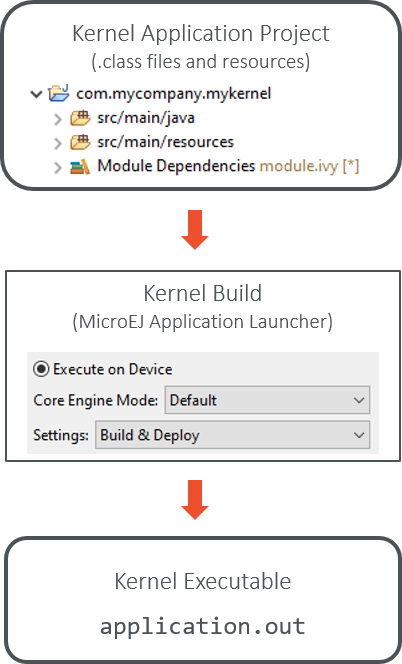

.. _multisandbox_firmware_creation:

Kernel Creation
===============

Create a new Project
--------------------

To create a new Kernel project:

.. tabs::

   .. tab:: SDK 6

      Create a new :ref:`Application <sdk6_module_natures.application>` following the steps described in :ref:`SDK 6 User Guide - Create a Project <sdk_6_create_project>` 
      depending on your IDE.

   .. tab:: SDK 5

      - First create a new :ref:`Kernel Application <module_natures.kernel_application>`.
      - A new project is generated into the workspace:

      .. image:: png/firmware-multiapp-skeleton-project.png
         :align: center
         :width: 334px
         :height: 353px
        
Configure a VEE Port
--------------------

Before building the Kernel, you need to build a VEE Port with Multi-Sandbox capability.
To enable the Multi-Sandbox capability in your VEE Port configuration, follow the instructions from the :ref:`multisandbox` section.

Once the VEE Port is built, configure the target VEE Port in your Kernel project:

- To configure a VEE Port with SDK 6, see :ref:`sdk_6_select_veeport`.
- To configure a VEE Port with SDK 5, see :ref:`platform_selection`.

.. _build_executable_and_virtual_device:

Build the Executable and Virtual Device
---------------------------------------

The Multi-Sandbox Executable and the Virtual Device of the Kernel Application must be built to allow the development and execution of Sandboxed Applications.

.. tabs::

   .. tab:: SDK 6

      - The Executable can be built by executing the Gradle ``buildExecutable`` task:

         .. code:: java

            ./gradlew buildExecutable

      The Executable is generated in the ``build/application/executable`` folder of the project. For more information about the build of the Executable 
      depending on your IDE, refer to the :ref:`sdk_6_build_executable` page.

      - The Virtual Device can be built by executing the Gradle ``buildVirtualDevice`` task:

         .. code:: java

            ./gradlew buildVirtualDevice

      The Virtual Device is generated in the ``build/virtualDevice`` folder of the project. For more information about the build of the Virtual Device 
      depending on your IDE, refer to the :ref:`sdk_6_build_virtual_device` page.

   .. tab:: SDK 5

      In the Package Explorer, right-click on the project and select :guilabel:`Build Module`. The build of the Executable and Virtual
      Device may take several minutes. Once the build has succeeded, the folder :guilabel:`myfirmware` > :guilabel:`target~` > :guilabel:`artifacts` contains the firmware output artifacts (see :ref:`in_out_artifacts`) :
      
      -  ``mymodule.out``: The Executable to be programmed on device.
      -  ``mymodule.kpk``: The Kernel package to be imported in a MicroEJ Forge instance.
      -  ``mymodule.vde``: The Virtual Device to be imported in the SDK.
      -  ``mymodule-workingEnv.zip``: This file contains all files produced by the build phase (intermediate, debug and report files).

      .. image:: png/firmware-multiapp-skeleton-artifacts.png
         :align: center
         :width: 335px
         :height: 866px

Build the Executable in the Workspace
~~~~~~~~~~~~~~~~~~~~~~~~~~~~~~~~~~~~~

.. note::
   The build of the Executable in the Workspace is available for SDK 5 only.
   Refer to the :ref:`sdk_6_build_executable` page to build the Executable with SDK 6.

It is possible to build the Executable using a :ref:`concepts-microejlaunches` rather than the regular module build.
This speeds-up the build time thanks to MicroEJ Module Manager workspace resolution and Eclipse incremental compilation.

- Import the Kernel project and all Sandboxed Application projects in the same workspace,
- Prepare a MicroEJ Application launch for the Kernel as a regular :ref:`standalone_application`,
- Prepare a MicroEJ Application launch for each Sandboxed Application using `Build Dynamic Feature` settings.

The following figure shows the overall build flow:

.. _build_flow_workspace:

   Kernel Build Flow using MicroEJ Launches

.. _define_apis:

Expose APIs
-----------

A Kernel must define the set of classes, methods and static fields all applications are allowed to use.

.. note::

   According to the :ref:`Kernel and Features specification <kf_specification>`, no API is open by default to Sandboxed Applications.

This can be done either by declaring :ref:`Kernel APIs <kernel.api>` or by defining a :ref:`Runtime Environment <runtime_environment>`.

The main difference is from the Application development point of view. 
In the first case, the Application project still declares standard module dependencies.
This is the good starting point for quickly building a Kernel with Applications based on the MicroEJ modules as-is.
In the second case, the Application project declares the runtime environment dependency. 
This is the preferred way in case you intend to build and maintain a dedicated Applications ecosystem.

A Kernel API or a Runtime Environment module must be added as dependency of the project:

.. tabs::

   .. tab:: SDK 6

      - A Kernel API module is added as a dependency with the configuration ``implementation``.

      .. code:: java

         dependencies {
            implementation("com.microej.kernelapi:edc:1.2.0")
            implementation("ej.api:edc:1.3.4")
         }

      .. warning::

         Unlike SDK 5 (MMM), Kernel API dependencies are not transitively fetched with SDK 6. They must therefore be explicitly added.

      - A Runtime Environment module is added as a dependency with the configuration ``microejRuntimeEnvironment``.   

      .. code:: java

         dependencies {
            microejRuntimeEnvironment("com.mycompany:myruntimeapi:1.0.0")
         }

   .. tab:: SDK 5

      - A Kernel API or a Runtime Environment module is added as a dependency with the configuration ``kernelapi->default``.

      .. code:: xml

         <dependency org="com.microej.kernelapi" name="edc" rev="1.2.0" conf="kernelapi->default"/>

.. _implement_security_policy:

Implement a Security Policy
---------------------------

A complete section about how to setup a security policy is available in the :ref:`Application security policy <applicationSecurityPolicy>` page.

.. _pre_installed_application_vd:

Add Pre-installed Applications
------------------------------

Your device may come with pre-installed applications, also known as applications that are already available when the Kernel starts.
These applications are installed during the manufacturing process, such as in ROM alongside the Kernel executable.

To mimic this behavior on a Virtual Device, add an Application as dependency of the Kernel project:

.. tabs::

   .. tab:: SDK 6

      with the configuration ``microejApplication``

      .. code:: java

         dependencies {
            microejApplication("com.mycompany:myapp:0.1.0")
         }

   .. tab:: SDK 5

      with the configuration ``systemapp-vd->application``

      .. code:: xml

         <dependency org="com.mycompany" name="myapp" rev="0.1.0" conf="systemapp-vd->application"/>

The provided Application is installed in the Virtual Device only, refer to the :ref:`application_link` page to install Applications on the Kernel.

.. _Kernel.install(): https://repository.microej.com/javadoc/microej_5.x/apis/ej/kf/Kernel.html#install-java.io.InputStream-

Kernel Application Configuration with SDK 5
-------------------------------------------

.. note::
   This section concerns SDK 5 only. For more information about the configuration of a Kernel Application with SDK 6, 
   refer to the :ref:`sdk6_module_natures.application` section.

.. _kernel_module_configuration:

Module Configuration
~~~~~~~~~~~~~~~~~~~~

The ``build-firmware-multiapp`` build type defines additional
configurations, used to specify the different kind of firmware inputs
(see :ref:`in_out_artifacts`) as dependencies.

The following table lists the different configuration mapping usage
where a dependency line is declared:

::

   <dependency org="..." name="..." rev="..." conf="[Configuration Mapping]"/>

.. tabularcolumns:: |p{4.3cm}|p{3cm}|p{8cm}|
.. table:: Configurations Mapping for ``build-firmware-multiapp`` Build Type

   +-------------------------------+-------------------------------+---------------------------------------------------------------------------------------------------------------------------------------------------------------------------------+
   | Configuration Mapping         | Dependency Kind               | Usage                                                                                                                                                                           |
   +===============================+===============================+=================================================================================================================================================================================+
   | ``vdruntime->default``        | Add-On Library (``JAR``)      | Embedded in the Virtual Device only, not in the Executable                                                                                                                      |
   +-------------------------------+-------------------------------+---------------------------------------------------------------------------------------------------------------------------------------------------------------------------------+
   | ``default->default;``         | Add-On Library (``JAR``)      | Embedded in both the Executable and the Virtual Device                                                                                                                          |
   | ``vdruntime->default``        |                               |                                                                                                                                                                                 |
   +-------------------------------+-------------------------------+---------------------------------------------------------------------------------------------------------------------------------------------------------------------------------+
   | ``platform->default``         | VEE Port                      | VEE Port dependency used to build the Executable and the Virtual Device. There are other ways to select the VEE Port (see :ref:`platform_selection`)                            |
   +-------------------------------+-------------------------------+---------------------------------------------------------------------------------------------------------------------------------------------------------------------------------+
   | ``kernelapi->default``        | Runtime Environment (``JAR``) | See :ref:`runtime_environment`                                                                                                                                                  |
   +-------------------------------+-------------------------------+---------------------------------------------------------------------------------------------------------------------------------------------------------------------------------+
   | ``systemapp-vd->application`` | Application (``WPK``)         | Included to the Virtual Device as pre-installed Application.                                                                                                                    |
   +-------------------------------+-------------------------------+---------------------------------------------------------------------------------------------------------------------------------------------------------------------------------+

**Example of minimal firmware dependencies.**

The following example defines a Kernel that exposes all APIs of ``EDC`` library.

.. code:: xml

   <dependencies>
       <dependency org="ej.api" name="edc" rev="1.2.0" conf="provided" />
       <!-- Runtime API (set of Kernel API files) -->
       <dependency org="com.microej.kernelapi" name="edc" rev="1.0.0" conf="kernelapi->default"/>
   </dependencies>

Build Options
~~~~~~~~~~~~~~

The :ref:`Kernel Application module nature <module_natures.kernel_application>` section describes all the options available for building a Kernel module.

Build only a Virtual Device with a pre-existing Kernel
~~~~~~~~~~~~~~~~~~~~~~~~~~~~~~~~~~~~~~~~~~~~~~~~~~~~~~

Copy/Paste the ``.kpk`` file into the folder ``dropins``

..
   | Copyright 2008-2024, MicroEJ Corp. Content in this space is free 
   for read and redistribute. Except if otherwise stated, modification 
   is subject to MicroEJ Corp prior approval.
   | MicroEJ is a trademark of MicroEJ Corp. All other trademarks and 
   copyrights are the property of their respective owners.
