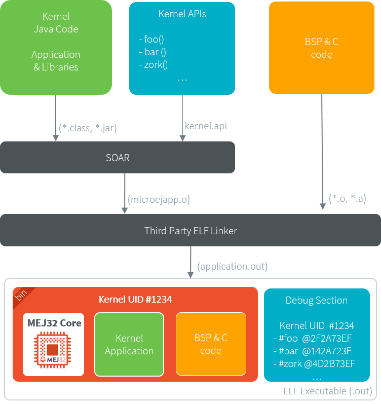

.. _kernel_link:

Kernel Linking
==============

This chapter describes how a Kernel Application is linked.

Basically, a Kernel Application is linked as a Standalone Application.
The main difference is that a Kernel Application defines :ref:`Kernel APIs <kernel.api>`, and requires to embed additional information that will be used later to build a Sandboxed Application against this Kernel (by linking with the Kernel APIs). 
Such additional information is called the Kernel Metadata.

Link Flow
---------

The following figure shows the general process of linking a Firmware, applied to a Kernel Application.

   Kernel Link Flow

The Platform must be configured with :ref:`Multi-Sandbox capability <multisandbox>`.

By default, the Kernel Metadata is included in the ``.debug.soar`` section which also serves for debug purpose (:ref:`stack_trace_reader`, :ref:`Heap Dumper <heapdumper>`).
Particularly, it contains resolved absolute addresses of Kernel APIs.

.. _kernel_metadata_generation:

Kernel Metadata Generation
--------------------------

To :ref:`build a Sandboxed Application on Device <build_feature_on_device>`, the Kernel Metadata must be exported after the Firmware link from the ``.debug.soar`` section of the executable.
This step is not necessary to :ref:`build a Sandboxed Application Off Board <build_feature_off_board>`.

The Kernel Metadata can be exported from an existing Firmware executable file by using the Kernel Metadata Generator tool.
It produces a ``.kdat`` file that will be used to link the Sandboxed Applications on device.

.. figure:: png/kernel_metadata_generator.png
   :alt: Kernel Metadata Generator
   :align: center
   :scale: 80%

   Kernel Metadata Generator

The ``.kdat`` file is optimized for size. When linking a Sandboxed Application ``.fso`` file, only the required metadata will be loaded in Java heap.
It will be loaded from a standard `InputStream <https://repository.microej.com/javadoc/microej_5.x/apis/java/io/InputStream.html>`_,
so that it can be stored to a non byte-addressable memory.

.. note::

   The Kernel Metadata ``.kdat`` file can also be integrated in a Firmware executable file using post-link tools such as binutils objcopy,
   provided a dedicated section has been reserved by the third-party linker.

.. _firmware_linker:

Firmware Linker
---------------

Firmware Linker is a tool that links a Feature within a Multi-Sandboxed Firmware.

It takes as input the Firmware executable (``.out`` file) and the Feature binary
code (``.fo`` file) into which to be linked. It outputs a new executable application
file, including the Installed Feature. This tool can be used to append
multiple Features, by using as input file of each link pass the output file of the
previous pass. Features linked this way are then called Installed Features. 

The Kernel should have been linked for dimensioning the maximum size (code,
data) for such Installed Features. See :ref:`Installed Features options <architecture_options_group_installed_features>`.

The Firmware Linker tool is automatically called when declaring :ref:`System Applications <system_application_input_ways>` to a Multi-Sandbox module description.
It is also available as a :ref:`MicroEJ Tool <MicroEJToolsSection>` named :guilabel:`Firmware Linker`.

.. figure:: png/build_flow_zoom_workspace_firmware_linker_only.png
   :alt: Firmware Linker using MicroEJ Launch
   :align: center
   :scale: 80%

   Firmware Linker using MicroEJ Launch
   
.. warning::

   Features linked using the Firmware Linker tool cannot be dynamically uninstalled using `Kernel.uninstall(Feature) <https://repository.microej.com/javadoc/microej_5.x/apis/ej/kf/Kernel.html#uninstall-ej.kf.Feature->`_ method.

.. _controlled_portability:

Controlled Portability
----------------------

A Kernel can install ``.fo`` files that have been built on other Kernels, provided this Kernel complies with other Kernels according to a set of rules declared hereafter.
Such phase is called `Controlled Portability` because the portability is verified during the new Kernel build, with no impact on the Feature dynamic installation.

Principle
~~~~~~~~~

During a Kernel build, SOAR can verify this Kernel preserves the portability of ``.fo`` files built on previous Kernel using :ref:`Kernel Metadata files <kernel_metadata_generation>`.
If the portability is preserved, the Kernel UIDs are embedded in the new Kernel, allowing ``.fo`` files built on previous Kernels to be installed.
Otherwise, SOAR fails with an error indicating the broken rules.

   Kernel Controlled Portability Principle

Enable
~~~~~~

.. note::

   This is a new functionality that requires a custom Architecture configuration.
   Please contact :ref:`our support team <get_support>` for more details.

Add ``com.microej.soar.kernel.compatiblemetadata.path`` option to your Kernel :ref:`Application Options <application_options>`.
This is an OS path-separated list of Kernel Metadata files and directories containing ``*.kdat`` files.

Portability Rules
~~~~~~~~~~~~~~~~~

A Kernel Application can install a ``.fo`` file that has been built against an other Kernel Application
if the Application code has not changed or complies with following rules:

- Modify method code, except if :ref:`soar_method_devirtualization` or :ref:`soar_method_inlining` has changed.
- Add a new type (including declared as Kernel API),
- Add a new static method (including declared as Kernel API),
- Add a new instance method in a type **not declared** as Kernel API,
- Add a new instance method with ``private`` visibility in a type **declared** as Kernel API,
- Add a new static field (including declared as Kernel API),
- Add a new instance field in a type **not declared** as Kernel API,
- Rename an instance field with ``private`` visibility in a type **declared** as Kernel API,
- Modify a Java type, method or static field **not declared** as Kernel API (code, signature, hierarchy) 
- Remove a Java type, method or static field **not declared** as Kernel API

Both Kernel Applications must be built from Platforms based on the same Architecture version.

Any other modifications will break the Feature portability, for example:

- Remove a Java type, method or static field **declared** as Kernel API,
- Add or remove an instance method in a type **declared** as Kernel API, even if the method is **not declared** as Kernel API,
- Add or remove an instance field in a type **declared** as Kernel API,
- Modify method or field signature **declared** as Kernel API (name, declaring type, static vs instance member, ...),
- Modify hierarchy of a type **declared** as Kernel API.

..
   | Copyright 2008-2022, MicroEJ Corp. Content in this space is free 
   for read and redistribute. Except if otherwise stated, modification 
   is subject to MicroEJ Corp prior approval.
   | MicroEJ is a trademark of MicroEJ Corp. All other trademarks and 
   copyrights are the property of their respective owners.
