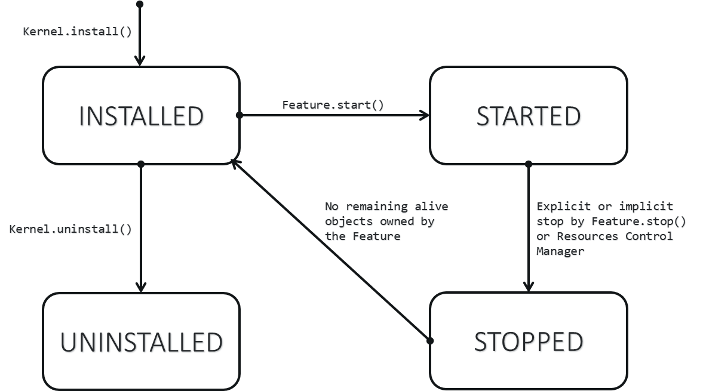

.. _kf_specification:

Kernel & Features Specification
===============================

Multi-Sandboxing is based on the Kernel & Features specification (KF). 
The fundamental concepts are introduced in the :ref:`Sandboxed Application chapter <sandboxed_application_fundamental_concepts>`. 

The following table provides links to the complete KF APIs & specification.

.. list-table::
   :widths: 10 30

   * - **Documentation**
     - **Link**
   * - Java APIs
     - https://repository.microej.com/javadoc/microej_5.x/apis/ej/kf/package-summary.html
   * - Specification
     - https://repository.microej.com/packages/ESR/ESR-SPE-0020-KF-1.4-H.pdf
   * - Module
     - https://repository.microej.com/modules/ej/api/kf/

Preface to KF Profile, ESR020
-----------------------------

This document defines the KF profile, a Trusted Execution
Environment (TEE) targeting virtual machines.

Who should use this specification?
~~~~~~~~~~~~~~~~~~~~~~~~~~~~~~~~~~

This specification is targeted at the following audiences:

-  Implementors of the KF specification.

-  Application developers that target applications with the need of embedding third party software components that may be untrusted.

-  Virtual machine providers.

Comments
~~~~~~~~

Your comments about KF are welcome. Please send them by email to
``contact@microej.com`` with KF as subject.

Requirements
~~~~~~~~~~~~

The term MUST indicates that the associated item is an absolute
requirement.

The term MAY indicates that the associated item is optional.

The term SHOULD indicates that the associated item is highly
recommended, but not required.

Although this specification defines minimal requirements, devices with
more resources may also benefit from KF specification, especially when
users are concerned with optimal resource usage.

The KF specification makes no hardware requirement for devices that run
a Java virtual machine that implements this specification. Typical
hardware for KF ranges from low-end 32-bit (such as Cortex-M0) to 64-bit
multi-core cpu.

The KF profile specification makes minimal assumptions about the system
software of the device. Although a Java virtual machine is required, the
Kernel does not need to support an OS/RTOS while the virtual machine may
be baremetal (i.e. the device boots directly in Java).

Compliant KF implementations MUST include all packages, classes, and
interfaces described in this specification, and implement the associated
behavior.

Related Literature
~~~~~~~~~~~~~~~~~~

JVM2: Tim Lindholm & Frank Yellin, The Java™ Virtual Machine
Specification, Second Edition, 1999

JLS: James Gosling, Guy Steele, Bill Joy, Gilad Bracha, The Java™
Language Specification, Third Edition, 2005

OSGI: OSGi Alliance, https://osgi.org/download/r7/osgi.core-7.0.0.pdf,
2018

Document Conventions
~~~~~~~~~~~~~~~~~~~~

In this document, references to methods of a Java class are written as
``ClassName.methodName(args)``. This applies to both static and instance
methods. Where the method is static this will be made clear in the
accompanying text.

Implementation Notes
~~~~~~~~~~~~~~~~~~~~

The KF specification does not include any implementation details. KF
implementors are free to use whatever techniques they deem appropriate
to implement the specification, with (or without) collaboration of any
Java virtual machine provider. KF experts have taken great care not to
mention any special virtual machines, nor any of their special features,
in order to encourage fair competing implementations. Implementations
are free to perform checks either at compile-time and/or at runtime.

Introduction
------------

This specification defines a Trusted Execution Environment (TEE) for
software modules called Features.

Basic Concepts
~~~~~~~~~~~~~~

Kernel & Features semantic (KF) allows an application to be split into
multiple parts:

-  the main application, called the Kernel

-  zero or more applications, called Features.

The Kernel is mandatory. It is assumed to be reliable, trusted and
cannot be modified. If there is only one application (i.e. only one main
entry point that the system starts with) then this application is called
the Kernel.

A Feature is an application “extension” managed by the Kernel. A Feature
is fully controlled by the Kernel: it can be installed (dynamically or
statically pre-installed), started, stopped and uninstalled at any time
independent of the system state (particularly, a Feature never depends
on another Feature to be stopped). A Feature is optional, potentially
not-trusted, maybe unreliable and can be executed without jeopardizing
the safety of the Kernel execution and other Features.

Resources accesses (RAM, hardware peripherals, CPU time, …) are under
control of the Kernel.

First Example
~~~~~~~~~~~~~

This simple example illustrates a log of a message called by a Kernel
and a Feature. The ``KernelExample`` class is the main Kernel entry point.
The ``FeatureExample`` class is a Feature entry point. The way these
classes are assigned to contexts and how the Feature is installed is not
described here. (the Feature is assumed to be installed before the
Kernel main method starts).

Kernel class
^^^^^^^^^^^^

.. code-block:: java
  :caption: Illustration 1: Kernel Hello World Example

  package ej.kf.example.helloworld;

  import ej.kf.Feature;
  import ej.kf.Kernel;

  /**
  * Defines a Kernel class. The Kernel entry point is the regular main method.
  */
  public class KernelExample {

    public static void main(String[] args) throws Exception {
      log("Hello World !");
      for (Feature f : Kernel.getAllLoadedFeatures()) {
        f.start();
      }
    }

    /**
    * Log a message, prefixed with the name of the caller
    */
    public static void log(String message) {
      String name = Kernel.getContextOwner().getName();
      System.out.println('[' + name + "]: " + message);
    }

  }

Feature class
^^^^^^^^^^^^^

.. code-block:: java
  :caption: Illustration 2: Feature Hello World Example

  package ej.kf.example.helloworld;

  import ej.kf.FeatureEntryPoint;

  /**
  * Defines a Feature class that implements {@link FeatureEntryPoint} interface.
  */
  public class FeatureExample implements FeatureEntryPoint {

    @Override
    public void start() {
      KernelExample.log("Hello World !");
    }

    @Override
    public void stop() {
    }

  }

Expected Output
^^^^^^^^^^^^^^^

.. code-block::

  [KERNEL]: Hello World !
  [FEATURE]: Hello World !

Ownership Rules
---------------

At runtime, each type, object and thread execution context has an owner.
This section defines ownership transmission and propagation rules.

Type
~~~~

The owner of a type is fixed when such type is loaded and that owner
cannot be modified after.

The owner of an array-of-type type is the owner of the type. Array of
basetypes are lazily loaded. Those that are required by the Kernel are
owned by the Kernel. Other arrays are loaded in any Feature that require
them.

The owner of a type can be retrieved by calling
``Kernel.getOwner(Object)`` with the ``Class`` instance.

Object
~~~~~~

When an object is created, it is assigned to the owner of the execution
context owner.

The owner of an object can be retrieved by calling
``Kernel.getOwner(Object)`` with the given object.

Execution Context
~~~~~~~~~~~~~~~~~

When a thread is started, the first execution context is set to the
owner of the thread object. When a method is called from Kernel mode
(:ref:`§ <kernelmode>`) and its receiver is owned by a Feature, the
execution context is set to the owner of the receiver. In all other
cases, the execution context of the method called is the execution
context of the caller.

The owner of the current execution context can be retrieved by calling
``Kernel.getContextOwner()``.

When a method returns, the execution context owner of the caller remains
the one it was before the call was done.

The Kernel is the first application to run, and it is triggered by the
system when it boots. The Kernel starts in Kernel mode, creating a first
thread owned by the Kernel.

The Kernel can execute a dynamic piece of code (``java.lang.Runnable``) in
a Feature context by calling ``Kernel.runUnderContext()``.

.. _kernelmode:

Kernel Mode
~~~~~~~~~~~

An execution context is said to be in *Kernel mode* when the current
execution context is owned by the Kernel. The method ``Kernel.enter()``
sets the current execution context owner to the Kernel. The method
``Kernel.exit()`` resets the current execution context owner to the one
when the method ``Kernel.enter()`` was called.

Execution Rules
---------------

*Notes: this specification does not force all rules to be checked at
runtime. When a rule is checked at runtime, a*
``java.lang.IllegalAccessError`` *must be thrown at the execution point where
the rule is broken.*

Type References
~~~~~~~~~~~~~~~

A type owned by the Kernel cannot refer to a type owned by a Feature.

A type owned by a Feature can refer to a type owned by the Kernel if and
only if it has been exposed as an API type.

A type owned by a Feature cannot refer to a type owned by another
Feature.

All the types of the KF library (package ``ej.kf.*``) are owned by the
Kernel. A type owned by a Feature cannot access any types of this
library except the ``ej.kf.FeatureEntryPoint`` interface and the
``ej.kf.Proxy`` class.

Method References
~~~~~~~~~~~~~~~~~

A type owned by a Feature can refererence a method of type owned by the
Kernel if and only if it has been exposed as an API method.

Field References
~~~~~~~~~~~~~~~~

Instance Field References
^^^^^^^^^^^^^^^^^^^^^^^^^

A type owned by a Feature can refer to all instance fields of a type
owned by the Kernel, if and only if the type has been exposed as an API
type and the field is accessible according to [JLS] access control
rules.

Static Field References
^^^^^^^^^^^^^^^^^^^^^^^

A type owned by a Feature can refer to a static field of a type owned by
the Kernel if and only if it has been exposed as an API static field.

A static field of a type owned by a Feature cannot refer to an object
owned by another Feature.

An object owned by a Feature can be assigned to a static field of a type
owned by the Kernel if and only if the current execution context is in
Kernel mode (:ref:`§ <kernelmode>`), otherwise a
``java.lang.IllegalAccessError`` is thrown at runtime.

Context Local Static Field References
^^^^^^^^^^^^^^^^^^^^^^^^^^^^^^^^^^^^^

By default, a static field holding an object reference is stored in a
single memory slot in the context of the owner of the type that defines
the field.

The Kernel can declare a static field as a context local storage field
in ``kernel.intern`` file (Section §\ ` <#anchor-2>`__ for full format
specification). A memory slot is then allocated for the Kernel and
duplicated for each Feature. As it is a static field, it is initialized
to ``null``.

.. code-block:: xml
  :caption: Illustration 3: Context Local Storage Declaration of a Static Field

  <kernel>
    <contextLocalStorage name="com.mycompany.MyType.MY_GLOBAL"/>
  </kernel>

The Kernel can declare an optional initialization method. This method is
automatically invoked when the field is being read if its content is
``null``. This gives a hook to lazily initialize the static field before
its first read access. If the initialization method returns a ``null``
reference, a ``java.lang.NullPointerException`` is thrown.

.. code-block:: xml
  :caption: Illustration 4: Context Local Storage Declaration of a Static Field with an Initialization Method

  <kernel>
    <contextLocalStorage
      name="com.mycompany.MyType.MY_GLOBAL" 
      initMethod="com.mycompany.MyType.myInit()java.lang.Object"
    />
  </kernel>

Object References
~~~~~~~~~~~~~~~~~

An object owned by a Feature cannot be assigned to an object owned by
another Feature.

An object owned by a Feature can be assigned to an object owned by the
Kernel if and only if the current execution context is in Kernel mode.

Note that all possible object assignments are included (field
assignment, array assignment and array copies using
``System.arraycopy()``).

Local References
~~~~~~~~~~~~~~~~

An object owned by a Feature cannot be assigned into a local of an
execution context owned by another Feature.

An object owned by a Feature can be assigned into a local of an
execution context owned by the Kernel. When leaving Kernel mode
explicitly with ``Kernel.exit()``, all locals that refer to an object
owned by another Feature are set to ``null``.

Monitor Access
~~~~~~~~~~~~~~

A method owned by a Feature cannot synchronize on an object owned by the
Kernel.

Native Method Declaration
~~~~~~~~~~~~~~~~~~~~~~~~~

A class owned by a Feature cannot declare a ``native`` method.

Reflective Operations
~~~~~~~~~~~~~~~~~~~~~

``Class.forName``
^^^^^^^^^^^^^^^^^

defines the semantic rules for ``java.lang.Class.forName(String)`` in
addition to [JLS] specification. If it is not allowed by this
specification, a ``java.lang.ClassNotFoundException`` is thrown as
specified by [JLS].

+---------------+------------+------------+---------------------------+
| Context Owner | Code Owner | Type Owner | ``Class.forName(Type)``   |
|               |            |            | allowed                   |
+===============+============+============+===========================+
| ``K``         | ``K``      | ``K``      | ``true``                  |
+---------------+------------+------------+---------------------------+
| ``K``         | ``K``      | ``F``      | ``false``                 |
+---------------+------------+------------+---------------------------+
| ``K``         | ``F``      | ``K``      | ``N/A``                   |
+---------------+------------+------------+---------------------------+
| ``K``         | ``F``      | ``F``      | ``N/A``                   |
+---------------+------------+------------+---------------------------+
| ``F``         | ``K``      | ``K``      | ``true``                  |
+---------------+------------+------------+---------------------------+
| ``Fi``        | ``K``      | ``Fj``     | ``i==j``                  |
+---------------+------------+------------+---------------------------+
| ``F``         | ``F``      | ``K``      | ``true`` if the type      |
|               |            |            | has been type has been    |
|               |            |            | exposed as an API type    |
|               |            |            | (§), ``false`` otherwise. |
+---------------+------------+------------+---------------------------+
| ``Fi``        | ``Fi``     | ``Fj``     | ``i==j``                  |
+---------------+------------+------------+---------------------------+

.. container:: caption

   Table 1: ``Class.forName(...)`` access rules

``Class.newInstance``
^^^^^^^^^^^^^^^^^^^^^

defines the semantic rules for ``java.lang.Class.newInstance(Class)`` in
addition to [JLS] specification.

============= ========== =========== ===================
Context Owner Code Owner Class Owner New instance ownwer
*K*           *K*        *K*         *K*
*K*           *K*        *F*         *F*
*K*           *F*        *K*         *N/A*
*K*           *F*        *F*         *N/A*
*F*           *K*        *K*         *F*
*F*           *K*        *F*         *F*
*F*           *F*        *K*         *F*
*F*           *F*        *F*         *F*
============= ========== =========== ===================

.. container:: caption

   Table 2: ``Class.newInstance(...)`` access rules

``Class.getResourceAsStream``
^^^^^^^^^^^^^^^^^^^^^^^^^^^^^

defines the semantic rules for
``java.lang.Class.getResourceAsStream(String)`` in addition to [JLS]
specification. If it is not allowed by this specification, ``null`` is
returned as specified by [JLS].

+---------------+------------+----------------+-----------------------------------+
| Context owner | Code owner | Resource owner | Class.getResourceAsStream(String) |
|               |            |                | allowed                           |
+---------------+------------+----------------+-----------------------------------+
| ``K``         | ``K``      | ``K``          | ``true``                          |
+---------------+------------+----------------+-----------------------------------+
| ``K``         | ``K``      | ``F``          | ``false``                         |
+---------------+------------+----------------+-----------------------------------+
| ``K``         | ``F``      | ``K``          | ``N/A``                           |
+---------------+------------+----------------+-----------------------------------+
| ``K``         | ``F``      | ``F``          | ``N/A``                           |
+---------------+------------+----------------+-----------------------------------+
| ``F``         | ``K``      | ``K``          | ``true``                          |
+---------------+------------+----------------+-----------------------------------+
| ``Fi``        | ``K``      | ``Fj``         | ``i==j``                          |
|               |            |                |                                   |
|               |            |                | If the same resource name is      |
|               |            |                | declared by both the Kernel and   |
|               |            |                | the Feature, the Feature resource |
|               |            |                | takes precedence over the Kernel  |
|               |            |                | resource.                         |
+---------------+------------+----------------+-----------------------------------+
| ``F``         | ``F``      | ``K``          | ``false``                         |
+---------------+------------+----------------+-----------------------------------+
| ``Fi``        | ``Fi``     | ``Fj``         | ``i==j``                          |
+---------------+------------+----------------+-----------------------------------+

.. container:: caption

   Table 3: ``Class.getResourceAsStream(...)`` access rules

``Thread.currentThread``
^^^^^^^^^^^^^^^^^^^^^^^^

Threads and their execution contexts have owners. The
``Thread.currentThread()`` method relates to the thread's owner that is
executing the current execution context only. There is no obligation
that two execution contexts that are in a caller-callee relationship
have the same (==) returned ``java.lang.Thread`` object when using
``Thread.currentThread()`` method.

If the Thread that initiated the execution has the same owner as the
current execution context or if execution is in Kernel mode, then the
thread that initiates the execution is returned, otherwise, a
``java.lang.Thread`` object owned by the Kernel is returned.

Feature Lifecycle
-----------------

Entry point
~~~~~~~~~~~

Each Feature MUST define an implementation of the
``ej.kf.FeatureEntryPoint``. ``FeatureEntryPoint.start()`` method is called
when the Feature is started. It is considered to be the main method of
the Feature application. ``FeatureEntryPoint.stop()`` method is called
when the Feature is stopped. It gives a chance to the Feature to
terminate properly.

States
~~~~~~

A Feature is in one of the following states:

-  **INSTALLED**: Feature has been successfully linked to the Kernel and is not running. There are no references from the Kernel to objects owned by this Feature.

-  **STARTED**: Feature has been started and is running.

-  **STOPPED**: Feature has been stopped and all its owned threads and execution contexts are terminated. The memory and resources are not yet reclaimed. See (§\ ` <#anchor-3>`__) for the complete stop sequence.

-  **UNINSTALLED**: Feature has been unlinked from the Kernel.

`Illustration 5 <illustration-5>`_ describes the Feature state diagram and the methods that changes Feature's state.

.. _illustration-5:

.. container:: caption

  Illustration 5: Feature State Diagram

Installation
~~~~~~~~~~~~

A Feature is installed by the Kernel using
``Kernel.install(InputStream)``. The content of the Feature data to be
loaded is implementation dependent. The Feature data is read and linked
to the Kernel. If the Feature cannot be linked to the Kernel, an
``ej.kf.IncompatibleFeatureException`` is thrown. Otherwise, the Feature
is added to the list of loaded Features and its state is set to
INSTALLED.

Start
~~~~~

A Feature is started by the Kernel using ``Feature.start()``. The Feature
is switched in the STARTED state. A new thread owned by the Feature is
created and started. Next steps are executed by the newly created
thread:

-  Feature clinits are executed

-  Entrypoint is instanciated

-  ``FeatureEntryPoint.start()`` is called

Stop
~~~~

A Feature is stopped explicitly by the Kernel using ``Feature.stop()``.
Features may be stopped implicitly by the Resource Control Manager. Next
steps are executed:

-  On explicit ``Feature.stop()`` call, a new thread owned by the Feature is created and ``FeatureEntryPoint.stop()`` is executed within this new thread. Wait until this new thread is done, and timeout of a global timeout stop-time occurred [1]_.

-  The Feature state is set to STOPPED.

-  Marks all objects owned by the Feature as dead objects, which implies that a ``ej.kf.DeadFeatureException`` is thrown in threads that are running the stopped Feature code or in threads that want to call stopped Feature code, or threads that accesses to objects owned bythe stopped Feature.

-  All execution contexts, from any thread, owned by the Feature are cleared.

-  All objects owned by the Feature have their references (to other objects) set to ``null``.

-  The alive [2]_ threads owned by the Feature are promoted to ``java.lang.Thread`` objects owned by the Kernel.

-  Native resources (files, sockets, …) opened by the Feature [3]_ that remain opened after ``FeatureEntryPoint.stop()`` execution are closed abruptly.

-  ``FeatureStateListener.stateChanged(...)`` is called for each registered listener.

-  If there are no remaining alive objects [4]_:

   -  Feature state is set to INSTALLED,

   -  ``FeatureStateListener.stateChanged(...)`` is called for each registered listener.

The method ``Feature.stop()`` can be called several times, until the
Feature is INSTALLED.

Deinstallation
~~~~~~~~~~~~~~

A Feature is uninstalled by the Kernel using ``Kernel.uninstall()``. The
Feature code is unlinked from the Kernel and reclaimed. The Feature is
removed from the list of loaded Features and its state is set to
UNINSTALLED. The Feature does not exist anymore in the system.

Class Spaces
------------

Overview
~~~~~~~~

|Illustration 6: Kernel & Features Class Spaces Overview|

Private Types
~~~~~~~~~~~~~

The Kernel and the Features define their own private name space.
Internal types are only accessible from within the Kernel or Features
that define these types. The Kernel or a Feature can have only one type
for a specific fully qualified name, insuring there are not two types in
the Kernel or in a Feature sharing the same fully qualified name.

Kernel API Types
~~~~~~~~~~~~~~~~

The Kernel can expose some of its types, methods and static fields as
API to Features. A file describes the list of the types, the methods and
the static fields that Features can refer to.

Here is an example for exposing ``System.out.println(String)`` to a Feature:

.. code-block:: xml
  :caption: Illustration 7: Kernel API Example for exposing ``System.out.println``

  <require>
    <field name="java.lang.System.out"/>
    <method name="java.io.PrintStream.println(java.lang.String)void"/>
  </require>

Section ` <#anchor-4>`__ describes the Kernel API file format.

Precedence Rules
~~~~~~~~~~~~~~~~

APIs exposed by the Kernel are publicly available for all Features: they
form the global name space.

A Kernel API type (from the global name space) always takes precedence
over a Feature type with the same fully qualified name when a Feature is
loaded [5]_.

Resource Control Manager
------------------------

CPU Control: Quotas
~~~~~~~~~~~~~~~~~~~

A Kernel can assign an execution quota to a Feature using
``Feature.setExecutionQuota()``. The quota is expressed in execution
units.

Quotas account to the running current context owner.

When a Feature has reached its execution quota, its execution is
suspended until all other Features have reached their execution quota.
When there are no threads owned by Features eligible to be scheduled,
the execution counter of all Features is reset.

Setting a Feature execution quota to zero causes the Feature to be
suspended (the Feature is paused).

RAM Control: Feature Criticality
~~~~~~~~~~~~~~~~~~~~~~~~~~~~~~~~

Each Feature has a criticality level between ``Feature.MIN_CRITICALITY``
and ``Feature.MAX_CRITICALITY``. When an execution context cannot allocate
new objects because a memory limit has been reached, Features shall be
stopped following next semantic:

-  Select the Feature with the lowest criticality.
-  If the selected Feature has a criticality lower than the current
   execution context owner criticality, then stop the selected Feature
   and all the Features with the same criticality.
-  If no memory is available, repeat these two previous steps in
   sequence until there are no more Features to stop.

If no memory is reclaimed, then an ``OutOfMemoryException`` is thrown.

Time-out Control: Watchdog
~~~~~~~~~~~~~~~~~~~~~~~~~~

All method calls that are done from a Kernel mode to a Feature mode are
automatically executed under the control of a watchdog.

The watchdog timeout is set according to the following rules:

-  use the watchdog timeout of the current execution context if it has
   been set,
-  else use the watchdog timeout of the current thread if it has been
   set,
-  else use the global system watchdog timeout.

The global system watchdog timeout value is set to ``Long.MAX_VALUE`` at
system startup.

When the watchdog timeout occurs the offending Feature is stopped.

Native Resource Control: Security Manager
~~~~~~~~~~~~~~~~~~~~~~~~~~~~~~~~~~~~~~~~~

The Kernel is responsible for holding all the native calls. The Kernel
shall provide methods (API) that systematically check, using the
standard security manager, that the access to a native call is granted
to the specific Feature.

When an object owned by a Feature is not allowed to access a native
resource, a specific exception shall be thrown.

Any native resource opened by a Feature must be registered by the Kernel
and closed when the Feature is stopped.

Communication Between Features
------------------------------

Introduction
~~~~~~~~~~~~

A Feature can communicate with another Feature, through a remote method
invocation mechanism based on pure Java interfaces.

A Feature can call a method owned by another Feature, provided:

-  Both Features own an interface in their class space with the same fully qualified name

-  Both Features have declared such interface as a shared interface

-  The source Feature has declared a Proxy class for its shared interface

-  The target Feature has registered to the Kernel an instance of a class implementing its shared interface

-  The source Feature has requested from the Kernel an instance of a class implementing its interface

-  The Kernel has bound the source interface to the target instance and returned an instance to the source Feature, implementing its shared interface

-  The source Feature calls a method declared in the shared interface using this instance as receiver

-  A method with the exact descriptor exists in the target Feature interface

-  The arguments given by the source Feature can be transferred to the target Feature

-  The value returned by the target Feature can be transferred to the source Feature (if the method does not return ``void``)

Shared Interface Declaration
~~~~~~~~~~~~~~~~~~~~~~~~~~~~

To declare an interface as a shared interface, it must be registered in
a shared interfaces file, as following:

.. code-block:: xml
  :caption: Illustration 8: Shared Interface Declaration Example

  <sharedInterfaces>
    <sharedInterface name="mypackage.MyInterface"/>
  </sharedInterfaces>

Section ` <#anchor-5>`__ describes the Shared Interface file format
specification.

An interface declared as Shared Interface can extends Feature interfaces
(which are not declared as Shared Interfaces) or Kernel interfaces.

A Shared Interface is composed of all methods declared by itself and its
super types. Each method must comply with the following:

-  types declared for parameters and optional return value must be transferable types (see section ` <#anchor-6>`__)

-  exceptions thrown must be owned by the Kernel

Proxy Class
~~~~~~~~~~~

In addition to the Shared Interface declaration, a Proxy class must be
implemented, with the following specification:

-  its fully qualified name is the shared interface fully qualified name append with ``Proxy``.

-  it extends ``ej.kf.Proxy``

-  it implements the Shared Interface

-  it provides an implementation of all interface methods

As the Proxy is implemented by the Feature that will use the Shared
Interface, it is free to implement the desired behavior and ensure its
own robustness. Although it is not part of this specification, it is
strongly encouraged that Proxy methods implementation comply with the
expected behavior, even when the remote Feature returns an unexpected
behavior (such as ``ej.kf.DeadFeatureException`` if the remote Feature is
killed).

Usually, the following template is applied:

.. code-block:: java
  :caption: Illustration 9: Proxy Method Implementation Template

  try {
      return invokeXXX();
  } catch (Throwable e) {
      // Implement a behavior that complies with the method specification.
      // i.e. return a valid error code or throw a documented exception.
      // Logging traces for debug can also be added here.
  }

The ``ej.kf.Proxy.invokeXXX()`` method invokes the target method
corresponding to the enclosing proxy method. There is one ``invokeXXX``
method for each returned type (``invokeBoolean``, ``invokeByte``,
``invokeChar``, ``invokeShort``, ``invokeInt``, ``invokeLong``, ``invokeFloat``,
``invokeDouble``, ``invokeRef``) and each Proxy method should use the right
one that matches its return type.

Object Binding
~~~~~~~~~~~~~~

The Kernel can bind an object owned by a Feature to an object owned by
another Feature using the method ``ej.kf.Kernel.bind()``.

-  When the target type is owned by the Kernel, the object is converted using the most accurate Kernel type converter.

-  When the target type is owned by the Feature, it must be a shared
   interface. In this case, a Proxy instance is returned. Object
   identity is preserved across Features: calling
   ``ej.kf.Kernel.bind()\ multiple times`` with the same parameters
   returns the same object.

Arguments Transfer
~~~~~~~~~~~~~~~~~~

A base type argument is directly passed without conversion (by copy).

A reference argument is subject to conversion rules, according to .

+------------------+---------+----------------+------------------+
| Type             | Owner   | Instance Owner | Transfer Rule    |
+==================+=========+================+==================+
| Any Class, Array | Kernel  | Kernel         | Direct reference |
| or Interface     |         |                | is passed to the |
|                  |         |                | target Feature.  |
+------------------+---------+----------------+------------------+
| Any Class, Array | Kernel  | Feature        | Converted to the |
| or Interface     |         |                | target Feature   |
|                  |         |                | if Kernel has    |
|                  |         |                | registered a     |
|                  |         |                | Kernel type      |
|                  |         |                | converter,       |
|                  |         |                | otherwise        |
|                  |         |                | Forbidden. See   |
|                  |         |                | section          |
|                  |         |                | `<#anchor-7>`__. |
+------------------+---------+----------------+------------------+
| Array of base    | Any     | Feature        | A new array is   |
| types            |         |                | allocated in the |
|                  |         |                | target Feature   |
|                  |         |                | and elements are |
|                  |         |                | copied into.     |
+------------------+---------+----------------+------------------+
| Array of         | Any     | Feature        | A new array is   |
| references       |         |                | allocated in the |
|                  |         |                | target Feature   |
|                  |         |                | and for each     |
|                  |         |                | element is       |
|                  |         |                | applied these    |
|                  |         |                | conversion       |
|                  |         |                | rules.           |
|                  |         |                | (recursively).   |
+------------------+---------+----------------+------------------+
| Shared Interface | Feature | Feature        | A Proxy to the   |
|                  |         |                | original object  |
|                  |         |                | is created and   |
|                  |         |                | passed to the    |
|                  |         |                | receiving        |
|                  |         |                | Feature.         |
|                  |         |                |                  |
|                  |         |                | -  If argument   |
|                  |         |                |    is already a  |
|                  |         |                |    Proxy and the |
|                  |         |                |    target owner  |
|                  |         |                |    is the same   |
|                  |         |                |    than the      |
|                  |         |                |    target Shared |
|                  |         |                |    Interface     |
|                  |         |                |    owner, the    |
|                  |         |                |    original      |
|                  |         |                |    object is     |
|                  |         |                |    passed.       |
|                  |         |                |    (unwrapping)  |
|                  |         |                | -  Otherwise a   |
|                  |         |                |    new Proxy     |
|                  |         |                |    wrapping on   |
|                  |         |                |    the original  |
|                  |         |                |    object is     |
|                  |         |                |    passed.       |
+------------------+---------+----------------+------------------+
| Any Class, Array | Feature | Feature        | Forbidden.       |
| or Interface     |         |                |                  |
+------------------+---------+----------------+------------------+

.. container:: caption

   Table 4 Shared Interface Argument Conversion Rules

Kernel Type Converters
~~~~~~~~~~~~~~~~~~~~~~

By default, Feature instances of types owned by the Kernel cannot be be
passed across a Shared Interface method invocation.

The Kernel can register a converter for each allowed type, using
``Kernel.addConverter()``. The converter must implement ``ej.kf.Converter
and`` can implement one of the following behaviors:

-  by wrapper: manually allocating a Proxy reference by calling ``Kernel.newProxy()``

-  by copy: with the help of ``Kernel.clone()``

Configuration Files
-------------------

Kernel and Features Declaration
~~~~~~~~~~~~~~~~~~~~~~~~~~~~~~~

A Kernel must provide a declaration file named ``kernel.kf``. A Feature
must provide a declaration file named ``[name].kf``.

KF Declaration file is a Properties file. It must appear at the root of
any application classpath (directory or JAR file). Keys are described
hereafter:

+------------+---------------------------+-------------------------------+
| Key        | Usage                     | Description                   |
+============+===========================+===============================+
| entryPoint | Mandatory for Feature     | The fully qualified name      |
|            | only.                     | of the class that implements  |
|            |                           | ``ej.kf.FeatureEntryPoint``   |
+------------+---------------------------+-------------------------------+
| name       | Optional                  | ``KERNEL`` by default for     |
|            |                           | the Kernel, or the name       |
|            |                           | of the file without the       |
|            |                           | ``.kf`` extension for         |
|            |                           | Features.                     |
+------------+---------------------------+-------------------------------+
| version    | Mandatory                 | String version, that can      |
|            |                           | retrieved using               |
|            |                           | ``ej.kf.Module.getVersion()`` |
+------------+---------------------------+-------------------------------+

.. container:: caption

   Illustration 10: KF Definition File Properties Specification

Kernel API Definition
~~~~~~~~~~~~~~~~~~~~~

By default, when building a Kernel, no types are exposed as API for
Features, except ``ej.kf.FeatureEntryPoint``. Kernel types, methods and
static fields allowed to be accessed by Features must be declared in one
or more ``kernel.api`` files. They must appear at the root of any
application classpath (directory or JAR file). Kernel API file is an XML
file, with the following schema:

.. code-block:: xml
  :caption: Illustration 11: Kernel API XML Schema

  <xs:schema xmlns:xs='http://www.w3.org/2001/XMLSchema'>
      <xs:element name='require'>
          <xs:complexType>
              <xs:choice minOccurs='0' maxOccurs='unbounded'>
                  <xs:element ref='type'/>
                  <xs:element ref='field'/>
                  <xs:element ref='method'/>
              </xs:choice>
          </xs:complexType>
      </xs:element>

      <xs:element name='type'>
          <xs:complexType>
              <xs:attribute name='name' type='xs:string' use='required'/>
          </xs:complexType>
      </xs:element>

      <xs:element name='field'>
          <xs:complexType>
              <xs:attribute name='name' type='xs:string' use='required'/>
          </xs:complexType>
      </xs:element>

      <xs:element name='method'>
          <xs:complexType>
              <xs:attribute name='name' type='xs:string' use='required'/>
          </xs:complexType>
      </xs:element>
  </xs:schema>

.. list-table:: Illustration 12: Kernel API Tags Specification
   :widths: 2 10 8
   :header-rows: 1

   *  - Tag
      - Attributes
      - Description
   *  - require
      - 
      - The root element
   *  - field
      - 
      - Static field declaration. Declaring a field as a Kernel API
        automatically declares its type as a Kernel API.
   *  - name
      - Fully qualified name on the form ``[type].[fieldName]``
      - 
   *  - method
      - 
      - Method or constructor declaration. Declaring a method or a
        constructor as a Kernel API automatically declares its type as
        a Kernel API
   *  - name
      - Fully qualified name on the form
        ``[type].[methodName]([typeArg1,...,typeArgN)typeReturned``.
        Types are fully qualified names or one of a base type as
        described by the Java language (``boolean``, ``byte``, ``char``,
        ``short``, ``int``, ``long``, ``float``, ``double``) When declaring a
        constructor, ``methodName`` is the single type name. When
        declaring a void method or a constructor, ``typeReturned`` is
        ``void``
      - 
   *  - type
      - 
      - Type declaration. Declaring a type as Kernel API automatically
        declares all its super types (classes and interfaces) and the
        default constructor (if any) as Kernel API.
   *  - name
      - Fully qualified name on the form
        ``[package].[package].[typeName]``
      - 

Identification
~~~~~~~~~~~~~~

Kernel and Features require an X509 [6]_ certificate for identification.
The 6 first fields defined by RFC 2253 [7]_ can be read by calling
``ej.kf.Module.getProvider().getValue(...)``.

The certificate file must be configured as following:

-  placed beside the related\ ``[name].kf`` file

-  named ``[name].cert``

-  ``DER``-encoded and may be supplied in binary or printable (Base64)
   encoding. If the certificate is provided in Base64 encoding, it
   must be bounded at the beginning by ``-----BEGIN CERTIFICATE-----``,
   and must be bounded at the end by ``-----END CERTIFICATE-----``. 

Shared Interface Declaration
~~~~~~~~~~~~~~~~~~~~~~~~~~~~

A Shared Interface file is an XML file ending with the *.si* suffix with
the following format:

.. code-block:: xml
  :caption: Illustration 13: Shared Interface XML Schema Specification

  <xs:schema xmlns:xs='http://www.w3.org/2001/XMLSchema'>

  <xs:element name='sharedInterfaces'>
    <xs:complexType>
    <xs:choice minOccurs='0' maxOccurs='unbounded'>
      <xs:element ref='sharedInterface'/>
    </xs:choice>
    </xs:complexType>
  </xs:element>

  <xs:element name='sharedInterface'>
    <xs:complexType>
    <xs:attribute name='name' type='xs:string' use='required'/>
    </xs:complexType>
  </xs:element>
  
  </xs:schema>

Shared interface files must appear at the root of any application
classpath (directory or JAR file).

Kernel Advanced Configuration
~~~~~~~~~~~~~~~~~~~~~~~~~~~~~

``The kernel.intern`` files is for Kernel advanced configurations such as
declaring context local storage static fields (§\ ` <#anchor-8>`__). It
must appear at the root of any application classpath (directory or JAR
file).

.. code-block:: xml
  :caption: Illustration 14: Kernel Intern Root XML Schema Specification

  <!-- 
    Root Element
    -->
  <xs:element name='kernel'>
    <xs:complexType>
    <xs:choice minOccurs='0' maxOccurs='unbounded'>
      <xs:element ref='contextLocalStorage'/>
      <xs:element ref='property'/>
    </xs:choice>
    </xs:complexType>
  </xs:element>

Context Local Storage Static Field Configuration
~~~~~~~~~~~~~~~~~~~~~~~~~~~~~~~~~~~~~~~~~~~~~~~~

XML Schema & Format
^^^^^^^^^^^^^^^^^^^

.. code-block:: xml
  :caption: Table 5: Context Local Storage XML Schema Specification

  <xs:element name='contextLocalStorage'>
    <xs:complexType>
    <!--
      Static Field Simple Name.
    -->
    <xs:attribute name='name' type='xs:string' use='required'/>
    <!--
      Optional Initialization Method descriptor, as specified by Kernel API method descriptor. 
      -->
    <xs:attribute name='initMethod' type='xs:string' use='optional'/>
    </xs:complexType>
  </xs:element>
   

Typical Example
^^^^^^^^^^^^^^^

The following illustration describes the definition of a context local
storage static field (``I``), which is duplicated in each context (Kernel
and Features):

|Illustration 15: Context Local Storage of Static Field Example|

The following illustration describes a detailed sequence of method calls
with the expected behavior.

|Illustration 16: Context Local Storage Example of Initialization
Sequence|

.. [1]
   A decent global timeout stop-time is 2,000ms.

.. [2]
   An alive thread is a thread in which at least one execution context
   is alive.

.. [3]
   The Kernel MUST track (native) resources that the Kernel granted
   access for the Feature. See Native resources control section.

.. [4]
   If there are remaining alive Feature objects after the Kernel
   listeners are called, the Feature stays in the ``STOPPED`` state
   forever (the Kernel has an issue)

.. [5]
   An exposed type from the Kernel cannot be overloaded by a Feature.

.. [6]
   https://tools.ietf.org/html/rfc5280

.. [7]
   :*CN (commonName), L (localityName), ST (stateOrProvinceName), O
   (organizationName), OU (organizationalUnitName), C (countryName).*

.. |Illustration 6: Kernel & Features Class Spaces Overview| image:: ../classloader.png
   :width: 6.1028in
   :height: 4.3165in
.. |Illustration 15: Context Local Storage of Static Field Example| image:: ../context_local_storage_slots.png
   :width: 4.6335in
   :height: 4.4in
.. |Illustration 16: Context Local Storage Example of Initialization Sequence| image:: ../context_local_storage_sequences.png
   :width: 6.1028in
   :height: 3.9917in

..
   | Copyright 2008-2024, MicroEJ Corp. Content in this space is free 
   for read and redistribute. Except if otherwise stated, modification 
   is subject to MicroEJ Corp prior approval.
   | MicroEJ is a trademark of MicroEJ Corp. All other trademarks and 
   copyrights are the property of their respective owners.
