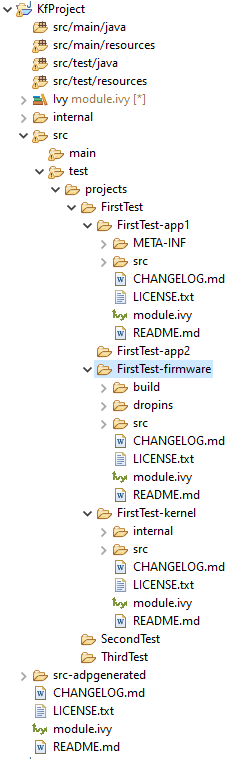

Setup a KF Testsuite
====================

A KF testsuite can be executed when building a Foundation Library or an Add-On library, 
and usually extends the tests written for the :ref:`default library testsuite <testsuite>` to verify the behavior
of this library when its APIs are exposed by a Kernel.

A KF testsuite is composed of a set of KF tests, each KF test itself is a minimal MicroEJ Multi-Sandbox Firmware composed of a Kernel and zero or more Features.

Enable the Testsuite
--------------------

In an existing library project:

- Create the ``src/test/projects`` directory,
- Edit the ``module.ivy`` and insert the following line within the ``<ea:build>`` XML element:

::

    <ea:plugin organisation="com.is2t.easyant.plugins" module="microej-kf-testsuite" revision="+" />

Add a KF Test
-------------

A KF test is a structured directory placed in the ``src/test/projects`` directory.

- Create a new directory for the KF test
- Within this directory, create the sub-projects:
  
  - Create a new :ref:`module project <mmm_module_skeleton>` for the Kernel using the ``microej-javalib`` skeleton,
  - Create a new :ref:`module project <mmm_module_skeleton>` for the Feature using the ``application`` skeleton,
  - Create a new :ref:`module project <mmm_module_skeleton>` for the Firmware using the ``firmware-multiapp`` skeleton.

The names of the project directories are free, however MicroEJ suggests the following naming convention, assuming the KF test directory is ``[TestName]``:

- ``[TestName]-kernel`` for the Kernel project, 
- ``[TestName]-app[1..N]`` for Feature projects,
- ``[TestName]-firmware`` for the Firmware project. 

The KF Testsuite structure shall be similar to the following figure:

   KF Testsuite Overall Structure

All the projects will be built automatically in the right order based on their dependencies.

KF Testsuite Options
--------------------
   
It is possible to configure the same options defined by :ref:`Testsuite Options <testsuite_options>` for the KF testsuite, 
by using the prefix ``microej.kf.testsuite.properties`` instead of ``microej.testsuite.properties``.

..
   | Copyright 2020, MicroEJ Corp. Content in this space is free 
   for read and redistribute. Except if otherwise stated, modification 
   is subject to MicroEJ Corp prior approval.
   | MicroEJ is a trademark of MicroEJ Corp. All other trademarks and 
   copyrights are the property of their respective owners.