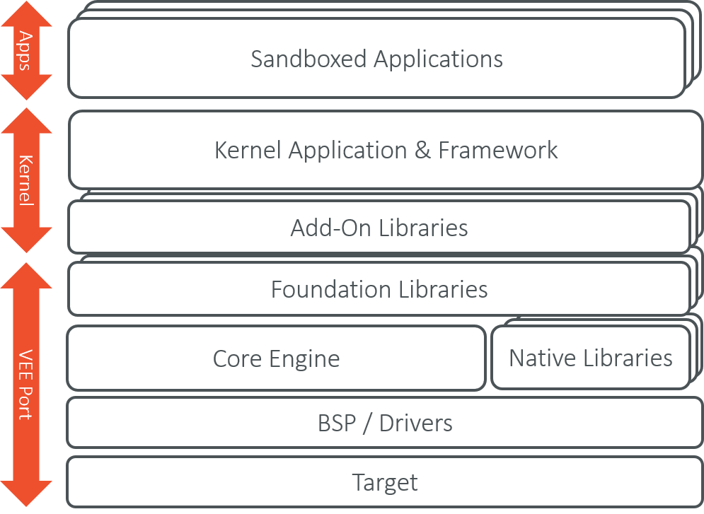
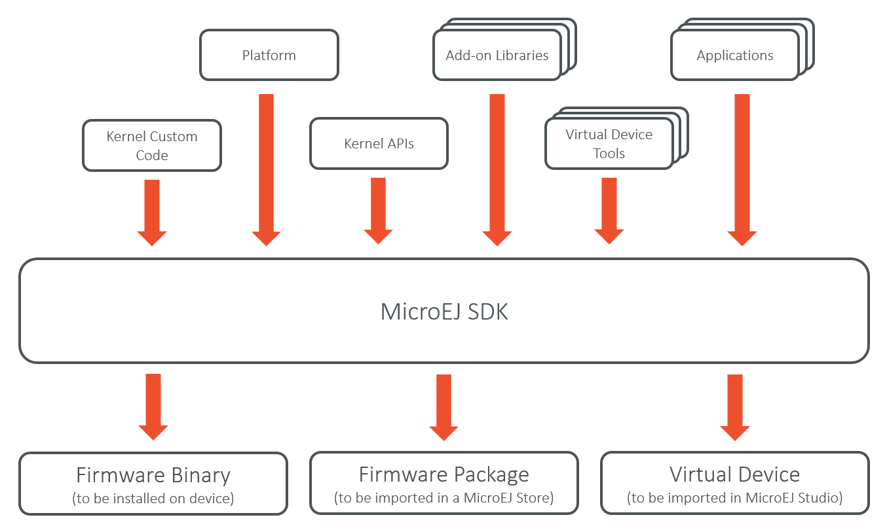
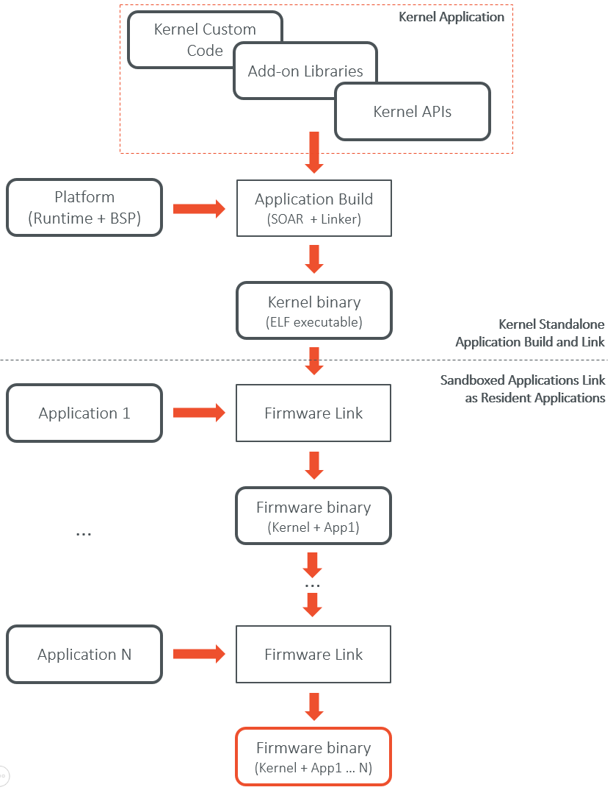
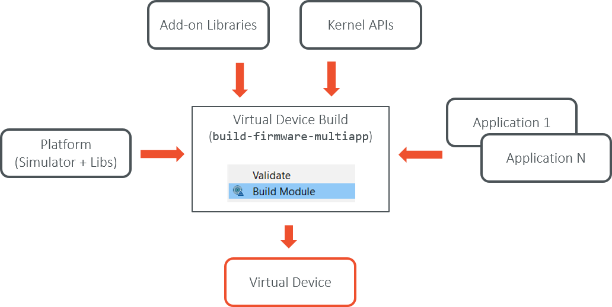

Overview
========

Introduction
------------

The Kernel Developer's Guide describes how to create a
MicroEJ Multi-Sandbox Firmware, i.e. a firmware that can be extended
(statically or dynamically) to run and control the execution of new
applications (called *Sandboxed Applications*).

The intended audience of this document are java developers and system
architects who plan to design and build their own firmware.

Here is a non-exhaustive list of the activities to be done by Multi-Sandbox
Firmware Developers:

-  Defining a list of APIs that will be exposed to applications

-  Managing lifecycles of applications (deciding when to install, start,
   stop and uninstall them)

-  Integrating applications (called resident applications)

-  Defining and applying permissions on system resources (rules &
   policies)

-  Managing connectivity

-  Controlling and monitoring resources

This document takes as prerequisite that a MicroEJ Platform is available
for the target device (see :ref:`_device.developer.guide`).
This document also assumes that the reader is familiar with the
development and deployment of MicroEJ Applications (see :ref:`_application.developer.guide`)
and specifics of developing Sandboxed Applications (see :ref:`_sandboxed.application`).

Terms and Definitions
---------------------

A *Resident Application* is a Sandboxed Application that is linked into
a Multi-Sandbox Firmware.

A *Multi-Sandbox Platform* is a Platform with the Multi Sandbox
capability of the MicroEJ Core Engine enabled (see the chapter
*Multi-Sandbox* of the `Device Developer's
Guide <https://developer.microej.com/packages/devdevguide-4.0-A/TLT-0784-MAN-DeviceDevGuide.pdf>`_).
A Multi-Sandbox Firmware can only be built with a Multi-Sandbox Platform.

A *Mono-Sandbox Firmware* is produced by building and linking a Standalone
Application with a Platform.

A *Virtual Device* is the Multi-Sandbox Firmware counterpart for developing
a Sandboxed Application in MicroEJ Studio. It provides the firmware
functional simulation part. Usually it also provides a mean to directly
deploy a Sandboxed Application on the target device running a Multi-Sandbox
Firmware (this is called *Local Deployment*). In case of dynamic
application deployment, the Virtual Device must be published on MicroEJ
Store in order to execute an internal batch applications build for this
device.

Overall Architecture
--------------------

.. _fw_stack_overwiew:

   Firmware Boundary Overview

.. _in_out_artifacts:

   Firmware Input and Output Artifacts

Firmware implementation libraries
~~~~~~~~~~~~~~~~~~~~~~~~~~~~~~~~~

Firmware implementations must cover the following topics:

-  The firmware's kernel entry point implementation, that deals with
   configuring the different policies, registering kernel services and
   converters, and starting applications.

-  The storage infrastructure implementation: mapping the ``Storage``
   service on an actual data storage implementation. There are multiple
   implementations of the data storage, provided in different artifacts
   that will be detailed in dedicated sections.

-  The applications management infrastructure: how application code is
   stored in memory and how the lifecycle of the code is implemented.
   Again, this has multiple alternative implementations, and the right
   artifact must be selected at build time to cover the specific
   firmware needs.

-  The simulation support: how the virtual device implementation
   reflects the firmware implementation, with the help of specific
   artifacts.

-  The Kernel API definition: not all the classes and methods used to
   implement the firmware's kernel are actually exposed to the
   applications. There are some artifacts available that expose some of
   the libraries to the applications, these ones can be picked when the
   firmware is assembled.

-  The Kernel types conversion and other KF-related utilities: Kernel
   types instances owned by one application can be transferred to
   another application through a Shared Interface. For that to be
   possible, a conversion proxy must be registered for this kernel type.

-  Tools libraries: tools that plug into MicroEJ Studio or SDK,
   extending them with feature that are specific to the firmware, like
   deployment of an application, a management console, ...

-  System applications: pre-built applications that can be embedded as
   resident apps into a firmware. Some of them are user-land counter
   parts of the Kernel, implementing the application lifecycle for the
   firmware's application framework (e.g. the Wadapps Framework). These
   "kernel system applications" rely on a dedicated set of interfaces to
   interact with the Kernel, this interface being defined in a dedicated
   artifact.

Firmware Build Flow
-------------------

.. _build_flow_generic:

   Firmware Build Flow (Kernel + Resident Applications)

Virtual Device Build Flow
-------------------------

The Virtual Device is automatically built at the same time than the
firmware when using the ``build-firmware-multiapp`` build type (see
:ref:`firmware_build_type`). The Virtual Device builder performs the
following steps:

-  Remove the embedded part of the platform (compiler, linker and
   runtime).

-  Append Add-on libraries and Resident Applications into the runtime
   classpath. (See :ref:`ivy_confs`) for specifying the
   dependencies).

-  Turn the Platform (MicroEJ SDK) license to Virtual Device (MicroEJ
   Studio) license so that it can be freely distributed.

-  Generate the Runtime Environment from the Kernel APIs.

   Virtual Device Build Flow

..
   | Copyright 2008-2020, MicroEJ Corp. Content in this space is free 
   for read and redistribute. Except if otherwise stated, modification 
   is subject to MicroEJ Corp prior approval.
   | MicroEJ is a trademark of MicroEJ Corp. All other trademarks and 
   copyrights are the property of their respective owners.
