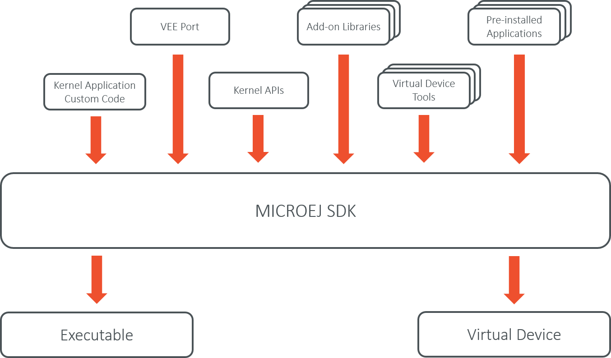

Overview
========

Introduction
------------

The Kernel Developer's Guide describes how to create a Kernel Application. 
A Kernel Application is a :ref:`Standalone Application <standalone_application>`
that can be extended (statically or dynamically) to install, run, and control the execution of new
applications called :ref:`Sandboxed Applications <sandboxed_application>`.

The intended audience of this document are Java developers and system
architects who plan to design and build their own Kernel.

Here is a non-exhaustive list of the activities to be done by Kernel Developers:

-  Integrating the Kernel Application with a VEE Port to produce a Multi-Sandbox Executable and Virtual Device

-  :ref:`Defining the set of APIs <define_apis>` that will be exposed to Applications, optionally by maintaining a custom :ref:`Runtime Environment <runtime_environment>`

-  Managing lifecycles of applications (deciding when to install, start,
   stop and uninstall them)

-  Defining and applying permissions on system resources (rules &
   policies)

-  Managing connectivity

-  Controlling and monitoring resources

This document takes as prerequisite that a VEE Port is available
for the target device (see :ref:`vee-porting-guide`).
This document also assumes that the reader is familiar with the
development and deployment of Applications (see :ref:`application-developer-guide`)
and specifics of developing Sandboxed Applications (see :ref:`sandboxed_application`).

Terms and Definitions
---------------------

A *Multi-Sandbox VEE Port* is a VEE Port with the Multi-Sandbox
capability of the Core Engine enabled (see the chapter
*Multi-Sandbox* of the :ref:`vee-porting-guide`).
A Multi-Sandbox Executable can only be built with a Multi-Sandbox VEE Port.

A *Virtual Device* is the Multi-Sandbox Executable counterpart for developing
a Sandboxed Application. It provides the Kernel
functional simulation part. Usually it also provides a mean to directly
deploy a Sandboxed Application on the target device running the Multi-Sandbox
Executable (this is called *Local Deployment*).

Overall Architecture
--------------------

.. _fw_stack_overwiew:
.. figure:: png/overview.png
   :alt: Kernel Boundary Overview
   :align: center
   :scale: 60%

   Kernel Boundary Overview

.. _in_out_artifacts:

Input and Output Artifacts
--------------------------

   Kernel Input and Output Artifacts

Kernel Build Flow
-----------------

The following describes the Kernel build flow.

   Kernel Build Flow

The Virtual Device builder performs the following steps:

-  Remove the embedded part of the VEE Port (including MEJ32).

-  Append Add-On Libraries and :ref:`pre-installed Applications <pre_installed_application_vd>` into the runtime
   classpath. See :ref:`Kernel Module Configuration <kernel_module_configuration>` section for specifying the
   dependencies.

-  Add a custom license allowing Virtual Device redistribution.

-  Generate the Runtime Environment from the Kernel APIs.

Kernel Implementation Libraries
-------------------------------

Kernel implementations must cover the following topics:

-  The kernel entry point implementation, that deals with
   configuring the different policies, registering kernel services and
   converters, and starting applications.

-  The storage infrastructure implementation: mapping the ``Storage``
   service on an actual data storage implementation. There are multiple
   implementations of the data storage, provided in different artifacts
   that will be detailed in dedicated sections.

-  The applications management infrastructure: how application code is
   stored in memory and how the lifecycle of the code is implemented.
   Again, this has multiple alternative implementations, and the right
   module must be selected at build time to cover the specific
   Kernel needs.

-  The simulation support: how the Virtual Device implementation
   reflects the Executable implementation, with the help of specific
   artifacts.

-  The Kernel API definition: not all the classes and methods used to
   implement the Kernel Application are actually exposed to the
   Sandboxed Applications. There are some artifacts available that expose some of
   the libraries to the applications, these ones can be picked when the
   Kernel is assembled.

-  The Kernel types conversion and other KF-related utilities: Kernel
   types instances owned by one application can be transferred to
   another application through a Shared Interface. For that to be
   possible, a conversion proxy must be registered for this kernel type.

-  Tools libraries: tools that plug into the SDK,
   extending them with features that are specific to the Kernel, like
   deployment of an application, a management console, ...

..
   | Copyright 2008-2023, MicroEJ Corp. Content in this space is free 
   for read and redistribute. Except if otherwise stated, modification 
   is subject to MicroEJ Corp prior approval.
   | MicroEJ is a trademark of MicroEJ Corp. All other trademarks and 
   copyrights are the property of their respective owners.
