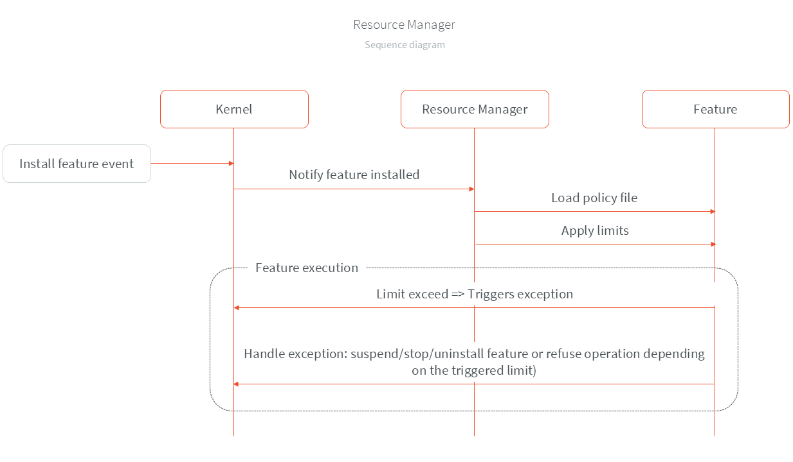

.. _resourceManager:

Resource Manager
================

The Resource Manager allows the kernel to apply a set of *controls*, defined in a policy file, to a feature. A *control* denotes either a resource limit (CPU, RAM, flash storage, network bandwidth) or the feature's priority level.

Principle
---------

When a feature is installed, the kernel checks whether it embeds a policy file. If present, the policy file is loaded and its rules are enforced throughout the lifecycle of the feature.
It is assumed that the policy file has been approved beforehand by a moderator.

The behaviour of each control is described as follows:

* **Priority**: Sets the priority of the threads owned by the feature.
* **CPU**: When a feature has reached its :ref:`CPU quota <cpu_quota>`, it is suspended until all other features consume their own quotas.
* **RAM**: If a feature exceeds its RAM limit, an ``OutOfMemoryError`` is raised and the feature is stopped and uninstalled. For more information about RAM control, please refer to this :ref:`section <ram_control>`.
* **Flash storage**: If the flash storage limit is exceeded, a ``StorageLimitException`` is thrown.
* **Network bandwidth**: Exceeding the daily bandwidth limit on the specified subnet triggers a ``BandwidthLimitException``.

The following diagram illustrates a simplified flow of the Resource Manager.

Policy File Format
------------------

To define a policy, a feature must include a policy file as a :ref:`resource <section.classpath.elements.raw_resources>`. By default, the resource name is set to ``/feature.policy.json``.
This filename can be overridden in the kernel configuration via a :ref:`system property <system_properties>`, as shown below:

.. code-block:: properties

    # Feature policy file
    feature.policy.name=/feature.policy.json

The policy file is provided in JSON format. An example is shown below:

.. code-block:: json

   {
     "priority": 5,
     "resources": {
       "limit": {
         "cpu": 30,
         "ram": 6400,
         "flash": 1024
       }
     },
     "networkData": {
       "upstream": [
         {
           "dailyDataLimit": 1024,
           "cidrSubnet": "127.0.0.1/24"
         }
       ]
     }
   }

Attributes
^^^^^^^^^^

* **priority**: Acceptable values for the priority level range from `1 <https://repository.microej.com/javadoc/microej_5.x/apis/constant-values.html#java.lang.Thread.MIN_PRIORITY>`_ to `10 <https://repository.microej.com/javadoc/microej_5.x/apis/constant-values.html#java.lang.Thread.MAX_PRIORITY>`_.
* **cpu**: CPU usage limit expressed as a percentage (relative to a calibrated 100% baseline).
* **ram**: RAM allocation limit expressed in bytes.
* **flash**: Flash memory allocation limit expressed in bytes.
* **networkData**:
    * **cidrSubnet**: Allowed IP range in CIDR notation.
    * **dailyDataLimit**: Daily upstream limit expressed in bytes.

Kernel Implementation
---------------------

Here are the steps to integrate the Resource Manager in your kernel:

1. Add the KF-Util library dependency in the kernel build file.

  .. tabs::
    .. tab:: Gradle (build.gradle.kts)
        .. code-block:: kotlin

          implementation("com.microej.library.util:kf-util:3.1.0")

    .. tab:: MMM (module.ivy)
        .. code-block:: xml

          <dependency org="com.microej.library.util" name="kf-util" rev="3.1.0"/>

2. Create an instance of the Resource Manager.

.. code-block:: java

    FeaturePolicyEnforcer policyEnforcer = new FeaturePolicyEnforcer();

3. Apply the policy when a feature is installed in the ``stateChanged(Feature feature, @Nullable Feature.State previousState)`` method of your `FeatureStateListener <https://repository.microej.com/javadoc/microej_5.x/apis/ej/kf/FeatureStateListener.html>`_ implementation.

.. code-block:: java

    public class CustomFeatureStateListener implements FeatureStateListener {

        @Override
	    public void stateChanged(Feature feature, @Nullable State previousState) {
            switch (feature.getState()) {
            case INSTALLED:
                if (previousState == null) {
                    try {
                        // The policyEnforcer instance is already created.
                        policyEnforcer.applyPolicy(feature);
                    } catch (Exception exception) {
                        // Log or handle exception.
                    }
                }
                break;

            // Other states.

            default:
                break;
            }
        }
    }

.. note::
    Steps 2 and 3 are already implemented within the ``SandboxedModuleManager`` and ``ApplicationModule`` wrappers provided by the KF-Util library. If you're using these wrappers, no additional code is required.

..
   | Copyright 2025, MicroEJ Corp. Content in this space is free
   for read and redistribute. Except if otherwise stated, modification
   is subject to MicroEJ Corp prior approval.
   | MicroEJ is a trademark of MicroEJ Corp. All other trademarks and
   copyrights are the property of their respective owners.