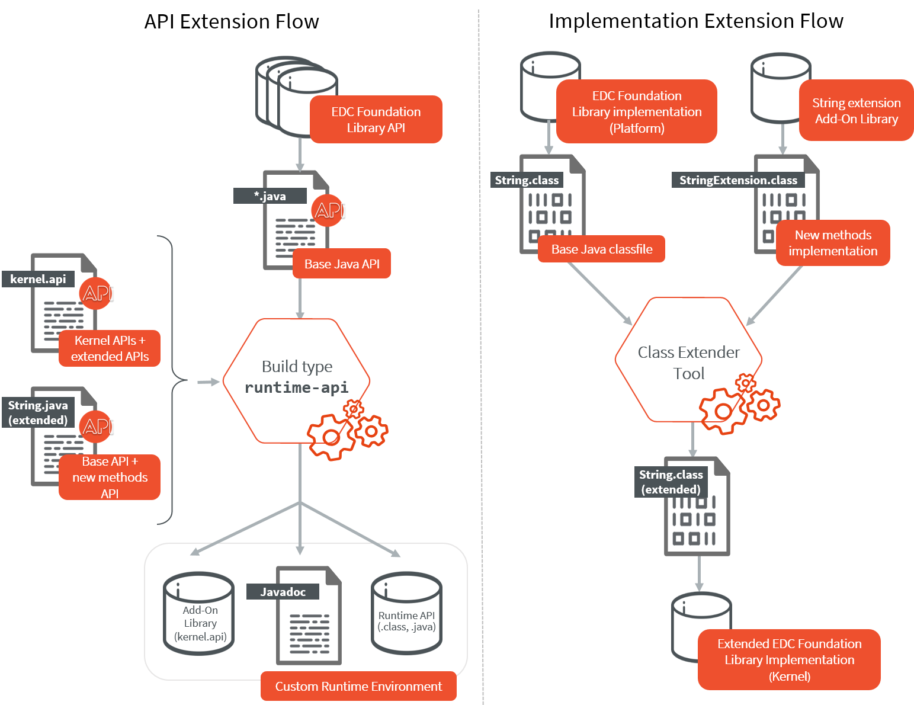

.. _runtime_environment:

===================
Runtime Environment
===================

Principle
---------

A Runtime Environment is a :ref:`module nature <module_natures>` for defining the set of APIs available to an Application developer on a Kernel.
It is built by aggregating a set of :ref:`Kernel APIs <kernel.api>`.

Building a Runtime Environment is one of the 2 solutions to define the APIs of a Kernel, as described in the section :ref:`define_apis`.
Having the set of APIs named and versioned in a Runtime Environment allows to maintain, share and document it outside of a specific Kernel implementation.

Once built, a Runtime Environment module contains the following elements:

- A JAR file with the whole library of APIs (``.class`` files and ``.java``), used by Application projects to compile Application code;
- A JAR file with the ``kernel.api`` file defined in the module (if any), 
  used by Kernel projects to fetch all the ``kernel.api`` files (by transitivity) to expose APIs when building the Firmware and the Virtual Device;
- A JAR file with the Javadoc of the APIs for documentation.

The following figure shows the overall build flow:

.. image:: png/runtime_environment_build_flow.png
   :align: center
   :scale: 75%

Create a new Runtime Environment Module
---------------------------------------

A Runtime Environment :ref:`module project <mmm_module_skeleton>` is created with the ``runtime-api`` skeleton.

.. code:: xml

   <info organisation="com.mycompany" module="myruntimeapi" status="integration" revision="1.0.0">
      <ea:build organisation="com.is2t.easyant.buildtypes" module="build-runtime-api" revision="4.0.+">
      </ea:build>
   </info>

Kernel APIs as Dependencies
~~~~~~~~~~~~~~~~~~~~~~~~~~~

The Kernel APIs can be declared as dependencies of the module.
For example, the following dependencies declare a Runtime Environment that aggregates all classes, methods and fields
defined by ``EDC,KF,BON,Wadapps,MicroUI`` Kernel APIs modules.

.. code:: xml

   <dependencies>
      <dependency org="com.microej.kernelapi" name="edc" rev="1.0.6"/>
      <dependency org="com.microej.kernelapi" name="kf" rev="2.0.3"/>
      <dependency org="com.microej.kernelapi" name="bon" rev="1.1.1"/>
      <dependency org="com.microej.kernelapi" name="wadapps" rev="2.1.2"/>
      <dependency org="com.microej.kernelapi" name="microui" rev="3.1.0"/>
   </dependencies>

The libraries modules are fetched transitively from the Kernel APIs dependencies.
For example, the dependency ``com.microej.kernelapi#edc;1.0.6`` fetches the library ``ej.api#edc;1.2.3``.

It is also possible to force the version of the libraries to use by declaring them as direct dependencies.
This is typically used to get a latest version of the library with improvements such as Javadoc fixes or Null Analysis annotations.
In this example:

.. code:: xml

   <dependencies>
      <dependency org="com.microej.kernelapi" name="edc" rev="1.0.6"/>
      
      <dependency org="ej.api" name="edc" rev="1.3.4"/>
   </dependencies>

The Runtime Environment uses the version ``1.3.4`` of the EDC library instead of the version ``1.2.3`` fetched transitively by the dependency ``com.microej.kernelapi#edc;1.0.6``.

Kernel APIs as Project File
~~~~~~~~~~~~~~~~~~~~~~~~~~~

The Kernel APIs can also be defined in a file in the Runtime Environment directly.
The file must be named ``kernel.api`` and stored in the ``src/main/resources`` folder.

Add Add-On Processors
~~~~~~~~~~~~~~~~~~~~~

When the Runtime Environment includes an Add-On Library which uses an Add-On Processor, this Add-On Processor must be declared as a direct dependency in the Runtime Environment.

The Add-On Processor dependency line can be retrieved as following: 

- Open the Add-On Library ``ivy-[version].xml`` file
- Search for the dependency line with ``conf="addon-processor->addon-processor"``

   .. code-block:: xml
      :emphasize-lines: 15

      <ivy-module xmlns:ea="http://www.easyant.org" xmlns:ej="https://developer.microej.com" xmlns:m="http://ant.apache.org/ivy/maven" version="2.0" ej:version="2.0.0">
         <info organisation="com.mycompany" module="mylibrary" revision="M.m.p" status="release" publication="20220523165033">
            ...
         </info>
         <configurations>
            ...
            <conf name="addon-processor" visibility="public" description="Addon processors dependencies."/>
         </configurations>
         <publications>
            ...
         </publications>
         <dependencies>
            <dependency org="ej.api" name="edc" rev="1.3.3" conf="default->default;provided->provided"/>
            ...
            <dependency org="com.mycompany.addon" name="mylibrary-processor" rev="x.y.z" conf="addon-processor->addon-processor"/>
            ...
         </dependencies>
      </ivy-module>
- In the Runtime Environment :ref:`module description file <mmm_module_description>`, declare the ``addon-processor`` configuration in the in the list of ``configurations``
  
  .. code-block:: xml
      
      <conf name="addon-processor" visibility="public" description="Add-On Processors dependencies."/>
- Paste the Add-On Processor dependency line

.. warning::

   If the Add-On library version is changed, the Add-On Processor version must be updated.

Here is a list of known libraries using an Add-On Processor:

- NLS::

   <dependency org="com.microej.library.runtime" name="nls-po" rev="2.3.0"/>

- Wadapps::

   <dependency org="ej.library.wadapps" name="wadapps" rev="2.2.0"/>

- JavaScript::

   <dependency org="com.microej.library.runtime" name="js" rev="0.13.0"/>

Use a Runtime Environment in an Application
-------------------------------------------

The Runtime Environment dependency must be declared in the Application project as following::

   <dependency org="com.mycompany" name="myruntimeapi" rev="1.0.0" conf="provided->runtimeapi"/>

.. note::

   If you want to add an other library dependency, make sure it is has been built on this Runtime Environment.
   Otherwise this could lead to inconsistent situations, for example by using an API not available at runtime.
   An other approach is to add it to the Runtime Environment.

Extend a Runtime Environment
----------------------------

In a Kernel, Foundation and Add-On libraries can be extended by adding new methods to their existing classes.
For example, it allows to add new methods to the class ``java.lang.String`` of the module ``ej.api#edc``.
This is done thanks to the `Class Extender tool <https://repository.microej.com/modules/com/microej/tool/class-extender/>`_.
This tool works at binary level and is able to inject methods from one class to another.
Extensions can thus be independently compiled and be retrieved by the Kernel and applied during a Multi-Sandbox Firmware build.

To make the extensions available to Application developers, the Runtime Environment has to be extended too. 

The following diagram illustrates the process of extending the default `String <https://repository.microej.com/javadoc/microej_5.x/apis/java/lang/String.html>`_ class from :ref:`[EDC] <runtime_edc>` from a Kernel developer point of view:

The extension must be applied in 2 locations:

   1. In the Runtime Environment. This ensures that Applications developers can see and use the new methods.
      The custom Runtime Environment must contain the following element:

      - the API to extend, as a dependency. 
        Here this is the EDC Foundation Library API, which contains the ``java.lang.String`` class we want to extend.
        We can add it transitively through its kernelapi::

         <dependency org="com.microej.kernelapi" name="edc" rev="1.0.6"/>

      - a :ref:`Kernel API <kernel.api>` file definition in the ``src/main/resources`` folder which includes the new methods.
        For example::

         <?xml version="1.0" encoding="UTF-8"?>
         <require>
            <method name="java.lang.String.myNewMethod(int)java.lang.String"/>
            <method name="java.lang.String.myOtherNewMethod()void"/>
         </require>

      - the new version of the Java source of the API to extend.
        This class overrides the original class fetched from the dependency.
        Therefore it must include all the methods, the ones existing in the original class as well as the new methods, with their Javadoc specification.
        In our example, we must add a new ``String.java`` source file in the ``src/main/java/java/lang`` folder, and add the new methods::

         	public String myNewMethod(int number) {
         	   return "My number is " + number;
	         }
	
         	public void myOtherNewMethod() {
         	   System.out.println("Hello!");
         	}

        This class overrides the ``java.lang.String`` class fetched from the EDC dependency.     

      Once built, the custom Runtime Environment contains the new methods and can be used in the Applications projects.

   2. In the Kernel.
      The EDC implementation is extended during the Kernel build thanks to the Class Extender tool. 
      Refer to the `Class Extender tool README <https://repository.microej.com/modules/com/microej/tool/class-extender/1.0.4/README-1.0.4.md>`_ 
      and especially to the chapter ``Include Class Extender During Firmware Project Build`` to learn how to integrate it in a Kernel build.

      MicroEJ Corp. provides some ready-to-use extension modules:
      
      - `com.microej.library.runtime#string-regex <https://repository.microej.com/modules/com/microej/library/runtime/string-regex/>`_: String methods based on Regular Expressions (e.g. ``String.split()``, ``String.replaceAll()``)
      - `com.microej.library.runtime#string-format <https://repository.microej.com/modules/com/microej/library/runtime/string-format/>`_: String formatting utility methods (e.g. ``String.format()``)

..
   | Copyright 2008-2022, MicroEJ Corp. Content in this space is free 
   for read and redistribute. Except if otherwise stated, modification 
   is subject to MicroEJ Corp prior approval.
   | MicroEJ is a trademark of MicroEJ Corp. All other trademarks and 
   copyrights are the property of their respective owners.