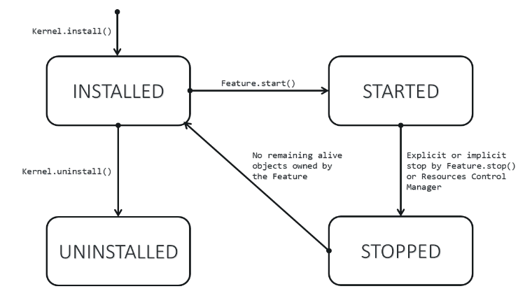

.. _kernel_application_lifecycle:

Sandboxed Application Lifecycle
===============================

The lifecycle of an Sandboxed Application is managed by the Kernel.

   Sandboxed Application Lifecycle

An Application is in one of the following states:

- **INSTALLED**: the Application has been successfully linked to the Kernel and is not running.
  There are no references from the Kernel to objects owned by this Application.
- **STARTED**: the Application has been started and is running.
- **STOPPED**: the Application has been stopped and all its owned threads and execution contexts are terminated.
  The memory and resources are not yet reclaimed.
- **UNINSTALLED**: the Application has been unlinked from the Kernel.

..
   | Copyright 2022-2023, MicroEJ Corp. Content in this space is free 
   for read and redistribute. Except if otherwise stated, modification 
   is subject to MicroEJ Corp prior approval.
   | MicroEJ is a trademark of MicroEJ Corp. All other trademarks and 
   copyrights are the property of their respective owners.
