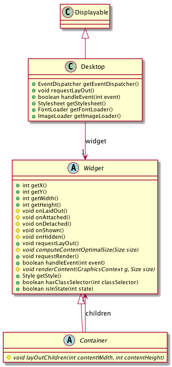
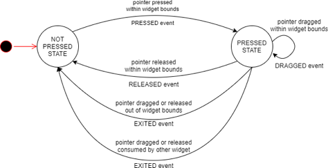

Architecture
============

Structure
---------

Widget
~~~~~~

A widget is an object that is intended to be displayed on a screen. A Widget occupies a specific region of the display and holds a state. A user may interact with a widget (using a touch screen or a button for example).

Widgets are arranged on a desktop. A widget can be part of only one desktop hierarchy, and can appear only once on that desktop.

Container
~~~~~~~~~

A container follows the composite pattern: it is a widget composed of other widgets. It also defines the layout policy of its children (defining their bounds). The children's positions are relative to the position of their parent.
Containers can be nested to design elaborate user interfaces.

Widgets added to a container are stored in a list. The order of the list defines the widgets' front-to-back stacking order within the container. By default, a Widget is added to the end of the list (so to the bottom of the stacking order).

Desktop
~~~~~~~

A desktop is a displayable intended to be shown on a display (cf. MicroUI). At any time, only one desktop can be displayed per display.

A desktop contains a widget (or a container). When the desktop is shown, its widget (and all its hierarchy for a container) is drawn on the display.

Rendering
---------

A new rendering of a widget on the display can be requested by calling its `requestRender()` method. The rendering is done asynchronously in the MicroUI thread.

When a container is rendered, all its children are also rendered.

A widget can be transparent, meaning that it does not fill its whole bounds. In this case, when this widget is asked to be rendered, its parent is asked to be rendered in the area of the widget (recursively if the parent is also transparent). Usually a widget is transparent when its background (from the style) is transparent.

A widget can also be rendered directly in a specific graphics context by calling its `render(GraphicsContext)` method. It can be useful to render a widget (and its children) in an image for example.

Lay Out
-------

All widgets are laid out at once during the lay out process. This process can be started by `Desktop.requestLayOut()`, `Widget.requestLayOut()`. The layout is also automatically done when the desktop is shown (`Desktop.onShown()`). This process is composed of two steps, each step browses the hierarchy of widgets following a depth-first algorithm:
* compute the optimal size for each widget and container (considering the constraints of the lay out),
* set position and size for each widget.

Once the position and size of a widget is set, the widget is notified by a call to `onLaidOut()`.

Event Dispatch
--------------

Events generated in the hardware (touch, buttons, etc.) are sent to the event dispatcher of the desktop. It is then responsible of sending the event to one or several widgets of the hierarchy. A widget receives the event through its `handleEvent(int)` method. This method returns a boolean that indicates whether or not the event has been consumed by the widget or not.

Disabled widgets cannot receive events and widget are disabled by default.

Pointer Event Dispatcher
~~~~~~~~~~~~~~~~~~~~~~~~~

By default, the desktop proposes an event dispatcher that handles only pointer events.

Pointer events are grouped in sessions. A session starts when the pointer is pressed, and ends when the pointer is released or when it exits the pressed widget.

While no widget consumes the events, they are sent to the widget that is under the pointer (see `Desktop.getWidgetAt(int, int)`), then sent to all its parent hierarchy recursively.

Once a widget has consumed an event, it will be the only one to receive the next events during the session.

A widget can redefine its reactive area by subclassing the `contains(int x, int y)` method. It is useful when a widget does not fill fully its bounds.

.. Add an example such as a circular slider or an analog watchface.

Style
-----

* Boxing model
* Other elements

Cascading resolution
~~~~~~~~~~~~~~~~~~~~

States
------

* Attached
* Shown

..
   | Copyright 2008-2020, MicroEJ Corp. Content in this space is free 
   for read and redistribute. Except if otherwise stated, modification 
   is subject to MicroEJ Corp prior approval.
   | MicroEJ is a trademark of MicroEJ Corp. All other trademarks and 
   copyrights are the property of their respective owners.
