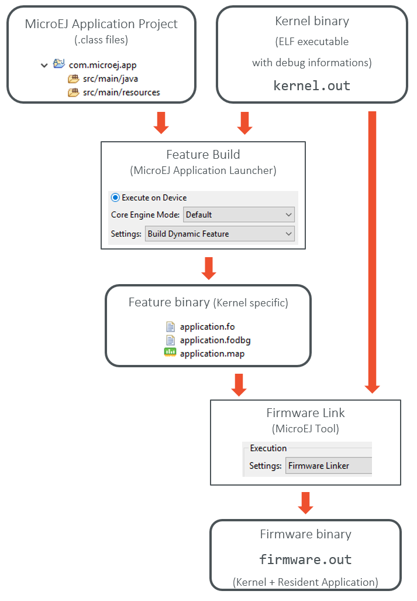
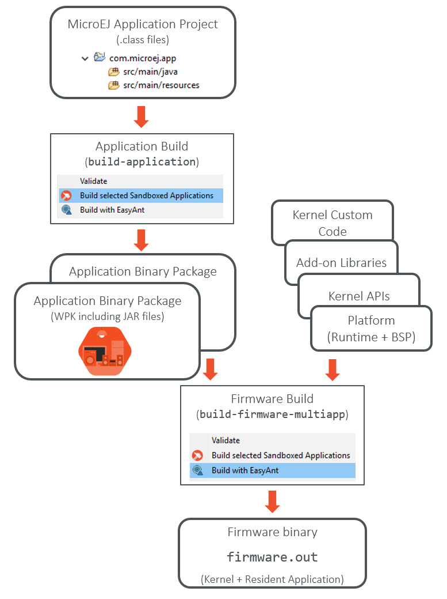

Multi-App Firmware Framework
============================

Overall Architecture
--------------------

Prebuilt Artifacts
------------------

Implementing a firmware framework is greatly simplified by available
artifacts ready to be assembled.

In the following sections these artifacts are listed, giving information
on how to retrieve them (name, organization) and their purpose.

Foundation Libraries
~~~~~~~~~~~~~~~~~~~~

Foundation libraries are provided by the underlying platform, they
typically are implemented with a mix of both Java and native code.

Because of that, they must be imported with the ``"provided"``
configuration, like so:

::

   <dependency org="ej.api" name="edc" rev="[1.2.0-RC0,2.0.0-RC0[" conf="provided"/>

ej.api#edc
^^^^^^^^^^

The EDC API ( ``java.lang`` and other core classes...)

ej.api#kf
^^^^^^^^^

The KF API. This is the foundation of the sandboxing mechanism. See the
:ref:`chapter_KF` chapter.

ej.api#net
^^^^^^^^^^

The Networking API (Sockets, ServerSockets, ...)

ej.api#ecom
^^^^^^^^^^^

The Communication and Device Management API (Connections, Streams, ...).

ej.api#ecom-comm
^^^^^^^^^^^^^^^^

The Serial Communication API.

Add-on Libraries
~~~~~~~~~~~~~~~~

Add-on libraries are implemented 100% in the Java code and can be used
in addition to a platform to implement a Firmware.

Among these libraries, some are used for a firmware implementation, some
other are used to simulate an environment (e.g., Virtual Device) since
they mainly simulate a device behavior, some are used for both
use-cases.

ej.library.wadapps#framework
^^^^^^^^^^^^^^^^^^^^^^^^^^^^

Wadapps Framework defines applications framework (
``Activity, BackgroundService, ...`` ) as well as the services offered
by the framework ( ``ApplicationsManager, ActivitiesList, ...`` )

ej.library.runtime#components
^^^^^^^^^^^^^^^^^^^^^^^^^^^^^

Components library allows a service-based programming model.
Applications can register a service implementation in a registry and can
retrieve them by using a lookup mechanism that identifies a service
according to its type.

The firmwares extend this concept to shared services. A application can
register a service (it has to implement SharedInterface), then another
applications can lookup for this service (using the Shared Interface as
the search criteria).

Firmware implementation libraries
~~~~~~~~~~~~~~~~~~~~~~~~~~~~~~~~~

Firmware implementations must cover the following topics:

-  The firmware's kernel entry point implementation, that deals with
   configuring the different policies, registering kernel services and
   converters, and starting applications.

-  The storage infrastructure implementation: mapping the ``Storage``
   service on an actual data storage implementation. There are multiple
   implementations of the data storage, provided in different artifacts
   that will be detailed in dedicated sections.

-  The applications management infrastructure: how application code is
   stored in memory and how the lifecycle of the code is implemented.
   Again, this has multiple alternative implementations, and the right
   artifact must be selected at build time to cover the specific
   firmware needs.

-  The simulation support: how the virtual device implementation
   reflects the firmware implementation, with the help of specific
   artifacts.

-  The Kernel API definition: not all the classes and methods used to
   implement the firmware's kernel are actually exposed to the
   applications. There are some artifacts available that expose some of
   the libraries to the applications, these ones can be picked when the
   firmware is assembled.

-  The Kernel types conversion and other KF-related utilities: Kernel
   types instances owned by one application can be transferred to
   another application through a Shared Interface. For that to be
   possible, a conversion proxy must be registered for this kernel type.

-  Tools libraries: tools that plug into MicroEJ Studio or SDK,
   extending them with feature that are specific to the firmware, like
   deployment of an application, a management console, ...

-  System applications: pre-built applications that can be embedded as
   resident apps into a firmware. Some of them are user-land counter
   parts of the Kernel, implementing the application lifecycle for the
   firmware's application framework (e.g. the Wadapps Framework). These
   "kernel system applications" rely on a dedicated set of interfaces to
   interact with the Kernel, this interface being defined in a dedicated
   artifact.

Filemanager implementation libraries
^^^^^^^^^^^^^^^^^^^^^^^^^^^^^^^^^^^^

The firmware framework can rely on a storage implementation that can be
backed by different implementation of the filemanager interface.

ej.library.util#filemanager
'''''''''''''''''''''''''''

Defines the common interface for all implementation of the filemanagers.

ej.library.util#filemanager-test
''''''''''''''''''''''''''''''''

Implements a common set of tests for the filemanager implementations.

ej.library.util#filemanager-ram
'''''''''''''''''''''''''''''''

A filemanager implementation that is backed by Java byte arrays
allocated in the Java heap. By construction, this implementation
provides no persistence. The use case for such an implementation is to
be used for tests purposes, or temporarily, until the underlying
platform provides an actual implementation of the filesystem interface.

ej.library.util#filemanager-fs
''''''''''''''''''''''''''''''

A filemanager implementation that relies on the FS foundation API (a.ka.
``ej.api#fs``).

Application management libraries
^^^^^^^^^^^^^^^^^^^^^^^^^^^^^^^^

There are multiple possible implementations of the Wadapps framework,
depending on the memory architecture of the target, or on the type of
persistent/non persistent behavior retained for the firmware.

To allow for these multiple implementations, the application management
implementation libraries are split in the following modules: a common
base module defining interfaces and common behavior, and different
backend implementations.

com.microej.library.wadapps#admin-kf-common
'''''''''''''''''''''''''''''''''''''''''''

This is the common module defining the common behavior and the
interfaces to be implemented by the backends.

com.microej.library.wadapps#admin-kf-default
''''''''''''''''''''''''''''''''''''''''''''

This is a simple 1 to 1 mapping of the KF concepts with the Wadapps
concepts. A Wadapps application is a ``Feature``, it has the same
lifecycle and the framework relies on the feature storage mechanism
provided by the KF implementation. If the KF implementation is not
persistent (i.e. features are stored in RAM), then the Wadapps
applications are not persistent.

com.microej.library.wadapps#admin-kf-storage
''''''''''''''''''''''''''''''''''''''''''''

This is a more complex mapping of the KF concepts under the Wadapps
concepts, with the Waddaps application being installed in the filesystem
(as provided by the filemanager) and being "installed" into KF only when
the application is actually "loaded" for execution. In this mode, when
an application is unloaded, it is uninstalled from KF, but it is still
available in the storage.

This implementation makes the most sense when the underlying KF
implementation provides no persistence, while the firmware must support
persistence of applications.

Application signature management
^^^^^^^^^^^^^^^^^^^^^^^^^^^^^^^^

In order to protect the device from malicious and/or undesired code to
be injected into the devices, the firmware can include an application
signature verification mechanism that allows for rejecting the
installation (or execution) of any application whose signature can't be
verified.

com.microej.library.security#util-der
'''''''''''''''''''''''''''''''''''''

The DER encoding is a non ambiguous binary encoding for protocols
defined with the ASN.1 syntax. This encoding is used for security
protocols or security objects such as X.509 certificates.

This utility library provides a stream-oriented API that allows for
parsing DER-encoded streams.

com.microej.library.security#command-unwrapper-api
''''''''''''''''''''''''''''''''''''''''''''''''''

Instead of defining a specific protocol for signed application
installation, a more generic approach has been chosen, by defining a
protocol for signed commands, with one of the commands being the
installation command. Other commands such as application uninstallation
or (un)blocking can therefore be defined and benefit from the signing
mechanism.

The concept of signed commands is not bound to a specific protocol and
appears in the Wadapps framework only through the
``ApplicationManager.execute(InputStream)`` method. When executing this
method, the implementations of the ApplicationManager interface are
looking for an implementation of the ``CommandWrapper`` interface.

This module defines the API that must be implemented by command wrapper
implementations.

When imported, command wrapper implementations dependency must use the
"service" configuration, like this: ``conf="default->service"``, to
ensure that not only the implementation is imported, but also it is
mapped as the actual implementation of the ``CommandUnwrapper``
interface.

com.microej.library.security#command-unwrapper-no-verify
''''''''''''''''''''''''''''''''''''''''''''''''''''''''

This module is an implementation that follows the signed command format
specificiation but performs no crypto operations, simply skipping the
protocol elements and providing (untrusted) access to the command
content.

This implementation is used by the ``admin-kf-storage`` backend for the
access to application metadata, when starting the system. This
particular use of this module doesn't happen thanks to the
``ServiceLoader`` mechanism but is done by direct instantiation, so if
this particular module is to be chosen as the system's
``CommandUnwrapper``, it must also be imported using the service
configuration mapping as explained above.

Other use cases of this implementation are for testing purposes, or when
the crypto operations cannot be performed on the desired target.

com.microej.library.security#command-unwrapper-verifier
'''''''''''''''''''''''''''''''''''''''''''''''''''''''

This module is an implementation that follows the signed command format
specification and that performs actual signature verification of the
command.

Without detailling the protocol completely, the verification algorithm
can be summarised as:

1. The wrapping command version is verfied to be known and supported by
   this firmware.

2. The signature algorithm and initialization parameters are decoded,
   and a Signature verification object instance is created and
   configured accordingly.

3. The certification path of this command is verified.

   The purpose of the certification path is to provide the public key of
   the signing entity, in a trusted manner. For this reason, the
   signer's key is delivered within a X.509 certificate, which is can be
   trusted because it is signed by a known authority whose X.509
   certificate is either provided in the certification path or securely
   stored on the device.

   The certifcation path is therefore processed in this order:

   1. The next (or first) certificate in the chain is verified. This
      certificate must be self-signed (if self-signed certificates are
      accepted) or must be signed with public key known as a trust
      anchor and securely stored in the device, or with the previously
      memorised publick key (see next steps). If the signature cannot be
      verified, the whole operation is rejected.

   2. The full distinguished name BER encoding of the certificate is
      checked against the full distinguished name of the authorized
      signing entity (comparison is performed at binary encoding level,
      so string encoding and order of the name elements matter)

      If the two DN match, then the rest of the command is considered to
      be authorized, so this second step can be skipped for next
      certificates

   3. If the processed certificate is verified, the its public key is
      memorised as a trusted key to be used for the next verification
      operation.

      If there are more cerificates in the certification path, then the
      process restarts at step 1, for the next certicate.

      If there are no more cerificates in the certification path, then
      the public key of the last certificate is the signer's public key.

      A this point, the command must be authorized, i.e. the DN of the
      signing entity must have been seen in the certification path,
      unless self-signed certificates are supported and accepted.

4. The command is decoded and interpreted, and executed, while keeping
   in mind that anything that is performed beacuse of this command is
   subject to the command signature verification that will happen in the
   end of this process.

   Every byte read (or skipped) from the command process is fed into the
   signature verification algorithm.

5. Once all the bytes of the Command stream have been processed, the
   command signature can be verified using the signer's public key, as
   expressed in the certification path detailed in the above section.

   If, and only if, the signature is verified, then the operations
   requested by this command must be considered as valid and their
   result can be effective and persistent.

Version 1.0 of this module includes a full-Java implementation of the
``RSAwithSHA256`` signature verfication algorithm, so this module can be
used on targets where the crypto library has not been implemented yet.
Future implementations of this module may be modified to rely on a
foundation library for cryptographic operations.

Version 1.0 of this module also contains a resource named
``trustedCAs.der`` that contains the X.509 certificate of the MicroEJ
Demonstration Stores Certification Authority. This allows the firmwares
to accept applications signed and delivered by the MicroEJ Demonstration
Stores.

The firmware can be configured with the following properties:

``com.microej.wadapps.allowSignedCommands``: Must be ``true`` if signed
commands are supported by this firmware. In this case, a
CommandUnwrapper implementation must be provided.

``com.microej.wadapps.allowUnsignedCommands``: Must be ``true`` if
unsigned commands are supported by this firmware. If not supported, then
unsigned commands are rejected.

``com.microej.wadapps.allowUpdateOnInstall``: If ``true`` then the
signed install command is accepted for an already-installed application,
and is actually an application update operation.

``com.microej.security.command.trustSelfSignedCertificates``: If
``true`` then the signed install commands can be signed using a
self-signed certificate, in which case the operation will automatically
be considered authorized.

``com.microej.security.command.authorized.DN``: Contains the hex
encoding of the know authorized signed entity. For the MicroEJ
Demonstration Stores, this property value is
``#303D313B303906035504030C32496E647573747269616C20536D61727420536
F66747761726520546563686E6F6C6F677920576164617070732053746F7265``

com.microej.tools#signed-command-tools
''''''''''''''''''''''''''''''''''''''

This module is a tooling artifact, used on the developer's machine to
generated signed commands, for validation purposes, or included in the
localdelploy extensions to locally build signed commands using
self-signed certificates.

.. _default_kernel_api:

Default Kernel APIs
^^^^^^^^^^^^^^^^^^^

MicroEJ provides some predefined kernel API files exposing the full APIs
for foundations libraries and some add-on libraries. These files are
packaged into individual artifacts on the MicroEJ Central Repository
(artifacts are named ``com.microej.kernelapi.*``).

System Applications and their Kernel interface
^^^^^^^^^^^^^^^^^^^^^^^^^^^^^^^^^^^^^^^^^^^^^^

com.microej.library.wadapps.kernel#common"
''''''''''''''''''''''''''''''''''''''''''

com.microej.app.wadapps#management
''''''''''''''''''''''''''''''''''

com.microej.app.wadapps#commandserver-comm
''''''''''''''''''''''''''''''''''''''''''

com.microej.app.wadapps#commandserver-socket
''''''''''''''''''''''''''''''''''''''''''''

Simulation support libraries
^^^^^^^^^^^^^^^^^^^^^^^^^^^^

com.microej.library.wadapps#standalone
''''''''''''''''''''''''''''''''''''''

K/F utilities libraries
^^^^^^^^^^^^^^^^^^^^^^^

com.microej.library.util#kf-util
''''''''''''''''''''''''''''''''

com.microej.library.util#kf-util-ecom
'''''''''''''''''''''''''''''''''''''

Tools artifacts
^^^^^^^^^^^^^^^

com.is2t.tools#wadapps-localdeploy-socket-extension
'''''''''''''''''''''''''''''''''''''''''''''''''''

com.is2t.tools#wadapps-localdeploy-wpk-socket-extension
'''''''''''''''''''''''''''''''''''''''''''''''''''''''

com.is2t.tools#wadapps-console-socket-extension
'''''''''''''''''''''''''''''''''''''''''''''''

com.is2t.tools#wadapps-localdeploy-comm-extension
'''''''''''''''''''''''''''''''''''''''''''''''''

com.is2t.tools#wadapps-localdeploy-wpk-comm-extension
'''''''''''''''''''''''''''''''''''''''''''''''''''''

com.is2t.tools#wadapps-console-comm-extension
'''''''''''''''''''''''''''''''''''''''''''''

com.is2t.tools#application-repository-extension
'''''''''''''''''''''''''''''''''''''''''''''''

.. _available.kernel.converters:

Available Kernel Converters
~~~~~~~~~~~~~~~~~~~~~~~~~~~

KF Backends (schema)
~~~~~~~~~~~~~~~~~~~~

admin standalone => VD 
admin KF => firmware

Building a Firmware
~~~~~~~~~~~~~~~~~~~

Workspace Build
^^^^^^^^^^^^^^^

=> launch groups 
resolve into workspace 
separate kernel artifact from firmware integration 
artifact ?

.. _build_flow_workspace:

   Firmware Build Flow in MicroEJ SDK Workspace

.. _firmware_build_type:

Headless Build
^^^^^^^^^^^^^^

=> build type =>

.. _build_flow_buildtype:

   Firmware Build Flow in MicroEJ SDK Workspace

..
   | Copyright 2008-2020, MicroEJ Corp. Content in this space is free 
   for read and redistribute. Except if otherwise stated, modification 
   is subject to MicroEJ Corp prior approval.
   | MicroEJ is a trademark of MicroEJ Corp. All other trademarks and 
   copyrights are the property of their respective owners.
