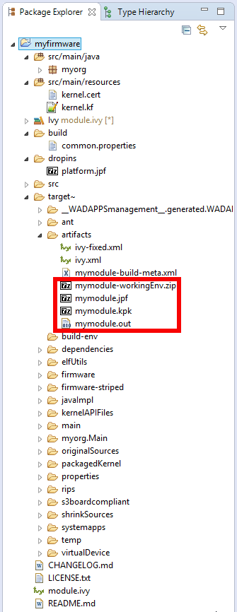

Getting Started
===============

Online Getting Started
----------------------

The MicroEJ Multi-App Firmware Getting Started is available on MicroEJ
GitHub repository, at
:http:`https://github.com/MicroEJ/Example-MinimalMultiAppFirmware`.

The file ``README.md`` provides a step by step guide to produce a
minimal firmware on an evaluation board on which new applications can be
dynamically deployed through a serial or a TCP/IP connection.

Create an Empty Firmware from Scratch
-------------------------------------

Create a new Firmware Project
~~~~~~~~~~~~~~~~~~~~~~~~~~~~~

MicroEJ SDK provides an EasyAnt skeleton
(``com.is2t.easyant.skeletons#firmware-multiapp``) to create an empty
Multi-App Firmware project.

Select :guilabel:`File` > :guilabel:`New` > :guilabel:`Other...` > :guilabel:`Easyant` > :guilabel:`Easyant Project`, set the
appropriate skeleton, and press the ``Finish`` button. 

.. _fms:
.. image:: png/firmware-multiapp-skeleton.png
   :align: center
   :width: 525px
   :height: 500px

A new project is generated into the workspace:

.. _fms-project:
.. image:: png/firmware-multiapp-skeleton-project.png
   :align: center
   :width: 334px
   :height: 353px

Setup a Platform
~~~~~~~~~~~~~~~~

Before building the firmware, a target platform must be configured. The
easiest way to do it is to copy a platform file into the
``myfirmware > dropins`` folder. Such file usually ends with ``.jpf``.
For other ways to setup the input platform to build a firmware see
:ref:`platform_selection`.

Build the Firmware
~~~~~~~~~~~~~~~~~~

In the Package Explorer, right-click on the firmware project and select
:guilabel:`Build with EasyAnt`. The build of the firmware and virtual
device may take several minutes. When the build is succeed, the folder
``myfirmware > target~ > artifacts`` contains the firmware output artifacts
(see :ref:`in_out_artifacts`) :

-  ``mymodule.out``: The Firmware Binary to be programmed on device.

-  ``mymodule.kpk``: The Firmware Package to be imported in a MicroEJ
   Store.

-  ``mymodule.jpf``: The Virtual Device to be imported in MicroEJ
   Studio.

-  ``mymodule-workingEnv.zip``: This file contains all files produced by
   the build phasis (intermediate, debug and report files).

.. _fms-artifacts:

..
   | Copyright 2008-2020, MicroEJ Corp. Content in this space is free 
   for read and redistribute. Except if otherwise stated, modification 
   is subject to MicroEJ Corp prior approval.
   | MicroEJ is a trademark of MicroEJ Corp. All other trademarks and 
   copyrights are the property of their respective owners.
