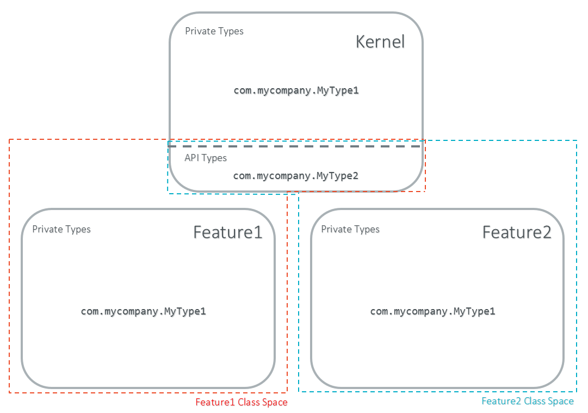
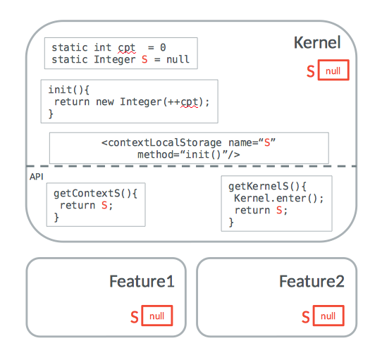
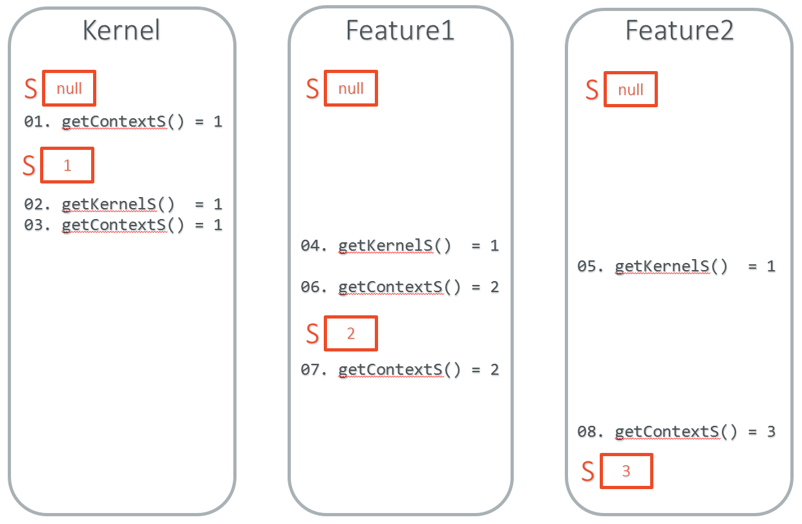
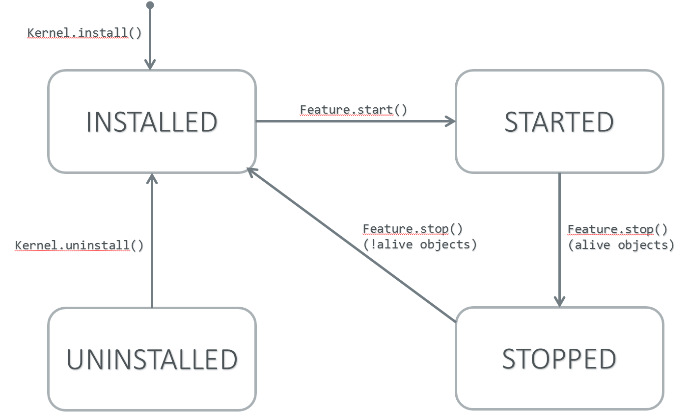

.. _chapter_KF:

Kernel & Features Specification
===============================

Basic Concepts
--------------

Kernel & Features semantic (KF) allows an application code to be split
between multiples parts: the main application, called the *Kernel* and
zero or more sandboxed applications called *Features*.

The Kernel part is mandatory and is assumed to be reliable, trusted and
cannot be modified. If there is only one application, i.e only one
``main`` entry point that the system starts with, then this application
is considered as the Kernel and called a standalone application. Even if
there are more applications in the platform, there is still only one
entry point. This entry point is the Kernel. Applications (downloaded or
preinstalled) are "code extensions" (called "Features"), that are called
by the Kernel. These Features are fully controlled by the Kernel: they
can be installed, started, stopped and uninstalled at any time
independently of the system state (particularily, a Feature never
depends on an other Feature to be stopped)!

Ownership
---------

At runtime, each type, object and thread execution context has an owner.
This section defines ownership transmission and propagation rules.

Type
~~~~

The owner of a type is fixed when type is loaded and cannot be modified
later on. The owner of an array of type is the owner of the type. Arrays
of basetypes are owned by the Kernel. The owner of a type can be
retrieved by calling ``Kernel.getOwner(Object)`` with the ``Class``
instance.

Object
~~~~~~

When an object is created, it is assigned to the execution context
owner. The owner of an object can be retrieved by calling
``Kernel.getOwner(Object)`` with the given object.

Execution Context
~~~~~~~~~~~~~~~~~

The owner of the current execution context can be retrieved by calling
``Kernel.getContextOwner()``. When a thread is started, the owner of the
first execution context is the owner of the thread object. When method
is called from Kernel mode (:ref:`kernel.mode`) and the
receiver owner is a Feature, the execution context is set to the owner
of the receiver. In all other cases, the execution context of the method
called is the current execution context of the caller.

Note that when a method returns, the execution context of the caller
remains the one it was before the call was done.

.. _kernel.mode:

Kernel mode
~~~~~~~~~~~

An execution context is considered to be in Kernel mode when the current
execution context is owned by the Kernel. The method ``Kernel.enter()``
sets the current execution context owner to the Kernel. The method
``Kernel.exit()`` resets the current execution context owner to the one
when the method was called. The main application runs in Kernel mode
(the first created thread - the main thread - is owned by the Kernel).

Execution Rules
---------------

Type References
~~~~~~~~~~~~~~~

A type owned by the Kernel cannot refer to a type owned by a Feature.

A type owned by a Feature cannot refer to a type owned by another
Feature.

A type owned by a Feature cannot access any types of this library (in
package ``ej.kf.*``) except the ``ej.kf.FeatureEntryPoint`` interface or
the ``ej.kf.Proxy`` class.

Objects References
~~~~~~~~~~~~~~~~~~

An object owned by a Feature cannot be assigned to an object owned by
another Feature, otherwise a ``java.lang.IllegalAccessError`` is thrown.

An object owned by a Feature can be assigned to an object owned by the
Kernel only in Kernel mode (see :ref:`kernel.mode`),
otherwise a ``java.lang.IllegalAccessError`` is thrown. Possible
assignments are field assignment, array assignment or array copies using
``System.arraycopy()``.

Static References
~~~~~~~~~~~~~~~~~

A static field of a Class owned by a Feature cannot refer to an object
owned by another Feature.

An object owned by a Feature can be assigned to a static field of a
Class owned by the Kernel only in Kernel mode (see :ref:`kernel.mode`), otherwise a ``java.lang.IllegalAccessError`` is
thrown.

Local references
~~~~~~~~~~~~~~~~

An execution context owned by a Feature cannot have a local that refers
to an object owned by another Feature. When leaving Kernel mode (see
:ref:`kernel.mode`) and returning to an execution context
owned by a Feature, all locals that refer to an object owned by another
Feature are reset to ``null``.

Native Declaration
~~~~~~~~~~~~~~~~~~

Only Kernel classes can declare a native method. If a class owned by a
Feature declares a native method, an error is thrown during the
compilation by the SOAR.

Reflective Operations
~~~~~~~~~~~~~~~~~~~~~

``Class.forName``
^^^^^^^^^^^^^^^^^

The table below defines the ``Class.forName`` semantic rules. According
to MicroEJ classpath semantic the type being loaded is assumed to have
been marked as a required type (see *Chapter MicroEJ Classpath* of the
Application Developer's Guide).

.. tabularcolumns:: |p{2.5cm}|p{2cm}|p{2.5cm}|p{8.1cm}|

+------------+------------+-------------+-----------------------------+
| Context    | Code Owner | Type Owner  | ``Class.forName(Type)``     |
| Owner      |            |             | allowed                     |
+============+============+=============+=============================+
| ``K``      | ``K``      | ``K``       | ``true``                    |
+------------+------------+-------------+-----------------------------+
| ``K``      | ``K``      | ``F``       | ``false``                   |
+------------+------------+-------------+-----------------------------+
| ``K``      | ``F``      | ``K``       | ``N/A``                     |
+------------+------------+-------------+-----------------------------+
| ``K``      | ``F``      | ``F``       | ``N/A``                     |
+------------+------------+-------------+-----------------------------+
| ``F``      | ``K``      | ``K``       | ``true``                    |
+------------+------------+-------------+-----------------------------+
| ``Fi``     | ``K``      | ``Fj``      | ``i==j``                    |
+------------+------------+-------------+-----------------------------+
| ``F``      | ``F``      | ``K``       | ``true`` if the type has    |
|            |            |             | been marked as API (see     |
|            |            |             | :ref:`kernel.api`),         |
|            |            |             | false otherwise.            |
+------------+------------+-------------+-----------------------------+
| ``Fi``     | ``Fi``     | ``Fj``      | ``i==j``                    |
+------------+------------+-------------+-----------------------------+

``Class.getResourceAsStream``
^^^^^^^^^^^^^^^^^^^^^^^^^^^^^

The table below defines the ``Class.getResourceAsStream`` semantic
rules.

.. tabularcolumns:: |p{2.5cm}|p{2cm}|p{2.5cm}|p{8.1cm}|

+---------+--------+-----------+---------------------------------------+
| Context | Code   | Resource  | ``Class.getResourceAsStream([name])`` |
| Owner   | Owner  | Owner     | allowed                               |
+=========+========+===========+=======================================+
| ``K``   | ``K``  | ``K``     | ``true``                              |
+---------+--------+-----------+---------------------------------------+
| ``K``   | ``K``  | ``F``     | ``false``                             |
+---------+--------+-----------+---------------------------------------+
| ``K``   | ``F``  | ``K``     | ``N/A``                               |
+---------+--------+-----------+---------------------------------------+
| ``K``   | ``F``  | ``F``     | ``N/A``                               |
+---------+--------+-----------+---------------------------------------+
| ``F``   | ``K``  | ``K``     | ``true``                              |
+---------+--------+-----------+---------------------------------------+
| ``Fi``  | ``K``  | ``Fj``    | ``i==j``. Note that if the same       |
|         |        |           | resource name is declared by both     |
|         |        |           | the Kernel and the Feature, the       |
|         |        |           | Feature resource takes precedence to  |
|         |        |           | the Kernel resource.                  |
+---------+--------+-----------+---------------------------------------+
| ``F``   | ``F``  | ``K``     | ``false``                             |
+---------+--------+-----------+---------------------------------------+
| ``Fi``  | ``Fi`` | ``Fj``    | ``i==j``                              |
+---------+--------+-----------+---------------------------------------+

``Class.newInstance``
^^^^^^^^^^^^^^^^^^^^^

The table below defines the ``Class.newInstance`` semantic rules.

.. tabularcolumns:: |p{2.5cm}|p{2cm}|p{2.5cm}|p{8.1cm}|

+----------+--------+-----------+-------------------------------------+
| Context  | Code   | Type      | New Instance Owner                  |
| Owner    | Owner  | Owner     |                                     |
+==========+========+===========+=====================================+
| ``K``    | ``K``  | ``K``     | ``K``                               |
+----------+--------+-----------+-------------------------------------+
| ``K``    | ``K``  | ``F``     | ``F``                               |
+----------+--------+-----------+-------------------------------------+
| ``K``    | ``F``  | ``K``     | ``N/A``                             |
+----------+--------+-----------+-------------------------------------+
| ``K``    | ``F``  | ``F``     | ``N/A``                             |
+----------+--------+-----------+-------------------------------------+
| ``F``    | ``K``  | ``K``     | ``F``                               |
+----------+--------+-----------+-------------------------------------+
| ``F``    | ``K``  | ``F``     | ``F``                               |
+----------+--------+-----------+-------------------------------------+
| ``F``    | ``F``  | ``K``     | ``F``                               |
+----------+--------+-----------+-------------------------------------+
| ``F``    | ``F``  | ``F``     | ``F``                               |
+----------+--------+-----------+-------------------------------------+

When ``Class.newInstance`` is disallowed, a
``java.lang.InstanciationException`` is thrown.

Feature Description
-------------------

Feature description files are automatically generated by MicroEJ Studio
for sandboxed application projects in ``src/.generated~`` source folder.
This section is useful for manual feature configuration or for the
understanding of the auto-generated files .

Definition Files
~~~~~~~~~~~~~~~~

The feature definition files are detailed in *Appendix / Foundation
Libraries / Chapter KF* of the Device Developer's Guide.

Entry point
~~~~~~~~~~~

Each Feature must define an implementation of the
``ej.kf.FeatureEntryPoint``. ``FeatureEntryPoint.start()`` method is
called when Feature is started. It is considered to be the main method
of the Feature application. ``FeatureEntryPoint.stop()`` method is
called when Feature is being stopped. It gives a chance to the Feature
to terminate properly.

The entry point can be manually overriden by explicitly setting the
following entry in the application ``META-INF/MANIFEST.MF`` file:

::

   Application-EntryPoint: com.mycompany.MyFeatureEntryPoint

Types & Class Loading
---------------------

Exposed API Types
~~~~~~~~~~~~~~~~~

A kernel API file is an xml file which contains the list of classes,
methods, and static fields exposed as APIs for the features in the
kernel. The kernel API specification is described in *Appendix :
Foundation Libraries / Chapter KF / Kernel API Definition*\ of the
Device Developer's Guide. 

.. _example.kernel.api:
.. code-block:: xml
   :caption: Kernel API Example for Exposing ``System.out.println()`` to a Feature

   <field name="java.lang.System.out"/> <method
   name="java.io.PrintStream.println(java.lang.String)void"/>

Class Space
~~~~~~~~~~~

A Kernel or a Feature class space never contains two classes with the
same fully qualified name. Types exposed as API by the Kernel are part
of the Feature class space. A Kernel and a Feature class spaces may
contain two different types with the same fully qualified name if the
Kernel type is not exposed as API. Two Features class spaces may contain
two different types with the same fully qualified name.

.. _kf_class_space:

   Kernel & Features Classes Spaces

Feature Classpath
~~~~~~~~~~~~~~~~~

Feature classpath loading respects the MicroEJ classpath loading (see
*Chapter MicroEJ Classpath* of the Application Developer's Guide) with
the following modifications:

-  A kernel type exposed as API takes precedence over a type with the
   same fully qualified name defined in the feature classpath

-  ``*.list`` files of a path (folder or JAR file) are not processed if
   the path contains at least one type exposed as API type. Such kind of
   path is considered to be a Kernel path (``*.list`` files have already
   been processed when building the Kernel).

-  ``*.properties.list`` are not processed. System properties can only
   be declared by the Kernel.

Context Local Storage for Static Fields
~~~~~~~~~~~~~~~~~~~~~~~~~~~~~~~~~~~~~~~

By default, a static field holding an object reference is stored in a
single memory slot in the context of the owner of the type that defines
the field. It is possible for the Kernel to declare a static field that
is also duplicated into each Feature, thus creating the context local
storage field. This is done by defining a ``kernel.intern`` file such as
following:

.. code-block:: xml
   :caption: Kernel & Features Classes Spaces

   <kernel> <contextLocalStorage
   name="com.mycompany.MyType.MY_GLOBAL"/> </kernel>

A memory slot is then
reserved for the Kernel and for each Feature. The static field is
initialized to ``null`` when the Feature is started. It is possible to
declare an initialization method by extending the ``kernel.intern`` file
such as following:

.. code-block:: xml
   :caption: Context Local Storage Declaration of a Static Field with an Initialization Method

   <kernel> <contextLocalStorage name="com.mycompany.MyType.MY_GLOBAL"
   initMethod="com.mycompany.MyType.myInit()java.lang.Object" /> </kernel>

This method is automatically invoked by MicroEJ Core Engine when a
static field is being read and its content is ``null``. This gives a
hook to lazily initialize the static field before its first read access.

The following example describes the definition of a context local
storage static field and a detailed sequence of method calls with its
expected behaviour.

   Context Local Storage of Static Field Example

   Context Local Storage Example of Initialization Sequence

Feature Lifecycle
-----------------

States
~~~~~~

A Feature is in one of the following states:

-  ``INSTALLED``: Feature has been successfully linked to the Kernel and
   is not running. There are no references from the Kernel to objects
   owned by this Feature.

-  ``STARTED``: Feature has been started and is running.

-  ``STOPPED``: Feature has been stopped and all its threads are
   terminated. There are remaining references from the Kernel to objects
   owned by this Feature.

-  ``UNINSTALLED``: Feature has been unlinked from the Kernel.

The following figure describes the Feature state diagram and the methods
that may change its state.

.. _kf_lifecyle:

   Feature State Lifecycle

Installation
~~~~~~~~~~~~

A Feature is installed by the Kernel using
``Kernel.install(InputStream)`` with the ``application.fo`` data
content. Consult the chapter *Multi-Applications* of the Device
Developer's Guide for how to build the feature binary application file.
The application data is read and linked to the Kernel. If the Feature
cannot be linked to the Kernel, an
``ej.kf.IncompatibleFeatureException`` is thrown. This most likely
occurs when the Feature binary file has been built for an other kernel
than the one on which it is been loaded. Otherwise, the Feature is added
to the list of loaded features with the ``INSTALLED`` state.

Start
~~~~~

A Feature is started by the Kernel using ``Feature.start()``. A new
thread owned by the Feature is created and started. The Feature is
switched to the ``STARTED`` state and the method returns. Next steps are
executed asynchronously within the new thread context:

-  Feature clinits are executed.

-  Entrypoint is instanciated.

-  ``FeatureEntryPoint.start()`` is called.

Stop
~~~~

A Feature is stopped by the Kernel using ``Feature.stop()``. Next steps
are executed:

-  A new thread owned by the Feature is created and
   ``FeatureEntryPoint.stop()`` is executed asynchronously.

-  Wait until this thread is normally terminated or timeout occurred.

-  Resources that remain open by the Feature are reclaimed.

-  A ``ej.kf.DeadFeatureException`` is thrown in threads that are
   running Feature code or in threads that want to call Feature code.

-  Wait until all threads owned by this Feature are terminated.

-  Feature state is set to ``STOPPED``.

-  Objects owned by the Feature are reclaimed. If there are no remaining
   alive objects, the Feature state is set to ``INSTALLED``.

When the new Feature state is ``INSTALLED``, the Feature runtime has
been fully reclaimed (threads and objects). Otherwise, the new Feature
state is ``STOPPED`` and there are some remaining Feature objects
references from Kernel. This method can be called multiple times by the
Kernel to reclaim objects again and thus to try to switch the Feature in
the ``INSTALLED`` state. When Feature state is set to ``STOPPED``, all
the method ``FeatureStateListener#stateChanged(Feature, State)`` is
called for each registered listener, giving a hook for the Kernel
application to remove all its references to objects owned by this
Feature.

Uninstallation
~~~~~~~~~~~~~~

A Feature is uninstalled by the Kernel using
``Kernel.uninstall(Feature)``. The Feature code is unlinked from the
Kernel and reclaimed. The Feature is removed from the list of loaded
features and its state is set to ``UNINSTALLED``.

Communication between Features
------------------------------

Features can communicate together through the use of shared interfaces.
The mechanism is described in *Chapter Shared Interfaces* of the
Application Developer's Guide.

Kernel Type Converters
~~~~~~~~~~~~~~~~~~~~~~

The shared interface mechanism allows to transfer an object instance of
a Kernel type from one Feature to an other. To do that, the Kernel must
register a new converter (See :ref:`kf.api.javadoc`
``Kernel.addConverter()`` method).

See also :ref:`available.kernel.converters` for a list of existing
converters.

.. _kf.api.javadoc:

API Documentation
-----------------

The full API documentation of the Kernel & Features foundation library
is available in MicroEJ SDK
(``Help > MicroEJ Resource Center > Javadoc > KF [version]``).

..
   | Copyright 2008-2020, MicroEJ Corp. Content in this space is free 
   for read and redistribute. Except if otherwise stated, modification 
   is subject to MicroEJ Corp prior approval.
   | MicroEJ is a trademark of MicroEJ Corp. All other trademarks and 
   copyrights are the property of their respective owners.
