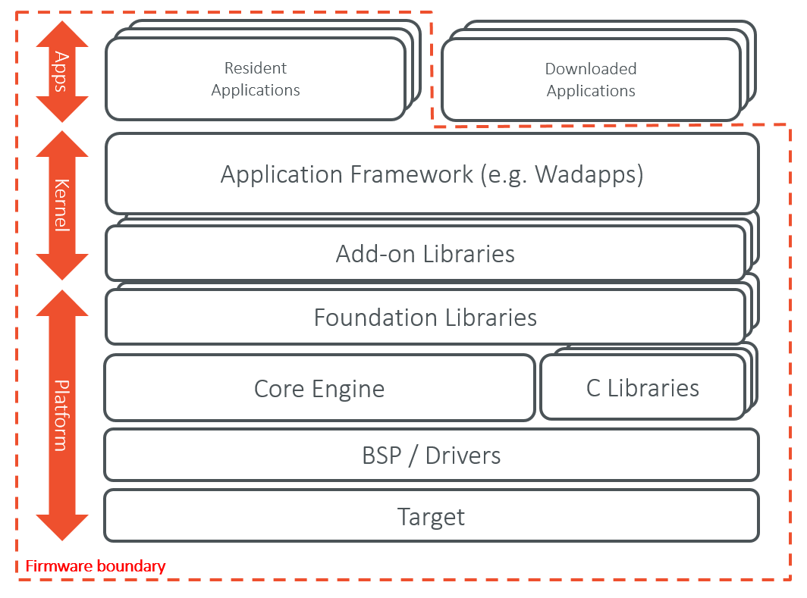
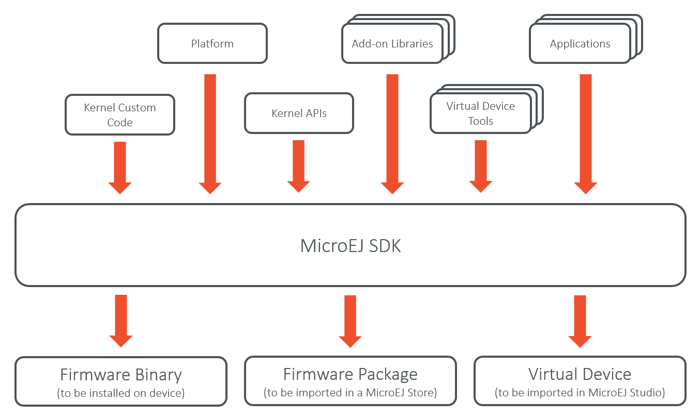
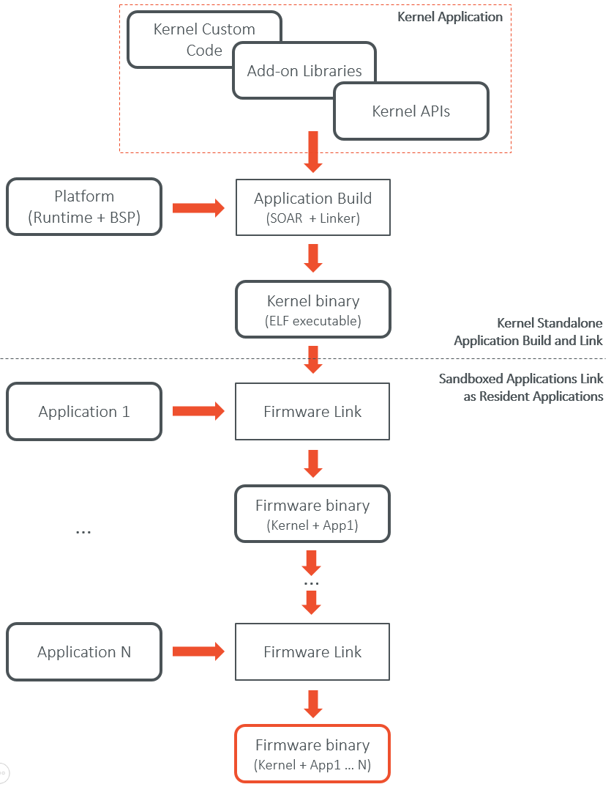
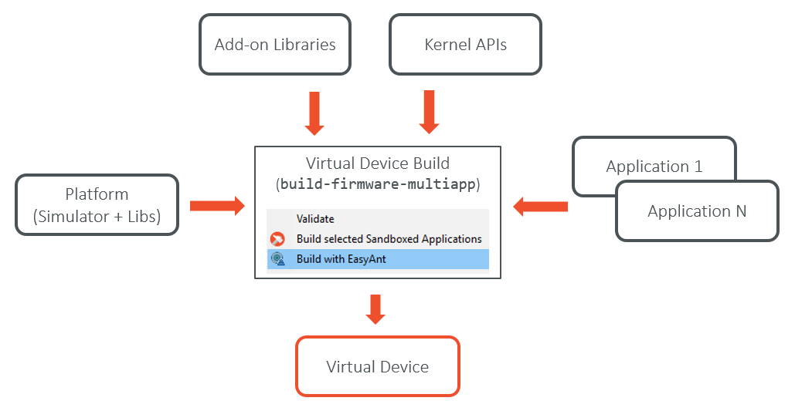

Multi-App Firmware Overview
===========================

Introduction
------------

The Multi-App Firmware Developer's Guide describes how to create a
MicroEJ Multi-App Firmware, i.e. a firmware that can be extended
(statically or dynamically) to run and control the execution of new
applications (called *Sandboxed Applications*).

The intended audience of this document are java developers and system
architects who plan to design and build their own firmware.

Here is a non-exhaustive list of the activities to be done by Multi-App
Firmware Developers:

-  Defining a list of APIs that will be exposed to applications

-  Managing lifecycles of applications (deciding when to install, start,
   stop and uninstall them)

-  Integrating applications (called resident applications)

-  Defining and applying permissions on system resources (rules &
   policies)

-  Managing connectivity

-  Controlling and monitoring resources

This document takes as prerequisite that a MicroEJ Platform is available
for the target device (refer to our `Device Developer's
Guide <https://developer.microej.com/packages/devdevguide-4.0-A/TLT-0784-MAN-DeviceDevGuide.pdf>`_).
This document also assumes that the reader is familiar with the
development and deployment of MicroEJ applications (refer to our
`Standalone Application Developer's
Guide <https://developer.microej.com/packages/appdevguide-stand-4.1-B/TLT-0793-DGI-StandaloneApplicationDeveloperGuide-MicroEJ_4.1-B.pdf>`_)
and specifics of developing Sandboxed Applications (refer to our
`Sandboxed Application Developer's
Guide <https://developer.microej.com/packages/appdevguide-sand-4.0-C/TLT-0788-DGI-SandboxedApplicationDeveloperGuide-MicroEJ_4.0-C.pdf>`_).

Terms and Definitions
---------------------

A *Standalone Application* is an application, designed in MicroEJ Studio
with the standalone application structure, that defines a main entry
point (a class that contains a ``public static void main(String[])``
method). A Standalone Application can be run on the simulator and is
intended to be statically linked with a Platform to produce a Single-App
Firmware.

A *Sandboxed Application* is an application designed in MicroEJ Studio
with the sandboxed application structure (see chapter *Sandboxed
Application Structure* of the `Sandboxed Application Developer's
Guide <https://developer.microej.com/packages/appdevguide-sand-4.0-C/TLT-0788-DGI-SandboxedApplicationDeveloperGuide-MicroEJ_4.0-C.pdf>`_).
A sandboxed application is intended to be executed by a Multi-App
Firmware.

A *Resident Application* is a Sandboxed Application that is linked into
a Multi-App Firmware.

A *Multi-App Platform* is a Platform with the Multi Applications
capability of the MicroEJ Core Engine enabled (see the chapter
*Multi-Applications* of the `Device Developer's
Guide <https://developer.microej.com/packages/devdevguide-4.0-A/TLT-0784-MAN-DeviceDevGuide.pdf>`_).
A Multi-App Firmware can only be built with a Multi-App Platform.

A *Single-App Firmware* is produced by building and linking a Standalone
Application with a Platform.

A *Virtual Device* is the Multi-App Firmware counterpart for developing
a Sandboxed Application in MicroEJ Studio. It provides the firmware
functional simulation part. Usually it also provides a mean to directly
deploy a Sandboxed Application on the target device running a Multi-App
Firmware (this is called *Local Deployment*). In case of dynamic
application deployment, the Virtual Device must be published on MicroEJ
Store in order to execute an internal batch applications build for this
device.

Overall Architecture
--------------------

.. _fw_stack_overwiew:

   Firmware Boundary Overview

.. _in_out_artifacts:

   Firmware Input and Output Artifacts

Firmware Build Flow
-------------------

.. _build_flow_generic:

   Firmware Build Flow (Kernel + Resident Applications)

Virtual Device Build Flow
-------------------------

The Virtual Device is automatically built at the same time than the
firmware when using the ``build-firmware-multiapp`` build type (see
:ref:`firmware_build_type`). The Virtual Device builder performs the
following steps:

-  Remove the embedded part of the platform (compiler, linker and
   runtime).

-  Append Add-on libraries and Resident Applications into the runtime
   classpath. (See :ref:`ivy_confs`) for specifying the
   dependencies).

-  Turn the Platform (MicroEJ SDK) license to Virtual Device (MicroEJ
   Studio) license so that it can be freely distributed.

-  Generate the Runtime Environment from the Kernel APIs.

   Virtual Device Build Flow

..
   | Copyright 2008-2020, MicroEJ Corp. Content in this space is free 
   for read and redistribute. Except if otherwise stated, modification 
   is subject to MicroEJ Corp prior approval.
   | MicroEJ is a trademark of MicroEJ Corp. All other trademarks and 
   copyrights are the property of their respective owners.
