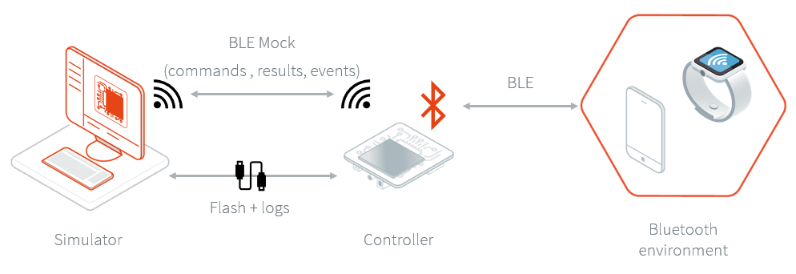
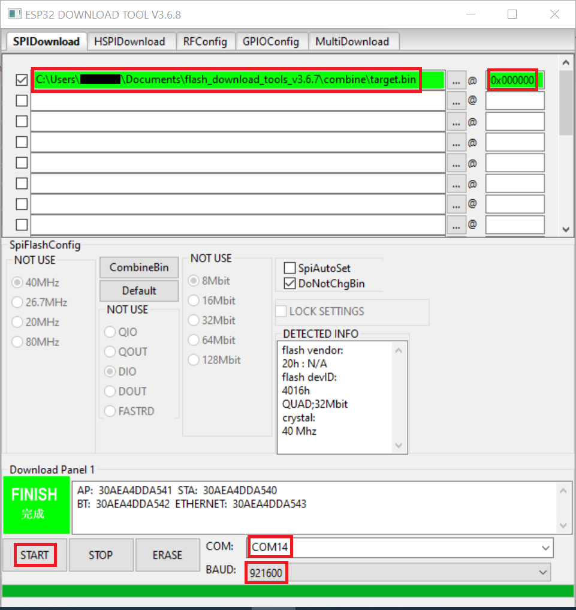
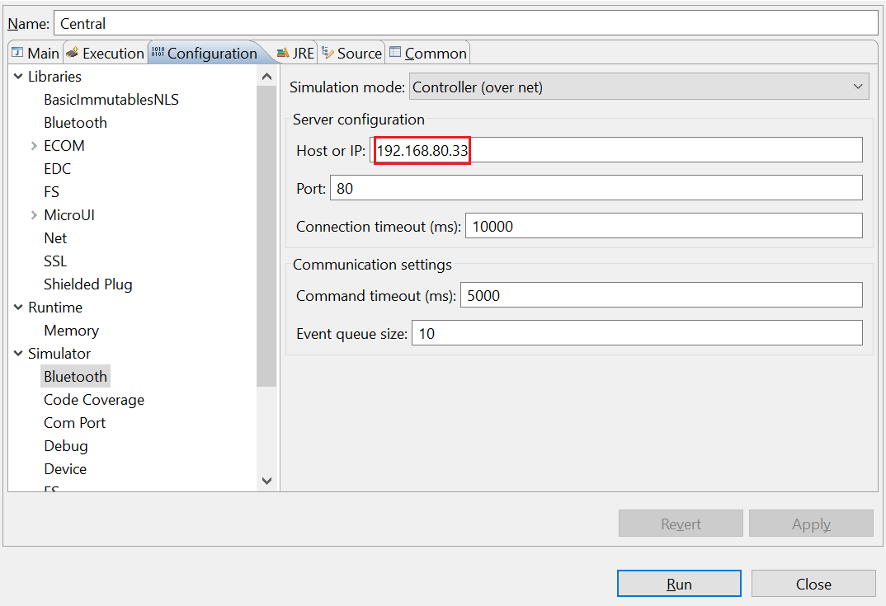
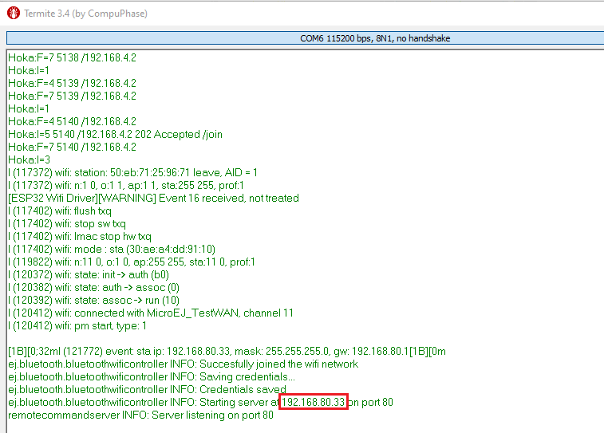

Bluetooth LE Simulation
=======================

Overview
--------

To run an application that uses the Bluetooth LE foundation library on the
simulator, a Bluetooth LE mock controller must be set up first :

   |Bluetooth-mock-controller|

The Bluetooth LE mock controller is a hardware mock of the Bluetooth LE library. It
means the simulator uses a real Bluetooth LE device to scan other devices,
advertise, discover services, connect, pair, etc... This design enables
testing of apps in a real-world environment.

The Bluetooth LE mock controller implementation is provided for the `ESP32-DevKitC
board reference <https://www.espressif.com/en/products/hardware/esp32-devkitc/overview>`__.
Other implementations or sources can be provided on request.

Requirements
------------

- A ESP32-DevKitC board.
- A Bluetooth LE mock controller firmware_.
- A tool to flash the firmware like
  https://www.espressif.com/en/tools-type/flash-download-tools.

Usage
-----

To simulate a Bluetooth LE application, follow these three steps:

- Set up the controller
- Set up the network configuration
- Run the application on the simulator

If your are facing any issues, check BLEMOCKTROUBLESHOOTING_.

Controller setup
~~~~~~~~~~~~~~~~

To set up the controller, flash the firmware on the device :

   |flash-download-tool|

Network setup
~~~~~~~~~~~~~

To configure the network:

#. Connect your computer to the Wi-Fi network "BLE-<ID>" (password :
   ``BLEoWifi``)
#. Open a browser and connect to http://192.168.4.1/ to access the Wi-Fi setup
   interface :

   |wifi-setup-interface|

#. Select the desired network and provide the required information if asked.
   If an error occurs during the connection, retry this step.
#. In case the device is successfully connected to the desired network, the
   web page should looks like this:

   |wifi-setup-last-screen|

   Additionally, the serial output of the device shows connection status.
#. Connect your computer back to this network : your computer and the
   controller must be in the same network.

Simulation
~~~~~~~~~~

It is possible to run the simulator as many times as necessary using the same
setup. Also, rebooting the controller will automatically set up the network with
the saved configuration.

The IP address of the controller is available in the logs :

|controller-ip|

Configure the Bluetooth LE mock settings in the simulator Run Configuration panel
of your Bluetooth LE application before running it on the simulator.

|bluetooth-mock-configuration|

Launching the application on the simulator will reboot the controller. The
simulation starts once the controller is reconnected to the network.

.. _BLEMOCKTROUBLESHOOTING: blemockTroubleshooting.rst
.. _firmware: resources/blemock-controller.bin

..
   | Copyright 2008-2020, MicroEJ Corp. Content in this space is free 
   for read and redistribute. Except if otherwise stated, modification 
   is subject to MicroEJ Corp prior approval.
   | MicroEJ is a trademark of MicroEJ Corp. All other trademarks and 
   copyrights are the property of their respective owners.