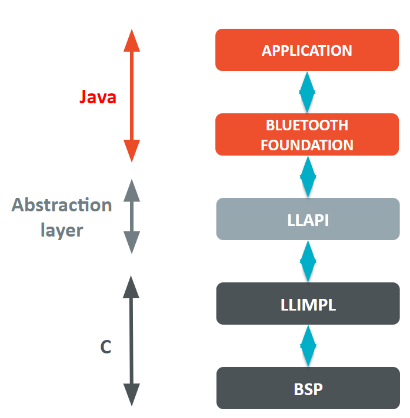
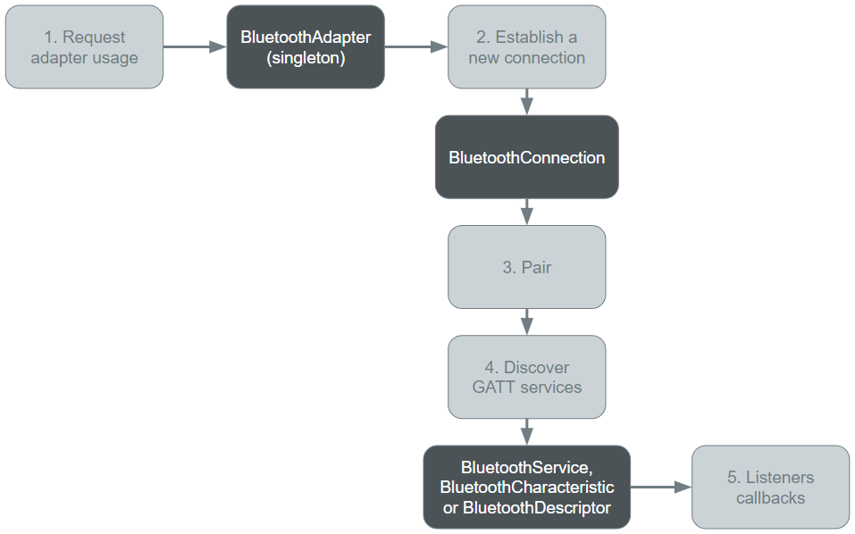

.. _pack_bluetooth:

=========
Bluetooth
=========

Principle
=========

MicroEJ provides some Foundation Libraries to implement Bluetooth, more
specifically Bluetooth Low Energy (BLE). Bluetooth Low Energy (BLE),
sometimes referred to as “Bluetooth Smart”, is a light-weight subset of
classic Bluetooth and was introduced as part of the Bluetooth 4.0 core
specification. While there is some overlap with classic Bluetooth, BLE
actually has a completely different use case intention. While classic
Bluetooth is targeted in order to stream data such as audio, BLE is
intended for low power applications that may send short bursts of data
at longer periods in order to minimize power consumption.

The diagram below shows a simplified view of the components involved in
the provisioning of a Java Bluetooth API.

   Component Stack Diagram.

Bluetooth low level API connects the Bluetooth library to the
user-supplied drivers code (coded in C).

In order to test and validate a Bluetooth port:

- Every LLAPI must be implemented. 
- Central and peripheral examples should work (you may test with the mobile
  application “nRF Connect” available on Android and iOS). 
- Testsuite should pass.

Functional Description
======================

The diagram below shows the overall process to use Bluetooth adapters.

   Functional Description Diagram.

The MicroEJ Application manages the Bluetooth connection using the
Bluetooth library. The Bluetooth 2.0 (or BLE) concepts are available,
they are pairing, bonding, requesting data, sending data, notifications
and more. In the typical usage, the application can play two roles:

1. A peripheral device, like a Wi-Fi access point:

   -  Advertises to nearby devices
   -  Waits for a connection request

2. A central device, like a Wi-Fi station

   -  Scans nearby peripheral devices
   -  Initiates the connection

Depending on the role choice, the application should take care of some
parts of this typical connection flow: 
1. Peripheral starts advertising.
2. Central starts scanning. 
3. Central initiates connection with peripheral. 
4. Central sends pairing request. 
5. Peripheral outputs passkey to user and requests passkey to central. 
6. Central gets passkey from user input and sends it to peripheral. 
7. Peripheral checks passkey match and accepts/denies pairing.

Dependencies
============

A platform with `bluetooth
pack <https://docs.microej.com/en/latest/PlatformDeveloperGuide/platformQualification.html#bluetooth-pack>`__
is needed.

.. code:: xml

   <dependency org="com.microej.pack.bluetooth" name="bluetooth-pack" rev="2.1.0"/>

The Bluetooth library depends on the Bluetooth pack for the native
implementation of Java native methods,
``com.microej.pack.bluetooth#bluetooth-pack``. See more about the `Low
Level
API <https://docs.microej.com/en/latest/PlatformDeveloperGuide/appendix/llapi.html>`__.

In addition, to qualify the port of the library, a suite of tests is needed:
``com.microej.pack.bluetooth#bluetooth-testsuite``.

Use
===

The Bluetooth API Module must be added to the module.ivy of the MicroEJ
Application project to use the Bluetooth library.

.. code:: xml

   <dependency org="ej.api" name="bluetooth" rev="2.1.0"/>

This foundation library is always required when developing a MicroEJ
Application which communicates with some external devices through
bluetooth. It is automatically embedded as soon as a sub communication
library is added in the classpath.
