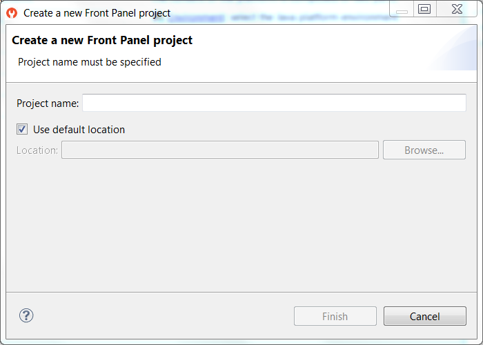

.. _section_frontpanel:

================
Front Panel Mock
================

Principle
=========

A major strength of the MicroEJ environment is that it allows
applications to be developed and tested in a Simulator rather than on
the target device, which might not yet be built. To make this possible
for devices that controls operated by the user, the Simulator must connect to a "mock" of
the control panel (the "Front Panel") of the device. The Front Panel generates a graphical representation of the
device, and is displayed in a window on the user's
development machine when the application is executed in the Simulator.

The Front Panel has been designed to be an implementation of MicroUI library (see :ref:`section_ui_simulation`). However it can be use to show a hardware device, blink a LED, interact with user without using MicroUI library. 

Functional Description
======================

1. Creates a new Front Panel project.

2. Creates an image of the required Front Panel. This could be a
   photograph or a drawing.

3. Defines the contents and layout of the Front Panel by editing an XML
   file (called an fp file). Full details about the structure and
   contents of fp files can be found in chapter
   :ref:`front_panel_file`.

4. Creates images to animate the operation of the controls (for example
   button down image).

5. Creates *Widgets* that  make the link between the application and the user interactions.

6. Previews the Front Panel to check the layout of controls and the
   events they create, etc.

7. Exports the Front Panel project into a MicroEJ Platform project.

The Front Panel Project
=======================

Creating a Front Panel Project
------------------------------

A Front Panel project is created using the New Front Panel Project
wizard. Select:

``New > Project... > MicroEJ > Front Panel Project``

The wizard will appear:

   New Front Panel Project Wizard

Enter the name for the new project.

Project Contents
----------------

.. figure:: images/project-content.png
   :alt: Project Contents
   :align: center

   Project Contents

A Front Panel project has the following structure and contents:

* The ``src/main/java`` folder is provided for the definition of ``Widgets``. It is initially empty. The creation of these classes will be explained later.
* The ``src/main/resources`` folder holds the file or files that define the contents and layout of the Front Panel, with a ``.fp`` extension (the fp file or files), plus images used to create the Front Panel. A newly created project will have a single fp file with the same name as the project, as shown above. The contents of fp files are detailed later in this  document.
* The ``JRE System Library`` is referenced, because a Front Panel  project needs to support the writing of Java for the ``Listeners`` (and ``DisplayExtensions``).
* The ``Modules Dependencies`` contains the libraries for the Front Panel simulation, the widgets it supports and the types needed to implement ``Listeners`` (and ``DisplayExtensions``).
* The ``lib`` contains a local copy of ``Modules Dependencies``. 

Module Dependencies
===================

The Front Panel project is a regular MicroEJ Module project. Its ``module.ivy`` file should look like this example:

.. code-block:: xml

   <ivy-module version="2.0" xmlns:ea="http://www.easyant.org" xmlns:ej="https://developer.microej.com" ej:version="2.0.0"> 
   <info organisation="com.mycompany" module="examplePanel" status="integration" revision="1.0.0"/>      

      <configurations defaultconfmapping="default->default;provided->provided">
         <conf name="default" visibility="public" description="Runtime dependencies to other artifacts"/>
         <conf name="provided" visibility="public" description="Compile-time dependencies to APIs provided by the Platform"/>
      </configurations>

      <dependencies>
         <dependency org="ej.tool.frontpanel" name="widget" rev="1.0.0"/>
      </dependencies>
   </ivy-module>

The dependency ``ej.tool.frontpanel#widget`` is only useful for MicroUI application (see :ref:`section_ui_simulation`). The dependencies block must be manually updated to depend only on the Front Panel framework. This framework contains the Front Panel core classes:

.. code-block:: xml
   :emphasize-lines: 2

   <dependencies>
      <dependency org="ej.tool.frontpanel" name="framework" rev="1.0.0"/>
   </dependencies>

The Front Panel framework does not provide any widgets. Widgets have to be added to simulate user interactions. 

Front Panel File
================

File Content
------------

The Front Panel engine takes an XML file (the ``.fp`` file) as input. It describes
the panel using widgets: they simulate the drivers, sensors and
actuators of the real device. The Front Panel engine generates the graphical
representation of the real device, and is displayed in a window on the
user's development machine when the application is executed in the
Simulator.

The following example file describes a simple board with one LED:

.. code-block:: xml

   <?xml version="1.0"?>
   <frontpanel 
      xmlns:xsi="http://www.w3.org/2001/XMLSchema-instance"
      xmlns="https://developer.microej.com" 
      xsi:schemaLocation="https://developer.microej.com .widget.xsd">
      
      <device name="MyBoard" skin="myboard.png">
         <ej.fp.widget.LED x="131" y="127" skin="box_led.png"/>
      </device>
   </frontpanel>

The ``device`` ``skin`` must refer to a ``png`` file in the
``src/main/resources`` folder. This image is used to render the background of the
Front Panel. The widgets are drawn on top of this background.

The ``device`` contains the elements that define the widgets that
make up the Front Panel. The name of the widget element defines the type
of widget. The set of valid types is determined by the Front Panel
Designer. Every widget element defines a ``label``, which must be unique
for widgets of this type (optional or not), and the ``x`` and ``y`` coordinates of the
position of the widget within the Front Panel (0,0 is top left). There
may be other attributes depending on the type of the widget.

The file and tags specifications are available in chapter
:ref:`front_panel_file`.

.. note:: The ``.fp`` file grammar has changed since the UI Pack version ``12.0.0`` (Front Panel core has been moved to MicroEJ Architecture ``7.11.0``). A quick migration guide is available here: open Platform configuration file ``.Platform``, go to ``Content`` tab, click on module ``Front Panel``. The migration guide is available in ``Details`` box.

Editing Front Panel Files
-------------------------

To edit a ``.fp`` file, open it using the Eclipse XML editor (right-click on
the ``.fp`` file, select ``Open With > XML Editor``). This editor features
syntax highlighting and checking, and content-assist based on the schema
(XSD file) referenced in the fp file. This schema is a hidden file
within the project's definitions folder. An incremental builder checks
the contents of the fp file each time it is saved and highlights
problems in the Eclipse Problems view, and with markers on the fp file
itself.

A preview of the Front Panel can be obtained by opening the Front Panel
Preview
(``Window > Show View > Other... > MicroEJ > Front Panel Preview``).

The preview is updated each time the ``.fp`` file is saved.

A typical working layout is shown below.

   Working Layout Example

Within the XML editor, content-assist is obtained by pressing
``CTRL + SPACE`` keys.  The editor will list all the elements valid at the cursor
position, and insert a template for the selected element.

Multiple Front Panel Files
--------------------------

A Front Panel project can contain multiple ``.fp`` files. All ``fp`` files are compiled when exporting the Front Panel project in a Platform (or during Platform build). It is useful to have two or more representation of a board (size, devices layout, display size etc.). By default the Simulator will chooses the default ``.fp`` file declared by the Platform, or will defaults to a random one. To choose a specific one, set the :ref:`Application Option <application_options>` ``frontpanel.file`` to a Front Panel simple file name included in the Platform (e.g. ``mycompany.fp``).

.. _section_frontpanel_widget:

Widget
======

Description
-----------

A widget is a subclass of Front Panel framework class ``ej.fp.Widget``. The library ``ej.tool.frontpanel#widget`` provides a set of widgets which are graphical engine compatible (see :ref:`section_ui_simulation`). To create a new widget (or a subclass of an existing widget), have a look on available widgets in this library.

A widget is recognized by the ``fp`` file as soon as its class contains a ``@WidgetDescription`` annotation. The annotation contains several ``@WidgetAttribute``. An attribute has got a name and tells if it is an optional attribute of widget (by default an attribute is mandatory).

This is the description of the widget ``LED``:

.. code-block:: java

   @WidgetDescription(attributes = { @WidgetAttribute(name = "x"),
         @WidgetAttribute(name = "y"), @WidgetAttribute(name = "skin")})

As soon as a widget is created (with its description) in Front Panel project, the ``fp`` file can use it. Close and reopen ``fp`` file after creating a new widget. In ``device`` group, press ``CTRL + SPACE`` keys to visualize the available widgets: the new widget can be added.

.. code-block:: xml

   <ej.fp.widget.LED x="170" y="753" skin="box_led.png" />

Each attribute requires the ``set`` methods in the widget source code. For instance, the widget LED (or its hierarchy) contains the following methods for sure:

* ``setX(int)``,
* ``setY(int)``,
* ``setskin(Image)``.

The ``set`` method parameter's type fixes the expected value in ``fp`` file. If the attribute cannot match the expected type, an error is throw when editing ``fp`` file. Widget master class already provides a set of standard attributes:

* ``setFilter(Image)``: apply a filtering image which allows to crop input area (:ref:`section_filter_input`).
* ``setWidth(int)`` and ``setHeight(int)``: limits the widget size.
* ``setLabel(String)``: specifies an identifier to the widget.
* ``setOverlay(boolean)``: draws widget skin with transparency or not.
* ``setSkin(Image)``: specifies the widget skin.
* ``setX(int)`` and ``setY(int)``: specifies widget position.

Notes:

* Widget class does not specify if an attribute is optional or not. It it the responsability to the subclass. 
* The label is often used as identifier. It also allows to retrieve a widget calling ``Device.getDevice().getWidget(Class<T>, String)``. Some widgets are using this identifier as an integer label. It is the responsability to the widget to fix the signification of the label.
* The widget size is often fixed by the its skin (which is an image). See ``Widget.finalizeConfiguration()``: it sets the widget size according the skin if the skin has been set; even if methods ``setWidth()`` and ``setHeight()`` have been called before.

Runtime
-------

The Front Panel engine parsing the ``fp`` file at application runtime. The widget methods are called in two times. First, engine creates widget by widget:

#. widget's constructor: Widget should initialize its own fields which not depend on widget attributes (not valorized yet).
#. ``setXXX()``: Widget should check if given attribute value matches the expected behavior (the type has been already checked by caller). For instance if a width is not negative. On error, implementation can throw an ``IllegalArgumentException``. These checks must not depend on other attributes because they may have not already valorized.
#. ``finalizeConfiguration()``: Widget should check the coherence between all attributes: they are now valorized.

During these three calls, all widgets are not created yet. And so, by definition, the main device (which is a widget) not more. By consequence, the implementation must not try to get the instance of device by calling ``Device.getDevice()``. Furthermore, a widget cannot try to get another widget by calling ``Device.getDevice().getWidget(s)``. If a widget depend on another widget for any reason, the last checks can be performed in ``start()`` method. This method is called when all widgets and main device are created. Call to ``Device.getDevice()`` is allowed.

The method ``showYourself()`` is only useful when visualizing the ``fp`` file during its editing (use Eclipse view ``Front Panel Preview``). This method is called when clicking on button ``Outputs``.

Example
-------

The following code is a simple widget LED. MicroEJ Application can interact with it using native methods ``on()`` and ``off()`` of class ``ej.fp.widget.LED``:

.. code-block:: java

   package ej.fp.widget;

   import ej.fp.Device;
   import ej.fp.Image;
   import ej.fp.Widget;
   import ej.fp.Widget.WidgetAttribute;
   import ej.fp.Widget.WidgetDescription;

   /**
   * Widget LED declaration. This class must have the same package than
   * <code>LED</code> in MicroEJ application. This is required by the simulator to
   * retrieve the implementation of native methods.
   */
   @WidgetDescription(attributes = { @WidgetAttribute(name = "x"), @WidgetAttribute(name = "y"),
         @WidgetAttribute(name = "skin") })
   public class LED extends Widget {

      boolean on; // false init

      /**
      * Called by the plugin when clicking on <code>Outputs</code> button from Front
      * Panel Preview.
      */
      @Override
      public void showYourself(boolean appearSwitchedOn) {
         update(appearSwitchedOn);
      }

      /**
      * Called by framework to render the LED.
      */
      @Override
      public Image getCurrentSkin() {
         // when LED is off, hide its skin returning null
         return on ? getSkin() : null;
      }

      /**
      * MicroEJ application native
      */
      public static void on() {
         update(true);
      }

      /**
      * MicroEJ application native
      */
      public static void off() {
         update(false);
      }

      private static void update(boolean on) {

         // retrieve the LED (there is only one LED on device)
         LED led = Device.getDevice().getWidget(LED.class);

         // update its state
         led.on = on;

         // ask to repaint it
         led.repaint();
      }
   }

Empty Widget
------------

By definition a widget may not contain an attribute. This kind of widget is useful to perform something at Front Panel startup, for instance to start a thread to pick up data somewhere. 

The widget description is ``@WidgetDescription(attributes = { })``. In ``start()`` method, a custom behavior can be performed. In ``fp`` file, the widget declaration is ``<com.mycompany.Init/>`` (where ``Init`` is an example of widget name).

.. _section_filter_input:

Input Device Filters
--------------------

The widgets which simulate the input devices use images (or "skins") to
show their current states (pressed and released). The user can change
the state of the widget by clicking anywhere on the skin: it is the
active area. This active area is, by default, rectangular.

These skins can be associated with an additional image called a
``filter``. This image defines the widget's active area. It
is useful when the widget is not rectangular.

.. figure:: images/fp-widget-active-area.*
   :alt: Active Area
   :width: 25.0%
   :align: center

   Active Area

The filter image must have the same size as the skin image. The active
area is delimited by the fully opaque pixels. Every pixel in the
filter image which is not fully opaque is considered not part of the
active area.

.. _fp_installation:

Installation
============

In the :ref:`platform configuration <platform_configuration_modules>` file, check :guilabel:`Front Panel` to
install the Front Panel module. When checked, the properties file
``frontpanel`` > ``frontpanel.properties`` is required during platform creation to
configure the module. This configuration step is used to identify and
configure the Front Panel.

The properties file must / can contain the following properties:

-  ``project.name`` [mandatory]: Defines the name of the Front Panel
   project (same workspace as the platform configuration project). If
   the project name does not exist, a new project will be created.

-  ``fpFile.name`` [optional, default value is "" (*empty*)]: Defines
   the Front Panel file (\*.fp) the application has to use by default when several ``fp`` files are available in project.

To test a Front Panel project without rebuilding the platform or without exporting manually the project, add the :ref:`Application Option <application_options>` ``ej.fp.project`` to a Front Panel Project absolute path (e.g. ``c:\\mycompany\\myfrontpanel.fp``). The Simulator will use the specified Front Panel project prior to the one included by the Platform. 

.. note:: This feature works only if the Platform has been built with the Front Panel module enabled.

.. warning:: This feature is useful to test locally some changes in Front Panel project. The Platform does not contain the changes until a new Platform is built.

Use
===

Launch an application on the Simulator to run the Front Panel.

..
   | Copyright 2008-2020, MicroEJ Corp. Content in this space is free 
   for read and redistribute. Except if otherwise stated, modification 
   is subject to MicroEJ Corp prior approval.
   | MicroEJ is a trademark of MicroEJ Corp. All other trademarks and 
   copyrights are the property of their respective owners.
