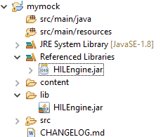

====
Mock
====

Principle
=========

The HIL engine is a Java standard-based engine that runs Mocks. A Mock
is a jar file containing some Java classes that simulate natives for the
Simulator. Mocks allow applications to be run unchanged in the Simulator
while still (apparently) interacting with native code.

Functional Description
======================

As with :ref:`[SNI] <esr-specifications>`, HIL is responsible for finding the method to execute as a
replacement for the native Java method that the MicroEJ Simulator tries
to run. Following the :ref:`[SNI] <esr-specifications>` philosophy, the matching algorithm uses a
naming convention. When a native method is called in the MicroEJ
Simulator, it requests that the HIL engine execute it. The corresponding
Mock executes the method and provides the result back to the MicroEJ
Simulator.

.. figure:: images/hil3.*
   :alt: The MicroEJ Simulator Executes a Native Java Method ``foo()``.
   :align: center
   :scale: 75 %

   The MicroEJ Simulator Executes a Native Java Method ``foo()``.

Example
=======

.. code:: java

   package example;

   import java.io.IOException;

   /**
    * Abstract class providing a native method to access sensor value.
    * This method will be executed out of virtual machine.
    */
   public abstract class Sensor {

       public static final int ERROR = -1;

       public int getValue() throws IOException {
           int sensorID = getSensorID();
           int value = getSensorValue(sensorID);
           if (value == ERROR) {
               throw new IOException("Unsupported sensor");
           }
           return value;
       }

       protected abstract int getSensorID();

       public static native int getSensorValue(int sensorID);
   }

   class Potentiometer extends Sensor {
       
       protected int getSensorID() {
           return Constants.POTENTIOMETER_ID; // POTENTIOMETER_ID is a static final
       }
   }

To implement the native method ``getSensorValue(int sensorID)``, you
need to create a MicroEJ standard project containing the same ``Sensor``
class on the same ``example`` package. To do so, open the Eclipse menu
``File > New > Project... > Java > Java Project`` in order to create a
MicroEJ standard project.

The following code is the required ``Sensor`` class of the created Mock
project:

.. code:: java

   package example;

   import java.util.Random;

   /**
    * Java standard class included in a Mock jar file.
    * It implements the native method using a Java method.
    */
   public class Sensor {

       /**
        * Constants
        */
       private static final int SENSOR_ERROR = -1;
       private static final int POTENTIOMETER_ID = 3;
       
       private static final Random RANDOM = new Random();
       
       /**
        * Implementation of native method "getSensorValue()"
        * 
        * @param sensorID Sensor ID
        * @return Simulated sensor value
        */
       public static int getSensorValue(int sensorID) {
           if( sensorID == POTENTIOMETER_ID ) {
               // For the simulation, Mock returns a random value
               return RANDOM.nextInt();
           }
           return SENSOR_ERROR;
       }
       
   }

.. note::

   The visibility of the native method implemented in the mock must be ``public`` regardless of the visibility of the native method in the application.  Otherwise the following exception is raised: ``java.lang.UnsatisfiedLinkError: No such method in remote class``.

Mocks Design Support
====================

Interface
---------

The MicroEJ Simulator interface is defined by static methods on the Java
class ``com.is2t.hil.NativeInterface``.

Array Type Arguments
--------------------

Both :ref:`[SNI] <esr-specifications>` and HIL allow arguments that are arrays of base types. By
default the contents of an array are NOT sent over to the Mock. An
"empty copy" is sent by the HIL engine, and the contents of the array
must be explicitly fetched by the Mock. The array within the Mock can be
modified using a regular assignment. Then to apply these changes in the
MicroEJ Simulator, the modifications must be flushed back. There are two
methods provided to support fetch and flush between the MicroEJ
Simulator and the HIL:

-  ``refreshContent``: initializes the array argument from the contents
   of its MicroEJ Simulator counterpart.

-  ``flushContent``: propagates (to the MicroEJ Simulator) the contents
   of the array that is used within the HIL engine.

.. figure:: images/hil4.*
   :alt: An Array and Its Counterpart in the HIL Engine.
   :align: center
   :scale: 75 %

   An Array and Its Counterpart in the HIL Engine.

Below is a typical usage.

::

   public static void foo(char[] chars, int offset, int length){
           NativeInterface ni = HIL.getInstance();
           //inside the Mock
           ni.refreshContent(chars, offset, length);
           chars[offset] = 'A';
           ni.flushContent(chars, offset, 1);
   }

Blocking Native Methods
-----------------------

Some native methods block until an event has arrived :ref:`[SNI] <esr-specifications>`. Such
behavior is implemented in native using the following three functions:

-  ``int32_t SNI_suspendCurrentJavaThread(int64_t timeout)``
-  ``int32_t SNI_getCurrentJavaThreadID(void)``
-  ``int32_t SNI_resumeJavaThread(int32_t id)``

This behavior is implemented in a Mock using the following methods on a ``lock`` object:

- ``Object.wait(long timeout)``: Causes the current thread to wait
  until another thread invokes the ``notify()`` method or the
  ``notifyAll()`` method for this object.

- ``Object.notifyAll()``: Wakes up all the threads that are waiting on
  this object's monitor.

- ``NativeInterface.notifySuspendStart()``: Notifies the Simulator that the current native is suspended so it can schedule a thread with a lower priority.

- ``NativeInterface.notifySuspendEnd()``: Notifies the Simulator that the current native is no more suspended. Lower priority threads in the Simulator will not be scheduled anymore.

.. code:: java

   public static byte[] data = new byte[BUFFER_SIZE];
   public static int dataLength = 0;
   private static Object lock = new Object();

	// Mock native method
	public static void waitForData() {
		NativeInterface ni = HIL.getInstance();
		// inside the Mock
		// wait until the data is received
		synchronized (lock) {
			while (dataLength == 0) {
				try {
					ni.notifySuspendStart();
					lock.wait(); // equivalent to lock.wait(0)
					ni.notifySuspendEnd();
				} catch (InterruptedException e) {
					Thread.currentThread().interrupt();
					// Use the error code specific to your library
					throw new NativeException(-1, "InterruptedException", e);
				}
			}
		}
	}

   // Mock data reader thread
   public static void notifyDataReception() {
         synchronized (lock) {
               dataLength = readFromInputStream(data);
               lock.notifyAll();
         }
   }

Resource Management
-------------------

In Java, every class can play the role of a small read-only file system
root: The stored files are called "Java resources" and are accessible
using a path as a String.

The MicroEJ Simulator interface allows the retrieval of any resource
from the original Java world, using the ``getResourceContent`` method.

::

   public static void bar(byte[] path, int offset, int length) {
         NativeInterface ni = HIL.getInstance();
         ni.refreshContent(path, offset, length);
         String pathStr = new String(path, offset, length);
         byte[] data = ni.getResourceContent(pathStr);
         ...
   }

Synchronous Terminations
------------------------

To terminate the whole simulation (MicroEJ Simulator and HIL), use the
stop() method.

::

   public static void windowClosed() {
         HIL.getInstance().stop();
   }

Dependencies
============

The HIL Engine API is automatically provided by the ``microej-mock`` project skeleton.

.. _mock_module:

Installation
============

First create a new :ref:`module project <mmm_module_skeleton>` using the ``microej-mock`` skeleton.

Once implemented, right-click on the repository project and select ``Build Module``.

Once the module is built, the mock can be installed in a Platform in one of the two ways:

- by adding the mock module as a regular Platform :ref:`module dependency <mmm_module_dependencies>` (if your Platform configuration project contains a ``module.ivy`` file), 
- or by manually copying the JAR file ``[mock_project]\target~\rip\mocks\[mock_name].jar`` to the :ref:`Platform configuration <platform_configuration_creation>` mock dropins folder ``dropins/mocks/dropins/``.

Use
===

Once installed, a Mock is used automatically by the Simulator when the
MicroEJ Application calls a native method which is implemented into the
Mock.

..
   | Copyright 2008-2020, MicroEJ Corp. Content in this space is free 
   for read and redistribute. Except if otherwise stated, modification 
   is subject to MicroEJ Corp prior approval.
   | MicroEJ is a trademark of MicroEJ Corp. All other trademarks and 
   copyrights are the property of their respective owners.
