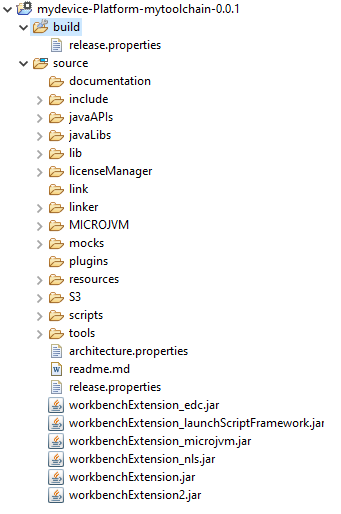
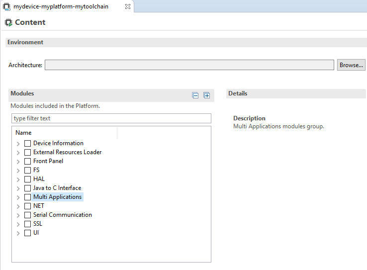

.. _new_platform_creation:

=================
Platform Creation
=================

This section describes the steps to create a new MicroEJ Platform in MicroEJ SDK, 
and options to connect it to an external Board Support Package (BSP) as well as a third-party C toolchain. 

.. note::
   
   If you own a legacy Platform, you can either create your Platform again from scratch,
   or follow the :ref:`former_platform_migration` chapter.

Architecture Selection
======================

The first step is to select a :ref:`MicroEJ Architecture <architecture_overview>` compatible with your device instructions set and C compiler.

MicroEJ Corp. provides MicroEJ Evaluation Architectures for most common instructions sets and compilers
at https://repository.microej.com/modules/com/microej/architecture. 

Please refer to the chapter :ref:`architectures_toolchains` for the details of ABI and compiler options.

If the requested MicroEJ Architecture is not available for evaluation or to get a MicroEJ Production Architecture,
please contact your MicroEJ sales representative or :ref:`our support team <get_support>`.

.. _platform_configuration_creation:

Platform Configuration
======================

The next step is to create a MicroEJ Platform configuration project:

-  Select :guilabel:`File` > :guilabel:`New` > :guilabel:`Project...` > :guilabel:`General` > :guilabel:`Project`,

-  Enter a :guilabel:`Project name`. The name is arbitrary and can be changed later. The usual convention is ``[PLATFORM_NAME]-configuration``,

-  Click on :guilabel:`Finish` button. A new empty project is created,

-  Install the latest `Platform Configuration Additions <https://github.com/MicroEJ/PlatformQualificationTools/blob/master/framework/platform/>`_. 
   Files within the ``content`` folder have to be copied to the configuration project folder,
   by following instructions described at https://github.com/MicroEJ/PlatformQualificationTools/blob/master/framework/platform/README.rst.
   
   You should get a MicroEJ Platform configuration project that looks like:

   .. figure:: images/platformConfigurationSkeleton.png
      :alt: MicroEJ Platform Configuration Project Skeleton
      :align: center

      MicroEJ Platform Configuration Project Skeleton

   .. note::
      
      The version of installed Platform Configuration Additions is indicated in the `CHANGELOG <https://github.com/MicroEJ/PlatformQualificationTools/blob/master/framework/platform/content/build/CHANGELOG.md>`_ file. 

- Edit the :ref:`mmm_module_description` ``module.ivy`` to declare the MicroEJ Architecture dependency:

  .. code-block:: xml
     :emphasize-lines: 3,4,5

     <dependencies>

        <dependency org="com.microej.architecture.[ISA].[TOOLCHAIN]" name="[UID]" rev="[VERSION]">
          <artifact name="[UID]" m:classifier="[USAGE]" ext="xpf"/>
        </dependency>
     
     </dependencies>

  The name of the module dependency needed for your Platform can be found in the chapter :ref:`architectures_toolchains`.
  Check the table of your corresponding Architecture and follow the link in the :guilabel:`Module Name` column.

  For example, to declare the MicroEJ Evaluation Architecture version ``7.14.0`` for Arm® Cortex®-M4 microcontrollers compiled with GNU CC toolchain:

  .. code-block:: xml
      :emphasize-lines: 3,4,5

      <dependencies>

          <dependency org="com.microej.architecture.CM4.CM4hardfp_GCC48" name="flopi4G25" rev="7.14.0">
            <artifact name="flopi4G25" m:classifier="eval" ext="xpf"/>
          </dependency>
      
      </dependencies>

 And the module for this Architecture is located in the :ref:`Central Repository <central_repository>` at https://repository.microej.com/modules/com/microej/architecture/CM4/CM4hardfp_GCC48/flopi4G25/7.14.0/.

  .. note:: The Platform Configuration Additions allow to select the Architecture ``USAGE`` using the option ``com.microej.platformbuilder.architecture.usage``.  Edit the file ``module.properties`` to set the property to ``prod`` to use a Production Architecture and to ``eval`` to use an Evaluation Architecture.
      
.. _pack_import:

Pack Import
===========

:ref:`MicroEJ Pack <pack_overview>` provides additional features on top of the MicroEJ Architecture such as Graphical User Interface or Networking.

.. note::

   MicroEJ Packs are optional. You can skip this section if you intend to integrate MicroEJ runtime only with custom libraries.

To declare a MicroEJ Pack dependency, edit the :ref:`mmm_module_description` ``module.ivy`` as follows:
  
.. code-block:: xml
  :emphasize-lines: 3,6,9

    <dependencies>
      <!-- MicroEJ Architecture Specific Pack -->
      <dependency org="com.microej.architecture.[ISA].[TOOLCHAIN]" name="[UID]-[NAME]-pack" rev="[VERSION]"/>

      <!-- MicroEJ Generic Pack -->
      <dependency org="com.microej.pack.[NAME]" name="[NAME]-pack" rev="[VERSION]"/>

      <!-- Legacy MicroEJ Generic Pack -->
      <dependency org="com.microej.pack" name="[NAME]" rev="[VERSION]"/>

    </dependencies>

For example, to declare the MicroEJ Architecture Specific Pack UI
version ``13.0.4`` for MicroEJ Architecture ``flopi4G25`` on Arm®
Cortex®-M4 microcontrollers compiled with GNU CC toolchain:

.. code-block:: xml
   :emphasize-lines: 3

   <dependencies>
       <!-- MicroEJ Architecture Specific Pack -->
       <dependency org="com.microej.architecture.CM4.CM4hardfp_GCC48" name="flopi4G25-ui-pack" rev="13.0.4"/>

   </dependencies>

To declare the MicroEJ Generic Pack Bluetooth version ``2.1.0``:

.. code-block:: xml
   :emphasize-lines: 3

   <dependencies>
       <!-- MicroEJ Generic Pack  -->
       <dependency org="com.microej.pack.bluetooth" name="bluetooth-pack" rev="2.1.0"/>

   </dependencies>

And to declare the Legacy MicroEJ Generic Pack Net version ``9.2.3``:

.. code-block:: xml
   :emphasize-lines: 3

   <dependencies>
       <!-- Legacy MicroEJ Generic Pack -->
       <dependency org="com.microej.pack" name="net" rev="9.2.3"/>

   </dependencies>

.. warning::
   
   :ref:`MicroEJ Architecture Specific Packs <pack_architecture_specific>` and :ref:`Legacy MicroEJ Generic Packs <pack_generic_legacy>` provide Platform modules
   that are **not installed** by default. See :ref:`platform_module_configuration` section for more details.

.. _platform_build:

Platform Build
==============

The MicroEJ Platform can be built either from the SDK or from the :ref:`MMM CLI <mmm_cli>`.
To build the MicroEJ Platform from the SDK, perform a regular :ref:`mmm_module_build`: 

  - Right-click on the Platform Configuration project,
  - Select :guilabel:`Build Module`.

To build the MicroEJ Platform from the MMM CLI:

  - Set the ``eclipse.home`` property to the path of your SDK, using ``-Declipse.home=<path>`` in the command line or using the :ref:`mmm_cli_shared_configuration`.
  
    By default, the SDK's path is one of the following directories:
  
    - on Windows: ``C:\Program Files\MicroEJ\MicroEJ-SDK-<YY.MM>\rcp``
    - on Linux: ``/home/<user>/MicroEJ/MicroEJ-SDK-<YY.MM>/rcp``
    - on macOS: ``/Applications/MicroEJ/MicroEJ-SDK-<YY.MM>/rcp/MicroEJ-SDK-<YY.MM>.app/Contents/Eclipse``
	
  - From the Platform Configuration project, execute the command: ``mmm``

In both cases the build starts and the build logs are redirected to the integrated console.
Once the build is terminated, you should get the following message:

    .. code-block:: console
      :emphasize-lines: 3,4,5,6
      
      module-platform:report:
        [echo]     ============================================================================================================
        [echo]     Platform has been built in this directory 'C:\tmp\mydevice-Platform-[TOOLCHAIN]-0.1.0'.
        [echo]     To import this project in your MicroEJ SDK workspace (if not already available):
        [echo]      - Select 'File' > 'Import...' > 'General' > 'Existing Projects into Workspace' > 'Next'
        [echo]      - Check 'Select root directory' and browse 'C:\tmp\mydevice-Platform-[TOOLCHAIN]-0.1.0' > 'Finish'
        [echo]     ============================================================================================================

      BUILD SUCCESSFUL

      Total time: 43 seconds

Then, import the Platform directory to your MicroEJ SDK workspace as mentioned in the report. You should get a ready-to-use MicroEJ Platform project
in the workspace available for the MicroEJ Application project to run on. You can also check the MicroEJ Platform availability in:
:guilabel:`Window` > :guilabel:`Preferences` > :guilabel:`MicroEJ` > :guilabel:`Platforms in workspace`.

   MicroEJ Platform Project
 
This step is only required the first time the Platform is built, or if the Platform properties have changed (i.e, name, version). 
When the same Platform is built again, the Platform project should be automatically refreshed after few seconds. 
In case of any doubt, right-click on the Platform project and select :guilabel:`Refresh` to get the new content.

.. _platform_module_configuration:

Platform Module Configuration
=============================

A Platform module is the minimal unit that can extend a MicroEJ Architecture with additional features such as:

- Runtime Capability (e.g. :ref:`multisandbox`, :ref:`section_externalresourceloader`) , 
- Foundation Library Implementation (e.g. :ref:`MicroUI <section_microui_installation>`, :ref:`NET <network_core>`),
- Simulator (e.g. :ref:`section_frontpanel`),
- Tool (e.g. :ref:`tool_javah`).

Platform modules provided by :ref:`MicroEJ Generic Packs <pack_generic>` are automatically installed during the :ref:`Platform build <platform_build>` 
and do not require extra configuration. They are not displayed in the Platform Editor.

Platform modules provided by :ref:`MicroEJ Architectures <architecture_overview>`, :ref:`MicroEJ Architecture Specific Packs <pack_architecture_specific>`
and :ref:`Legacy MicroEJ Generic Packs <pack_generic_legacy>` following list are **not installed** by default.
They must be enabled and configured using the Platform Editor.

Before opening the Platform Editor, the Platform must have been built once to let :ref:`mmm` resolve and download MicroEJ Architecture and Packs locally.
Then import them in MicroEJ SDK as follows:

- Select :guilabel:`File` > :guilabel:`Import` > :guilabel:`MicroEJ` > :guilabel:`Architectures`,
- Browse :guilabel:`myplatform-configuration/target~/dependencies` folder (contains ``.xpf`` and ``.xpfp`` files once the Platform is built),
- Check the :guilabel:`I agree and accept the above terms and conditions...` box to accept the license,
- Click on :guilabel:`Finish` button. This may take some time.

Once imported, double-click on the :guilabel:`default.platform` file to open the Platform Editor.

From the Platform Editor, select the :guilabel:`Content` tab to access the
modules selection.  Platform modules can be selected/deselected from the :guilabel:`Modules` frame.

Platform modules are organized into groups.
When a group is selected, by default, all its modules are selected.
To view all the modules making up a group, click on the Expand All icon on the top-right of the frame. 
This will let you select/deselect on a per module basis. Note that individual module selection is not
recommended and that it is only available when the module have been
imported.

The description and contents of an item (group or module) are displayed
beside the list on item selection.

All the selected Platform modules will be installed in the Platform.

   MicroEJ Platform Configuration Modules Selection

Each selected Platform module can be customized by creating a :guilabel:`[module]`
folder named after the module beside the :guilabel:`.platform` file definition. 
It may contain:

-  A :guilabel:`[module].properties` file named after the module name.
   These properties will be injected in the execution context prefixed
   by the module name. Some properties might be needed for the
   configuration of some modules. Please refer to the modules
   documentation for more information.
-  A :guilabel:`bsp.xml` file which provides additional information about the BSP
   implementation of Low Level APIs.

   This file must start with the node ``<bsp>``. It can contain several 
   lines like this one:
   ``<nativeName="A_LLAPI_NAME" nativeImplementation name="AN_IMPLEMENTATION_NAME"/>``

   where:

   -  ``A_LLAPI_NAME`` refers to a Low Level API native name. It is 
      specific to the MicroEJ C library which provides the Low Level API.

   -  ``AN_IMPLEMENTATION_NAME`` refers to the implementation name of the
      Low Level API. It is specific to the BSP; and more specifically, to
      the C file which does the link between the MicroEJ C library and the
      C driver.

   These files will be converted into an internal format during the
   MicroEJ Platform build.

-  Optional module specific files and folders

Modifying one of these files requires to :ref:`build the Platform <platform_build>` again.

.. note::

  It is possible to quickly rebuild the Platform from the Platform Editor if only Platform module configuration has changed.
  Click on the :guilabel:`Build Platform` link on the Platform configuration :guilabel:`Overview` tab.

.. _platformCustomization:

Platform Customization
======================

The configuration project (the project which contains the
:guilabel:`.platform` file) can contain an optional :guilabel:`dropins` folder.
The contents of this folder will be copied integrally into the final
Platform. This feature allows to add some additional libraries, tools
etc. into the Platform.

The dropins folder organization should respect the final Platform files
and folders organization. For instance, the tools are located in the
sub-folder :guilabel:`tools`. Launch a Platform build without the dropins folder
to see how the Platform files and folders organization is. Then fill the
dropins folder with additional features and build again the Platform to
obtain an advanced Platform.

The dropins folder files are kept in priority. If one file has the same
path and name as another file already installed into the Platform, the
dropins folder file will be kept.

Platform build can also be customized by updating the :guilabel:`configuration.xml` file
beside the :guilabel:`.platform` file. This Ant script can extend one or
several of the extension points available. By default, you should not have to change 
the default configuration script.

Modifying one of these files requires to :ref:`build the Platform <platform_build>` again.

.. _platform_publication:

Platform Publication
====================

The publication of the built Platform to a :ref:`module repository <module_repository>` is disabled by default.
It can be enabled by setting the ``skip.publish`` property defined in the file ``module.properties`` of 
the Platform configuration project to ``false``.

The publication is generally kept disabled by default in the project sources since developers use the locally built platform,
but must be enabled in the Continuous Integration environment.
This can be done by leaving the ``skip.publish`` property to ``true`` in the project sources 
and by overwriting it in the command launched by the Continuous Integration environment, for example:

.. code-block:: sh

  mmm publish shared -Dskip.publish=false

.. _bsp_connection:

BSP Connection
==============

Principle
---------

Using a MicroEJ Platform, the user can compile a MicroEJ Application on that Platform. 
The result of this compilation is a ``microejapp.o`` file.

This file has to be linked with the MicroEJ Platform runtime file (``microejruntime.a``) 
and a third-party C project, called the Board Support Package (BSP),
to obtain the final binary file (MicroEJ Firmware).
For more information, please consult the :ref:`MicroEJ build process overview <build_process_overview>`.

The BSP connection can be configured by defining 4 folders where the following files are located:

- MicroEJ Application file (``microejapp.o``).
- MicroEJ Platform runtime file (``microejruntime.a``, also available in the Platform ``lib`` folder).
- MicroEJ Platform header files (``*.h``, also available in the Platform ``include`` folder).
- BSP project :ref:`build script <bsp_connection_build_script>` file (``build.bat`` or ``build.sh``).

Once the MicroEJ Application file (``microejapp.o``) is built, the files are then copied to these locations 
and the ``build.bat`` or ``build.sh`` file is executed to produce the final executable file (``application.out``).

.. note::

   The final build stage to produce the executable file can be done outside of MicroEJ SDK, and thus 
   the BSP connection configuration is optional.
   
   BSP connection configuration is only required in the following cases:

   - Use MicroEJ SDK to produce the final executable file of a Mono-Sandbox Firmware (recommended).
   - Use MicroEJ SDK to run a :ref:`MicroEJ Test Suite <platform_testsuite>` on device.
   - Build a Multi-Sandbox Firmware.

.. _bsp_connection_cases:

MicroEJ provides a flexible way to configure the BSP connection to target any kind of projects, teams organizations and company build flows.
To achieve this, the BSP connection can be configured either at MicroEJ Platform level or at MicroEJ Application level (or a mix of both). 

The 3 most common integration cases are:

- Case 1: No BSP connection

  The MicroEJ Platform does not know the BSP at all.

  BSP connection can be configured when building the MicroEJ Application (absolute locations).

  .. figure:: images/bsp-connection-cases-none.png
     :alt: MicroEJ Platform with no BSP connection
     :align: center
     :scale: 80%

     MicroEJ Platform with no BSP connection

  This case is recommended when:

  - the MicroEJ Firmware is built outside MicroEJ SDK.
  - the same MicroEJ Platform is intended to be reused on multiple BSP projects which do not share the same structure.

- Case 2: Partial BSP connection
  
  The MicroEJ Platform knows how the BSP is structured.

  BSP connection is configured when building the MicroEJ Platform (relative locations within the BSP), 
  and the BSP root location is configured when building the MicroEJ Application (absolute directory).

  .. figure:: images/bsp-connection-cases-partial.png
     :alt: MicroEJ Platform with partial BSP connection
     :align: center
     :scale: 80%

     MicroEJ Platform with partial BSP connection

  This case is recommended when:
  
  - the MicroEJ Platform is used to build one MicroEJ Application on top of one BSP. 
  - the Application and BSP are slightly coupled, thus making a change in the BSP just requires to build the firmware again.

- Case 3: Full BSP connection
  
  The MicroEJ Platform includes the BSP.

  BSP connection is configured when building MicroEJ Platform (relative locations within the BSP), 
  as well as the BSP root location (absolute directory).
  No BSP connection configuration is required when building the MicroEJ Application.

  .. figure:: images/bsp-connection-cases-full.png
     :alt: MicroEJ Platform with full BSP connection
     :align: center
     :scale: 80%

     MicroEJ Platform with full BSP connection

  This case is recommended when:

  - the MicroEJ Platform is used to build various MicroEJ Applications.
  - the MicroEJ Platform is validated using MicroEJ test suites. 
  - the MicroEJ Platform and BSP are delivered as a single standalone module (same versioning), perhaps
    subcontracted to a team or a company outside the application project(s).

.. _bsp_connection_options:

Options
-------

BSP connection options can be specified as Platform options or as Application options or a mix of both.

The following table describes the Platform options, which can be set in the ``bsp/bsp.properties`` file of the Platform configuration project.

.. list-table:: MicroEJ Platform Options for BSP Connection
   :widths: 1 5 3 
   :header-rows: 1

   * - Option Name   
     - Description
     - Example
   * - ``microejapp.relative.dir``
     - The path relative to BSP ``root.dir`` where to deploy the MicroEJ Application file (``microejapp.o``).
     - ``MicroEJ/lib``
   * - ``microejlib.relative.dir``
     - The path relative to BSP ``root.dir`` where to deploy the MicroEJ Platform runtime file (``microejruntime.a``).
     - ``MicroEJ/lib``
   * - ``microejinc.relative.dir``
     - The path relative to BSP ``root.dir`` where to deploy the MicroEJ Platform header files (``*.h``). 
     - ``MicroEJ/inc``
   * - ``microejscript.relative.dir``
     - The path relative to BSP ``root.dir`` where to execute the BSP build script file (``build.bat`` or ``build.sh``). 
     - ``Project/MicroEJ``
   * - ``root.dir``
     - The 3rd-party BSP project absolute directory, to be included to the Platform.
     - ``c:\\Users\\user\\mybsp`` on Windows systems or ``/home/user/bsp`` on Unix systems.

.. _bsp_connection_application_options:

The following table describes the Application options, which can be set as regular :ref:`MicroEJ Application Options <application_options>`.

.. list-table:: MicroEJ Application Options for BSP Connection
   :widths: 1 5
   :header-rows: 1

   * - Option Name   
     - Description
   * - ``deploy.bsp.microejapp``
     - Deploy the MicroEJ Application file (``microejapp.o``) to the location defined by the Platform (defaults to ``true`` when Platform option ``microejapp.relative.dir`` is set).
   * - ``deploy.bsp.microejlib``
     - Deploy the MicroEJ Platform runtime file (``microejruntime.a``) to the location defined by the Platform (defaults to ``true`` when Platform option ``microejlib.relative.dir`` is set).
   * - ``deploy.bsp.microejinc``
     - Deploy the MicroEJ Platform header files (``*.h``) to the location defined by the Platform (defaults to ``true`` when Platform option ``microejinc.relative.dir`` is set). 
   * - ``deploy.bsp.microejscript``
     - Execute the BSP build script file (``build.bat`` or ``build.sh``) at the location specified by the Platform. (defaults to ``false`` and requires ``microejscript.relative.dir`` Platform option to be set). 
   * - ``deploy.bsp.root.dir``
     - The 3rd-party BSP project absolute directory. This option is required if at least one the 4 options described above is set to ``true`` and the Platform does not include the BSP.
   * - ``deploy.dir.microejapp``
     - Absolute path to the directory where to deploy the MicroEJ Application file (``microejapp.o``). An empty value means no deployment.
   * - ``deploy.dir.microejlib``
     - Absolute path to the directory where to deploy the MicroEJ Platform runtime file (``microejruntime.a``) to this absolute directory. An empty value means no deployment.
   * - ``deploy.dir.microejinc``
     - Absolute path to the directory where to deploy the MicroEJ Platform header files (``*.h``) to this absolute directory. An empty value means no deployment.
   * - ``deploy.dir.microejscript``
     - Absolute path to the directory that contains the BSP build script file (``build.bat`` or ``build.sh``). An empty value means no build script execution.

.. note::

   It is also possible to configure the BSP root directory by setting the :ref:`build option <mmm_build_options>` ``toolchain.dir``, 
   instead of the application option ``deploy.bsp.root.dir``.
   This allows to configure a MicroEJ Firmware by specifying both the Platform (using the ``target.platform.dir`` option) and the BSP 
   at build level, without having to modify the application options files.

For each :ref:`Platform BSP connection case <bsp_connection_cases>`, here is a summary of the options to set: 

- No BSP connection, executable file built outside MicroEJ SDK
  :: 

    Platform Options:
      [NONE]

    Application Options:
      [NONE]

- No BSP connection, executable file built using MicroEJ SDK
  :: 

    Platform Options:
      [NONE]

    Application Options:
      deploy.dir.microejapp=[absolute_path]
      deploy.dir.microejlib=[absolute_path]
      deploy.dir.microejinc=[absolute_path]
      deploy.dir.microejscript=[absolute_path]
      deploy.bsp.microejscript=true

- Partial BSP connection, executable file built outside MicroEJ SDK
  :: 

    Platform Options:
      microejapp.relative.dir=[relative_path]
      microejlib.relative.dir=[relative_path]
      microejinc.relative.dir=[relative_path]

    Application Options:
      deploy.bsp.root.dir=[absolute_path]

- Partial BSP connection, executable file built using MicroEJ SDK
  :: 

    Platform Options:
      microejapp.relative.dir=[relative_path]
      microejlib.relative.dir=[relative_path]
      microejinc.relative.dir=[relative_path]
      microejscript.relative.dir=[relative_path]   

    Application Options:
      deploy.bsp.root.dir=[absolute_path]
      deploy.bsp.microejscript=true

- Full BSP connection, executable file built using MicroEJ SDK
  :: 

    Platform Options:
      microejapp.relative.dir=[relative_path]
      microejlib.relative.dir=[relative_path]
      microejinc.relative.dir=[relative_path]
      microejscript.relative.dir=[relative_path]
      root.dir=[absolute_path]

    Application Options:
      deploy.bsp.microejscript=true

.. _bsp_connection_build_script:

Build Script File
-----------------

The BSP build script file is used to invoke the third-party C toolchain (compiler and linker)
to produce the final executable file (``application.out``).

The build script must comply with the following specification:

- On Windows operating system, it is a Windows batch file named ``build.bat``.
- On macOS or Linux operating systems, it is a shell script named ``build.sh``, with execution permission enabled.
- On error, the script must end with a non zero exit code.
- On success

  - The executable must be copied to a file named ``application.out`` in the directory from
    where the script has been executed.
  - The script must end with zero exit code.

Many build script templates are available for most commonly used C toolchains in the 
`Platform Qualification Tools repository <https://github.com/MicroEJ/PlatformQualificationTools/tree/master/framework/platform/scripts>`_.

.. note::

    The final executable file must be an ELF executable file.  On
    Unix, the command ``file(1)`` can be use to check the format of a
    file.  For example:

    .. code-block:: sh

       ~$ file application.out
       ELF 32-bit LSB executable

.. _bsp_connection_run_script:

Run Script File
---------------

This script is required only for Platforms intended to run a :ref:`MicroEJ Testsuite <platform_testsuite>` on device.

The BSP run script is used to invoke a third-party tool to upload and start the executable file on device.

The run script must comply with the following specification:

- On Windows operating system, it is a Windows batch file named ``run.bat``.
- On macOS or Linux operating systems, it is a shell script named ``run.sh``, with execution permission enabled.
- The executable file is passed as first script parameter if there is one, otherwise it is the ``application.out`` file located in the directory from where the script has been executed.
- On error, the script must end with a non zero exit code.
- On success:

  - The executable file (``application.out``) has been uploaded and started on the device
  - The script must end with zero exit code.

The run script can optionally redirect execution traces. If it does not implement execution traces redirection,
the testsuite must be configured with the following :ref:`application_options` in order to take its input from a TCP/IP socket server, 
such as :ref:`tool_serial_to_socket`.

.. code-block:: properties

  testsuite.trace.ip=localhost
  testsuite.trace.port=5555

..
   | Copyright 2008-2022, MicroEJ Corp. Content in this space is free 
   for read and redistribute. Except if otherwise stated, modification 
   is subject to MicroEJ Corp prior approval.
   | MicroEJ is a trademark of MicroEJ Corp. All other trademarks and 
   copyrights are the property of their respective owners.
