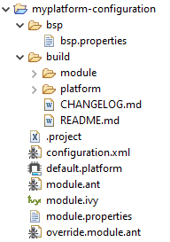

=============================
Create a new MicroEJ Platform
=============================

This section describes the steps to create a new MicroEJ Platform in MicroEJ SDK, 
and options to connect it to an external Board Support Package (BSP) as well as a third-party C toolchain. 

First, start MicroEJ SDK on a new empty :ref:`workspace <workspace>`.

.. _import_architecture:

Import a MicroEJ Architecture
=============================

The next step is to import a :ref:`MicroEJ Architecture <architecture_overview>`. 
MicroEJ Architectures for most common microcontroller instructions sets and compilers
can be downloaded from https://repository.microej.com/architectures/. 

MicroEJ Architecture files ends with the ``.xpf`` extension, and are classified using the following folder naming convention:

:: 

  com/microej/architecture/[ISA]/[TOOLCHAIN]/[UID]/[VERSION]/

For example, the MicroEJ Architecture versions for Arm® Cortex®-M4 microcontrollers compiled with GNU CC toolchain is available at 
https://repository.microej.com/architectures/com/microej/architecture/CM4/CM4hardfp_GCC48/flopi4G25/.

Once you downloaded a MicroEJ Architecture file, proceed with the following steps to import it in MicroEJ SDK:

- Select :guilabel:`File` > :guilabel:`Import` > :guilabel:`MicroEJ` > :guilabel:`Architectures`.
- Browse an ``.xpf`` file or a folder that contains one or more an ``.xpf`` files.
- Check the :guilabel:`I agree and accept the above terms and conditions...` box to accept the license.
- Click on :guilabel:`Finish` button.

.. _platform_configuration_creation:

Create a New MicroEJ Platform Configuration
===========================================

The next step is to create a MicroEJ Platform configuration:

-  Select :guilabel:`File` > :guilabel:`New` > :guilabel:`MicroEJ Platform Project…`.

-  Click on :guilabel:`Next` button. The Configure Target Architecture page allows to
   select the MicroEJ Architecture that contains a minimal MicroEJ
   Platform and a set of compatible modules targeting a processor
   architecture and a compilation toolchain. This environment can be
   changed later.

   -  Click on :guilabel:`Browse...` button to select one of the installed MicroEJ
      Architecture.

   -  Check the :guilabel:`Create from a platform reference implementation` box to
      use one of the available implementation. Uncheck it if you want to
      provide your own implementation or if no reference implementation
      is available.

-  Click on :guilabel:`Next` button. The ``Configure platform properties`` page contains the
   identification of the MicroEJ Platform to create. Most fields are
   mandatory, you should therefore set them. Note that their values can
   be modified later on.

-  Click on :guilabel:`Finish` button. A new project ``[device]-[name]-[toolchain]`` is being created
   containing a ``[name].platform`` file. A Platform description editor shall then
   open.

-  Install `Platform Configuration Additions <https://github.com/MicroEJ/PlatformQualificationTools/trunk/framework/platform/>`_. 
   Files within the ``content`` folder have to be copied to the configuration project folder,
   by following instructions described at https://github.com/MicroEJ/PlatformQualificationTools/trunk/framework/platform/README.rst.
   
You should get a MicroEJ Platform configuration project that looks like:

   MicroEJ Platform Configuration Project Skeleton

Groups / Modules Selection
==========================

From the Platform description editor, select the Content tab to access
the Platform modules selection. Modules can be selected/deselected from
the Modules frame.

Modules are organized into groups. When a group is selected, by default,
all its modules are selected. To view the modules making up a group,
click on the Show/Hide modules icon on the top-right of the frame. This
will let you select/deselect on a per module basis. Note that individual
module selection is not recommended.

The description and contents of an item (group or module) are displayed
beside the list on item selection.

All the checked modules will be installed in the Platform.

Modules Customization
=====================

Each selected module can be customized by creating a [module] folder
named after the module beside the ``[name].platform`` definition. It may
contain:

-  An optional [module].properties file named after the module name.
   These properties will be injected in the execution context prefixed
   by the module name. Some properties might be needed for the
   configuration of some modules. Please refer to the modules
   documentation for more information.

-  Optional module specific files and folders.

Modifying one of these files requires to build the Platform again.

.. _platformCustomization:

Platform Customization
======================

Platform can be customized by creating a ``configuration.xml`` script
beside the ``[name].platform`` file. This script can extend one or
several of the extension points available. By default, you should not have to change 
the default configuration script.

Configuration project (the project which contains the
``[name].platform`` file) can contain an optional ``dropins`` folder.
The contents of this folder will be copied integrally into the final
Platform. This feature allows to add some additional libraries, tools
etc. into the Platform.

The dropins folder organization should respect the final Platform files
and folders organization. For instance, the tools are located in the
sub-folder ``tools``. Launch a Platform build without the dropins folder
to see how the Platform files and folders organization is. Then fill the
dropins folder with additional features and build again the Platform to
obtain an advanced Platform.

The dropins folder files are kept in priority. If one file has the same
path and name as another file already installed into the Platform, the
dropins folder file will be kept.

Modifying one of these files requires to build the Platform again.

.. _bsp_connection:

BSP Connection
==============

Principle
---------

Using a MicroEJ Platform, the user can compile a MicroEJ Application on that Platform. 
The result of this compilation is a ``microejapp.o`` file.

This file has to be linked with the MicroEJ Platform runtime file (``microejruntime.a``) 
and a third-party C project, called the Board Support Package (BSP) ,
to obtain the final binary file (MicroEJ Firmware).
For more information, please consult the :ref:`MicroEJ build process overview <build_process_overview>`.

The BSP connection can be configured by defining 4 folders where the following files are located:

- MicroEJ Application file (``microejapp.o``).
- MicroEJ Platform runtime file (``microejruntime.a``, also available in the Platform ``lib`` folder).
- MicroEJ Platform header files (``*.h``, also available in the Platform ``include`` folder).
- BSP project :ref:`build script <bsp_connection_build_script>` file (``build.bat`` or ``build.sh``).

Once the MicroEJ Application file (``microejapp.o``) is built, the files are then copied to these locations 
and the ``build.bat`` or ``build.sh`` file is executed to produce the final executable file (``application.out``).

.. note::

   The final build stage to produce the executable file can be done outside of MicroEJ SDK, and thus 
   the BSP connection configuration is optional.
   
   BSP connection configuration is only required in the following cases:

   - Use MicroEJ SDK to produce the final executable file of a Mono-Sandbox Firmware (recommended).
   - Use MicroEJ SDK to run a :ref:`MicroEJ Testsuite <testsuite>` on device.
   - Build a Multi-Sandbox Firmware.

.. _bsp_connection_cases:

MicroEJ provides a flexible way to configure BSP connection to target any kind of projects, teams organizations and company build flows.
For that, BSP connection can be configured either at MicroEJ Platform level or at MicroEJ Application level (or a mix of both). 

The following list describes the 3 most common integration cases:

- Case 1: No BSP connection

  The MicroEJ Platform does not know the BSP at all.
  BSP connection can be configured when building the MicroEJ Application (options with absolute paths).

  .. figure:: images/bsp-connection-cases-none.png
     :alt: MicroEJ Platform with no BSP connection
     :align: center
     :scale: 75 %

     MicroEJ Platform with no BSP connection

  This case is recommended when:

  - the MicroEJ Firmware is built outside MicroEJ SDK.
  - the same MicroEJ Platform is intended to be reused on multiple BSP projects which do not share the same structure.

- Case 2: Partial BSP connection
  
  The MicroEJ Platform knows how the BSP is structured.
  BSP connection is configured when building the MicroEJ Platform options (options with relative paths within the BSP), 
  and the BSP root location is configured when building the MicroEJ Application (option with absolute path).

  .. figure:: images/bsp-connection-cases-partial.png
     :alt: MicroEJ Platform with partial BSP connection
     :align: center
     :scale: 75 %

     MicroEJ Platform with partial BSP connection

  This case is recommended when:
  
  - the MicroEJ Platform is used to build one MicroEJ Application on top of one BSP. 
  - the Application and BSP are slightly coupled, thus making a change in the BSP just require to rebuild the firmware.

- Case 3: Full BSP connection
  
  The MicroEJ Platform includes its BSP.
  BSP connection is configured when building MicroEJ Platform options (options with relative paths within the Platform and the BSP), 
  No BSP path need to be configured when building the MicroEJ Application.

  .. figure:: images/bsp-connection-cases-full.png
     :alt: MicroEJ Platform with full BSP connection
     :align: center
     :scale: 75 %

     MicroEJ Platform with full BSP connection

  This case is recommended when:

  - the MicroEJ Platform is used to build various MicroEJ Applications.
  - the MicroEJ Platform is validated using MicroEJ testsuites. 
  - the MicroEJ Platform and BSP are delivered as a single standalone module (same versioning), perhaps
    subcontracted to a team or a company outside the application project(s).

Options
-------

BSP connection options can be specified as Platform options or as Application options or a mix of both.

The following table describes Platform options, configured in ``bsp`` > ``bsp.properties`` file of the Platform configuration project.

.. list-table:: MicroEJ Platform Options for BSP Connection
   :widths: 1 5 3 
   :header-rows: 1

   * - Option Name   
     - Description
     - Example
   * - ``microejapp.relative.dir``
     - The path relative to BSP ``root.dir`` where to deploy the MicroEJ Application file (``microejapp.o``).
     - ``MicroEJ/lib``
   * - ``microejlib.relative.dir``
     - The path relative to BSP ``root.dir`` where to deploy the MicroEJ Platform runtime file (``microejruntime.a``).
     - ``MicroEJ/lib``
   * - ``microejinc.relative.dir``
     - The path relative to BSP ``root.dir`` where to deploy the MicroEJ Platform header files (``*.h``). 
     - ``MicroEJ/inc``
   * - ``microejscript.relative.dir``
     - The path relative to BSP ``root.dir`` where to execute the BSP build script file (``build.bat`` or ``build.sh``). 
     - ``Project/MicroEJ``
   * - ``root.dir``
     - The 3rd-party BSP project absolute directory, to be included to the Platform.
     - ``c:\\Users\\user\\mybsp`` on Windows systems or ``/home/user/bsp`` on Unix systems.

.. _bsp_connection_application_options:

The following table describes Application options, configured as regular :ref:`MicroEJ Application Options <application_options>`.

.. list-table:: MicroEJ Application Options for BSP Connection
   :widths: 1 5
   :header-rows: 1

   * - Option Name   
     - Description
   * - ``deploy.bsp.microejapp``
     - Deploy the MicroEJ Application file (``microejapp.o``) to the location defined by the Platform (defaults to ``true`` when Platform option ``microejapp.relative.dir`` is set).
   * - ``deploy.bsp.microejlib``
     - Deploy the MicroEJ Platform runtime file (``microejruntime.a``) to the location defined by the Platform (defaults to ``true`` when Platform option ``microejlib.relative.dir`` is set).
   * - ``deploy.bsp.microejinc``
     - Deploy the MicroEJ Platform header files (``*.h``) to the location defined by the Platform (defaults to ``true`` when Platform option ``microejinc.relative.dir`` is set). 
   * - ``deploy.bsp.microejscript``
     - Execute the BSP build script file (``build.bat`` or ``build.sh``) present at the location defined by the Platform. (defaults to ``false`` and requires ``microejscript.relative.dir`` Platform option to be set). 
   * - ``deploy.bsp.root.dir``
     - The 3rd-party BSP project absolute directory. This option is required if at least one the 4 options described above is set to ``true`` and the Platform does not includes the BSP.
   * - ``deploy.dir.microejapp``
     - Deploy the MicroEJ Application file (``microejapp.o``) to this absolute directory. An empty value means no deployment.
   * - ``deploy.dir.microejlib``
     - Deploy the MicroEJ Platform runtime file (``microejruntime.a``) to this absolute directory. An empty value means no deployment.
   * - ``deploy.dir.microejinc``
     - Deploy the MicroEJ Platform header files (``*.h``) to this absolute directory. An empty value means no deployment.
   * - ``deploy.bsp.microejscript``
     - Execute the BSP build script file (``build.bat`` or ``build.sh``) present in this absolute directory. An empty value means no deployment.

.. note::

   It is also possible to configure the BSP root directory using the build option named ``toolchain.dir``, 
   instead of the application option ``deploy.bsp.root.dir``.
   This allow to configure a MicroEJ Firmware by specifying both the Platform (using the ``target.platform.dir`` option) and the BSP 
   at build level, without having to modify the application options files.

For each :ref:`Platform BSP connection case <bsp_connection_cases>`, here is a summary of the options to set: 

- No BSP connection, executable file built outside MicroEJ SDK
  :: 

    Platform Options:
      [NONE]

    Application Options:
      [NONE]

- No BSP connection, executable file built using MicroEJ SDK
  :: 

    Platform Options:
      [NONE]

    Application Options:
      deploy.dir.microejapp=[absolute_path]
      deploy.dir.microejlib=[absolute_path]
      deploy.dir.microejinc=[absolute_path]
      deploy.bsp.microejscript=[absolute_path]

- Partial BSP connection, executable file built outside MicroEJ SDK
  :: 

    Platform Options:
      microejapp.relative.dir=[relative_path]
      microejlib.relative.dir=[relative_path]
      microejinc.relative.dir=[relative_path]

    Application Options:
      deploy.bsp.root.dir=[absolute_path]

- Partial BSP connection, executable file built using MicroEJ SDK
  :: 

    Platform Options:
      microejapp.relative.dir=[relative_path]
      microejlib.relative.dir=[relative_path]
      microejinc.relative.dir=[relative_path]
      microejscript.relative.dir=[relative_path]   

    Application Options:
      deploy.bsp.root.dir=[absolute_path]
      deploy.bsp.microejscript=true

- Full BSP connection, executable file built using MicroEJ SDK
  :: 

    Platform Options:
      microejapp.relative.dir=[relative_path]
      microejlib.relative.dir=[relative_path]
      microejinc.relative.dir=[relative_path]
      microejscript.relative.dir=[relative_path]
      root.dir=[absolute_path]

    Application Options:
      deploy.bsp.microejscript=true

.. _bsp_connection_build_script:

Build Script File
-----------------

The BSP build script file is responsible to invoke the third-party C toolchain (compiler and linker)
to produce the final executable file (``application.out``).

The build script must implement the following specification:

- On Windows operating system, it is a Windows batch file named ``build.bat``.
- On Mac OS X or Linux operating systems, it is a shell script named ``build.sh``, with execution permission enabled.
- On build error, the script must end with a non zero exit code.
- On success, the executable must be copied to the file ``application.out`` in the directory from
  where the script has been executed. Then the script must end with zero exit code.

Many build script templates are available for most commonly used C toolchains in the 
`Platform Qualification Tools repository <https://github.com/MicroEJ/PlatformQualificationTools/trunk/framework/platform/scripts>`_.

Low Level APIs Implementation Files
-----------------------------------

Some MicroEJ Architecture modules require some additional information 
about the BSP implementation of Low Level APIs.

This information must be stored in each module's configuration folder, in a file named ``bsp.xml``.

This file must start with the node ``<bsp>``. It can contain several
lines like this one:
``<nativeName="A_LLAPI_NAME" nativeImplementation name="AN_IMPLEMENTATION_NAME"/>``
where:

-  ``A_LLAPI_NAME`` refers to a Low Level API native name. It is
   specific to the MicroEJ C library which provides the Low Level API.

-  ``AN_IMPLEMENTATION_NAME`` refers to the implementation name of the
   Low Level API. It is specific to the BSP; and more specifically, to
   the C file which does the link between the MicroEJ C library and the
   C driver.

Example:

::

   <bsp>
       <nativeImplementation name="COMM_DRIVER" nativeName="LLCOMM_BUFFERED_CONNECTION"/>
   </bsp>

These files will be converted into an internal format during the
MicroEJ Platform build.

Build MicroEJ Platform
======================

To build the MicroEJ Platform, click on the :guilabel:`Build Platform` link on the
Platform configuration :guilabel:`Overview` tab.

It will create a MicroEJ Platform in the workspace available for the
MicroEJ project to run on. The MicroEJ Platform will be available in:
:guilabel:`Window` > :guilabel:`Preferences` > :guilabel:`MicroEJ` > :guilabel:`Platforms in workspace`.

..
   | Copyright 2008-2020, MicroEJ Corp. Content in this space is free 
   for read and redistribute. Except if otherwise stated, modification 
   is subject to MicroEJ Corp prior approval.
   | MicroEJ is a trademark of MicroEJ Corp. All other trademarks and 
   copyrights are the property of their respective owners.
