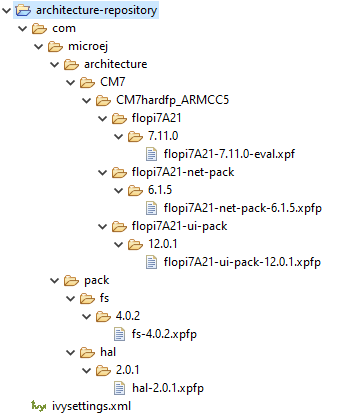

.. _former_platform_migration:

Former Platform Migration
=========================

This chapter describes the steps to migrate a former MicroEJ Platform in its latest form described in :ref:`new_platform_creation` chapter.

As a reminder, this new form brings two main features:

- Both MicroEJ Platform :ref:`build <platform_build>` and :ref:`dependencies declaration <platform_configuration_creation>` are managed by :ref:`mmm`. This allows a fully automated build and continuous integration.
- The configuration of the target Board Support Package (BSP) has been revisited to support any :ref:`BSP Connection cases <bsp_connection_cases>`.
 
Former MicroEJ Platforms were usually distributed by MicroEJ Corp. in an all-in-one ZIP file also called `fullPackaging`.

In this document, the `MicroEJ Platform for STMicroelectronics STM32F746G-DISCO board
<https://repository.microej.com/packages/referenceimplementations/846SI/3.4.2/STM32F746GDISCO-846SI-fullPackaging-eval-3.4.2.zip>`_
will be used as an example.

The following figure shows the `fullPackaging` structure once extracted.

   
   STM32F746G-DISCO Platform Full Packaging Structure 

The migration steps are:

#. Create a :ref:`Module Repository <module_repository>` to store the :ref:`MicroEJ Architecture <architecture_overview>`
   and :ref:`MicroEJ Packs <pack_overview>` used by the MicroEJ Platform.
#. Import the `Platform Configuration Additions <https://github.com/MicroEJ/PlatformQualificationTools/blob/master/framework/platform/>`_ into the Platform
   Configuration project.
#. Update the Front Panel project configuration.
#. Configure the :ref:`BSP Connection <bsp_connection>`.
#. Add the :ref:`Build Script <bsp_connection_build_script>` and :ref:`Run Script <bsp_connection_run_script>`.

Create an Architecture Repository
---------------------------------

The first step is to create an Architecture Repository. 
The MicroEJ Architecture and MicroEJ Packs are provided in the ``platformArchitecture`` directory of the `fullPackaging` package.

By default, we provide the steps to extend the default :ref:`MicroEJ SDK settings file configuration <mmm_configuration>`
with local MicroEJ Architecture and MicroEJ Packs modules.
The following steps can be adapted to custom :ref:`settings file <mmm_settings_file>`.

- Create a new empty project named ``architecture-repository``
- Create a new file named ``ivysettings.xml`` with the following content and update the included settings file according to your MicroEJ SDK version (see :ref:`get_sdk_version`)
  
  .. code-block:: xml

     <?xml version="1.0" encoding="UTF-8"?>
     <ivysettings>
       <property name="local.repo.url" value="${ivy.settings.dir}" override="false"/>

       <!--
           Include default settings file for MicroEJ SDK version:
           - MICROEJ SDK 5.4.0 or higher: ${user.home}/.microej/microej-ivysettings-5.4.xml
           - MICROEJ SDK 5.0.0 to 5.3.1: ${user.home}/.microej/microej-ivysettings-5.xml
           - MICROEJ SDK 4.1.x: ${user.home}/.ivy2/microej-ivysettings-4.1.xml
       -->
       <include file="${user.home}/.microej/microej-ivysettings-5.xml"/>

       <settings defaultResolver="ArchitectureResolver"/>

       <resolvers>
         <chain name="ArchitectureResolver">
           <filesystem m2compatible="true">
             <artifact pattern="${local.repo.url}/${microej.artifact.pattern}" />
             <ivy pattern="${local.repo.url}/${microej.ivy.pattern}" />
           </filesystem>
           <resolver ref="${microej.default.resolver}"/>
         </chain>
       </resolvers>
     </ivysettings>

- Copy the MicroEJ Architecture file (``.xpf``) into the correct directory
  following its :ref:`naming convention <architecture_naming_convention>`).

  - Open or extract the MicroEJ Architecture file (``.xpf``)
  - Open the ``release.properties`` file to retrieve the naming convention mapping:

    - ``architecture`` is the ``ISA`` (e.g. ``CM7``)
    - ``toolchain`` is the ``TOOLCHAIN`` (e.g. ``CM7hardfp_ARMCC5``)
    - ``name`` is the ``UID`` (e.g. ``flopi7A21``)
    - ``version`` is the ``VERSION`` (e.g. ``7.11.0``)

  For example, in the STM32F746G-DISCO Platform, the MicroEJ
  Architecture file ``flopi7A21-eval.xpf`` shall be copied and renamed
  to
  ``architecture-repository/com/microej/architecture/CM7/CM7hardfp_ARMCC5/flopi7A21/7.11.0/flopi7A21-7.11.0-eval.xpf``.

- Copy the MicroEJ Architecture Specific Packs files (``.xpfp``) into
  the correct directory following MicroEJ Naming Convention (see
  :ref:`pack_import`) with the exception of the Standalone pack that
  should not be imported (e.g. named ``flopi7A21Standalone.xpfp``).

  - Open or extract the MicroEJ Architecture Specific Pack (``.xpfp``).

    .. note:: The MicroEJ Architecture Specific Packs have the ``UID``
              of the MicroEJ Architecture in their name
              (e.g. ``flopi7A21UI.xpfp``) and their
              ``release_pack.properties`` file contains the
              information of the MicroEJ Architecture.

  - Open the ``release_pack.properties`` file to retrieve the naming convention mapping:

    - ``architecture`` is the ``ISA`` (e.g. ``CM7``)
    - ``toolchain`` is the ``TOOLCHAIN`` (e.g. ``CM7hardfp_ARMCC5``)
    - ``name`` is the ``UID`` (e.g. ``flopi7A21``)
    - ``packName`` is the ``NAME`` (e.g. ``ui``)
    - ``packVersion`` is the ``VERSION`` (e.g. ``12.0.1``)

  For example, in the STM32F746G-DISCO Platform, the MicroEJ
  Architecture Specific Pack UI ``flopi7A21UI.xpfp`` shall be copied
  and renamed to
  ``architecture-repository/com/microej/architecture/CM7/CM7hardfp_ARMCC5/flopi7A21-ui-pack/12.0.1/flopi7A21-ui-pack-12.0.1.xpfp``.

- Copy the Legacy MicroEJ Generic Packs (``.xpfp`` files) into the correct directory
  following MicroEJ Naming Convention (see :ref:`pack_import`).

  - Open or extract the MicroEJ Generic Pack (``.xpfp``).

    .. note:: The ``release_pack.properties`` of Legacy MicroEJ
                Generic Packs does not contain information about
                MicroEJ Architecture.

  - Open the ``release_pack.properties`` file:

    - ``packName`` is the ``NAME`` (e.g. ``fs``)
    - ``packVersion`` is the ``VERSION`` (e.g. ``4.0.2``)

  For example, in the STM32F746G-DISCO Platform, the Legacy MicroEJ
  Generic Pack FS ``fs.xpfp`` shall be copied and renamed to
  ``architecture-repository/com/microej/pack/fs/4.0.2/fs-4.0.2.xpfp``.

- Configure MicroEJ Module Manager to use the Architecture Repository:

  - Go to :guilabel:`Window` > :guilabel:`Preferences` >
    :guilabel:`MicroEJ` > :guilabel:`Module Manager`
  - In :guilabel:`Module Repository` set :guilabel:`Settings File:` to
    ``${workspace_loc:architecture-repository/ivysettings.xml}``.
  - :guilabel:`Apply and Close`

Here is the layout of the Architecture Repository for STM32F746G-DISCO.

   
   Architecture Repository for STM32F746G-DISCO `fullPackaging`

Install the Platform Configuration Additions
--------------------------------------------

- Rename the file ``bsp.properties`` to ``bsp2.properties`` (save it
  for later).
- Install `Platform Configuration Additions <https://github.com/MicroEJ/PlatformQualificationTools/blob/master/framework/platform/>`_, 
  by following instructions described at https://github.com/MicroEJ/PlatformQualificationTools/blob/master/framework/platform/README.rst.
  Files within the ``content`` folder have to be copied to the ``-configuration`` project
  (e.g. ``STM32F746GDISCO-Full-CM7_ARMCC-FreeRTOS-configuration``).
- Edit the ``module.properties`` file and set
  ``com.microej.platformbuilder.platform.filename`` to the name of the
  platform configuration file (e.g. ``STM32F746GDISCO.platform``).
- Fill the ``module.ivy`` with the MicroEJ Architecture and MicroEJ
  Packs dependencies.

Here is the module dependencies declared for the STM32F746G-DISCO Platform.

.. code-block:: xml
   :caption: STM32F746GDISCO-Full-CM7_ARMCC-FreeRTOS-configuration/module.ivy

   <dependencies>
     <!-- MicroEJ Architecture -->
     <dependency org="com.microej.architecture.CM7.CM7hardfp_ARMCC5" name="flopi7A21" rev="7.11.0">
       <artifact name="flopi7A21" m:classifier="${com.microej.platformbuilder.architecture.usage}" ext="xpf"/>
     </dependency>
   
     <!-- MicroEJ Architecture Specific Packs  -->
     <dependency org="com.microej.architecture.CM7.CM7hardfp_ARMCC5" name="flopi7A21-ui-pack" rev="12.0.1">
       <artifact name="flopi7A21-ui-pack" ext="xpfp"/>
     </dependency>
     <dependency org="com.microej.architecture.CM7.CM7hardfp_ARMCC5" name="flopi7A21-net-pack" rev="6.1.5">
       <artifact name="flopi7A21-net-pack" ext="xpfp"/>
     </dependency>
   
     <!-- Legacy MicroEJ Generic Packs -->
     <dependency org="com.microej.pack" name="fs" rev="4.0.2">
       <artifact name="fs" ext="xpfp"/>
     </dependency>
     <dependency org="com.microej.pack" name="hal" rev="2.0.1">
       <artifact name="hal" ext="xpfp"/>
     </dependency>
     
   </dependencies>
      

Update Front Panel Configuration
--------------------------------

- In ``-configuration/frontpanel/frontpanel.properties`` set the
  ``project.name`` to the folder name that contains the frontpanel
  (e.g. ``project.name=STM32F746GDISCO-Full-CM7_ARMCC-FreeRTOS-fp``).

At this state, the MicroEJ Platform is not connected to the BSP yet, but you
can check that everything is properly configured so far by building it:

- Right-click on the ``-configuration`` project and select
  :guilabel:`Build Module`
- Import the MicroEJ Platform built into the workspace by following instructions available at the end of the build logs).

At this stage the MicroEJ Platform is built, so you can create a MicroEJ Standalone Application and run it on the
Simulator (see :ref:`simulator_execution`).

Configure BSP Connection
------------------------

This section explains how to configure a full BSP Connection on the
STM32F746G-DISCO Platform.  See :ref:`bsp_connection` for more
information.

- Open ``-configuration/bsp/bsp.properties``.
- Comment out and set the following variables:

  - ``root.dir``
  - ``microejapp.relative.dir``
  - ``microejlib.relative.dir``
  - ``microejinc.relative.dir``
  - ``microejscript.relative.dir``

  For example:

  .. code-block:: properties

     # Specify the MicroEJ Application file ('microejapp.o') parent directory.
     # This is a '/' separated directory relative to 'bsp.root.dir'.
     microejapp.relative.dir=Projects/STM32746G-Discovery/Applications/MicroEJ/platform/lib
     
     # Specify the MicroEJ Platform runtime file ('microejruntime.a') parent directory.
     # This is a '/' separated directory relative to 'bsp.root.dir'.
     microejlib.relative.dir=Projects/STM32746G-Discovery/Applications/MicroEJ/platform/lib
     
     # Specify MicroEJ Platform header files ('*.h') parent directory.
     # This is a '/' separated directory relative to 'bsp.root.dir'.
     microejinc.relative.dir=Projects/STM32746G-Discovery/Applications/MicroEJ/platform/inc
     
     # Specify BSP external scripts files ('build.bat' and 'run.bat') parent directory.
     # This is a '/' separated directory relative to 'bsp.root.dir'.
     microejscript.relative.dir=Projects/STM32746G-Discovery/Applications/MicroEJ/scripts
     
     # Specify the BSP root directory. Can use ${project.parent.dir} which target the parent of platform configuration project
     # For example, '${project.parent.dir}/PROJECT-NAME-bsp' specifies a BSP project beside the '-configuration' project
     root.dir=${project.parent.dir}/STM32F746GDISCO-Full-CM7_ARMCC-FreeRTOS-bsp/

The paths to ``microejXXX.relative.dir`` can be inferred by looking at
the ``output.dir`` value in ``bsp2.properties`` saved earlier.  For
example on the STM32F746G-DISCO project, its value is
``${workspace}/${project.prefix}-bsp/Projects/STM32746G-Discovery/Applications/MicroEJ/platform``.

- The BSP project path ``${workspace}/${project.prefix}-bsp`` becomes
  ``${project.parent.dir}/STM32F746GDISCO-Full-CM7_ARMCC-FreeRTOS-bsp/``.
- ``Projects/STM32746G-Discovery/Applications/MicroEJ/platform`` is
  the path to MicroEJ Application file, MicroEJ Platform header and
  runtime files.  MicroEJ convention is to put the MicroEJ Application
  file and MicroEJ Platform runtime files to ``platform/lib/`` and
  MicroEJ Platform header files to ``platform/inc/``.
- :ref:`bsp_connection_build_script` and
  :ref:`bsp_connection_run_script` are PCA-specific and did not exist
  before.  By convention we put them in a ``scripts/`` directory.

The paths to ``microejXXX.relative.dir`` can be also be checked by
looking at the C TOOLCHAIN configuration of the BSP.  For example on
the STM32F746G-DISCO project, the BSP configuration is located at
``STM32F746GDISCO-Full-CM7_ARMCC-FreeRTOS-bsp/Projects/STM32746G-Discovery/Applications/MicroEJ/MDK-ARM/Project.uvprojx``.

- In :guilabel:`Project` > :guilabel:`Options for Target
  'standalone'...` > :guilabel:`C/C++` > :guilabel:`Include Paths`
  contains ``../platform/inc``.  This corresponds to the
  ``microejinc.relative.dir`` relative the TOOLCHAIN project's file.
- In the :guilabel:`Project` pane, there is a folder ``MicroEJ/Libs``
  that contains ``microejruntime.lib`` and ``microejapp.o``.

  - Right-click on ``microejruntime.lib`` > :guilabel:`Options for
    File 'XXX'...`.  The :guilabel:`Path` is
    ``../platform/lib/microejruntime.lib``.  This corresponds to the
    ``microejlib.relative.dir``.
  - Right-click on ``microejapp.o`` > :guilabel:`Options for File
    'XXX'...`.  The :guilabel:`Path` is
    ``../platform/lib/microejapp.o``.  This corresponds to the
    ``microejapp.relative.dir``.
- Rebuild the platform (Right-click on the ``-configuration`` project
  and select :guilabel:`Build Module`)
  
At this stage the MicroEJ Platform is connected to the BSP so you can 
build and program a MicroEJ Firmware (see :ref:`device_build`).

Add Build Script and Run Script
-------------------------------

The final stage consists of adding the Build Script, to automate the build a
MicroEJ Firmware, and the Run Script, to automate the program a MicroEJ Firmware
onto the device.

The `Platform Qualification Tools`_ provides examples of Build Script
and Run Script for various C TOOLCHAIN `here
<https://github.com/MicroEJ/PlatformQualificationTools/tree/master/framework/platform/scripts>`__.

On the STM32F746G-DISCO, the C TOOLCHAIN used is Keil uVision.

- Create the directory pointed by ``microejscript.relative.dir``
  (e.g. ``STM32F746GDISCO-Full-CM7_ARMCC-FreeRTOS-bsp\Projects\STM32746G-Discovery\Applications\MicroEJ\scripts``).
- Copy the example scripts from the `Platform Qualification Tools`_
  for the C TOOLCHAIN of the BSP
  (e.g. ``PlatformQualificationTools/framework/platform/scripts/KEILuV5/``)
- Configure the scripts.  Refer to the documentation in the scripts
  comments for this step.
- Enable the execution of the build script: 

  - Go to :guilabel:`Run` > :guilabel:`Run Configurations...`
  - Select the launch configuration
  - Go to :guilabel:`Configuration` > :guilabel:`Device` > :guilabel:`Deploy`
  - Ensure :guilabel:`Execute the MicroEJ build script (build.bat) at
    a location known by the 3rd-party BSP project.` is checked.

Going further
-------------

Now that the MicroEJ Platform is connected to the BSP it can leverage
the Java Test Suites provided by the `Platform Qualification Tools`_.
See :ref:`tutorial_run_test_suite_on_device` for a step by step
explanation on how to do so.

.. _Platform Qualification Tools: https://github.com/MicroEJ/PlatformQualificationTools

..
   | Copyright 2021-2022, MicroEJ Corp. Content in this space is free 
   for read and redistribute. Except if otherwise stated, modification 
   is subject to MicroEJ Corp prior approval.
   | MicroEJ is a trademark of MicroEJ Corp. All other trademarks and 
   copyrights are the property of their respective owners.

