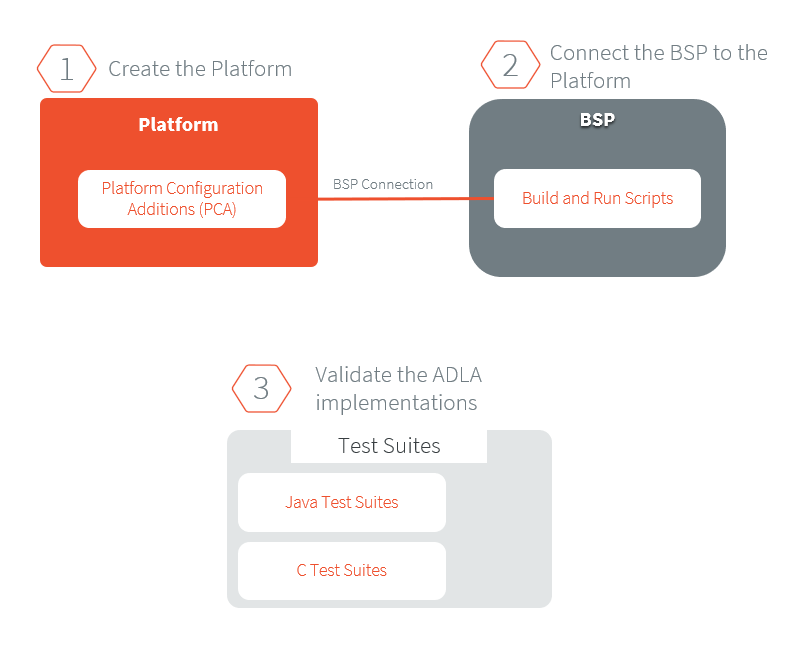

.. _platform_qualification:

======================
Platform Qualification
======================

Introduction
============

A Platform integrates one or more Foundation Libraries with their
respective Abstraction Layers.

Platform Qualification is the process of validating the Abstraction
Layer that implements the :ref:`Low Level APIs <low_level_api>` of a
Foundation Libraries.

.. figure:: images/overview-platform-qualification.png
   :align: center

   Platform Qualification: Validate the conformance of Abstraction Layer implementations

For each Low Level API, an Abstraction Layer implementation is
required.  The validation of the Abstraction Layer implementations is
performed by running tests at two-levels:

- In C, by calling Low Level APIs (usually manually).
- In Java, by calling Foundation Library APIs (usually automatically using :ref:`platform_testsuite`).

MicroEJ provides a set of tools and pre-defined projects aimed at
simplifying the steps for validating Platforms in the form of the
`Platform Qualification Tools (PQT)
<https://github.com/MicroEJ/PlatformQualificationTools>`__.

.. _pqt_overview:

Platform Qualification Tools Overview
=====================================

The Platform Qualification Tools provide the following components:

- Platform Configuration Additions (PCA) to:

  - Manage MicroEJ Architecture, MicroEJ Packs and the Platform build
    with the MicroEJ Module Manager.
  - Configure the BSP connection to call the build and run scripts.

- Build and Run Scripts examples to:

  - Generate and deploy a MicroEJ Firmware on a device by invoking a
    third-party toolchain for the BSP

- C and Java Test Suites to:

  - Validate the Low Level APIs implementations

The Platform Qualification Tools components are to be used in the following context:

- The Platform Configuration Additions (PCA) are added when creating a
  Platform.  See :ref:`new_platform_creation`.
- The Build and Run Scripts are configured when integrating the BSP to
  the Platform.  See to :ref:`bsp_connection_build_script` or
  check the tutorial XXX
- The C and Java Test Suites should be validated during the BSP
  development and whenever a Low Level API implementation is added
  or changed.  See :ref:`tutorialRunATestSuiteOnDevice`.

Please refer to the `PQT README
<https://github.com/MicroEJ/PlatformQualificationTools>`__ for more
details and for the exact location of the components.

.. _platform_testsuite:

Platform Test Suite
===================

The purpose of a MicroEJ Platform Test Suite is to validate
an implementation of a Low Level API by automatically running Java tests on the device.

The :ref:`testsuite_engine` is used for building,
running a Test Suite, and providing a report.

A Platform Test Suite contains one or more tests.  For each test, the Test Suite Engine will:

1. Build a MicroEJ Firmware for the test.

2. Program the MicroEJ Firmware onto the device.

3. Retrieve the execution traces.

4. Analyze the traces to determine whether the test has ``PASSED`` or ``FAILED``.

5. Append the result to the Test Report.

6. Repeat until all tests of the Test Suite have been executed.

.. figure:: images/testsuite-engine-overview.png
   :alt: Platform Test Suite on Device Overview
   :align: center

   Platform Test Suite on Device Overview

Test Suite Versioning
=====================

Foundation Libraries are integrated in a MicroEJ Platform by MicroEJ
Packs (see :ref:`pack_import`).  Depending on the version of the
Foundation Libraries provided by a Pack (one MicroEJ Pack can provide
several Foundation Libraries), a precise Test Suite version must be
used to validate the Abstraction Layer implementations.

The following table presents the Test Suites to use to validate the
integration of MicroEJ Packs in the Platform.

.. list-table:: MicroEJ Packs and Test Suites association table
   :widths: 40 10 40 10
   :header-rows: 1

   * - MicroEJ Pack
     - Pack Version
     - Test Suite
     - Test Suite Version
   * - com/microej/pack/bluetooth/bluetooth-pack
     - 2.1.0
     - com/microej/pack/bluetooth/bluetooth-testsuite
     - 2.0.0
   * - com/microej/pack/device/device-pack
     - 1.1.1
     - N/A
     -
   * - com/microej/pack/ecom-mobile/ecom-mobile-pack
     - 1.0.0
     - N/A
     -
   * - com/microej/architecture/generic/fs/fs-pack
     - 5.0.0
     - com/microej/pack/fs/fs-testsuite
     - 3.0.3
   * - com/microej/pack/fs
     - 4.0.3
     - com/microej/pack/fs/fs-testsuite
     - 3.0.3
   * - com/microej/pack/fs
     - 5.1.2
     - com/microej/pack/fs/fs-testsuite
     - 3.0.3
   * - com/microej/pack/hal
     - 2.0.2
     - N/A
     -
   * - com/microej/pack/gnss/gnss-pack
     - 1.0.2
     - N/A
     -
   * - com/microej/pack/monitoring/monitoring-pack
     - 1.0.0
     - com/microej/pack/watchdog/watchdog-testsuite
     - 2.0.0
   * - com/microej/pack/multicore/multicore-pack
     - 0.1.0
     - N/A
     -
   * - com/microej/pack/net
     - 9.2.3
     - com/is2t/libraries/net-embedded/net-embedded-testsuite
     - 3.5.2
   * -
     -
     - com/is2t/libraries/ssl-embedded/ssl-embedded-testsuite
     - 3.1.2
   * -
     -
     - com/is2t/libraries/security/security-testsuite
     - 1.1.0
   * - com/microej/pack/net-addons
     - 2.3.0
     - com/is2t/libraries/net-embedded/net-embedded-testsuite-wifi
     - 1.1.2
   * -
     -
     - com/is2t/libraries/ecom- network/ecom-network-wifi-testsuite
     - 1.0.0
..
   | Copyright 2008-2021, MicroEJ Corp. Content in this space is free
   for read and redistribute. Except if otherwise stated, modification
   is subject to MicroEJ Corp prior approval.
   | MicroEJ is a trademark of MicroEJ Corp. All other trademarks and
   copyrights are the property of their respective owners.
