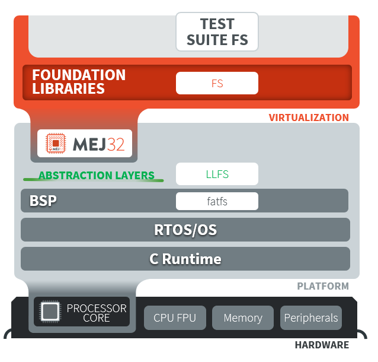
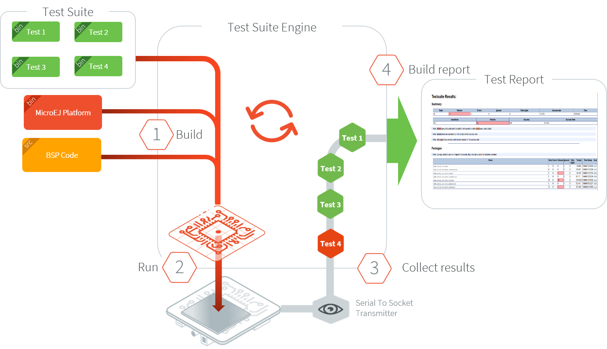

.. _platform_qualification:

======================
Platform Qualification
======================

Introduction
============

A MicroEJ Platform integrates one or more Foundation Libraries with their
respective Abstraction Layers.

Platform Qualification is the process of validating the Abstraction
Layer that implements the :ref:`Low Level APIs <low_level_api>` of a
Foundation Library.

.. figure:: images/overview-platform-qualification.png
   :align: center
   :scale: 90%

   Platform Qualification: Validate the conformance of Abstraction Layer implementations

For each Low Level API, an Abstraction Layer implementation is
required.  The validation of the Abstraction Layer implementation is
performed by running tests at two-levels:

- In C, by calling Low Level APIs (usually manually).
- In Java, by calling Foundation Library APIs (usually automatically using :ref:`platform_testsuite`).

The following figure depicts an example for the Test Suite FS:

   Validate the conformance with Test Suite FS

MicroEJ provides a set of tools and pre-defined projects aimed at
simplifying the steps for validating Platforms in the form of the
`Platform Qualification Tools (PQT)
<https://github.com/MicroEJ/PlatformQualificationTools>`__.

.. _pqt_overview:

Platform Qualification Tools Overview
=====================================

The Platform Qualification Tools provide the following components:

- Platform Configuration Additions (PCA):

  - Used to:

    - Manage MicroEJ Architecture, MicroEJ Packs and the Platform
      build with the MicroEJ Module Manager.
    - Configure the BSP connection to call the build and run scripts.

  - Added when creating a Platform (see :ref:`new_platform_creation`
    or check the tutorial :ref:`tutorial_create_firmware_from_scratch`).

- Build and Run Scripts examples:

  - Used to generate and deploy a MicroEJ Firmware on a device by
    invoking a third-party toolchain for the BSP
  - Added when integrating the BSP to the Platform (see
    :ref:`bsp_connection_build_script` and
    :ref:`bsp_connection_run_script` or check the tutorial :ref:`tutorial_create_platform_build_and_run_scripts`).

- C and Java Test Suites:

  - Used to validate the Low Level APIs implementations
  - Validated during the BSP development and whenever an Abstraction
    Layer implementation is added or changed (see
    :ref:`platform_testsuite` or check the tutorial
    :ref:`tutorial_run_test_suite_on_device`).

Please refer to the `Platform Qualification Tools README
<https://github.com/MicroEJ/PlatformQualificationTools>`__ for more
details and the location of the components.

.. _platform_testsuite:

Platform Test Suite
===================

The purpose of a MicroEJ Platform Test Suite is to validate the
Abstraction Layer that implements the :ref:`Low Level APIs
<low_level_api>` of a Foundation Libraries by automatically running
Java tests on the device.

The :ref:`testsuite_engine` is used for building,
running a Test Suite, and providing a report.

A Platform Test Suite contains one or more tests.  For each test, the Test Suite Engine will:

1. Build a MicroEJ Firmware for the test.

2. Program the MicroEJ Firmware onto the device.

3. Retrieve the execution traces.

4. Analyze the traces to determine whether the test has ``PASSED`` or ``FAILED``.

5. Append the result to the Test Report.

6. Repeat until all tests of the Test Suite have been executed.

   Platform Test Suite on Device Overview

.. _test_suite_versioning:

Test Suite Versioning
=====================

Foundation Libraries are integrated in a MicroEJ Platform by MicroEJ
Packs (see :ref:`pack_import`).  Use the Test Suite version compliant
with the Foundation Library version to validate the Abstraction Layer
implementation.  For example, the `Test Suite FS module 3.0.3
<https://repository.microej.com/modules/com/microej/pack/fs/fs-testsuite/3.0.3/>`_
should be used to validate the Abstraction Layer implementation of the
:ref:`Low Level API FS <LLFS-API-SECTION>` provided by the `FS Pack
5.1.2
<https://repository.microej.com/modules/com/microej/pack/fs/5.1.2/>`_.

.. note:: A MicroEJ Pack can provide several Foundation Libraries.

.. _test_suite_versioning_fs:

FS Pack
-------

.. list-table:: FS API Implementation and Validation
   :widths: 20 10 10

   * - FS Pack
     - FS API
     - Java Test Suite
   * - [5.1.2-5.2.0[
     - `2.0.6 <https://repository.microej.com/modules/ej/api/fs/2.0.6/>`__
     - `3.0.3 <https://repository.microej.com/modules/com/microej/pack/fs/fs-testsuite/3.0.3/>`__
   * - [4.0.0-4.1.0[
     - `2.0.6 <https://repository.microej.com/modules/ej/api/fs/2.0.6/>`__
     - On demand [#]_

.. _test_suite_versioning_bluetooth:

BLUETOOTH Pack
--------------

.. list-table:: BLUETOOTH API Implementation and Validation
   :widths: 20 10 10

   * - BLUETOOTH Pack
     - BLUETOOTH API
     - Java Test Suite
   * - 2.1.0
     - `2.1.0 <https://repository.microej.com/modules/ej/api/bluetooth/2.1.0/>`__
     - `2.0.0 <https://repository.microej.com/modules/com/microej/pack/bluetooth/bluetooth-testsuite/2.0.0/>`__
   * - 2.0.1
     - `2.0.0 <https://repository.microej.com/modules/ej/api/bluetooth/2.0.0/>`__
     - `2.0.0 <https://repository.microej.com/modules/com/microej/pack/bluetooth/bluetooth-testsuite/2.0.0/>`__

.. [#] Test Suite available on demand, please contact :ref:`MicroEJ Support<get_support>`.

..
   | Copyright 2008-2021, MicroEJ Corp. Content in this space is free
   for read and redistribute. Except if otherwise stated, modification
   is subject to MicroEJ Corp prior approval.
   | MicroEJ is a trademark of MicroEJ Corp. All other trademarks and
   copyrights are the property of their respective owners.
