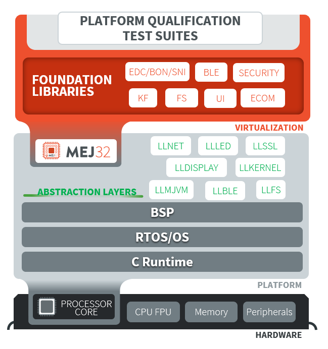

.. _platform_qualification:

======================
Platform Qualification
======================

Introduction
============

A Platform integrates one or more Foundation Libraries with their
respective Abstraction Layers.

Platform Qualification is the process of validating the :ref:`Low
Level APIs <low_level_api>` implemented by the Adaptation Layer
(ADLA) of the Foundation Libraries.

   Platform Qualification: Validate the conformance of ADLA implementations

Such validation is performed by running tests at two-levels:

- In C, by calling Low Level APIs (usually manually).
- In Java, by calling Foundation Library APIs (usually automatically using :ref:`platform_testsuite`).

MicroEJ provides a set of tools and pre-defined projects aimed at simplifying the steps 
for validating Platforms. Please refer to https://github.com/MicroEJ/PlatformQualificationTools.

.. _pqt_overview:

Platform Qualification Tools Overview
=====================================

The Platform Qualification Tools provide the following components:

- Platform Configuration Additions (PCA) to:

  - Manage MicroEJ Architecture, MicroEJ Packs and the Platform build
    with the MicroEJ Module Manager.
  - Configure the BSP connection to call the build and run scripts.

- Build and Run Scripts examples to:

  - Generate and deploy a MicroEJ Firmware on a device by invoking a
    third-party toolchain for the BSP

- C and Java Test Suites to:

  - Validate the Low Level APIs implementations

The Platform Qualification Tools components are to be used in the following context:

- The Platform Configuration Additions (PCA) are added when creating a
  Platform.  See :ref:`new_platform_creation`.
- The Build and Run Scripts are configured when integrating the BSP to
  the Platform.  See to :ref:`bsp_connection_build_script` or
  check the tutorial XXX
- The C and Java Test Suites should be validated during the BSP
  development and whenever a Low Level API implementation is added
  or changed.  See :ref:`tutorialRunATestSuiteOnDevice`.

.. figure:: images/platform-qualification-timeline.png
   :align: center

.. _platform_testsuite:

Platform Test Suite
===================

The purpose of a MicroEJ Platform Test Suite is to validate
an implementation of a Low Level API by automatically running Java tests on the device.

The :ref:`testsuite_engine` is used for building,
running a Test Suite, and providing a report.

A Platform Test Suite contains one or more tests.  For each test, the Test Suite Engine will:

1. Build a MicroEJ Firmware for the test.

2. Program the MicroEJ Firmware onto the device.

3. Retrieve the execution traces.

4. Analyze the traces to determine whether the test has ``PASSED`` or ``FAILED``.

5. Append the result to the Test Report.

6. Repeat until all tests of the Test Suite have been executed.

.. figure:: images/testsuite-engine-overview.png
   :alt: Platform Test Suite on Device Overview
   :align: center

   Platform Test Suite on Device Overview

Test Suite Versioning
=====================

From an Application point of view, a Platform provides a set of
Foundation Libraries.  From the Platform point of view, a Platform
integrates a set of MicroEJ Packs with Low-Level APIs that must be
implemented in the BSP.  The version of Test Suites to run depends on
the Packs integrated in the Platform.

..
   | Copyright 2008-2021, MicroEJ Corp. Content in this space is free 
   for read and redistribute. Except if otherwise stated, modification 
   is subject to MicroEJ Corp prior approval.
   | MicroEJ is a trademark of MicroEJ Corp. All other trademarks and 
   copyrights are the property of their respective owners.
