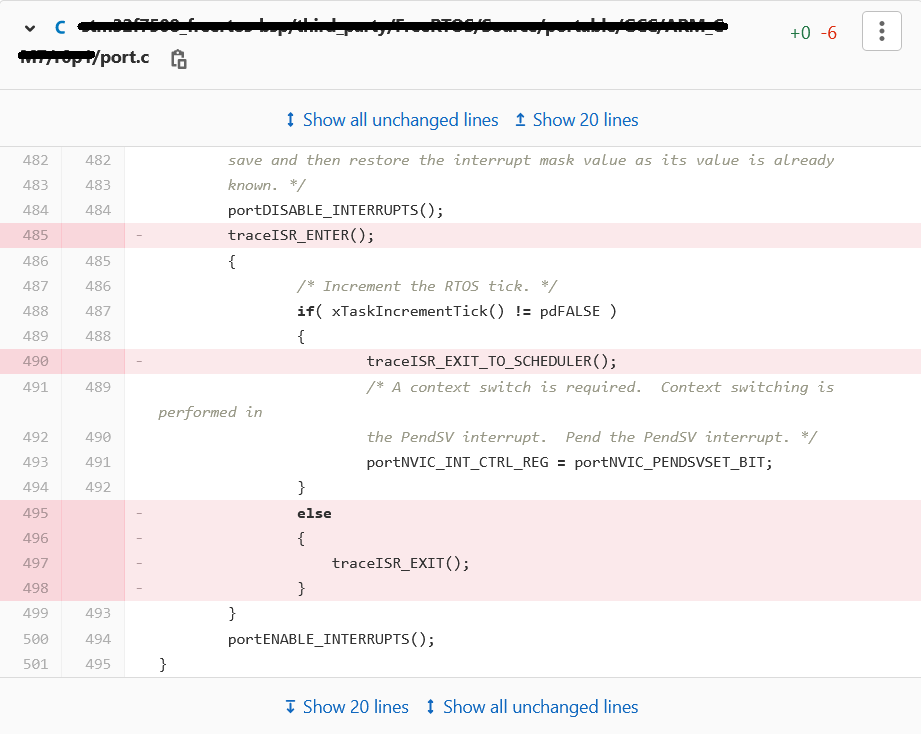
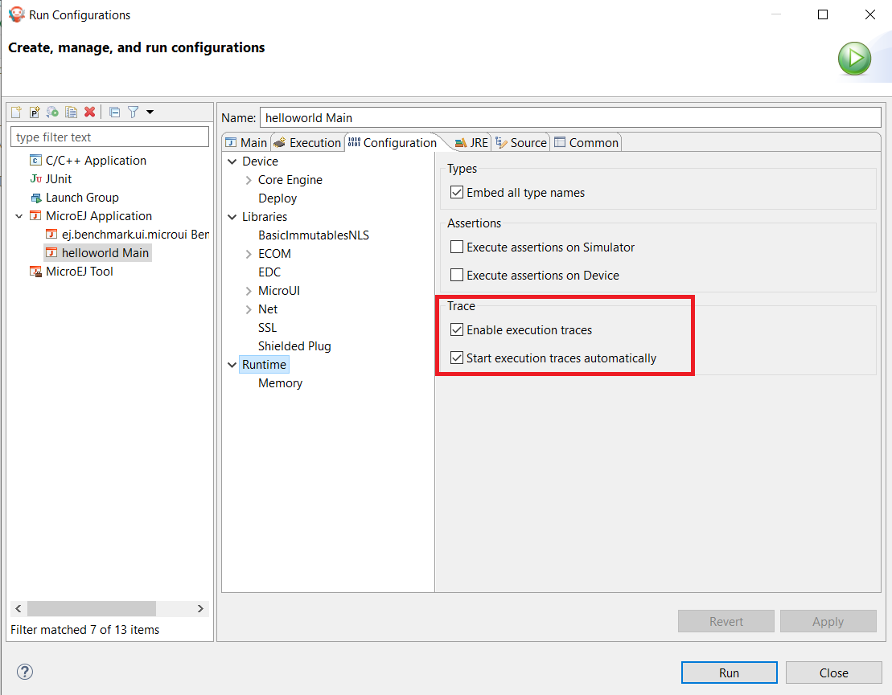
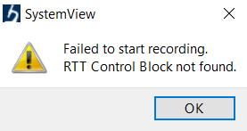
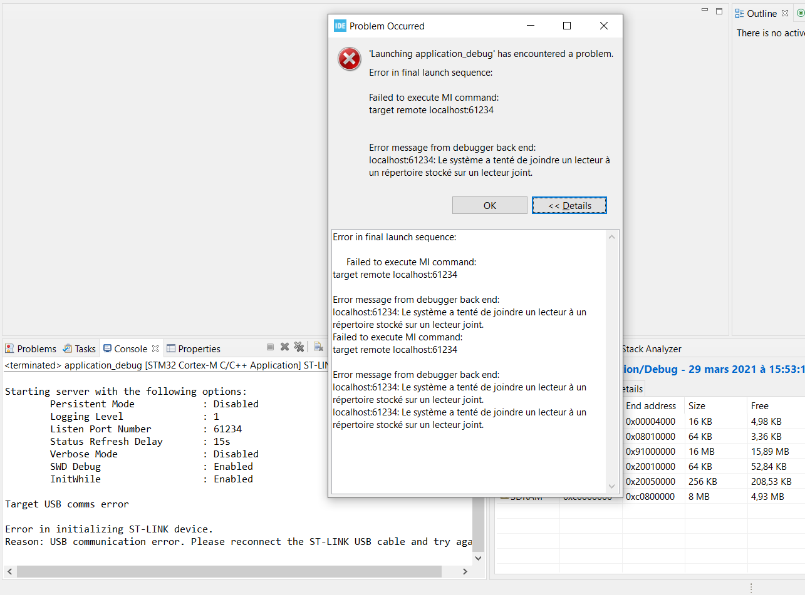

.. _systemview:

==========
SystemView
==========

Principle
=========

SystemView is a real-time recording and visualization tool for embedded systems that reveals the true runtime behavior of an application, going far deeper than the system insights provided by debuggers. This is particularly effective when developing and working with complex embedded systems comprising multiple threads and interrupts: SystemView can ensure a system performs as designed, can track down inefficiencies, and show unintended interactions and resource conflicts, with a focus on the details of every single system tick.

A specific SystemView extension made by MicroEJ allows to traces the OS tasks and the MicroEJ Java threads at the same time. This chapter explains how to add SystemView feature in a platform and how to setup it.

A SystemView support is provided to use the software with a MicroEJ system. This documentation shows how to setup your BSP and your Java application.

.. note:: SystemView support for MicroEJ is compatible with FreeRTOS 9 and FreeRTOS 10. 

.. note:: This SystemView section has been written for SystemView version V2.52a. Later versions may or may not work, and may need modification to the following steps.

References
==========

* https://www.segger.com/products/development-tools/systemview/
* https://www.segger.com/downloads/jlink/UM08027

Installation
============

SystemView consists on installing several items in the BSP. The following steps describe them and must be performed in the right order. If SystemView support is already available in the BSP, apply only modifications made by MicroEJ on SystemView files and SystemView for FreeRTOS files to enable MicroEJ Java threads monitoring.

1. Download and install SystemView V2.52a: http://segger.com/downloads/systemview/.
2. Apply SystemView for FreeRTOS patch as described in documentation (https://www.segger.com/downloads/jlink/UM08027); patch is available in installation folder ``SEGGER\SystemView\Src\Sample\FreeRTOSVxx``.

.. note:: If you are using FreeRTOS V10.2.0, use the patch located here: https://forum.segger.com/index.php/Thread/6158-SOLVED-SystemView-Kernelpatch-for-FreeRTOS-10-2-0/?s=add3b0f6a33159b9c4b602da0082475afeceb89a

3. Check if the patch disabled SystemView systick events in ``port.c``, if not remove these lines manually:

4. Add ``SEGGER\SystemView\Src\Sample\FreeRTOSVxx\Config\SEGGER_SYSVIEW_Config_FreeRTOS.c`` in your BSP.

This file can be modified to fit with your system configuration:
   
   * Update ``SYSVIEW_APP_NAME``, ``SYSVIEW_DEVICE_NAME`` and ``SYSVIEW_RAM_BASE`` defines to fit your system information.
   * To add MicroEJ Java threads management in SystemView tasks initialization:
  
      * Add these includes ``#include "LLMJVM_MONITOR_SYSVIEW.h"`` and ``#include "LLTRACE_SYSVIEW_configuration.h"``.
      * In function ``_cbSendSystemDesc(void)``, add this instruction: ``SEGGER_SYSVIEW_SendSysDesc("N="SYSVIEW_APP_NAME",D="SYSVIEW_DEVICE_NAME",O=FreeRTOS");`` before ``SEGGER_SYSVIEW_SendSysDesc("I#15=SysTick");``.
      * Replace the ``Global function`` section by this code:

      .. code-block:: C

         /*********************************************************************
         *
         *       Global functions
         *
         **********************************************************************
         */

         SEGGER_SYSVIEW_OS_API SYSVIEW_MICROEJ_X_OS_TraceAPI;

         static void SYSVIEW_MICROEJ_X_OS_SendTaskList(void){
            SYSVIEW_X_OS_TraceAPI.pfSendTaskList();
            LLMJVM_MONITOR_SYSTEMVIEW_send_task_list();
         }
         
         void SEGGER_SYSVIEW_Conf(void) {
            SYSVIEW_MICROEJ_X_OS_TraceAPI.pfGetTime = SYSVIEW_X_OS_TraceAPI.pfGetTime;
            SYSVIEW_MICROEJ_X_OS_TraceAPI.pfSendTaskList = SYSVIEW_MICROEJ_X_OS_SendTaskList;
            
            SEGGER_SYSVIEW_Init(SYSVIEW_TIMESTAMP_FREQ, SYSVIEW_CPU_FREQ,
                                 &SYSVIEW_MICROEJ_X_OS_TraceAPI, _cbSendSystemDesc);
            SEGGER_SYSVIEW_SetRAMBase(SYSVIEW_RAM_BASE);
         }

5. Add in your BSP the MicroEJ C module files for SystemView: `com.microej.clibrary.thirdparty#systemview <https://repository.microej.com/modules/com/microej/clibrary/thirdparty/systemview/1.3.1/>`_ (or check the differences between pre-installed SystemView and C files provided by this module)
6. Add in your BSP the MicroEJ C module files for SystemView FreeRTOS support (or check the differences between pre-installed SystemView and C files provided by this module)
   
   - FreeRTOS 10: `com.microej.clibrary.thirdparty#systemview-freertos10 <https://repository.microej.com/modules/com/microej/clibrary/thirdparty/systemview-freertos10/1.1.1/>`_ 
   - FreeRTOS 9: please contact :ref:`our support team <get_support>` to get the latest maintenance version of ``com.microej.clibrary.thirdparty#systemview-freertos9`` module.

7. Install the Abstraction Layer implementation of the :ref:`Java Trace API <trace_implementations>` for SystemView by adding C module files in your BSP: `com.microej.clibrary.llimpl#trace-systemview <https://repository.microej.com/modules/com/microej/clibrary/llimpl/trace-systemview/2.1.1/>`_
8. Make FreeRTOS compatible with SystemView: open  ``FreeRTOSConfig.h`` and:

   * add ``#define INCLUDE_xTaskGetIdleTaskHandle 1``
   * add ``#define INCLUDE_pxTaskGetStackStart 1``
   * add ``#define INCLUDE_uxTaskPriorityGet 1``
   * comment the line ``#define traceTASK_SWITCHED_OUT()`` if defined 
   * comment the line ``#define traceTASK_SWITCHED_IN()`` if defined 
   * add ``#include "SEGGER_SYSVIEW_FreeRTOS.h"`` at the end of file

9. Enable SystemView on startup (before creating first OS task): call ``SEGGER_SYSVIEW_Conf();``. Include required ``#include "SEGGER_SYSVIEW.h"``.
10. Prints the RTT block address to the serial port on startup: ``printf("SEGGER_RTT block address: %p\n", &(_SEGGER_RTT));``. Include required ``#include "SEGGER_RTT.h"``.

.. note:: 
   
   This is useful if SystemView does not find automatically the RTT block address.
   See section :ref:`systemview_no_rtt_block` for more details.

11. Add a call to ``SYSVIEW_setMicroJVMTask((U32)pvCreatedTask);`` just after creating the OS task to register the MicroEJ Core Engine OS task. The handler to give is the one filled by ``xTaskCreate`` function.

12. Copy the file ``/YourPlatformProject-bsp/projects/microej/trace/systemview/SYSVIEW_MicroEJ.txt`` to the SystemView install path such as: ``SEGGER/SystemView_V252a/Description/``. If you use MicroUI traces, you can also copy the file in section :ref:`microui_traces`

MicroEJ Core Engine OS Task
===========================

The :ref:`MicroEJ Core Engine <core_engine>` task is the OS task that executes MicroEJ Java threads. 
Once it is :ref:`started <core_engine_implementation>` (by calling ``SNI_startVM``) it executes initialization code and rapidly starts to execute the MicroEJ Application main thread.
At that time, the events produced by this OS task (context switch, semaphores, etc.) are dispatched to the current MicroEJ Java thread.
By consequence, this OS task is useless when the MicroEJ Application is running.

SystemView for MicroEJ disables the visibility of this OS task when the MicroEJ Application is running. It simplifies the SystemView client debugging.

OS Tasks and Java Threads Names
===============================

To make a distinction between the OS tasks and MicroEJ Java threads, a prefix is added to OS tasks names (``[OS]``) and Java threads names (``[MEJ]``).

.. _fig_sv_names:
.. figure:: images/sv_names.*
   :alt: OS and Thread Names
   :align: center

   OS Tasks and Java Threads Names

.. note:: 

   SystemView limits the number of characters to 32. The prefix length is included in these 32 characters and by consequence the end of the original OS task or Java thread name can be cropped.

OS Tasks and Java Threads Priorities
====================================

SystemView lists the OS tasks and Java threads according their priorities. 
However the priority notion has not the same signification when talking about OS tasks or Java threads: a Java thread priority depends on the MicroEJ Core Engine OS task priority.

By consequence, a Java thread with the priority ``5`` may not appear between an OS task with the priority ``4`` and other OS task with priority ``6``:

* if the MicroEJ Core Engine OS task priority is ``3``, the Java thread must appear below an OS task with priority ``4``. 
* if the MicroEJ Core Engine OS task priority is ``7``, the Java thread must appear above an OS task with priority ``6``. 

To keep a consistent line ordering in SystemView, the priorities sent to SystemView client respect the following rules:

* OS task: ``priority_sent = task_priority * 100``.
* MicroEJ Java thread: ``priority_sent = MicroJvm_task_priority * 100 + thread_priority``.

Use
===

MicroEJ Architecture can generate specific events that allow monitoring current Java thread executed, Java exceptions, Java allocations, ... as well as custom application events.
Please refer to :ref:`event-tracing` section.

To enable events recording, refer to section :ref:`event_enable_recording` to configure required :ref:`Application Options <application_options>`.

Troubleshooting
===============

SystemView doesn't see any activity in MicroEJ Tasks
----------------------------------------------------

You have to enable runtime traces of your Java application. 

- In ``Run > Run configuration`` select your Java application launcher.
- Then, go to ``Configuration tab > Runtime > Trace``
- Finally, check checkboxes ``Enable execution traces`` and ``Start execution traces automatically`` as shown in the picture below.
- Rebuild your firmware with the new Java application version and it should fix the issue.

You may only check the first checkbox when you know when you want to start the trace recording. 
For more information, please refer to section :ref:`event_enable_recording` to configure required :ref:`Application Options <application_options>`.

OVERFLOW Events in SystemView
-----------------------------

Depending on the application, OVERFLOW events can be seen in System View. To mitigate this problem, the default `SEGGER_SYSVIEW_RTT_BUFFER_SIZE` can be increased
from the default 1kB to a more appropriate size of 4kB. Still, if OVERFLOW events are still visible, the user can further increase this configuration found in
``/YourPlatformProject-bsp/projects/microej/thirdparty/systemview/inc/SEGGER_SYSVIEW_configuration.h``.

.. _systemview_no_rtt_block:

RTT Control Block Not Found
---------------------------

* Get RTT block address from standard output by resetting the board (it's printed at the beginning of the firmware program),
* In SystemView, select :guilabel:`Target` > :guilabel:`Start recording`,
* In :guilabel:`RTT Control Block Detection`, select :guilabel:`Address` and put the address retrieved.
  You can also try with :guilabel:`Search Range` option.

SystemView for STM32 ST-Link Probe
==================================

SystemView software requires a J-Link probe. 
If your target board uses a ST-Link probe, it is possible to re-flash the ST-LINK on board with a J-Link firmware.
See instructions provided by SEGGER Microcontroller https://www.segger.com/products/debug-probes/j-link/models/other-j-links/st-link-on-board/ for more details.

If you cannot flash a firmware for a STM32 device after replacing back J-Link firmware by ST-Link original one:

- Use ST_Link utility program to update the ST_Link firmware, go to ``ST-LINK > Firmware update``.
- Then, try to flash again.

..
   | Copyright 2020-2021, MicroEJ Corp. Content in this space is free 
   for read and redistribute. Except if otherwise stated, modification 
   is subject to MicroEJ Corp prior approval.
   | MicroEJ is a trademark of MicroEJ Corp. All other trademarks and 
   copyrights are the property of their respective owners.
