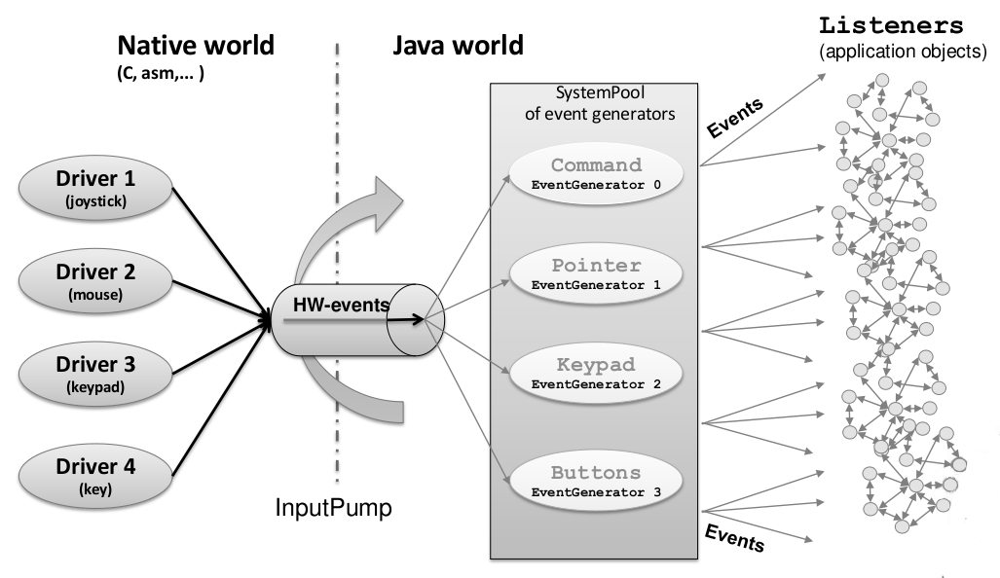

.. _section_input:

=====
Input
=====

Principle
=========

The Input module contains the C part of the MicroUI implementation which manages input devices. This module is composed of two elements:

-  the C part of MicroUI input API (a built-in C archive) called Input Engine,

-  an implementation of a Low Level APIs for the input devices
   that must be provided by the BSP (see :ref:`LLINPUT-API-SECTION`).

Functional Description
======================

The Input module implements the MicroUI ``int``-based event generators' framework. ``LLUI_INPUT`` specifies the Low Level APIs that send events to the Java world.

Drivers for input devices must generate events that are sent, via a MicroUI `Event Generator <https://repository.microej.com/javadoc/microej_5.x/apis/ej/microui/event/EventGenerator.html>`_, to the application. An event generator accepts notifications from devices, and generates an event in a standard format that can be handled by the application. Depending on the MicroUI configuration, there can be several different types of event generator in the system, and one or more instances of each type. 

Each MicroUI `Event Generator <https://repository.microej.com/javadoc/microej_5.x/apis/ej/microui/event/EventGenerator.html>`_ represents one side of a pair of collaborative components that communicate using a shared buffer:

-  The producer: the C driver connected to the hardware. As a producer, it sends its data into the communication buffer.

-  The consumer: the MicroUI `Event Generator <https://repository.microej.com/javadoc/microej_5.x/apis/ej/microui/event/EventGenerator.html>`_. As a consumer, it reads (and removes) the data from the communication buffer.

.. figure:: images/drivers-microui-comms.*
   :alt: Drivers and MicroUI Event Generators Communication
   :width: 550px
   :align: center

   Drivers and MicroUI Event Generators Communication

The ``LLUI_INPUT`` API allows multiple pairs of ``<driver - event generator>`` to use the same buffer, and associates drivers and event generators using an int ID. The ID used is the event generator ID held within the MicroUI global registry. Apart from sharing the ID used to "connect" one driver's data to its respective event generator, both entities are completely decoupled.

The `MicroUI <https://repository.microej.com/javadoc/microej_5.x/apis/ej/microui/MicroUI.html>`_ thread waits for data to be published by drivers into the "input buffer", and dispatches to the correct (according to the ID) event generator to read the received data. This "driver-specific-data" is then transformed into MicroUI events by event generators and sent to objects that listen for input activity.

   MicroUI Events Framework

.. _section_inputs_implementation:

Driver Listener
===============

Drivers may either interface directly with event generators, or they can send their notifications to a *Listener*, also written in C, and the listener passes the notifications to the event generator. This
decoupling has two major benefits:

-  The drivers are isolated from the MicroEJ libraries – they can even
   be existing code.

-  The listener can translate the notification; so, for example, a
   joystick could generate pointer events.

.. _section_inputs_static_init:

Static Initialization
=====================

The event generators available on MicroUI startup (after the call to `MicroUI.start() <https://repository.microej.com/javadoc/microej_5.x/apis/ej/microui/MicroUI.html#start-->`_) are the event generators listed in the MicroUI description file (XML file). This file is a part of the MicroUI Static Initialization step (:ref:`section_static_init`). 

The order of event generators defines the unique identifier for each event generator. These identifiers are generated in a header file called ``microui_constants.h``. The input driver (or its listener) has to use these identifiers to target a specific event generator.

If an unknown identifier is used or if two identifiers are swapped, the associated event may be never received by the application or may be misinterpreted. 

Standard Event Generators
=========================

MicroUI provides a set of standard event generators: `Command <https://repository.microej.com/javadoc/microej_5.x/apis/ej/microui/event/generator/Command.html>`_, `Buttons <https://repository.microej.com/javadoc/microej_5.x/apis/ej/microui/event/generator/Buttons.html>`_, `Pointer <https://repository.microej.com/javadoc/microej_5.x/apis/ej/microui/event/generator/Pointer.html>`_ and `States <https://repository.microej.com/javadoc/microej_5.x/apis/ej/microui/event/generator/States.html>`_. For each standard generator, the Input Engine proposes a set of functions to create and send an event to this generator.

Static Initialization proposes an additional event generator: ``Touch``. A touch event generator is a `Pointer <https://repository.microej.com/javadoc/microej_5.x/apis/ej/microui/event/generator/Pointer.html>`_ event generator whose area size is the display size where the touch panel is placed. Furthermore, contrary to a pointer, a *press* action is required to be able to have a *move* action (and so a *drag* action). The Input Engine proposes a set of functions to target a touch event generator (equal to a pointer event generator but with some constraints). The touch event generator is identified as a standard `Pointer <https://repository.microej.com/javadoc/microej_5.x/apis/ej/microui/event/generator/Pointer.html>`_ event generator, by consequence the Java application has to use the `Pointer <https://repository.microej.com/javadoc/microej_5.x/apis/ej/microui/event/generator/Pointer.html>`_ API to deal with a touch event generator.

According to the event generator, one or several parameters are required. The parameter format is event generator dependant. For instance a ``Pointer`` X-coordinate is encoded on 16 bits (0-65535 pixels).

.. _section_inputs_genericEventGenerators:

Generic Event Generators
========================

MicroUI provides an abstract class `GenericEventGenerator <https://repository.microej.com/javadoc/microej_5.x/apis/ej/microui/event/generator/GenericEventGenerator.html>`_ (package ``ej.microui.event``). The aim of a generic event generator is to be able to send custom events from native world to the application. These events may be constituted by only one 32-bit word or by several 32-bit words (maximum 255). 

On the application side, a subclass must be implemented by clients who want to define their own event generators.  Two abstract methods must be implemented by subclasses:

-  ``eventReceived``: The event generator received an event from a C driver through the Low Level APIs ``sendEvent`` function.

-  ``eventsReceived``: The event generator received an event made of several ``int``\ s.

The event generator is responsible for converting incoming data into a MicroUI event and sending the event to its listener. It should be defined during MicroUI Static Initialization step (in the XML file, see :ref:`section_static_init`). This allows the MicroUI implementation to instantiate the event generator on startup. 

If the event generator is not available in the application classpath, a warning is thrown (with a stack trace) and the application continues. In this case, all events sent by BSP to this event generator are ignored because no event generator is able to decode them.

.. _section_input_llapi:

Low Level API
=============

The implementation of the MicroUI ``Event Generator`` APIs provides some Low Level APIs. The BSP has to implement these Low Level APIs, making the link between the MicroUI C library ``inputs`` and the BSP input devices
drivers.

The Low Level APIs to implement are listed in the header file ``LLUI_INPUT_impl.h``. It allows events to be sent to the MicroUI implementation. The input drivers are allowed to add events directly using the event generator's
unique ID (see :ref:`section_static_init`). The drivers are fully dependent on the MicroEJ framework (a driver or a driver listener cannot be developed without MicroEJ because it uses the header file generated during the MicroUI initialization step).

To send an event to the application, the driver (or its listener) has to call one of the event engine function, listed in ``LLUI_INPUT.h``. 
These functions take as parameter the MicroUI EventGenerator to target and the data. The event generator is represented by a unique ID. The data depends on the type of the event. To run correctly, the event engine requires an implementation of functions listed in ``LLUI_INPUT_impl.h``. When an event is added, the event engine notifies MicroUI library.

.. figure:: images/ui_llapi_input2.*
   :alt: MicroUI Input Low Level
   :width: 500px
   :align: center

   Input Low Level API

When there is no input device on the board, a *stub* implementation of C library is available. This C library must be linked by the third-party C IDE when the MicroUI module is installed in the MicroEJ Platform. This stub library does not provide any Low Level API files.

Typical Implementation
======================

This chapter helps to write a basic ``LLUI_INPUT_impl.h`` implementation.
This implementation should be divided into several files:

- ``LLUI_INPUT_impl.c``: implements ``LLUI_INPUT_imp.h`` and *receives* the input devices interrupts / callbacks (button press, touch move, etc.).
- ``xxx_helper.c``: one helper per kind of input device (group of buttons, touch, etc.). It links the input device hardware status and the software status (MicroUI event status). 
- ``event_generator.c``: converts the input device hardware events in MicroUI events.

The pseudo-code calls external functions such as ``BUTTONS_DRIVER_xxx`` or ``TOUCH_DRIVER_xxx`` to symbolize the use of external drivers.

LLUI_INPUT_impl.c
-----------------

Its main aim is to synchronize the Input Engine with the input devices. 
The Input Engine holds a circular FIFO to store the input devices' events.
The use of this FIFO must be performed under the critical section. 
The concurrent actions "an input device adds a new event in the Input Engine" and "the Input Engine reads an event from the FIFO" must not be performed simultaneously.
The implementation does not need to manage the concurrency: the Input Engine automatically calls the functions ``LLUI_INPUT_IMPL_enterCriticalSection`` and ``LLUI_INPUT_IMPL_leaveCriticalSection`` when an event is added or read.

- If the input devices add events under interrupt, the critical section must disable and re-enable the input devices' interrupts.
- If the input devices add events from an OS task, the critical section must use a semaphore to prevent scheduling.
- If both modes are used (typical use case), the critical section must be designed in consequence.

The following pseudo-code shows a typical implementation with:

- buttons under interrupt.
- touch panel from an OS task.

.. code:: c
   
   static xSemaphoreHandle _sem_input;

   void LLUI_INPUT_IMPL_initialize(void)
   {
      _sem_input = xSemaphoreCreateBinary();
      xSemaphoreGive(g_sem_input); // first take must pass
      
      BUTTONS_DRIVER_initialize();
      TOUCH_DRIVER_initialize();
   }

   jint LLUI_INPUT_IMPL_getInitialStateValue(jint stateMachinesID, jint stateID)
   {
      // no state on this BSP
      return 0;
   }

   void LLUI_INPUT_IMPL_enterCriticalSection()
   {
      if (MICROEJ_FALSE == interrupt_is_in())
      {
         xSemaphoreTake(_sem_input, portMAX_DELAY);
         BUTTONS_DRIVER_disable_interrupts();
      }
      // else: already in secure state (under interrupt)
   }

   void LLUI_INPUT_IMPL_leaveCriticalSection()
   {
      if (MICROEJ_FALSE == interrupt_is_in())
      {
         BUTTONS_DRIVER_enable_interrupts();
         xSemaphoreGive(_sem_input);
      }
      // else: already in secure state (under interrupt)
   }

The other aim of this implementation is to *receive* the input devices' hardware events and to redirect these events to the dedicated helper.

.. code:: c

   // called by the touch panel dedicated task
   void TOUCH_DRIVER_callback(uint8_t pressed, int32_t x, int32_t y)
   {            
      if (pressed)
      {
         // here, pen is down for sure
         TOUCH_HELPER_pressed(x, y);
      }
      else
      {
         // here, pen is up for sure
         TOUCH_HELPER_released();
      }
   }

   void GPIO_IRQHandler(int32_t button, uint32_t port, uint32_t pin)
   {
      if (GPIO_PIN_SET == GPIO_ReadPin(port, pin))
      {
         // GPIO == 1 means "pressed"
         BUTTONS_HELPER_pressed(button);
      }
      else
      {
         // GPIO == 0 means "released"
         BUTTONS_HELPER_released(button);
      }
   }

buttons_helper.c
----------------

The Input Engine's FIFO might be full.
In such a case, a new input device event cannot be added.
Consequently, a button *release* event should not be added to the FIFO if the previous button *press* event had not been added.
This helper keeps the *software* state: the input device's state seen by the application.

.. note:: This helper does not convert the hardware event into a MicroUI event. It lets ``event_generator.c`` performs this job.

.. code:: c

   static uint8_t buttons_pressed[NUMBER_OF_BUTTONS];

   void BUTTONS_HELPER_initialize(void)
   {
      for(uint32_t i = 0; i < NUMBER_OF_BUTTONS; i++)
      {
         buttons_pressed[i] = MICROEJ_FALSE;
      }
   }

   void BUTTONS_HELPER_pressed(int32_t buttonId)
   {
      // button is pressed

      if (MICROEJ_TRUE == buttons_pressed[buttonId])
      {
         // button was pressed => repeat event  (don't care if event is lost)
         EVENT_GENERATOR_button_repeated(buttonId);
      }
      else
      {
         // button was released => press event
         if (LLUI_INPUT_OK == EVENT_GENERATOR_button_pressed(buttonId) )
         {
            // the event has been managed: we can store the new button state
            // button is pressed now
            buttons_pressed[buttonId] = MICROEJ_TRUE;
         }
         // else: event has been lost: stay in "release" state
      }
   }

   void BUTTONS_HELPER_repeated(int32_t buttonId)
   {
      // manage this repeat event like a press event to check "software" button state
      BUTTONS_HELPER_pressed(buttonId);
   }

   void BUTTONS_HELPER_released(int32_t buttonId)
   {
      // button is now released

      if (MICROEJ_TRUE == buttons_pressed[buttonId])
      {
         // button was pressed => release event
         if (LLUI_INPUT_OK == EVENT_GENERATOR_button_released(buttonId) )
         {
            // the event has been managed: we can store the new button state
            // button is released now
            buttons_pressed[buttonId] = MICROEJ_FALSE;
         }
         // else: event has been lost: stay in "press" state
      }
      // else: already released
   }

touch_helper.c
----------------

The Input Engine's FIFO might be full.
In such a case, a new input device event cannot be added.
Consequently, a touch *move* / *drag* event should not be added to the FIFO if the previous touch *press* event had not been added.
This helper keeps the *software* state: the input device's state seen by the application.

This helper also filters the touch panel events.
It uses two defines ``FIRST_MOVE_PIXEL_LIMIT`` and ``MOVE_PIXEL_LIMIT``to reduce the number of events sent to the application (values are expressed in pixels).

.. note:: This helper does not convert the hardware event in the MicroUI event. It lets ``event_generator.c`` performs this job.

.. code:: c

   // Number of pixels to generate a move after a press
   #ifndef FIRST_MOVE_PIXEL_LIMIT
   #error "Please set the define FIRST_MOVE_PIXEL_LIMIT (in pixels)"
   #endif

   // Number of pixels to generate a move after a move
   #ifndef MOVE_PIXEL_LIMIT
   #error "Please set the define MOVE_PIXEL_LIMIT (in pixels)"
   #endif

   #define DIFF(a,b)             ((a) < (b) ? (b-a) : (a-b))
   #define KEEP_COORD(p,n,limit)    (DIFF(p,n) <= limit ? MICROEJ_FALSE : MICROEJ_TRUE)
   #define KEEP_PIXEL(px,x,py,y,limit) (KEEP_COORD(px,x,limit) || KEEP_COORD(py,y,limit))
   #define KEEP_FIRST_MOVE(px,x,py,y)  (KEEP_PIXEL(px,x,py,y, FIRST_MOVE_PIXEL_LIMIT))
   #define KEEP_MOVE(px,x,py,y)     (KEEP_PIXEL(px,x,py,y, MOVE_PIXEL_LIMIT))

   static uint8_t touch_pressed = MICROEJ_FALSE;
   static uint8_t touch_moved = MICROEJ_FALSE;
   static uint16_t previous_touch_x, previous_touch_y;

   void TOUCH_HELPER_pressed(int32_t x, int32_t y)
   {
      // here, the pen is down for sure

      if (MICROEJ_TRUE == touch_pressed)
      {
         // pen was down => move event

         // keep pixel according first "move" event or not
         int keep_pixel;
         if(MICROEJ_TRUE == touch_moved)
         {
            keep_pixel = KEEP_MOVE(previous_touch_x, x, previous_touch_y, y);
         }
         else
         {
            keep_pixel = KEEP_FIRST_MOVE(previous_touch_x, x, previous_touch_y, y);
         }

         if (MICROEJ_TRUE == keep_pixel)
         {
            // store the new pixel
            previous_touch_x = x;
            previous_touch_y = y;
            touch_moved = MICROEJ_TRUE;

            // send a MicroUI touch event (don't care if event is lost)
            EVENT_GENERATOR_touch_moved(x, y);
         }
         // else: same position; no need to send an event
      }
      else
      {
         // pen was up => press event
         if (LLUI_INPUT_OK == EVENT_GENERATOR_touch_pressed(x, y))
         {
            // the event has been managed: we can store the new touch state
            // touch is pressed now
            previous_touch_x = x;
            previous_touch_y = y;
            touch_pressed = MICROEJ_TRUE;
            touch_moved = MICROEJ_FALSE;
         }
         // else: event has been lost: stay in "release" state
      }
   }

   void TOUCH_HELPER_moved(int32_t x, int32_t y)
   {
      // manage this move like a press event to check "software" touch state
      TOUCH_HELPER_pressed(x, y);
   }

   void TOUCH_HELPER_released(void)
   {
      // here, the pen is up for sure

      if (MICROEJ_TRUE == touch_pressed)
      {
         // pen was down => release event
         if (LLUI_INPUT_OK == EVENT_GENERATOR_touch_released())
         {
            // the event has been managed: we can store the new touch state
            // touch is released now
            touch_pressed = MICROEJ_FALSE;
         }
         // else: event has been lost: stay in "press | move" state
      }
      // else: the pen was already up
   }

event_generator.c
-----------------

This file aims to convert the events (received by ``LLUI_INPUT_impl.c`` and then filtered by ``xxx_helper.c``) to the application through the Input Engine.

This C file should be the only C file to include the header file ``microui_constants.h``.
This header file has been generated during the Platform build (see microui.xml) XXX.
It holds some defines that describe the available list of MicroUI Event Generators.
Each MicroUI Event Generator has its identifier: 0 to *n-1*.

A button event is often converted in the MicroUI Command event. 
That allows the application to be button-independent: the application is not waiting for button 0 or button 1 events but MicroUI Command ``ESC`` or ``LEFT`` for instance.
The following pseudo-code converts the buttons events in MicroUI Command events.

.. note:: Each hardware event can be converted into another kind of MicroUI event. For instance, a joystick can simulate a MicroUI Pointer; a touch panel can be reduced to a set of MicroUI Commands (left, right, top, left), etc.

.. code:: c
   
   #include "microui_constants.h"

   static uint32_t _get_button_command(int32_t button_id)
   {
      switch (button_id) 
      {
      default:
      case BUTTON_WAKEUP_ID:
         return LLUI_INPUT_COMMAND_ESC;
      case BUTTON_TAMPER_ID:
         return LLUI_INPUT_COMMAND_MENU;
      }
   }

   int32_t EVENT_GENERATOR_button_pressed(int32_t buttonId)
   {
      return LLUI_INPUT_sendCommandEvent(MICROUI_EVENTGEN_COMMANDS, _get_button_command(buttonId));
   }

   int32_t EVENT_GENERATOR_button_repeated(int32_t buttonId)
   {
      return LLUI_INPUT_sendCommandEvent(MICROUI_EVENTGEN_COMMANDS, _get_button_command(buttonId));
   }

   int32_t EVENT_GENERATOR_button_released(int32_t buttonId)
   {
      // do not send a Command event on the release event
      return LLUI_INPUT_OK; // the event has been managed
   }

   int32_t EVENT_GENERATOR_touch_pressed(int32_t x, int32_t y)
   {
      return LLUI_INPUT_sendTouchPressedEvent(MICROUI_EVENTGEN_TOUCH, x, y);
   }

   int32_t EVENT_GENERATOR_touch_moved(int32_t x, int32_t y)
   {
      return LLUI_INPUT_sendTouchMovedEvent(MICROUI_EVENTGEN_TOUCH, x, y);
   }

   int32_t EVENT_GENERATOR_touch_released(void)
   {
      return LLUI_INPUT_sendTouchReleasedEvent(MICROUI_EVENTGEN_TOUCH);
   }

.. _section_inputs_eventbuffer:

Event Buffer
============

MicroUI is using a circular buffer to manage the input events. 
As soon as an event is added, removed, or replaced in the queue, the event engine calls the associated Low-Level API (LLAPI) ``LLUI_INPUT_IMPL_log_queue_xxx()``.
This LLAPI allows the BSP to log this event to dump it later thanks to a call to ``LLUI_INPUT_dump()``.

.. note:: When the functions ``LLUI_INPUT_IMPL_log_queue_xxx()`` are not implemented, a call to ``LLUI_INPUT_dump()`` has no effect (there is no default logger).

The following steps describe how the logger is called:

1. On startup, MicroUI calls ``LLUI_INPUT_IMPL_log_queue_init()``: it gives the event buffer. The implementation should prepare its logger.
2. The BSP adds or replaces an event in the queue, the event engine calls ``LLUI_INPUT_IMPL_log_queue_add()`` or ``LLUI_INPUT_IMPL_log_queue_replace()``. The implementation should store the event metadata: buffer index, event size, etc.
3. If the event cannot be added because the queue is full, the event engine calls ``LLUI_INPUT_IMPL_log_queue_full()``. The implementation can print a warning, throw an error, etc.
4. MicroUI reads an event, the event engine calls ``LLUI_INPUT_IMPL_log_queue_read()``. The implementation has to update its metadata (if required).

The following steps describe how the dump is performed:

1. The BSP calls ``LLUI_INPUT_dump()``: the event engine starts a dump of the event buffer.
2. First, the event engine dumps the older events. It calls ``LLUI_INPUT_IMPL_log_dump()`` for each old event. The log type value is ``0``; it means that all logs are the events or events' data already consumed (`past` events), and the first log is the latest event or data stored in the queue.
3. Then, the event engine dumps the `future` events (events not consumed yet by MicroUI). It calls ``LLUI_INPUT_IMPL_log_dump()`` for each new event. The log type value is ``1``; it means that all logs are the events or data not consumed yet (`future` events).
4. The `future` events can target a MicroUI object (a `Displayable` for a `requestRender` event,  a `Runnable` for a `callSerially` event, etc.). The event engine notifies the logger to print the MicroUI objects by calling ``LLUI_INPUT_IMPL_log_dump()`` with ``2`` as log type value.
5. Finally, the event engine notifies the logger about the end of the dump by calling ``LLUI_INPUT_IMPL_log_dump()`` with ``3`` as log type value.

.. warning:: The dump of MicroUI objects linked to the `future` events is only available with the MicroEJ Architectures 7.16 and higher. With older MicroEJ Architectures, nothing is dumped.
 
An implementation is available on the :ref:`C module<section_ui_releasenotes_cmodule>`. This logger is constituted with two files:

* ``LLUI_INPUT_LOG_impl.c``: this file holds some metadata for each event. When the event engine calls ``LLUI_INPUT_IMPL_log_dump()``, the logger retrieves the event metadata and calls ``microui_event_decoder.c`` functions. To enable this logger, set the define ``MICROUIEVENTDECODER_ENABLED`` in ``microui_event_decoder_conf.h``. 
* ``microui_event_decoder.c``: this file describes the MicroUI events. It has to be customized with the MicroUI event generators identifiers. See ``microui_event_decoder_conf.h``.

Example of a dump:

::

   ============================== MicroUI FIFO Dump ===============================
   ---------------------------------- Old Events ----------------------------------
   [27: 0x00000000] garbage
   [28: 0x00000000] garbage
   [...]  
   [99: 0x00000000] garbage
   [00: 0x08000000] Display SHOW Displayable (Displayable index = 0)
   [01: 0x00000008] Command HELP (event generator 0)
   [02: 0x0d000000] Display REPAINT Displayable (Displayable index = 0)
   [03: 0x07030000] Input event: Pointer pressed (event generator 3)
   [04: 0x009f0063]    at 159,99 (absolute)
   [05: 0x07030600] Input event: Pointer moved (event generator 3)
   [06: 0x00aa0064]    at 170,100 (absolute)
   [07: 0x02030700] Pointer dragged (event generator 3)
   [08: 0x0d000000] Display REPAINT Displayable (Displayable index = 0)
   [09: 0x07030600] Input event: Pointer moved (event generator 3)
   [10: 0x00b30066]    at 179,102 (absolute)
   [11: 0x02030700] Pointer dragged (event generator 3)
   [12: 0x0d000000] Display REPAINT Displayable (Displayable index = 0)
   [13: 0x07030600] Input event: Pointer moved (event generator 3)
   [14: 0x00c50067]    at 197,103 (absolute)
   [15: 0x02030700] Pointer dragged (event generator 3)
   [16: 0x0d000000] Display REPAINT Displayable (Displayable index = 0)
   [17: 0x07030600] Input event: Pointer moved (event generator 3)
   [18: 0x00d00066]    at 208,102 (absolute)
   [19: 0x02030700] Pointer dragged (event generator 3)
   [20: 0x0d000000] Display REPAINT Displayable (Displayable index = 0)
   [21: 0x07030100] Input event: Pointer released (event generator 3)
   [22: 0x00000000]    at 0,0 (absolute)
   [23: 0x00000008] Command HELP (event generator 0)
   ---------------------------------- New Events ----------------------------------
   [24: 0x0d000000] Display REPAINT Displayable (Displayable index = 0)
   [25: 0x07030000] Input event: Pointer pressed (event generator 3)
   [26: 0x002a0029]    at 42,41 (absolute)
   --------------------------- New Events' Java objects ---------------------------
   [java/lang/Object[2]@0xC000FD1C
	[0] com/microej/examples/microui/mvc/MVCDisplayable@0xC000BAC0
	[1] null
   ================================================================================

Notes:

* The event ``24`` holds an object in the events objects array (a ``Displayable``); its object index is ``0``. 
* An object is ``null`` when the memory slot has been used during the application execution but freed at the dump time.
* The object array' size is the maximum of non-null objects reached during application execution.
* The indices of old events are out-of-date: the memory slot is now null or reused by a newer event.
* The event ``25`` targets the event generator ``3``; the identifier is available in ``microui_constants.h`` (created during the MicroEJ Platform build, see :ref:`section_inputs_static_init`). 
* The events ``27`` to ``99`` cannot be identified (no metadata or partial event content due to circular queue management).
* Refers to the implementation on the :ref:`C module<section_ui_releasenotes_cmodule>` to have more information about the format of the event; this implementation is always up-to-date with the MicroUI implementation.

Dependencies
============

-  MicroUI module (see :ref:`section_microui`)

-  Static MicroUI initialization step (see :ref:`section_static_init`). This step generates a header file which contains some unique event generator IDs. These IDs must be used in the BSP to make the link between the input devices drivers and the MicroUI ``Event Generator``\ s.

-  ``LLUI_INPUT_impl.h`` implementation (see :ref:`LLINPUT-API-SECTION`).

.. _section_inputs_installation:

Installation
============

Input module is a sub-part of the MicroUI library. The Input module is installed at same time than MicroUI module. 

Use
===

The MicroUI Input APIs are available in the classes of packages ``ej.microui.event`` and ``ej.microui.event.generator``.

..
   | Copyright 2008-2022, MicroEJ Corp. Content in this space is free 
   for read and redistribute. Except if otherwise stated, modification 
   is subject to MicroEJ Corp prior approval.
   | MicroEJ is a trademark of MicroEJ Corp. All other trademarks and 
   copyrights are the property of their respective owners.
