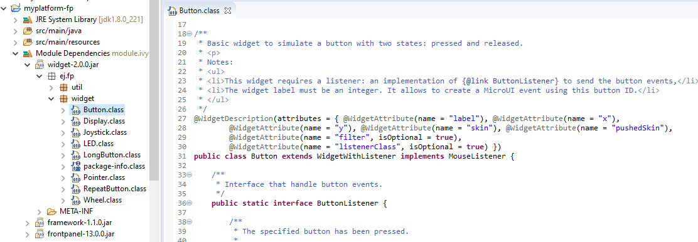

.. include:: uiReplaces.rst

.. _section_ui_simulation:

==========
Simulation
==========

Principle
=========

The graphical user interface uses the Front Panel mock (see :ref:`section_frontpanel`) and some extensions (widgets) to simulate the user interactions. It is the equivalent of the three embedded modules (Display, Input and LED) of the MicroEJ Platform (see :ref:`section_microui`).

The Front Panel enhances the development environment by allowing User Interface  applications to be designed and tested on the computer rather than on the target device (which may not yet be built). The mock interacts with the user's computer in two ways: 

-  output: LEDs, graphical displays
-  input: buttons, joystick, touch, haptic sensors

.. note:: This chapter completes the notions described in :ref:`section_frontpanel` chapter. 

Module Dependencies
===================

The Front Panel project is a regular MicroEJ Module project. Its module.ivy file should look like this example:

::

   <ivy-module version="2.0" xmlns:ea="http://www.easyant.org" xmlns:ej="https://developer.microej.com" ej:version="2.0.0"> 
   <info organisation="com.mycompany" module="examplePanel" status="integration" revision="1.0.0"/>      

      <configurations defaultconfmapping="default->default;provided->provided">
         <conf name="default" visibility="public" description="Runtime dependencies to other artifacts"/>
         <conf name="provided" visibility="public" description="Compile-time dependencies to APIs provided by the platform"/>
      </configurations>

      <dependencies>
         <dependency org="ej.tool.frontpanel" name="widget" rev="1.0.0"/>
      </dependencies>
   </ivy-module>

It depends at least on the Front Panel framework. This framework contains the Front Panel core classes. The dependencies can be reduced to:

::

   <dependencies>
      <dependency org="ej.tool.frontpanel" name="framework" rev="1.1.0"/>
   </dependencies>

To be compatible with Display module's Graphics Engine, the project must depend on an extension of Front Panel framework. This extension provides some interfaces and classes the Front Panel is using to target simulated display and input devices. The extension does not provide any widgets. It is the equivalent of the embedded Low Level API. It fetches by transitivity the Front Panel framework, so the Front Panel framework dependency does not need to be specified explicitly: 

::

   <dependencies>
      <dependency org="com.microej.pack.ui" name="ui-pack" rev="[UI Pack version]">
         <artifact name="frontpanel" type="jar"/>
      </dependency>
   </dependencies>

.. warning:: This extension is built for each UI pack version. By consequence, a Front Panel project is done for a platform built with the same UI pack. When the UI pack mismatch, some errors may occur during the Front Panel project export step, during the platform build, and/or during the application runtime. The current pack version is |UIPACKVERSION|.

The Front Panel extension does not provide any widgets. Some compatible widgets are available in a third library. The life cycle of this library is different than the UI pack's one. New widgets can be added to simulate new kind of displays, input devices, etc. This extension fetches by transitivity the Front Panel extension, so this extension dependency does not need to be specified explicitly: 

::

   <dependencies>
      <dependency org="ej.tool.frontpanel" name="widget" rev="2.0.0"/>
   </dependencies>

.. warning:: The minimal version ``2.0.0`` is required to be compatible with UI pack 13.0.0 and higher. By default, when creating a new Front Panel project, the widget dependency version is ``1.0.0``.

Source code for widgets is available by expanding the library from the project view.

   Front Panel Widgets

MicroUI Implementation
======================

As described :ref:`here<section_ui_low_level>`, the Front Panel uses an equivalent of embedded side's header files that implement MicroUI native methods.

.. figure:: images/ui_llapi_sim.*
   :alt: MicroUI Low Level
   :width: 100.0%
   :align: center

This set of classes and interfaces is available in the module ``com.microej.pack.ui#ui-pack``.
It offers the same capacity to override some built-in drawing algorithms (internal Graphics Engine drawing algorithms), to add some custom drawing algorithms, to manipulate the MicroUI concepts (GraphicsContext, Image, etc.) in the Front Panel project, etc.

* The interface ``ej.microui.display.LLUIDisplay`` represents the MicroUI Graphics Engine (MicroUI framework). It provides some methods to map MicroUI byte arrays in MicroUI Graphics Context objects, manipulate MicroUI colors, etc. An instance of this framework is available via the field ``Instance``. 
* The interface ``ej.microui.display.LLUIDisplayImpl`` all methods required by MicroUI implementation to be compatible with the MicroUI Display class implementation. See :ref:`section_ui_simulation_display`.
* The class ``ej.microui.display.LLUIPainter`` implements all MicroUI drawing natives. It defines some interfaces and classes to manipulate the MicroUI concepts (GraphicsContext, Image, etc.) in the Front Panel project. Like the embedded side, this class manages the synchronization with the Graphics Engine and delegates the drawing to the interface ``ej.microui.display.UIDrawing``. 
* Like the embedded side, the default implementation of the interface ``ej.microui.display.UIDrawing``: ``ej.microui.display.UIDrawing.UIDrawingDefault`` calls the internal Graphics Engine algorithms (software algorithms). Each algorithm can be overridden independently. 
* The classes in the package ``ej.drawing`` implement the native of the MicroUI extended library: `Drawing <https://repository.microej.com/modules/ej/api/drawing/>`_
* The classes in the package ``ej.microui.event`` manage the input events, see :ref:`section_ui_simulation_input`.
* The classes in the package ``ej.microui.led`` manage the LEDs.

.. _section_ui_simulation_display:

Widget Display
==============

The widget Display implements the interface ``ej.microui.display.LLUIDisplayImpl`` to be compatible with the implementation of the MicroUI class `Display <https://repository.microej.com/javadoc/microej_5.x/apis/ej/microui/display/Display.html>`_.

This widget manages:

* The simple or double buffering (default value): ``doubleBufferFeature=true|false``.
* The backlight (enabled by default): ``backlightFeature=true|false``.
* The non-rectangular displays: ``filter="xxx.png"``. Some displays can have another appearance (for instance: circular); the Front Panel can simulate using a filter (see :ref:`section_frontpanel_widget`). This filter defines the pixels inside and outside the whole display area. The filter image must have the same size as the rectangular display area. A display pixel at a given position will not be rendered if the pixel at the same position in the mask is fully transparent.
* The :ref:`standard<display_pixel_structure_standard>` pixel formats.
* The :ref:`driver-specific<display_pixel_structure_driver>` pixel formats: ``extensionClass="xxx"``. This class must be added in the Front Panel project and implement the interface ``ej.fp.widget.Display.DisplayExtension``.

.. _section_ui_simulation_customdrawing:

Custom Drawings
===============
   
Custom algorithms like the embedded side can replace the Graphics Engine drawing algorithms.
This chapter describes how to override the method ``fillRectangle()``.

1. Create an implementation of the interface ``ej.microui.display.UIDrawing.UiDrawingDefault``: ``MyDrawer``. 
2. Create an :ref:`empty widget<section_frontpanel_emptywidget>` to invoke the new implementation:

.. code-block:: java

   @WidgetDescription(attributes = { })
   public class Init extends Widget{
      @Override
      public void start() {
         super.start();
         LLUIPainter.setDrawer(new MyDrawer());
      }
   }

3. Invokes this widget in the ``.fp`` file:

.. code-block:: xml

   <frontpanel xmlns:xsi="http://www.w3.org/2001/XMLSchema-instance" xmlns="https://developer.microej.com"  xsi:schemaLocation="https://developer.microej.com .widget.xsd">
      <device name="STM32429IEVAL" skin="Board-480-272.png">
         <com.is2t.microej.fp.Init/>
         [...]
      </device>
   </frontpanel>

4. Implements the ``fillRectangle`` method like this:

.. code-block:: java

   @Override
   public void fillRectangle(MicroUIGraphicsContext gc, int x1, int y1, int x2, int y2) {

      // manage the clip
      if (gc.isClipEnabled() && !gc.isRectangleInClip(x1, y1, x2, y2)) {
         x1 = Math.max(x1, gc.getClipX1());
         x2 = Math.min(x2, gc.getClipX2());
         y1 = Math.max(y1, gc.getClipY1());
         y2 = Math.min(y2, gc.getClipY2());

         if (x2 < x1 || y2 < y1) {
            // nothing to render
            return;
         }
      }
      // clip disabled, or rectangle entirely fits the clip

      // get/create AWT objects
      Graphics2D src = (Graphics2D) ((BufferedImage) gc.getImage().getRAWImage()).getGraphics();
      Color color = new Color(gc.getRenderingColor());

      // fill rectangle
      src.setColor(color);
      src.fillRect(x1, y1, x2 - x1 + 1, y2 - y1 + 1);

      // update Graphics Engine's dirty area
      gc.setDrawingLimits(x1, y1, x2, y2);
   }

Explanations:

* The Front Panel framework is running over AWT. 
* The method ``gc.getImage()`` returns a ``ej.fp.Image``. It is the representation of a MicroUI Image in the Front Panel framework. The method ``gc.getImage().getRAWImage()`` returns the implementation of the Front Panel image on the J2SE framework: a AWT ``BufferedImage``. From this image, retrieve the AWT graphics.
* The MicroUI color (``gc.getRenderingColor()``) is converted in an AWT color.
* Before drawing, the MicroUI clip is checked (the MicroUI drawing can be outside the clip and/or the image itself).
* After drawing, the implementation updates the Graphics Engine dirty area by calling ``gc.setDrawingLimits()``.

.. note:: More details are available in LLUIPainter, UIDrawing, LLUIDisplay, and LLUIDisplayImpl classes.

New Drawings
============

The Front Panel framework allows the addition of custom drawing algorithms.
This chapter describes how to implement the method ``drawSomething()``.

.. note:: To add a custom drawing algorithm, it is strongly recommended to follow the same rules as the MicroUI drawings: a class that synchronizes the drawings with the Graphics Engine and another class that performs the drawing itself (like :ref:`section_ui_simulation_customdrawing`).

1. In the MicroEJ application, write the new native: 

.. code-block:: java

   private static void drawSomething(byte[] gc, int x, int y);
   
2. Call this function from a ``render`` method:

.. code-block:: java

   @Override
   public void render(GraphicsContext gc) {
      [...]
      drawSomething(gc.getSNIContext(), 15, 36);
      [...]
   }

3. In the Front Panel project, write the equivalent of ``LLUIPainter`` class:

.. code-block:: java

   public static void drawSomething(byte[] target, int x, int y) {
      LLUIDisplay graphicalEngine = LLUIDisplay.Instance;
      synchronized (graphicalEngine) {
         MicroUIGraphicsContext gc = graphicalEngine.mapMicroUIGraphicsContext(target);
         if (gc.requestDrawing()) {
            MyDrawer.Instance.drawSomething(gc, x, y);
         }
      }
   }

4.  In the Front Panel project, write the equivalent of ``UIDrawing`` interface, see :ref:`section_ui_simulation_customdrawing`:

.. code-block:: java

   public static void drawSomething(MicroUIGraphicsContext gc, int x, int y) {
      // 1- manage clip
      // 2- draw
      // 3- update Graphics Engine's dirty area
   }

   
.. note:: More details are available in LLUIPainter, UIDrawing, LLUIDisplay, and LLUIDisplayImpl classes.

.. _section_ui_simulation_input:

Inputs Extensions
=================

The input device widgets (button, joystick, touch, etc.) require a listener to know how to react on input events (press, release, move, etc.). The aim of this listener is to generate an event compatible with MicroUI `Event Generator <https://repository.microej.com/javadoc/microej_5.x/apis/ej/microui/event/EventGenerator.html>`_. Thereby, a button press action can become a MicroUI `Buttons <https://repository.microej.com/javadoc/microej_5.x/apis/ej/microui/event/generator/Buttons.html>`_ press event or a `Command <https://repository.microej.com/javadoc/microej_5.x/apis/ej/microui/event/generator/Command.html>`_ event or anything else. 

A MicroUI `Event Generator <https://repository.microej.com/javadoc/microej_5.x/apis/ej/microui/event/EventGenerator.html>`_ is known by its name. This name is fixed during the MicroUI static initialization (see :ref:`section_static_init`). To generate an event to a specific event generator, the widget has to use the event generator name as identifier. 

A Front Panel widget can:

* Force the behavior of an input action: the associated MicroUI `Event Generator <https://repository.microej.com/javadoc/microej_5.x/apis/ej/microui/event/EventGenerator.html>`_ type is hardcoded (`Buttons <https://repository.microej.com/javadoc/microej_5.x/apis/ej/microui/event/generator/Buttons.html>`_, `Pointer <https://repository.microej.com/javadoc/microej_5.x/apis/ej/microui/event/generator/Pointer.html>`_, etc.), the event is hardcoded (for instance: widget button press action may be hardcoded on event generator `Buttons <https://repository.microej.com/javadoc/microej_5.x/apis/ej/microui/event/generator/Buttons.html>`_ and on the event `pressed`). Only the event generator name (identifier) should be editable by the Front Panel extension project.
* Propose a default behavior of an input action: contrary to first point, the Front Panel extension project is able to change the default behavior. For instance a joystick can simulate a MicroUI `Pointer <https://repository.microej.com/javadoc/microej_5.x/apis/ej/microui/event/generator/Pointer.html>`_.
* Do nothing: the widget requires the Front Panel extension project to give a listener. This listener will receive all widgets action (press, release, etc.) and will have to react on it. The action should be converted on a MicroUI `Event Generator <https://repository.microej.com/javadoc/microej_5.x/apis/ej/microui/event/EventGenerator.html>`_ event or might be dropped.

This choice of behavior is widget dependant. Please refer to the widget documentation to have more information about the chosen behavior.

Heap Simulation
===============

Graphics Engine is using two dedicated heaps: for the images (see :ref:`section_image_loader_memory` ) and the external fonts (see :ref:`section_font_loader_memory`). Front Panel partly simulates the heaps usage.

* Images heap: Front Panel simulates the heap usage when the application is creating a `BufferedImage <https://repository.microej.com/javadoc/microej_5.x/apis/ej/microui/display/BufferedImage.html#>`_, when it loads and decodes an image (PNG, BMP, etc.) which is not a raw resource and when it converts an image in MicroEJ format in another MicroEJ format. However it does not simulate the external image copy in heap (see :ref:`section_image_external_memory`).
* External fonts heap: Front Panel does not simulate this heap (see :ref:`section_font_loader_memory`). There is no rendering limitation when application is using a font which is located outside CPU addresses ranges.

.. _fp_ui_decoder:

Image Decoders
==============

Front Panel uses its own internal image decoders when the associated modules have been selected (see :ref:`internal image decoders<image_external_decoder>`). Front Panel can add some additional decoders like the C-side for the embedded platform (see :ref:`external image decoders<image_external_decoder>`). However, the exhaustive list of additional decoders is limited (Front Panel is using the Java AWT ``ImageIO`` API). To add an additional decoder, specify the property ``hardwareImageDecoders.list`` in Front Panel configuration properties file (see :ref:`fp_ui_installation`) with one or several property values:

.. table:: Front Panel Additional Image Decoders

   +-----------------------------------------------------+-----------------+
   | Type                                                | Property value  |
   +=====================================================+=================+
   | Graphics Interchange Format (GIF)                   | gif             |
   +-----------------------------------------------------+-----------------+
   | Joint Photographic Experts Group (JPEG)             | jpeg or jpg     |
   +-----------------------------------------------------+-----------------+
   | Portable Network Graphics (PNG)                     | png             |
   +-----------------------------------------------------+-----------------+
   | Windows bitmap (BMP)                                | bmp             |
   +-----------------------------------------------------+-----------------+

The decoders list is comma (*,*) separated. Example:

::

   hardwareImageDecoders.list=jpg,bmp

Dependencies
============

-  MicroUI module (see :ref:`section_microui`),

-  Display module (see :ref:`section_display`): This module gives
   the characteristics of the graphical display that are useful for
   configuring the Front Panel.

.. _fp_ui_installation:

Installation
============

Front Panel is an additional module for MicroUI library. When the
MicroUI module is installed, install this module in order to be able to
simulate UI drawings on the Simulator. See :ref:`fp_installation` to install the module.

The properties file can additional properties:
   
-  ``hardwareImageDecoders.list`` [optional, default value is ""
   (*empty*)]: Defines the available list of additional image decoders
   provided by the hardware (see :ref:`fp_ui_decoder`). Use comma (',') to specify several decoders among this list: bmp, jpg, jpeg, gif, png. If empty or unspecified,
   no image decoder is added.

Use
===

Launch a MicroUI application on the Simulator to run the Front Panel.

..
   | Copyright 2008-2021, MicroEJ Corp. Content in this space is free 
   for read and redistribute. Except if otherwise stated, modification 
   is subject to MicroEJ Corp prior approval.
   | MicroEJ is a trademark of MicroEJ Corp. All other trademarks and 
   copyrights are the property of their respective owners.
