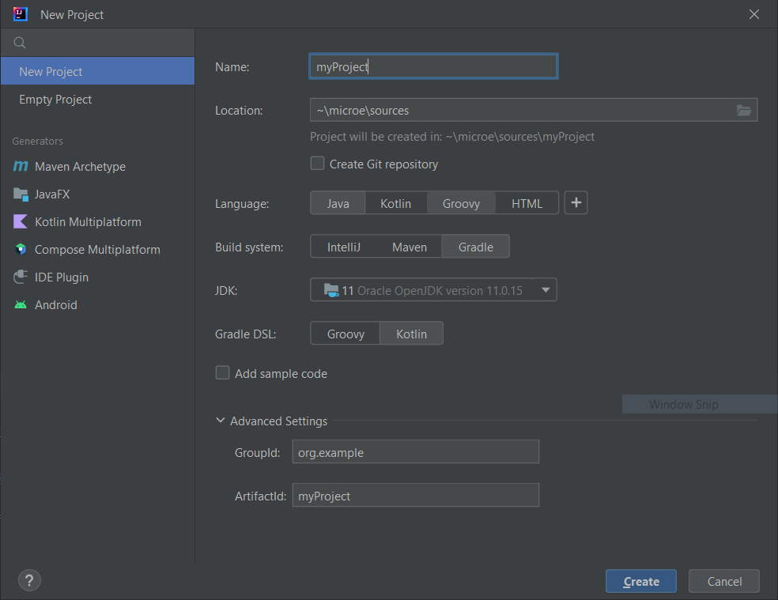

.. _sdk_6_create_project:

Create a Project
================

This chapter explains the different ways to create a new project.

.. note::
  The different project creation systems do not produce exactly the same project content and structure.
  Especially, the IntelliJ IDEA wizard produces a simple project whereas the CLI and Eclipse wizards create multi-projects builds.
  Both structures (single and multi projects) can be used, the recommended one depends on the context (components, size of the project, ...).
  Refer to `the official Gradle documentation <https://docs.gradle.org/current/userguide/multi_project_builds.html>`__ for more information.

.. _sdk_6_create_project_cli:

Command Line Interface
----------------------

The creation of a project can be done via the command line interface via the Gradle ``init`` task.
This task guides you through multiple steps to configure and select the project template to use.
Refer to `the official documentation <https://docs.gradle.org/current/userguide/build_init_plugin.html>`__ for the full list of templates and options.

In order to create a MicroEJ project, the best way is to use the ``application`` template:

- in a new empty directory, execute the command ``gradle init``.
- select the ``application`` project type.
- select the ``Java`` implementation language.
- for the step ``Split functionality across multiple subprojects?``, select ``no``.
- select your prefered build script DSL language.
- decide if you want to use Gradle new APIs and behavior in your build script.
  If you are new to Gradle, choose 'no'.
- for the test framework, select ``JUnit 4``.
- choose the name of the project (defaults to the name of the parent directory).
- choose the package name for the source files.

The created project is a multi-project build containing a root project and a single subproject (named ``app``).
The ``app`` subproject is a standard Java Application project (Gradle ``java`` plugin),
so it must be updated to be a MicroEJ project:

- open the project in your favorite editor.
- open the ``app/build.gradle.kts`` file.
- erase its whole content.
- add the MicroEJ plugin, depending on the module nature you want to build, for example for an Add-On Library::

    plugins {
        id("com.microej.gradle.library") version "0.3.1"
    }

  or for an Application::

    plugins {
        id("com.microej.gradle.application") version "0.3.1"
    }

  .. note::
    The ``java`` plugin must not be added since it is automatically applied by the MicroEJ plugin.

  Refer to the page :ref:`sdk6_module_natures` for a complete list of the available MicroEJ natures and their corresponding plugins.

- declare the dependencies required by your project in the ``dependencies`` block. For example::

      dependencies {
          implementation("ej.api:edc:1.3.5")
      }

- delete the test class in the folder ``app/src/test/java``.

Eclipse
-------

.. warning::
   Only the IntelliJ IDEA IDE is fully supported for the moment, so it is recommend to use it instead of Eclipse.
   The support of Eclipse will come soon. 

..
  The creation of a project with Eclipse is done as follows:

  - click on ``File`` > ``New`` > ``Project...``.
  - select the project type ``Gradle > Gradle Project`` and click on the ``Next`` button.

  .. figure:: images/eclipse-create-gradle-project-01.png
    :alt: Project Type Selection in Eclipse
    :align: center
    :scale: 70%

    Project Type Selection in Eclipse

  - fill the name of the project in the ``Name`` field and click on the ``Next`` button.

  .. figure:: images/eclipse-create-gradle-project-02.png
    :alt: Project root folder in Eclipse
    :align: center
    :scale: 70%

    Project root folder in Eclipse

  - in the ``Options`` screen, leave the default values and click on the ``Next`` button.
  - click on the ``Next`` button and finally on the ``Finish`` button.

    

  The project created by Eclipse is a multi-project build containing a root project and a single subproject (named ``lib``).
  The ``lib`` subproject is a standard Java Library project (Gradle ``java-library`` plugin).
  The ``build.gradle.kts`` file of the ``lib`` subproject has to be updated to make it a MicroEJ project:

  ...

  **OR**

The Eclipse creation wizard for Gradle Project is quite limited, 
and produces a multi-project build with a Java Library subproject (Gradle ``java-library`` plugin).
It requires several modifications to make it a MicroEJ project.
Therefore, the recommended way to create a project is to use the :ref:`Gradle CLI <sdk_6_create_project_cli>`,
then to :ref:`import the project in Eclipse <sdk_6_import_project_eclipse>`.

IntelliJ IDEA
-------------

The creation of a project with IntelliJ IDEA is done as follows:

- click on ``File`` > ``New`` > ``Project...``.
- fill the name of the project in the ``Name`` field.
- select the location of the project in the ``Location`` field.
- select the language ``Java`` in the ``Language`` field.
- select ``Gradle`` for the ``Build system`` field.
- select your prefered language for the field ``Gradle DSL``.
- check the ``Add sample code`` checkbox.
- click on ``Create`` button.

   Project Creation in IntelliJ IDEA

The project created by IntelliJ IDEA is a standard Java project (Gradle ``java`` plugin).
The ``build.gradle.kts`` file has to be updated to make it a MicroEJ project:

- use the MicroEJ Gradle plugin, depending on the module nature you want to build, for example for an Add-On Library::

    plugins {
        id("com.microej.gradle.library") version "0.3.1"
    }

  Refer to the page :ref:`sdk6_module_natures` for a complete list of the available MicroEJ natures and their corresponding plugins.

- remove the ``repositories`` block.
- replace the content of the ``dependencies`` block by the dependencies required by your project. For example::

    dependencies {
        implementation("ej.api:edc:1.3.5")
    }

- remove the block related to the ``test`` task.

.. note::
   A message ``Project JDK is not defined`` is displayed at the top of the editor.
   This message can be ignored.
   It warns that the project does not have a JDK defined, which is expected since a MicroEJ project does not rely on a standard JDK.

   .. figure:: images/intellij-project-sdk-message.png
      :alt: Project JDK message in IntelliJ IDEA
      :align: center
      :scale: 70%

      Project JDK message in IntelliJ IDEA

..
   | Copyright 2022, MicroEJ Corp. Content in this space is free 
   for read and redistribute. Except if otherwise stated, modification 
   is subject to MicroEJ Corp prior approval.
   | MicroEJ is a trademark of MicroEJ Corp. All other trademarks and 
   copyrights are the property of their respective owners.
