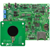
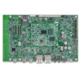
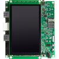
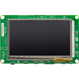

.. _sdk_6_getting_started:

Getting Started
===============

      .. figure:: images/gettingStarted/getting-started_DOC_1200x297.jpg
         :alt: Getting Started Banner
         :align: center
         :scale: 100%

Welcome! Follow this step-by-step instructional guide to get started with MICROEJ SDK (Software Development Kit) and MICROEJ VEE (Virtual Execution Environment). Learn how to create apps and build a VEE Port by taking advantage of interactive tutorials and extensive technical documentation.

Before you get started, be sure to understand the fundamentals about `MICROEJ VEE <https://developer.microej.com/microej-vee-virtual-execution-environment/>`_, and take a look at our `glossary page <https://docs.microej.com/en/latest/glossary.html>`_ to familiarize yourselves with MicroEJ key terminology.

What you will do:

- Choose a starter kit
- Install MICROEJ SDK
- Watch the Get Started Tutorial
- Get Started with MICROEJ VEE

What you will learn:

- How to run an app using a `Virtual Device <https://developer.microej.com/virtual-devices/>`_.
- How to run an app on a real development board.
- Discover more examples and guided tutorials to go further with MicroEJ technology.

.. raw:: html

        

                <video width="960" height="540" poster="https://developer.microej.com/wp-content/uploads/2024/03/hellomicroej_thirddraft_preview.jpg" controls="controls" >
                        <source src="https://repository.microej.com/packages/videos/gettingStartedSDK6_v9.0_opt.mp4" type="video/mp4">
                </video>
        

VEE Ports for Evaluation
------------------------

These VEE ports are ideal to evaluate MicroEJ's technology. They include the latest software components.

.. list-table::
   :widths: 50 50
   :header-rows: 0

   * - |logo_nxp|
     - |image_imx93|
       :ref:`i.MX 93 Evaluation Kit <sdk_6_getting_started_imx93>`
   * - |logo_nxp|
     - |image_rt1170|
       :ref:`i.MX RT1170 Evaluation Kit <sdk_6_getting_started_imxrt1170>`
   * - |logo_st|
     - |image_stm32f7508|
       :ref:`STM32F7508-DK Evaluation Kit <sdk_6_getting_started_stm32f7508>`

.. toctree::
   :hidden:

   gettingStartedIMXRT1170
   gettingStartedSTM32F7508
   
VEE Port Examples
-----------------

These VEE ports are provided as-is. They can include libraries that are not the latest version.

.. list-table::
   :widths: 50 50
   :header-rows: 0

   * - |logo_nxp|
     - |image_rt595|
       :ref:`i.MX RT595 Evaluation Kit <sdk_6_getting_started_imxrt595>`

All VEE Port source code examples can be found at `GitHub <https://github.com/MicroEJ/?q=VEE&type=all&language=&sort=>`_.

.. toctree::
   :hidden:

   gettingStartedIMX93
   gettingStartedIMXRT1170
   gettingStartedSTM32F7508
   gettingStartedIMXRT595

..
   | Copyright 2008-2024, MicroEJ Corp. Content in this space is free 
   for read and redistribute. Except if otherwise stated, modification 
   is subject to MicroEJ Corp prior approval.
   | MicroEJ is a trademark of MicroEJ Corp. All other trademarks and 
   copyrights are the property of their respective owners.
