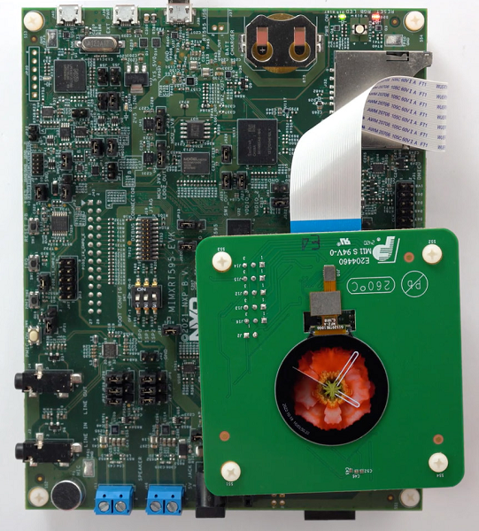
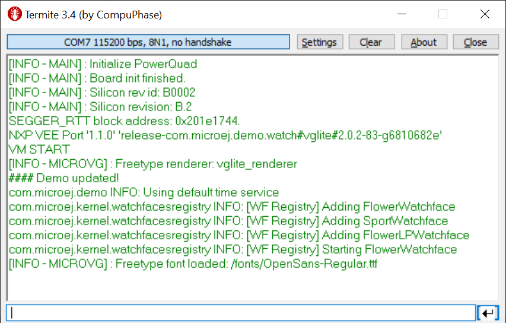

.. _sdk_6_getting_started_imxrt595:

i.MX RT595 EVK
==============

During this Getting Started, you will learn to run an application on the Virtual Device and on the Device using the MicroEJ SDK 6.

Prerequisites
-------------

.. note::
  
   This Getting Started has been tested on Windows 10 & 11.

To follow this Getting Started, all you need is: 

* :guilabel:`Demo-Wearable-VG` MicroEJ Application will be used in this Getting Started. 
  Please contact :ref:`our support team <get_support>` to get the code for this demo. It will soon be released publicly.
* An Internet connection to access Github repositories & MicroEJ Central Repository.
* i.MX RT595 EVK board, available `here <https://www.nxp.com/design/development-boards/i-mx-evaluation-and-development-boards/i-mx-rt595-evaluation-kit:MIMXRT595-EVK>`__.
* G1120B0MIPI display panel, available `here <https://www.nxp.com/part/G1120B0MIPI>`__.

Environment Setup
-----------------

To follow this Getting Started, you need to install: 

* MicroEJ SDK 6.
* A GNU ARM Embedded Toolchain, Cmake and Make are needed to build the BSP.
* LinkServer tool to flash the board.

Install MicroEJ SDK 6
^^^^^^^^^^^^^^^^^^^^^

Install MicroEJ SDK 6 by following :ref:`sdk_6_install` instructions. 
IntelliJ IDEA is used on this Getting Started but feel free to use your favorite IDE.

Install the C toolchain
^^^^^^^^^^^^^^^^^^^^^^^

The C toolchain must be installed, it is composed of the GNU ARM Embedded Toolchain, CMake and Make.

.. note::
  
   This Getting Started has been tested with the following configuration:

   - GNU ARM Embedded Toolchain version ``10.3 2021.10``.
   - CMake version ``3.26.5``.
   - Make version ``3.81``.

   Later versions may or may not work, and may need modification to the Getting Started steps.

Install GNU ARM Embedded Toolchain 
""""""""""""""""""""""""""""""""""

The toolchain is the `GNU ARM Embedded Toolchain <https://developer.arm.com/downloads/-/gnu-rm>`__. 

At the end of the installation, it will ask you to complete the Setup of the wizard, choose the following options: 

      .. figure:: images/getting-started-arm-gcc-installation.png
         :alt: Import demo application
         :align: center
         :scale: 70%

Once installed, ``ARMGCC_DIR`` must be set as an environment variable and point to the toolchain directory. To do so: 

* Open the :guilabel:`Edit the system environment variables` application on Windows.
* Click on the :guilabel:`Environment Variables...` button.
* Click on the :guilabel:`New...` button under the :guilabel:`User variables` section.
* Set :guilabel:`Variable Name` to ``ARMGCC_DIR``.
* Set :guilabel:`Variable Value` to the toolchain directory (e.g. ``C:\Program Files (x86)\GNU Arm Embedded Toolchain\10 2021.10``).
* Click on the :guilabel:`Ok` button until it closes :guilabel:`Edit the system environment variables` application.

Install CMake
"""""""""""""

`CMake <https://cmake.org/download/>`__ is the application used by the build system to generate the firmware.

During the installation, it will ask you if you wish to add CMake to your system Path, add it at least to the current user system path.
If you missed it, you can manually add ``CMake/bin`` folder to your path.

Install Make
""""""""""""

`Make <https://gnuwin32.sourceforge.net/packages/make.htm>`__ is the tool that will generate the executable based on the files generated by CMake. It will also be used to flash the board. 
Under :guilabel:`Download` section, you can select the Setup program for the complete package, except sources. 

By default, it will automatically add Make to your path.
If not, you can manually add ``GnuWin32\bin`` folder to your path.

Install the flashing tool
^^^^^^^^^^^^^^^^^^^^^^^^^

.. note::
  
   This Getting Started has been tested with LinkServer version ``1.2.45``. 

   Later versions may or may not work, and may need modification to the Getting Started steps.

`LinkServer <https://www.nxp.com/design/software/development-software/mcuxpresso-software-and-tools-/linkserver-for-microcontrollers:LINKERSERVER>`__ is needed to flash the board.

Once installed, ``LinkServer_xxx/binaries`` folder must be set on your Path. To do so: 

* Open the :guilabel:`Edit the system environment variables` application on Windows.
* Click on the :guilabel:`Environment Variables...` button.
* Select :guilabel:`Path` variable under the :guilabel:`User variables` section and edit it.
* Click on :guilabel:`New` and point to the ``binaries`` folder located where you installed LinkServer (e.g. ``nxp/LinkServer_1.2.45/binaries``).

Set up the MicroEJ Application on your IDE
------------------------------------------

Import the project
^^^^^^^^^^^^^^^^^^

The first step is to import the :guilabel:`Demo-Wearable-VG` MicroEJ Application into your IDE: 

.. note::
  
   If you are using another IDE than IntelliJ IDEA, please have a look at :ref:`sdk_6_import_project` section.

* If you are in the Welcome Screen, click on the :guilabel:`Open` button. Otherwise click either on :guilabel:`File` > :guilabel:`Open...` or on :guilabel:`File` > :guilabel:`New` > :guilabel:`Project From Existing Sources...`.
* Select the ``Demo-Wearable-VG`` directory located where you downloaded it and click on the :guilabel:`OK` button.

      .. figure:: images/getting-started-import-demo-application.png
         :alt: Import demo application
         :align: center
         :scale: 70%

* If you are asked to choose a project model, select :guilabel:`Gradle`. 

      .. raw:: html

         

            <table>
               <tr>
                  <td style="width:50%;text-align:center;vertical-align:middle;" alt="Project Model Selection when Opening in IntelliJ IDEA">
                     
                  </td>
                  <td style="width:50%;text-align:center;vertical-align:middle;" alt="Project Model Selection when Importing in IntelliJ IDEA">
                     
                  </td>
               </tr>
               <tr>
                  <td style="width:50%;text-align:center;font-size:18px;font-style:italic;">
                     Fig 1. Project Model Selection when Opening in IntelliJ IDEA
                  </td>
                  <td style="width:50%;text-align:center;font-size:18px;font-style:italic;">
                     Fig 2. Project Model Selection when Importing in IntelliJ IDEA
                  </td>
               </tr>
            </table>
         

      .. |image1| image:: images/intellij-import-gradle-project-01.png
      .. |image2| image:: images/intellij-import-gradle-project-02.png

* Click on the :guilabel:`Create` button.

The Gradle project should now be imported in IntelliJ IDEA, your workspace contains the following projects: 

      .. figure:: images/getting-started-workspace-view.png
         :alt: Workspace view
         :align: center
         :scale: 70%

.. _sdk_6_getting_started_run_virtual_device:

Run an application on the Virtual Device
----------------------------------------

In order to execute the :guilabel:`Demo-Wearable-VG` Application on the Virtual Device, the SDK provides the Gradle :guilabel:`runOnSimulator` task. 

.. note::
  
   If you are using another IDE than IntelliJ IDEA, please have a look at :ref:`sdk_6_run_on_simulator` section.

* Double-click on the :guilabel:`runOnSimulator` task in the Gradle tasks view. It may takes few seconds.

      .. figure:: images/getting-started-runOnSimulator.png
         :alt: runOnSimulator task
         :align: center
         :scale: 70%

The Virtual Device starts and executes the :guilabel:`Demo-Wearable-VG` application.

      .. figure:: images/getting-started-virtual-device.png
         :alt: Virtual Device
         :align: center
         :scale: 70%

.. note::
  
   If you want to know more about the use of the :guilabel:`Demo-Wearable-VG`, please have a look at its `Readme <https://github.com/MicroEJ/Demo-Wearable-VG/blob/master/watch-vg/README.md>`__.

Run an application on i.MX RT595 EVK
------------------------------------

To deploy :guilabel:`Demo-Wearable-VG` application on your board, you will have to:

* Get an :ref:`Evaluation License <sdk_eula>`
* Build the Executable
* Flash the board

Build the Executable for i.MX RT595 EVK
^^^^^^^^^^^^^^^^^^^^^^^^^^^^^^^^^^^^^^^

In order to build the Executable of the :guilabel:`Demo-Wearable-VG` Application, the SDK provides the Gradle :guilabel:`buildExecutable` task.

.. note::
  
   If you are using another IDE than IntelliJ IDEA, please have a look at :ref:`sdk_6_build_executable` section.
   Come back on this page if you need to activate an Evaluation License.

* Double-click on the :guilabel:`buildExecutable` task in the Gradle tasks view.
* The build stops with a failure.
* Go to the top project in the console view and scroll up to get the following error message:

      .. figure:: images/getting-started-console-output-license-uid.png
         :alt: Console Output License UID
         :align: center
         :scale: 70%

* Copy the UID. It will be required to activate your Evaluation license.

Request your Evaluation License:

* Request your Evaluation license by following the :ref:`evaluation_license_request_activation_key` instructions. You will be asked to fill the machine UID you just copied before.

* When you have received your activation key by email, drop it in the license directory by following the :ref:`evaluation_license_install_license_key` instructions (drop the license key zip file to the ``~/.microej/licenses/`` directory).

Now your Evaluation license is installed, you can relaunch your application build by double-clicking on the :guilabel:`buildExecutable` task in the Gradle tasks view. It may takes some time.

The gradle task deploys the MicroEJ application in the BSP and then builds the BSP using Make.

The :guilabel:`Demo-Wearable-VG` application is built and ready to be flashed on i.MX RT595 EVK once the hardware setup is completed.

Hardware Setup
^^^^^^^^^^^^^^

      .. figure:: images/getting-started-hardware-setup.png
         :alt: Hardware Setup
         :align: center
         :scale: 70%

Setup the i.MX RT595 EVK:

* Check that the dip switches (SW7) are set to OFF, OFF and ON (ISP0, ISP1, ISP2).
* Ensure jumpers JP18 and JP19 are closed.
* Remove jumper JP4.
* Connect the micro-USB cable to J40 to power the board.

The USB connection is used as a serial console for the SoC, as a CMSIS-DAP debugger, and as a power input for the board.

A COM port is automatically mounted when the board is plugged into a computer using a USB cable. All board logs are available through this COM port.

The COM port uses the following parameters:

.. list-table::
   :header-rows: 1
   :widths: 10 10 10 10 10

   * - Baudrate
     - Data bits
     - Parity bits
     - Stop bits
     - Flow control
   * - 115200
     - 8
     - None
     - 1
     - None

You can have a look at your application logs with an RS232 Terminal (e.g. `Termite <https://www.compuphase.com/software_termite.htm>`__).

Flash the application on the i.MX RT595 EVK board
^^^^^^^^^^^^^^^^^^^^^^^^^^^^^^^^^^^^^^^^^^^^^^^^^

In order to flash the :guilabel:`Demo-Wearable-VG` Application on i.MX RT595 EVK, the application provides the Gradle :guilabel:`runOnDevice` task.

.. note::
  
   If you are using another IDE than IntelliJ IDEA, please have a look at :ref:`sdk_6_run_on_device` section.

* Double-click on the :guilabel:`runOnDevice` task in the Gradle tasks view. It may takes some time.

      .. figure:: images/getting-started-runOnDevice.png
         :alt: runOnDevice task
         :align: center
         :scale: 70%

Once the firmware is flashed, you should see the :guilabel:`Demo-Wearable-VG` running on your board.      

.. raw:: html

   

      <table>
         <tr>
            <td style="width:50%;text-align:center;vertical-align:middle;" alt="Application running on i.MXRT595-EVK">
               
            </td>
            <td style="width:50%;text-align:center;vertical-align:middle;" alt="Termite Application Output">
               
            </td>
         </tr>
         <tr>
            <td style="width:50%;text-align:center;font-size:18px;font-style:italic;">
               Fig 1. Application running on i.MXRT595-EVK
            </td>
            <td style="width:50%;text-align:center;font-size:18px;font-style:italic;">
               Fig 2. Application logs on Termite
            </td>
         </tr>
      </table>
   

Modify the Java application
---------------------------

With MicroEJ, it is easy to modify and test your Java application on the Virtual Device.

For example, we could modify the color of the date on the Flower Watchface that is shown at the startup of the application.

* Open :guilabel:`FlowerWatchface.java` file located in the :guilabel:`watchface-flower/src/main/java/com/microej/demo/watch/watchface/flower` folder.
* On the :guilabel:`renderDate` method, replace the following line:

.. code:: 

   g.setColor(style.getColor());

by

.. code:: 

   g.setColor(Colors.GREEN);

* Follow :ref:`sdk_6_getting_started_run_virtual_device` instructions to launch the modified application on the Virtual Device.

Here is the modified application running in simulation: 

      .. figure:: images/getting-started-virtual-device-modified.png
         :alt: Virtual Device
         :align: center
         :scale: 70%

..
   | Copyright 2008-2023, MicroEJ Corp. Content in this space is free 
   for read and redistribute. Except if otherwise stated, modification 
   is subject to MicroEJ Corp prior approval.
   | MicroEJ is a trademark of MicroEJ Corp. All other trademarks and 
   copyrights are the property of their respective owners.