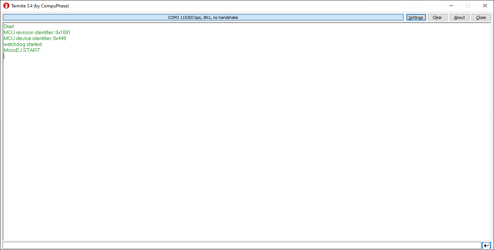

.. _sdk_6_getting_started_stm32f7508:

STM32F7508-DK Evaluation Kit
============================

During this Getting Started, you will learn to:

* run an Application on the STM32F7508-DK Evaluation Kit Virtual Device,
* run the same Application on your STM32F7508-DK Evaluation Kit.

In case you are not familiar with MicroEJ, please visit `Discover MicroEJ <https://developer.microej.com/discover-microej/>`__ to understand the principles of our technology.

Prerequisites
-------------

.. note::
  
   This Getting Started has been tested on Windows 10. Also note that examples used in this Getting Started could depend on older tools and libraries. Most notably the MicroEJ Gradle plugin could be an older version, implying syntax changes.

This Getting Started is separated in two main parts.

The first part consists of running an MVC demo application on the Virtual Device. All you need is:

* An Internet connection to access Github repositories & :ref:`Module Repositories <module_repositories>`.
* MICROEJ SDK 6 (installed during :ref:`Environment Setup <sdk_6_getting_started_stm32f7508dk_environment_setup>`).
* The Example-Foundation-Libraries samples at GitHub. Download or clone the project `here <https://github.com/MicroEJ/Example-Foundation-Libraries/tree/51.0.0>`__.

The second part consists of running the same demo application on your device. For that you will need:

* STM32F7508-DK Evaluation Kit, available `here <https://www.st.com/en/evaluation-tools/stm32f7508-dk.html>`__.
* You will be guided on how to install STM32CubeIDE later.

.. _sdk_6_getting_started_stm32f7508dk_environment_setup:

Environment Setup
-----------------

To follow this Getting Started, you need to: 

* Install MICROEJ SDK 6.
* Get the Example-Foundation-Libraries from GitHub.

Install MICROEJ SDK 6
^^^^^^^^^^^^^^^^^^^^^

Install MICROEJ SDK 6 by following :ref:`sdk_6_install` instructions. 
Android Studio Hedgehog is used on this Getting Started but feel free to use your favorite IDE.

Set up the Application on your IDE
----------------------------------

Import the Project
^^^^^^^^^^^^^^^^^^

The first step is to import the Application into your IDE: 

.. note::
  
   If you are using another IDE than Android Studio, please have a look at :ref:`sdk_6_import_project` section.

* If you are in the Welcome Screen, click on the :guilabel:`Open` button. Otherwise click either on :guilabel:`File` > :guilabel:`Open...`.
* Select the ``Example-Foundation-Libraries`` directory located where you downloaded it and click on the :guilabel:`OK` button.

      .. figure:: images/gettingStarted/STM32F7508DK/getting-started-import-mvc-application.png
         :alt: Import demo application
         :align: center
         :scale: 70%

The Gradle project should now be imported in Android Studio, your workspace contains the following project in the :guilabel:`Projects` view: 

      .. figure:: images/gettingStarted/STM32F7508DK/getting-started-workspace-view.png
         :alt: Workspace view
         :align: center
         :scale: 70%

.. _sdk_6_getting_started_stm32f7508dk_eula:

Accept the MICROEJ SDK EULA
---------------------------

You may have to accept the SDK EULA if you didn't already do, please have a look at :ref:`sdk_6_eula_acceptation`.

.. _sdk_6_getting_started_stm32f7508dk_run_virtual_device:

Run an Application on the Virtual Device
----------------------------------------

We will be using the :guilabel:`microui.mvc` Application as the sample to test the VEE port simulation execution (you can choose another example it'll work similarly). In order to execute the :guilabel:`microui.mvc` Application on the Virtual Device, the SDK provides the Gradle :guilabel:`runOnSimulator` task. 

.. note::
  
   If you are using another IDE than Android Studio, please have a look at :ref:`sdk_6_run_on_simulator` section.

* Double-click on the :guilabel:`runOnSimulator` task in the Gradle tasks view. It may take few seconds.

      .. figure:: images/gettingStarted/STM32F7508DK/getting-started-runOnSimulator.png
         :alt: runOnSimulator task
         :align: center
         :scale: 70%

The Virtual Device starts and executes the :guilabel:`microui.mvc` application.

      .. figure:: images/gettingStarted/STM32F7508DK/getting-started-virtual-device.png
         :alt: Virtual Device
         :align: center
         :scale: 70%

.. figure:: images/gettingStarted/well-done-mascot.png
   :alt: Well Done
   :align: center
   :scale: 70%

Well done !
-----------

Now you know how to run an application on a Virtual Device.

If you want to learn how to run an application on your STM32F7508-DK Evaluation Kit, you can continue this Getting Started: :ref:`Run an Application on STM32F7508-DK Evaluation Kit <sdk_6_getting_started_stm32f7508dk_run_on_device>`.

Otherwise, learn how to :ref:`Modify the Java Application <sdk_6_getting_started_stm32f7508dk_modify_java_application>`.

.. _sdk_6_getting_started_stm32f7508dk_run_on_device:

Run an Application on STM32F7508-DK Evaluation Kit
--------------------------------------------------

To deploy :guilabel:`microui.mvc` application on your board, you will have to:

* Setup your Environment (IDE, flashing-tool, hardware setup).
* Request a 30 days :ref:`Evaluation License <sdk_eula>` and install an activation key.
* Build the Executable.
* Flash the board.

Environment Setup
^^^^^^^^^^^^^^^^^

This chapter takes approximately one hour and will take you through the steps to set up your board and build the BSP.

Install the STM32CubeIDE software
"""""""""""""""""""""""""""""""""

Please install the following:

* The STM32CubeIDE version 1.9.0 for STM32F7508-DK, available `here <https://www.st.com/en/development-tools/stm32cubeide.html>`__.
* The STM32CubeProgrammer utility program, available `here <https://www.st.com/en/development-tools/stm32cubeprog.html>`__.

Be aware that we need the 1.9.0 version of the STM32CubeIDE, also please install the IDE and programmer to the default installation folders, it will simplify future steps.

Hardware Setup
""""""""""""""

* Check the jumpers configuration on JP1, you only want the :guilabel:`5V link` jumper to be bridged.
* Connect the micro-USB cable to CN14 to power the board.

The USB connection is used as a serial link, as a ST-Link probe and as a power input for the board.

The COM port uses the following parameters:

.. list-table::
   :header-rows: 1
   :widths: 10 10 10 10 10

   * - Baudrate
     - Data bits
     - Parity bits
     - Stop bits
     - Flow control
   * - 115200
     - 8
     - None
     - 1
     - None

You can have a look at your application logs with an RS232 Terminal (e.g. `Termite <https://www.compuphase.com/software_termite.htm>`__).

Congratulations, you have finished the setup of your environment. You are now ready to discover how to build and flash a MicroEJ application.

Build the Executable for the STM32F7508-DK Evaluation Kit
^^^^^^^^^^^^^^^^^^^^^^^^^^^^^^^^^^^^^^^^^^^^^^^^^^^^^^^^^

In order to build the Executable of the :guilabel:`microui.mvc` Application, the SDK provides the Gradle :guilabel:`buildExecutable` task.

.. note::
  
   If you are using another IDE than Android Studio, please have a look at :ref:`sdk_6_build_executable` section.
   Come back on this page if you need to activate an Evaluation License.

* Double-click on the :guilabel:`buildExecutable` task in the Gradle tasks view.
* The build stops with a failure.
* Go to the top project in the console view and scroll up to get the following error message:

      .. figure:: images/gettingStarted/STM32F7508DK/getting-started-console-output-license-uid.png
         :alt: Console Output License UID
         :align: center
         :scale: 70%

* Copy the UID. It will be required to activate your Evaluation license.

Request your Evaluation License:

* Request your Evaluation license by following the :ref:`evaluation_license_request_activation_key` instructions. You will be asked to fill the machine UID you just copied before.

* When you have received your activation key by email, drop it in the license directory by following the :ref:`evaluation_license_install_license_key` instructions (drop the license key zip file to the ``~/.microej/licenses/`` directory).

Now your Evaluation license is installed, you can relaunch your application build by double-clicking on the :guilabel:`buildExecutable` task in the Gradle tasks view. It may takes some time.

The gradle task deploys the Application in the BSP and then builds the BSP using Make.

The :guilabel:`microui.mvc` application is built and ready to be flashed on STM32F7508-DK Evaluation Kit once the hardware setup is completed.

Flash the Application on the STM32F7508-DK Evaluation Kit
^^^^^^^^^^^^^^^^^^^^^^^^^^^^^^^^^^^^^^^^^^^^^^^^^^^^^^^^^

In order to flash the :guilabel:`microui.mvc` Application on the STM32F7508-DK Evaluation Kit, the application provides the Gradle :guilabel:`runOnDevice` task.

.. note::
  
   If you are using another IDE than Android Studio, please have a look at :ref:`sdk_6_run_on_device` section.

* Double-click on the :guilabel:`runOnDevice` task in the Gradle tasks view. It may takes some time.

      .. figure:: images/gettingStarted/STM32F7508DK/getting-started-runOnDevice.png
         :alt: runOnDevice task
         :align: center
         :scale: 70%

Once the firmware is flashed, you should see the :guilabel:`microui.mvc` running on your board.      

.. raw:: html

   

      <table>
         <tr>
            <td style="width:50%;text-align:center;vertical-align:middle;" alt="Application running on the STM32F7508-DK Evaluation Kit">
               
            </td>
            <td style="width:50%;text-align:center;vertical-align:middle;" alt="Termite Application Output">
               
            </td>
         </tr>
         <tr>
            <td style="width:50%;text-align:center;font-size:18px;font-style:italic;">
               Fig 1. Application running on the STM32F7508-DK Evaluation Kit
            </td>
            <td style="width:50%;text-align:center;font-size:18px;font-style:italic;">
               Fig 2. Application logs on Termite
            </td>
         </tr>
      </table>
   

.. |image3| image:: images/gettingStarted/STM32F7508DK/getting-started-stm32f7508dk-hardware-demo-running.png

.. _sdk_6_getting_started_stm32f7508dk_modify_java_application:

Modify the Java Application
---------------------------

With MicroEJ, it is easy to modify and test your Java application on the Virtual Device.

For example, we could modify the color used in the pie chart.

* Open the :guilabel:`PieView` file located in the :guilabel:`src/main/java/com/microej/example/foundation/microui/mvc` folder.
* The pie char color is set at line 12, replace the following line:

.. code:: 

   public static final int COLOR_CONTENT = 0x2fc19c;	// green

by

.. code:: 

   public static final int COLOR_CONTENT = 0x800080;	// purple

* Follow :ref:`sdk_6_getting_started_stm32f7508dk_run_virtual_device` instructions to launch the modified application on the Virtual Device.

Here is the modified application running in simulation: 

      .. figure:: images/gettingStarted/STM32F7508DK/getting-started-virtual-device-modified.png
         :alt: Virtual Device
         :align: center
         :scale: 70%

Going Further
-------------

You have now successfully executing a MicroEJ application on an embedded device, so what's next?

If you are application developer you can continue to explore MicroEJ's API and functionalities by running and studying our samples at GitHub:

.. list-table::
   :widths: 33 33 33
   :header-rows: 0

   * - Foundation Libraries
     - Eclasspath
     - IoT
   * - Description
     - Description
     - Description
   * - https://github.com/MicroEJ/Example-Foundation-Libraries
     - https://github.com/MicroEJ/Example-Eclasspath
     - https://github.com/MicroEJ/Example-IOT

You can also learn how to build bigger and better applications by reading our Application Developer Guide.

If you are an embedded engineer you could look at our VEE port examples at `Github <https://github.com/microej?q=vee&type=all&language=&sort=>`_. And to learn how create custom VEE ports you can read our VEE Porting Guide. 

You can also follow the Kernel Developer Guide for more information on our multi-applications framework or read about our powerful wearable solution called VEE Wear.

Last but not least you can choose to learn about specific topics by following one of our many tutorials ranging from how easily debug application to setting up a Continuous Integration process and a lot of things in between.

..
   | Copyright 2024, MicroEJ Corp. Content in this space is free 
   for read and redistribute. Except if otherwise stated, modification 
   is subject to MicroEJ Corp prior approval.
   | MicroEJ is a trademark of MicroEJ Corp. All other trademarks and 
   copyrights are the property of their respective owners.