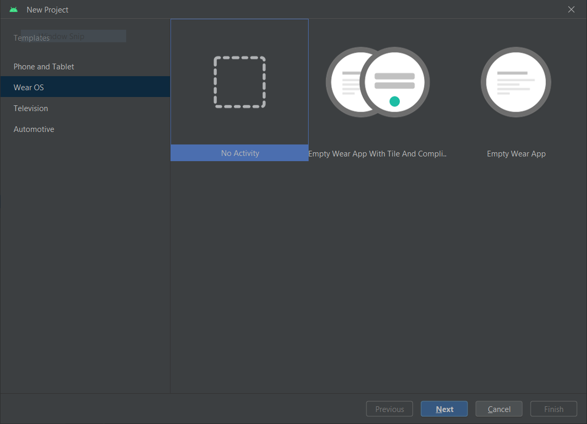
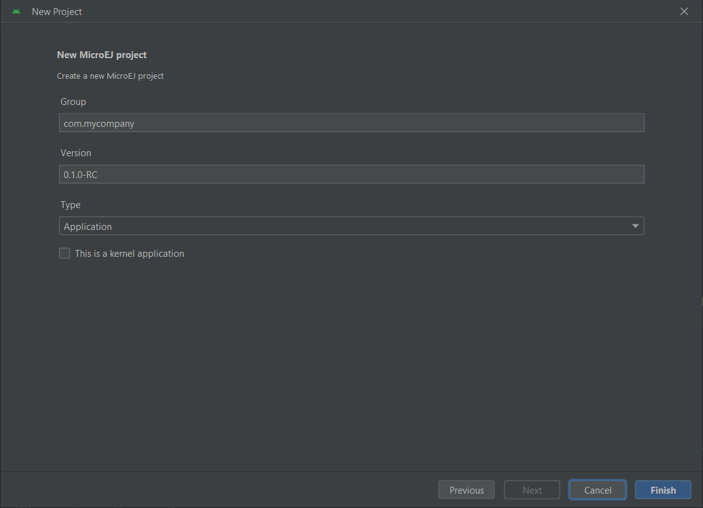
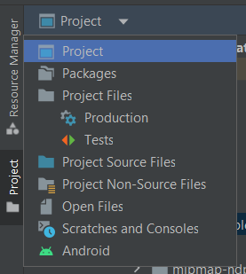

.. _sdk_6_getting_started_stm32f7508_multisandbox:

Multi-Sandbox STM32F7508-DK Discovery Kit
=========================================

This Getting Started will show you how to run Sandboxed Applications
on-top of a pre-built Multi-Sandbox Firmware for the STM32F7508-DK Discovery Kit.

During this Getting Started, you will learn to:

* create a Sandboxed Application,
* run a `Sandboxed Application <https://docs.microej.com/en/latest/ApplicationDeveloperGuide/sandboxedApplication.html>`__ on the Virtual Device,
* run the same Sandboxed Application on your STM32F7508-DK Discovery kit,
* run the `Demo Sandboxed Applications <https://github.com/MicroEJ/Demo-Sandboxed-Applications>`__.

In case you are not familiar with MicroEJ, please visit `Discover MicroEJ <https://developer.microej.com/discover-microej/>`__ to understand the principles of our technology.

Prerequisites
-------------

.. note::
  
   This Getting Started has been tested on Windows 10. 
   Also note that examples used in this Getting Started could depend on older tools and libraries. 
   Most notably our dependency manager plugin (using `Gradle <https://gradle.org/>`__) could be an older version.

TODO This Getting Started is separated in two main parts.

TODO The first part consists of running the Multi-Sandbox Firmware on the STM32F7508-DK Discovery Kit. All you need is:

For this Getting Started, all you need is:

* An Internet connection to access Github repositories & :ref:`Module Repositories <module_repositories>`.
* MICROEJ SDK 6 (installed during :ref:`Environment Setup <sdk_6_getting_started_stm32f7508dk_environment_setup>`).
* STM32F7508-DK Evaluation Kit, available `here <https://www.st.com/en/evaluation-tools/stm32f7508-dk.html>`__.
* A microSD card formatted as FAT32.
* An RS232 Terminal (e.g. `Termite <https://www.compuphase.com/software_termite.htm>`__).
* `STM32CubeProgrammer <https://www.st.com/en/development-tools/stm32cubeprog.html>`__ installed to flash a firmware on your board.

TODO The second part consists of running the same demo application on your device. For that you will need:

.. _sdk_6_getting_started_stm32f7508dk_environment_setup:

Environment Setup
-----------------

To follow this Getting Started, you need to: 

* Install MICROEJ SDK 6.
* `Download the Virtual Device <https://repository.microej.com/packages/green/2.0.0/vd/STM32F7508-DK/GREEN-STM32F7508-DK-2.0.0.zip>`__ ``GREEN-STM32F7508-DK-2.0.0.zip``.
  * Unzip ``GREEN-STM32F7508-DK-2.0.0.zip``.
* `Download the Multi-Sandbox Firmware <https://repository.microej.com/packages/green/2.0.0/firmwares/STM32F7508-DK/GREEN-STM32F7508-DK-2.0.0.out>`__ ``GREEN-STM32F7508-DK-2.0.0.out``.

If you want more informations about this Multi-Sandbox Firmware, the Javadoc and the Release notes are available in this `directory <https://repository.microej.com/packages/green/2.0.0/>`__.

Hardware Setup
""""""""""""""

* Check the jumpers configuration on JP1, you only want the :guilabel:`5V link` jumper to be bridged.
* Connect the micro-USB cable to CN14 to power the board.

The USB connection is used as a serial link, as a ST-Link probe and as a power input for the board.

The COM port uses the following parameters:

.. list-table::
   :header-rows: 1
   :widths: 10 10 10 10 10

   * - Baudrate
     - Data bits
     - Parity bits
     - Stop bits
     - Flow control
   * - 115200
     - 8
     - None
     - 1
     - None

You can have a look at your application logs with an RS232 Terminal (e.g. `Termite <https://www.compuphase.com/software_termite.htm>`__).

Congratulations, you have finished the setup of your environment. You are now ready to discover how to build and flash a MicroEJ application.

Deploy the Multi-Sandbox Firmware on your STM32F7508-DK Discovery Kit
"""""""""""""""""""""""""""""""""""""""""""""""""""""""""""""""""""""

Set up your STM32F7508-DK Discovery kit:

- Insert a microSD card (formatted as FAT32)in the board connector.
- Connect the Ethernet connector to the internet.
- Connect the USB connector of the board to your computer with 
  a mini-USB cable by following the 
  `Board Configuration <https://github.com/MicroEJ/VEEPort-STMicroelectronics-STM32F7508-DK/blob/2.3.1/stm32f7508_freertos-bsp/projects/microej/README.rst#mandatory-connectors>`__ 
  instructions.

Set up STM32CubeProgrammer:

- Open STM32CubeProgrammer.
- Go to ``External loaders`` tab in the menu.
- Select ``STM32F7508-DISCO`` board in the Available external loaders list.
- Click on ``Connect`` green button and wait until your board is connected.

Deploy the Multi-Sandbox Firmware:

- Go to ``Erasing & Programming`` tab in the menu of STM32CubeProgrammer.
- Point ``File path`` to your Multi-Sandbox Firmware (``GREEN-STM32F7508-DK-2.0.0.out`` file).
- Click on ``Start Program...``. Wait for the programming to finish.

.. note::
   
   Sometimes, the programming may fail. Repeat it until it succeeds.

Set up the logs output:

- Get the COM port where your board is connected 
  (if you are using Windows, you can open your Device Manager from the Windows menu).
- Set up a serial terminal (e.g. Termite) to see output logs from the board.
  Set it with the COM port retrieved previously and by following `Logs Output <https://github.com/MicroEJ/VEEPort-STMicroelectronics-STM32F7508-DK/blob/2.3.1/README.rst#logs-output>`__
  instructions.
- Click on the Reset button of the board by following the `Board Configuration <https://github.com/MicroEJ/VEEPort-STMicroelectronics-STM32F7508-DK/blob/2.3.1/stm32f7508_freertos-bsp/projects/microej/README.rst#mandatory-connectors>`__
  instructions.
- Get the IP address of your board. You will find it in the logs output:
  
.. figure:: images/gettingStarted/multiSandbox/STM32F7508DK/getting-started-stm32f7508dk-termite-green-fw-output.png
   :alt: Logs Output on Termite Serial Terminal
   :align: center
   :scale: 70%

The Multi-Sandbox Firmware is running on the STM32F7508-DK Discovery kit and is ready to be used.

Run a Sandboxed Application on the Virtual Device
-------------------------------------------------

Install MICROEJ SDK 6
"""""""""""""""""""""

Install MICROEJ SDK 6 by following :ref:`sdk_6_install` instructions. 
Android Studio Koala is used on this Getting Started but feel free to use your favorite IDE.

Accept the MICROEJ SDK EULA
"""""""""""""""""""""""""""

You may have to accept the SDK EULA if you didn't already do, please have a look at :ref:`sdk_6_eula_acceptation`.

Create the Sandboxed Application Project
""""""""""""""""""""""""""""""""""""""""

Create a new Sandboxed Application project as follows in Android Studio:

- Click on :guilabel:`File` > :guilabel:`New` > :guilabel:`Project...`.
- Select :guilabel:`Generic` > :guilabel:`New MicroEJ project`.

   Project Creation in Android Studio

- Click on the :guilabel:`Next` button.
- Fill the name of the project in the :guilabel:`Name` field.
- Fill the package name of the project in the :guilabel:`Package name` field.
- Select the location of the project in the :guilabel:`Save location` field.
- Keep the default Android SDK in the :guilabel:`Minimum SDK` field.
- Select :guilabel:`Kotlin` for the :guilabel:`Build configuration language` field.

.. note::
   Groovy build script DSL is not officially supported by the SDK, so the project created by the Wizard uses Kotlin regardless
   of the language selected by the user.
      
.. figure:: images/android-studio-create-project-02.png
   :alt: Project Creation in Android Studio
   :align: center
   :scale: 70%

   Project Creation in Android Studio

- Click on :guilabel:`Next` button.
- Fill the group of the artifact to publish in the :guilabel:`Group` field.
- Fill the version of the artifact to publish in the :guilabel:`Version` field.
- Select the project type in the drop-down list.
- Select the :guilabel:`Application` project type.
- Click on :guilabel:`Finish` button.

   Project Creation in Android Studio

- Change the view from :guilabel:`Android` to :guilabel:`Project` in the selectbox at the top of the project's files tree:

   Project View in Android Studio

.. note::
   If you do not use the last version of Android Studio, make sure that Gradle Wrapper uses at least Gradle version ``8.6``.
   Refer to the :ref:`sdk_6_create_project_gradle_wrapper` section for more information.

Run the Sandboxed Application on the Virtual Device
"""""""""""""""""""""""""""""""""""""""""""""""""""

The Multi-Sandbox Firmware and Virtual Device need to be provided to the :guilabel:`MyApplication` application:

- Open the ``app/build.gradle.kts`` file of the :guilabel:`MyApplication` application,
- Declare the dependency to the Multi-Sandbox Firmware and Virtual Device as follows:
  
.. code-block:: kotlin

   dependencies {
      ...
      //Uncomment the microejVee dependency to set the VEE Port or Kernel to use
      microejVee(files("C:\\[YOUR_PATH]\\GREEN-STM32F7508-DK-2.0.0\\virtualDevice", "C:\\[YOUR_PATH]\\GREEN-STM32F7508-DK-2.0.0.out"))
   }

In order to execute the :guilabel:`MyApplication` application on the Virtual Device, the SDK provides the Gradle :guilabel:`runOnSimulator` task. 

.. note::
  
   If you are using another IDE than Android Studio, please have a look at :ref:`sdk_6_run_on_simulator` section.

* Double-click on the :guilabel:`runOnSimulator` task in the Gradle tasks view. It may take few seconds.

      .. figure:: images/gettingStarted/STM32F7508DK/getting-started-runOnSimulator.png
         :alt: runOnSimulator task
         :align: center
         :scale: 70%

The Virtual Device starts and executes the :guilabel:`MyApplication` application.
The ``Hello World!`` message can be seen in the console:

      .. figure:: images/gettingStarted/multiSandbox/STM32F7508DK/getting-started-stm32f7508dk-myapplication-sim.png
         :alt: Virtual Device
         :align: center
         :scale: 70%

.. figure:: images/gettingStarted/well-done-mascot.png
   :alt: Well Done
   :align: center
   :scale: 70%

Well done !
-----------

Now you know how to run a Sandboxed Application on a Virtual Device.

If you want to learn how to run a Sandboxed Application on your STM32F7508-DK Discovery Kit, you can continue this Getting Started: :ref:`Run a Sandboxed Application on STM32F7508-DK Discovery Kit <sdk_6_getting_started_stm32f7508dk_run_on_device_multisandbox>`.

Otherwise, learn how to :ref:`Run the Demo-Sandboxed-Applications <sdk_6_getting_started_stm32f7508dk_run_demo_sandboxed_applications>`.

.. _sdk_6_getting_started_stm32f7508dk_run_on_device_multisandbox:

Run the Sandboxed Application on the STM32F7508-DK Discovery kit
----------------------------------------------------------------

The Multi-Sandbox Firmware embeds a server that listens for Sandboxed Applications deployment commands.

The :guilabel:`MyApplication` application can be deployed on the STM32F7508-DK Discovery kit using the ``Local Deploy tool``.
This tool will deploy the application on the STM32F7508-DK Discovery kit through your local network.

Configure the Local Deploy tool in :guilabel:`MyApplication` application:

- Open the ``app/build.gradle.kts`` file of the :guilabel:`MyApplication` application,
- Paste the following code at the beginning of the file:

.. code-block::

   import com.microej.gradle.tasks.ExecToolTask
   import com.microej.gradle.tasks.LoadKernelExecutableTask
   import com.microej.gradle.tasks.LoadVeeTask

- Paste the following code at the end of the file:

.. code-block:: kotlin

   val ipAddress = "192.168.1.83"
   val port = "4000"
   val boardTimeout = "120000"
   val useStorage = "true"

   val loadVee = tasks.withType(LoadVeeTask::class).named("loadVee")
   val loadKernelExecutableTask = tasks.withType(LoadKernelExecutableTask::class).named("loadKernelExecutable")

   tasks.register<ExecToolTask>("localDeploy") {

      group="microej"
      // These inputs are required for now, it should not be the case when M0090IDE-4712 is done.
      veeDir.set(loadVee.get().loadedVeeDir)
      resourcesDirectories.from(project.extensions.getByType(SourceSetContainer::class)
               .getByName(SourceSet.MAIN_SOURCE_SET_NAME).output.resourcesDir,
               project.layout.buildDirectory.dir("generated/microej-app-wrapper/resources"))
      classesDirectories.from(project.extensions.getByType(SourceSetContainer::class)
               .getByName(SourceSet.MAIN_SOURCE_SET_NAME).output.classesDirs)

      classpathFromConfiguration.from(project.getConfigurations().getByName("runtimeClasspath"))

      // These inputs concern the localDeploymentSocket tool only
      toolName = "localDeploymentSocket"
      inputs.file(loadKernelExecutableTask.get().loadedKernelExecutableFile)
      toolProperties.putAll(mapOf(
               "application.main.class" to microej.applicationEntryPoint,
               "board.server.host" to ipAddress,
               "board.server.port" to port,
               "board.timeout" to boardTimeout,
               "use.storage" to useStorage
      ))
      doFirst {
         toolProperties["kernel.filename"] = loadKernelExecutableTask.get().loadedKernelExecutableFile.get().asFile.absolutePath
      }
   }

- Update the ``ipAddress`` variable with your board IP address.
- Reload the Gradle project:

   .. figure:: images/gettingStarted/multiSandbox/getting-started-reload-gradle-project.png
      :alt: Virtual Device
      :align: center
      :scale: 70%

- A :guilabel:`localdeploy` task is now visible in the :guilabel:`microej` tasks list:

   .. figure:: images/gettingStarted/multiSandbox/getting-started-localdeploy-task.png
      :alt: Virtual Device
      :align: center
      :scale: 70%

- Double-click on the :guilabel:`localdeploy` task to deploy :guilabel:`MyApplication` on the board.
- :guilabel:`MyApplication` is successfully deployed and the ``Hello World!`` is displayed
  in the serial terminal: 

      .. figure:: images/gettingStarted/multiSandbox/STM32F7508DK/getting-started-stm32f7508dk-termite-myapplication-output.png
         :alt: Virtual Device
         :align: center
         :scale: 70%

.. note::
   If you update your application, just run the :guilabel:`localdeploy` task again to test the
   updated application on the board!

Well done !
-----------

Now you know how to run a Sandboxed Application on a Multi-Sandbox Firmware!

The next step is about :ref:`Running the Demo-Sandboxed-Applications <sdk_6_getting_started_stm32f7508dk_run_demo_sandboxed_applications>`.
This demo showcases the communication between Sandboxed Applications using the Shared Interfaces.

.. _sdk_6_getting_started_stm32f7508dk_run_demo_sandboxed_applications:

Run the Demo-Sandboxed-Applications on your STM32F7508-DK Discovery Kit
-----------------------------------------------------------------------

Import the Project
""""""""""""""""""

The first step is to import the Demo project into your IDE: 

.. note::
  
   If you are using another IDE than Android Studio, please have a look at :ref:`sdk_6_import_project` section.

* If you are in the Welcome Screen, click on the :guilabel:`Open` button. Otherwise click either on :guilabel:`File` > :guilabel:`Open...`.
* Select the ``Demo-Sandboxed-Applications`` directory located where you downloaded it and click on the :guilabel:`OK` button.

The Gradle project should now be imported in Android Studio, your workspace contains the following project in the :guilabel:`Projects` view: 

      .. figure:: images/gettingStarted/multiSandbox/getting-started-demo-sandboxed-applications-project.png
         :alt: Workspace view
         :align: center
         :scale: 70%

.. _sdk_6_getting_started_stm32f7508dk_run_virtual_device:

Going Further
-------------

You have now successfully executed a MicroEJ application on an embedded device so what's next?

If you are an application developer you can continue to explore MicroEJ's API and functionalities by running and studying our samples at GitHub:

.. list-table::
   :widths: 33 33 33

   * - Foundation Libraries
     - Eclasspath
     - IoT
   * - This project gathers all the basic examples of the foundation libraries. 
     - This project gather all the examples of eclasspath. 
     - This project gathers simple applications using net libraries. 
   * - https://github.com/MicroEJ/Example-Foundation-Libraries
     - https://github.com/MicroEJ/Example-Eclasspath
     - https://github.com/MicroEJ/Example-IOT

You can also learn how to build bigger and better applications by reading our :ref:`Application Developer Guide <application-developer-guide>`.

If you are an embedded engineer you could look at our VEE port examples at `GitHub <https://github.com/microej?q=vee&type=all&language=&sort=>`_. And to learn how create custom VEE ports you can read our :ref:`VEE Porting Guide <vee-porting-guide>`.

You can also follow the :ref:`Kernel Developer Guide <kernel-developer-guide>` for more information on our multi-applications framework or read about our powerful wearable solution called :ref:`VEE Wear <vee-wear>`.

Last but not least you can choose to learn about specific topics by following one of our many :ref:`trainings` ranging from how to easily debug application to setting up a Continuous Integration process and a lot of things in between.

..
   | Copyright 2024, MicroEJ Corp. Content in this space is free 
   for read and redistribute. Except if otherwise stated, modification 
   is subject to MicroEJ Corp prior approval.
   | MicroEJ is a trademark of MicroEJ Corp. All other trademarks and 
   copyrights are the property of their respective owners.