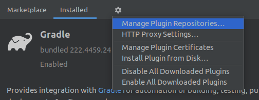
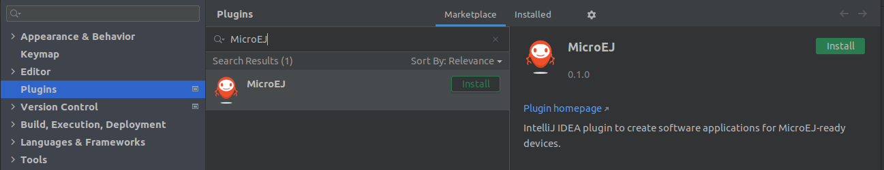

.. _sdk_6_install_plugin_snapshot:

How to Install MicroEJ Plugin Snapshot Version on IntelliJ IDEA
===============================================================

If you want to test the version under development, the latest snapshot version of the plugin can be installed:

- In IntelliJ IDEA, go to ``File > Settings...``.
- Go to ``Plugins`` menu.
- Click on the icon at the right of the ``Installed`` tab, then click on ``Manage Plugin Repositories``.

   IntelliJ IDEA Plugin Repository

- Click on the ``+`` icon.
- Set the URL ``https://repository.microej.com/intellij-plugins/snapshots/updatePlugins.xml``.
- Click on the ``OK`` button.
- Click on the ``Marketplace`` tab.
- In the search field, type ``MicroEJ``:

   IntelliJ IDEA Snapshot Plugin Installation

- Click on the ``Install`` button.
- Click on the ``Restart IDE`` button.
