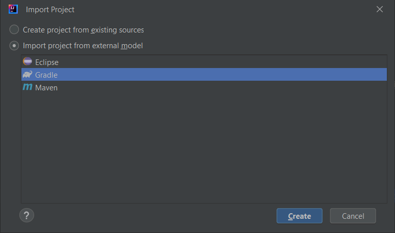

.. _sdk_6_import_project:

Import a Project
================

This chapter explains how to import a project in an IDE.

.. _sdk_6_import_project_eclipse:

Eclipse
-------

.. warning::
   Only the IntelliJ IDEA IDE is fully supported for the moment, so it is recommend to use it instead of Eclipse.
   The support of Eclipse will come soon. 

In order to import an existing Gradle project in Eclipse, follow these steps:

- click on ``File`` > ``Import...``.
- select the project type ``Gradle > Existing Gradle Project`` and click on the ``Next`` button.

   Project Type Selection in Eclipse

- select the root directory of the project.

   Project root folder in Eclipse

- click on the ``Next`` button and finally on the ``Finish`` button.

The Gradle project should now be imported in Eclipse.

.. _sdk_6_import_project_intellij:

IntelliJ IDEA
-------------

In order to import an existing Gradle project in IntelliJ IDEA, follow the following steps:

- click on ``File`` > ``New`` > ``Project From Existing Sources...``.
- select the root directory of the project and click on the ``OK`` button.
- select ``Import project from external model`` and choose ``Gradle``. 

   Project Import in IntelliJ IDEA

- click on the ``Create`` button.

The Gradle project should now be imported in IntelliJ IDEA.

..
   | Copyright 2022, MicroEJ Corp. Content in this space is free 
   for read and redistribute. Except if otherwise stated, modification 
   is subject to MicroEJ Corp prior approval.
   | MicroEJ is a trademark of MicroEJ Corp. All other trademarks and 
   copyrights are the property of their respective owners.
