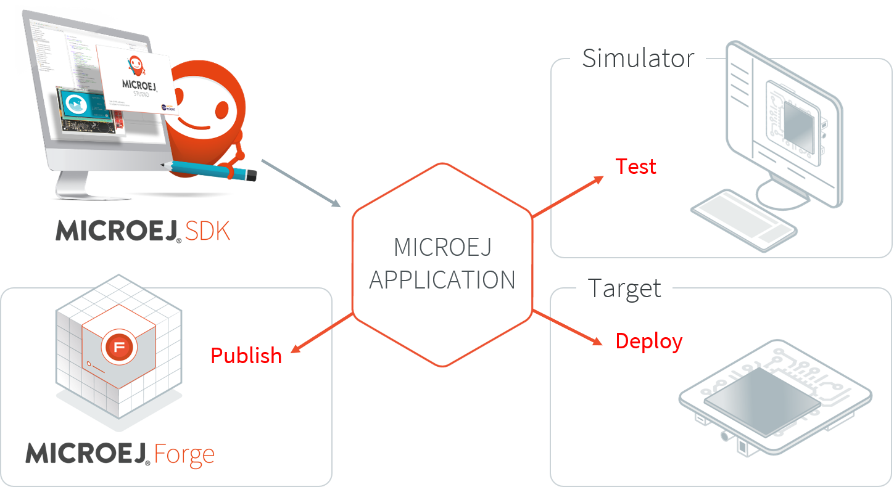
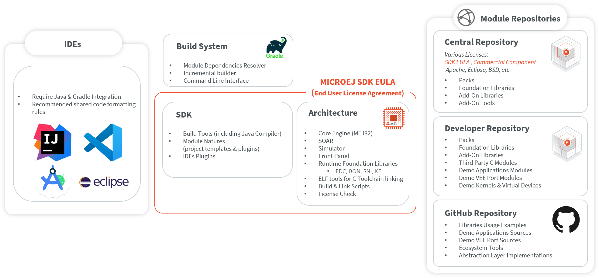

.. _sdk_6_user_guide:

SDK 6 User Guide
================

MICROEJ SDK 6 provides the tools to write applications for MicroEJ-ready devices and run them on a virtual (simulated) or real device.
The capability to execute an application in a simulated environment allows to quickly test changes done 
in the application code and hence provides a short development feedback loop.

Since the purpose of the SDK is to develop for targeted MCU/MPU computers (IoT, wearable, etc.), it is a cross-development tool.
But unlike standard low-level cross-development tools, the SDK offers unique services like hardware simulation.
Used with your favorite IDE (Eclipse or IntelliJ IDEA) to provide a complete development environment to create your applications:

   MicroEJ Application Development Overview

.. note::
  The SDK 6 is limited to the build, test and simulation of Applications and Add-on Libraries.
  If you need other features, such as creating an Executable or a Platform, you have to use :ref:`the SDK 5 <sdk_user_guide>`.

The SDK is composed of the following main elements:

- **Gradle plugins**, the plugins to compile and package MicroEJ modules with `Gradle <https://gradle.org/>`__, a popular module and build manager.
  Gradle provides a Command Line Interface and a complete integration with all the most used IDEs.

- **Architecture**, the software package that includes the MEJ32 port to a target instruction set and a C compiler, SOAR, core libraries and Simulator.
  See :ref:`architecture_overview` section for more details.

The SDK is licensed under the :ref:`SDK End User License Agreement (EULA) <sdk_eula>`. The following figure shows a detailed view of the elements.

   SDK Detailed View

.. toctree::
   :hidden:
   :maxdepth: 1

   install
   moduleNatures
   createProject

..
   | Copyright 2022, MicroEJ Corp. Content in this space is free 
   for read and redistribute. Except if otherwise stated, modification 
   is subject to MicroEJ Corp prior approval.
   | MicroEJ is a trademark of MicroEJ Corp. All other trademarks and 
   copyrights are the property of their respective owners.
