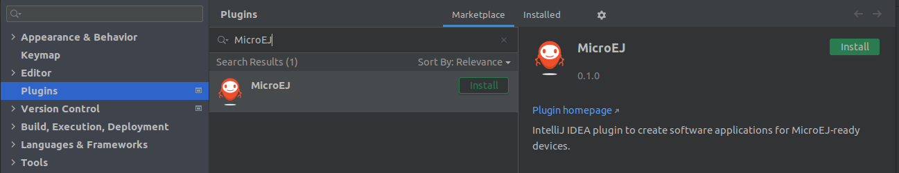
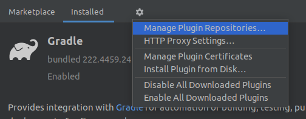

.. _sdk_6_install:

Installation
============

This chapter will guide you through the installation process of the SDK on your workstation.
First check the System Requirements before proceeding.

System Requirements
-------------------

- **Hardware**
   - Intel x64 (Dual-core i5 minimum) or macOS AArch64 (M1) processor
   - 4GB RAM (minimum)
   - 16GB Disk (minimum)

- **Operating Systems**
   - Windows 11 or Windows 10
   - Linux distributions (tested on Ubuntu 20.04 and 22.04)
   - macOS x86_64 with Intel chip
   - macOS aarch64 with M1 chip

- **Java Runtime Environment**
    - JDK 11 - Eclipse Temurin or Oracle Distributions

Check your JDK version
----------------------

The SDK requires a JDK 11 to be installed and:

- the ``JAVA_HOME`` environment variable set to the path of a JDK 11.

OR

- the ``java`` executable of a JDK 11 available in the ``PATH``.

If the ``JAVA_HOME`` is set to a JDK, make sure that it is a JDK 11.

If the ``JAVA_HOME`` is not set, make sure a JDK 11 executable is available in the ``PATH`` environment variable.
To check, run ``java -version`` in a terminal::

   $ java -version
   openjdk version "11.0.15" 2022-04-19
   OpenJDK Runtime Environment Temurin-11.0.15+10 (build 11.0.15+10)
   OpenJDK 64-Bit Server VM Temurin-11.0.15+10 (build 11.0.15+10, mixed mode)

If you don't have a JDK 11 installed, 
you can download and install one from `Adoptium <https://adoptium.net/temurin/releases/>`__ or `Oracle <https://www.oracle.com/fr/java/technologies/downloads/>`__.

Install Gradle
--------------

Once a JDK is correctly configured, the next step is to install Gradle by following `the official documentation <https://gradle.org/install/>`__.
The SDK is only compatible with the Gradle ``8.0.2`` and higher, so make sure to install a right version.
Once done, you can verify your installation by opening a terminal and run the command ``gradle -v``.
It should display, amongst other information, the Gradle and the JVM versions:

.. code:: console

   $ gradle -v
   
  ------------------------------------------------------------
  Gradle 8.0.2
  ------------------------------------------------------------

  Build time:   2023-03-03 16:41:37 UTC
  Revision:     7d6581558e226a580d91d399f7dfb9e3095c2b1d

  Kotlin:       1.8.10
  Groovy:       3.0.13
  Ant:          Apache Ant(TM) version 1.10.11 compiled on July 10 2021
  JVM:          11.0.18 (Eclipse Adoptium 11.0.18+10)
  OS:           Windows 10 10.0 amd64

Configure Repositories
----------------------

In order to use the SDK Gradle plugins and modules in your project, 
the :ref:`Central <central_repository>` and :ref:`Developer <developer_repository>` repositories must be configured.
There are several ways to declare repositories.
To get started, you can declare them globally to make them available in all your projects:

- create the folder ``<user.home>/.gradle/init.d`` if they do not exist.
- download and copy :download:`this file <resources/microej.init.gradle.kts>` in the previously created folder.

At this stage, you can already build a project from the command line, 
for example, by executing the command ``gradle build`` at the root of the project.
But let's continue the installation process to have a complete development environment.

Install the IDE
---------------

Using an IDE is highly recommended for developing MicroEJ projects, making the development more comfortable and increasing productivity.
The two following IDEs are supported: 

- `IntelliJ IDEA <https://www.jetbrains.com/idea/>`__ - Minimum supported version is ``2021.2``.
- `Eclipse IDE for Java Developers <https://www.eclipse.org/downloads/packages/release/2022-09/r/eclipse-ide-java-developers>`__ - Minimum supported version is ``2022-03``.

Follow their respective documentation to install one of them.

.. warning::
   Only the IntelliJ IDEA IDE is fully supported for the moment.
   The support of Eclipse will come soon. 

These 2 IDEs come with the Gradle plugin installed by default.

Install the IDE Plugin
----------------------

Once your favorite IDE is installed, the MicroEJ plugin must be installed.

IntelliJ IDEA
~~~~~~~~~~~~~

Install the Stable Version
##########################

Follow these steps to install the latest stable version of the MicroEJ plugin for IntelliJ IDEA:

- in IntelliJ IDEA, open the Settings window (menu ``File > Settings...`` on Windows and Linux, 
  menu ``IntelliJ IDEA > Preferences...`` on macOS).
- go to ``Plugins`` menu.
- in the search field, type ``MicroEJ``:

   IntelliJ IDEA Plugin Installation

- click on the ``Install`` button.
- click on the ``Restart IDE`` button.

Install the Snapshot Version
############################

If you want to test the version under development, the latest snapshot version of the plugin can be installed:

- in IntelliJ IDEA, go to ``File > Settings...``.
- go to ``Plugins`` menu.
- click on the icon at the right of the ``Installed`` tab, then click on ``Manage Plugin Repositories``.

   IntelliJ IDEA Plugin Repository

- click on the ``+`` icon.
- set the URL ``https://repository.microej.com/intellij-plugins/snapshots/updatePlugins.xml``.
- click on the ``OK`` button.
- click on the ``Marketplace`` tab.
- in the search field, type ``MicroEJ``:

   IntelliJ IDEA Snapshot Plugin Installation

- click on the ``Install`` button.
- click on the ``Restart IDE`` button.

Eclipse
~~~~~~~

The MicroEJ plugin for Eclipse is not available yet, so it is recommended to use IntelliJ IDEA for the moment.

..
   | Copyright 2008-2023, MicroEJ Corp. Content in this space is free
   for read and redistribute. Except if otherwise stated, modification 
   is subject to MicroEJ Corp prior approval.
   | MicroEJ is a trademark of MicroEJ Corp. All other trademarks and 
   copyrights are the property of their respective owners.
