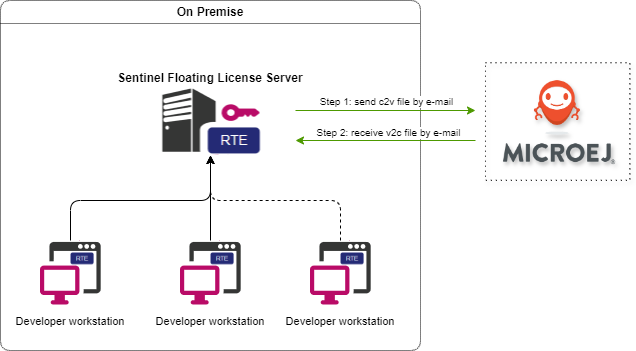
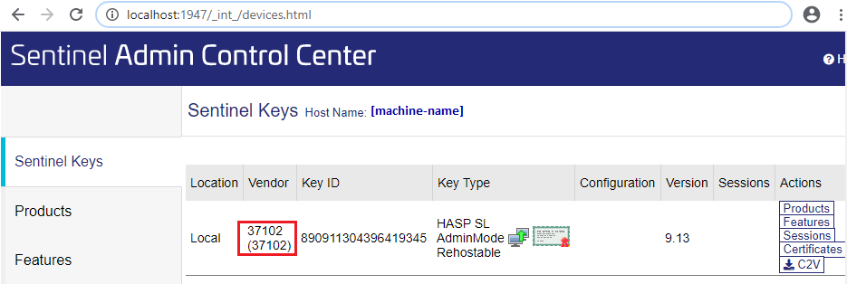
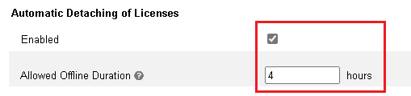
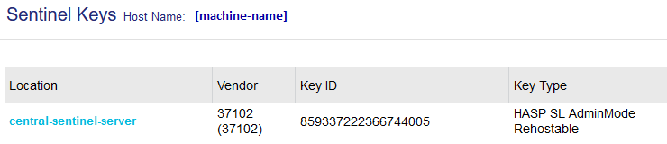

Sentinel License Management
===========================

In addition to single-workstation license based on a hardware dongle, MICROEJ SDK supports floating licenses based on Thales Sentinel LDK solution.

This chapter contains instructions that will allow you to setup Sentinel environment and activate your license.

There are two installation flows:

#. If you are a System Administrator, :ref:`setup the Sentinel Floating License Server  <setup_sentinel_floating_license_server>` on a host machine.
#. If you are a Developer, proceed with the :ref:`setup of the Sentinel client for the SDK  <setup_sentinel_developer_workstation>`.

.. note::
	
   Floating License requires :ref:`Architecture 8.1.0 <changelog-8.1.0>` or higher (Production only).

.. _setup_sentinel_floating_license_server:

Setup the Sentinel Floating License Server
------------------------------------------

This section contains instructions for the System Administrator to setup the Sentinel Floating License Server.

- Choose a machine to host the Sentinel Floating License Server. 
  The host machine must be choosen with care, as its fingerprint will be required to generate the license file.
  Especially, you have to choose a host machine that is accessible through the network to all your developer workstations.

Install the Sentinel LDK Run-time Environment (RTE) for License Server
~~~~~~~~~~~~~~~~~~~~~~~~~~~~~~~~~~~~~~~~~~~~~~~~~~~~~~~~~~~~~~~~~~~~~~

`Sentinel LDK Run-time Environment <https://docs.sentinel.thalesgroup.com/ldk/rte.htm>`__ enables your protected software to run by communicating with Sentinel protection keys. 

First, download `Sentinel_RTE_Installation-1.1.0.zip <https://repository.microej.com/packages/sentinel/Sentinel_RTE_Installation-1.1.0.zip>`__ file. It contains installer for Windows, macOS and Linux.

**Installation for Windows**

- Get ``haspdinst_37102.exe`` file
- Type ``haspdinst_37102.exe -i`` in the command line. The installation or upgrade process is performed automatically. A message is displayed informing you that the Sentinel LDK Run-time Environment was successfully installed

.. note::
	To uninstall Sentinel RTE, type ``haspdinst_37102.exe -r`` in the command line. A message is displayed informing you that the Sentinel LDK Run-time Environment was successfully removed.

**Installation for Linux**

Get ``aksusbd_37102-10.12.1.tar.gz`` file and extract it. The installation packages are in the directory ``pkg``, as root enter the following command:

- For RedHat, SUSE, or CentOS 64-bit Intel systems: ``rpm -i aksusbd-10.12.1.x86_64.rpm``
- For Ubuntu or Debian 64-bit Intel systems: ``dpkg -i aksusbd_10.12-1_amd64.deb``
- Copy ``aksusbd-10.12.1/haspvlib_37102.so`` and ``aksusbd-10.12.1/haspvlib_x86_64_37102.so`` to ``/var/hasplm`` directory

.. note::
	All install/uninstall commands must be executed with root rights. On Ubuntu, prefix the commands with the ``sudo`` command. On other Linux distributions, use the ``su`` utility to become root in the terminal window.

Configure the License Server
~~~~~~~~~~~~~~~~~~~~~~~~~~~~

- On the host machine, open a web browser.
- Browse ``http://<server-ip-address>:1947`` to open the Sentinel Admin Control Center.
- Go to :guilabel:`Sentinel Keys` tab and click on :guilabel:`Fingerprint` button to download the ``*.c2v`` file.

   .. figure:: images/sentinel_rte_server_get_fingerprint.png
      :scale: 90%

- The ``*.c2v`` file stands for `Customer to Vendor`. Send this file to your MicroEJ sales representative.
- Wait until MicroEJ prepares your license key. Then you will receive a ``.v2c`` file. 
  The ``*.v2c`` file stands for `Vendor to Customer`.
- On the host machine, go back to the Sentinel Admin Control Center.
- Click on :guilabel:`Update/Attach` tab.
- Click on :guilabel:`Select File...` button and browse the ``.v2c`` file.
- Click on :guilabel:`Apply File` button.

In :guilabel:`Sentinel Keys` tab, you should see the successfully installed license key:

- Go to :guilabel:`Configuration` > :guilabel:`Access from Remote Clients` and check `All licenses are accessible without need of identity`
- Go to :guilabel:`Configuration` > :guilabel:`Detachable Licenses`, enabled `Automatic Detaching of Licenses` and set an `Allowed Offline Duration` of 4 hours.

- Configure the host machine to open the IP port ``1947`` for TCP, UDP, TCP6, UDP6.
- Optionally, you can set a printable name for the Sentinel Floating License Server that will be displayed on the Developer workstation license list.
  
  - Go to :guilabel:`Configuration` > :guilabel:`Basic Settings` tab.
  - Update the :guilabel:`Machine Name` text field (e.g. ``central-sentinel-server``).
  - Click on :guilabel:`Submit` button.

Your Sentinel Floating License Server is successfully configured. All you have to do is to share the host machine IP address to your MicroEJ Developers.

.. _setup_sentinel_developer_workstation:

Setup the Developer Workstation
-------------------------------

This section contains instructions for the MicroEJ Developer to setup its workstation in order to connect a Sentinel Floating License Server.

First, download `Sentinel_RTE_Installation-1.1.0.zip <https://repository.microej.com/packages/sentinel/Sentinel_RTE_Installation-1.1.0.zip>`__ file. It contains installer for Windows, macOS and Linux.
`Sentinel LDK Run-time Environment <https://docs.sentinel.thalesgroup.com/ldk/rte.htm>`__ enables your protected software to run by communicating with Sentinel protection keys. 

**Installation for Windows**

- Get ``haspdinst_37102.exe`` file
- Type ``haspdinst_37102.exe -i`` in the command line. The installation or upgrade process is performed automatically. A message is displayed informing you that the Sentinel LDK Run-time Environment was successfully installed
- Put ``MicroEJ_library\hasp_windows_x64_37102.dll`` file in the system folder (``%SystemRoot%\system32``) if you have administrator rights on your machine. 
  Otherwise drop the ``hasp_windows_x64_37102.dll`` file beside ``java.exe`` executable of the Java Development Kit (JDK) used to run the SDK.

.. note::
   
   To restart RTE, go to Services window and restart ``Sentinel LDK License Manager`` service. To uninstall Sentinel RTE, type ``haspdinst_37102.exe -r`` in the command line. A message is displayed informing you that the Sentinel LDK Run-time Environment was successfully removed.

Then you can continue with the :ref:`Remote Floating License Server <add_remote_floating_license_server>` section.

**Installation for Linux**

.. note::
	All install/uninstall commands must be executed with root rights. On Ubuntu, prefix the commands with the ``sudo`` command. On other Linux distributions, use the ``su`` utility to become root in the terminal window.

Get ``aksusbd_37102-10.12.1.tar.gz`` file and extract it. The installation packages are in the directory ``pkg``, as root enter the following command:

- For RedHat, SUSE, or CentOS 64-bit Intel systems: ``rpm -i aksusbd-10.12.1.x86_64.rpm``
- For Ubuntu or Debian 64-bit Intel systems: ``dpkg -i aksusbd_10.12-1_amd64.deb``
- Copy ``aksusbd-10.12.1/haspvlib_37102.so`` and ``aksusbd-10.12.1/haspvlib_x86_64_37102.so`` to ``/var/hasplm`` directory
- Get ``MicroEJ_library/libhasp_linux_x86_64_37102.so`` file and copy it in a directory of your choice
- Set ``LD_LIBRARY_PATH`` variable with command ``export LD_LIBRARY_PATH=<directory_of_libhasp_file>:$LD_LIBRARY_PATH`` (just the directory, not with the file name).
  This modification has to be setup at session startup  (e.g: using ``~/.bashrc`` or ``~/.profile`` files) to ensure that OS is properly configured before running the SDK.

.. note::

   If you use the Sentinel RTE on WSL (Windows Subsystem for Linux): you can set the service to start on boot by creating the file ``/etc/wsl.conf`` and add these lines to it:

   .. code-block::
   
      [boot]
      command="service aksusbd start"

   You can check the service status with the command ``sudo service aksusbd status``

Then you can continue with the :ref:`Remote Floating License Server <add_remote_floating_license_server>` section.

**Installation for MacOS**

- Get ``Sentinel_Runtime_37102.tar`` file
- In ``SentinelRuntimeInstaller.framework/Versions/A/Resources/`` double-click on ``Sentinel_Runtime.pkg``
- Double-click the Install Sentinel Runtime Environment disk image icon. The installer wizard is launched
- Follow the instructions of the installer wizard until the installation is complete. The first time that you run Admin Control Center and submit configuration changes, ``hasplmd`` creates configuration files in ``/private/etc/hasplm/``
- Get ``MicroEJ_library/hasp_darwin_37102.dylib`` file and copy it in a directory of your choice
- Set ``DYLD_LIBRARY_PATH`` variable with command ``export DYLD_LIBRARY_PATH=<your_directory>:$DYLD_LIBRARY_PATH``.
  This modification has to be setup at session startup  (e.g: using ``.bashrc`` file) to ensure that OS is properly configured before running the SDK.

.. note::

   To restart the daemons, on a terminal, go to ``/Library/LaunchDaemons/`` and launch ``sudo launchctl load com.aladdin.aksusbd.plist`` and ``sudo launchctl load com.aladdin.hasplmd.plist``

Then you can continue with the :ref:`Remote Floating License Server <add_remote_floating_license_server>` section.

.. _add_remote_floating_license_server:

Add Remote Floating License Server
~~~~~~~~~~~~~~~~~~~~~~~~~~~~~~~~~~

**From Sentinel Admin Control Center**

- On the developer workstation, open a web browser.
- Browse http://localhost:1947 to open the Sentinel Admin Control Center (if you work with WSL read note below). 
- Go to :guilabel:`Configuration` > :guilabel:`Access to Remote License Managers`.
- Check :guilabel:`Allow Access to Remote Licenses`.
- Uncheck :guilabel:`Broadcast Search for Remote Licenses`.
- In :guilabel:`Remote License Search Parameters`, add the Floating License Server IP address that should have been shared by your System Administrator.
   
   .. image:: images/sentinel_rte_client_remote_config.png

- Click on :guilabel:`Submit` button.
- Your computer should now have access to the licenses configured on the Floating License Server. 
  In :guilabel:`Sentinel Keys` tab, you should see the license key provided by your Floating License Server (e.g. ``central-sentinel-server``). 

   .. image:: images/sentinel_rte_client_installed_license.png

.. note::

   If you use WSL (Windows Subsystem for Linux) ``localhost`` refers to your Windows localhost and not to your WSL instance. First, on WSL, create ``/etc/hasplm/hasplm.ini`` file and add  ``accremote = 1`` line to it. Then on WSL terminal, launch ``hostname -I`` command, copy the first IP address and use it instead  of ``localhost`` in your browser (e.g. http://172.30.106.171:1947/).

**From Command Line**

- On Linux: update or create the file ``hasplm.ini`` in ``/etc/hasplm`` or ``hasp_37102.ini`` in ``~/.hasplm`` (if you have not installed RTE as root). 
- On Windows: edit ``%CommonProgramFiles(x86)%\Aladdin Shared\HASP\hasplm.ini`` file. 

Then add to the ``.ini`` file the following lines:
   
   .. code-block::
      
      [REMOTE]
      broadcastsearch = 0
      serversearchinterval = 30
      serveraddr = <license_server_IP>

- Restart the service.

Running in a container
~~~~~~~~~~~~~~~~~~~~~~

If you want to configure a CI (Continuous integration) runner you can follow one of these two solutions:

- Either create a Docker image with the RTE installed inside, see :ref:`Installation for Linux <setup_sentinel_developer_workstation>` section.

- Or install and configure the RTE on the host and run the Docker container with these options:

   .. code-block::
      
      -v /var/hasplm:/var/hasplm:ro -v /home/<host_user>/.hasplm:/home/<container_user>/.hasplm:ro -e LD_LIBRARY_PATH=/var/hasplm

Runtime Installation Instructions and Troubleshooting
-----------------------------------------------------

Check Activation with the Command Line Tool
~~~~~~~~~~~~~~~~~~~~~~~~~~~~~~~~~~~~~~~~~~~

To verify access to the Sentinel license on the workstation where the SDK executes, run the debug tool as following:

#. Open a terminal
#. Change directory to a Production VEE Port
#. Execute the command:
   
    .. code:: console

       java -Djava.library.path=resources/os/[OS_NAME] -jar licenseManager/licenseManagerProduct.jar

    with ``OS_NAME`` set to ``Windows64`` for Windows OS, ``Linux64`` for Linux OS, ``Mac`` for macOS x86_64 (Intel chip) or ``MacA64`` for macOS aarch64 (M1 chip).

If your Sentinel license has been properly activated, you should get the following output:
   
.. code:: console

   [DEBUG] ===== MicroEJ Sentinel Debug Tool =====
   [DEBUG] => Detected Sentinel License Key ID: XXXXXXXXXXXXXXXX.
   [DEBUG] => Detected MicroEJ License valid until YYYY-MM-DD.
   [DEBUG] ===== SUCCESS =====

Troubleshooting
~~~~~~~~~~~~~~~

Sentinel API dynamic library not found (code 400)
"""""""""""""""""""""""""""""""""""""""""""""""""

The following error occurred when the library ``hasp_[os]_37102.[ext]`` has not been found. Please refer to :ref:`setup_sentinel_developer_workstation`. 

Specifically, if you are on Linux:

- check the library is readable with the command ``file libhasp_linux_x86_64_37102.so``.
- check the `LD_LIBRARY_PATH` environment variable is properly set before launching MICROEJ SDK. 
  If MICROEJ SDK is launched from a desktop application, it must have been set in the ``~/.profile`` file.

Sentinel key not found (code 7)
"""""""""""""""""""""""""""""""

The following error occurred when there is no Sentinel license available. Go to http://localhost:1947/int/devices.html and check your Sentinel licenses. You should see at least one installed license key:

Make sure you correctly configured the access to the Sentinel Floating License Server. Please refer to :ref:`add_remote_floating_license_server`.

No Administrator Privileges on Developer Workstation
""""""""""""""""""""""""""""""""""""""""""""""""""""

Sentinel LDK RTE installation requires administrator privileges and facilitates the setup of the network server.
However, it is not necessary to be installed on the developer workstation in case of floating licenses. 
See this `documentation <https://docs.sentinel.thalesgroup.com/ldk/LDKdocs/SPNL/LDK_SLnP_Guide/Distributing/Distributing_LDK/RTE_when_required.htm>`__ for more details.
If you are in such situation, please can contact `our support team <https://www.microej.com/contact/#form_2>`_.

..
   | Copyright 2008-2026, MicroEJ Corp. Content in this space is free 
   for read and redistribute. Except if otherwise stated, modification 
   is subject to MicroEJ Corp prior approval.
   | MicroEJ is a trademark of MicroEJ Corp. All other trademarks and 
   copyrights are the property of their respective owners.
