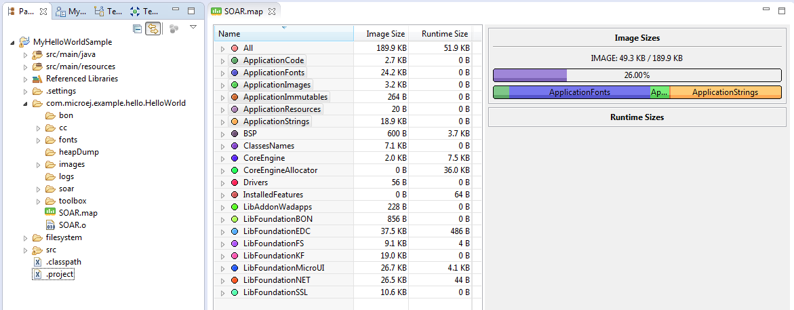

.. _sdk6_memorymapanalyzer:

===================
Memory Map Analyzer
===================

Principle
=========

When the Executable of an Application is built, a Memory Map file is generated. 
This file can be visualized with the Memory Map Analyzer, an Eclipse IDE plug-in. 
It displays the memory consumption of different features in the RAM and ROM.

   Memory Map Analyzer Process

Use
===

When the Executable file of an Application has been produced, 
the Memory Map file is available at ``build/executable/application/SOAR.map``.

   Memory Map File

You can visualize it by following these steps:

- Make sure :ref:`the Eclipse IDE is installed with the required plugin <sdk6_microejtools>`, then launch it.
- Click on :guilabel:`File` > :guilabel:`Open File...`.
- Select the Memory Map file.

   Consult Full Memory

You can select an item (or several) to show the memory used by this item(s) on the right, 
or select ``All`` to show the memory used by all items. 
This special item performs the same action as selecting all items in the list.

You can also select an item in the list, and expand it to see all symbols used by the item. 
This view is useful in understanding why a symbol is embedded.

.. figure:: images/RIDetailedView.png
   :alt: Detailed view
   :align: center
   :width: 1216px
   :height: 753px

   Detailed View

..
   | Copyright 2008-2023, MicroEJ Corp. Content in this space is free 
   for read and redistribute. Except if otherwise stated, modification 
   is subject to MicroEJ Corp prior approval.
   | MicroEJ is a trademark of MicroEJ Corp. All other trademarks and 
   copyrights are the property of their respective owners.
