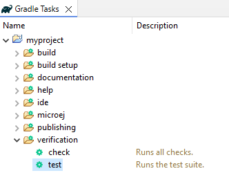
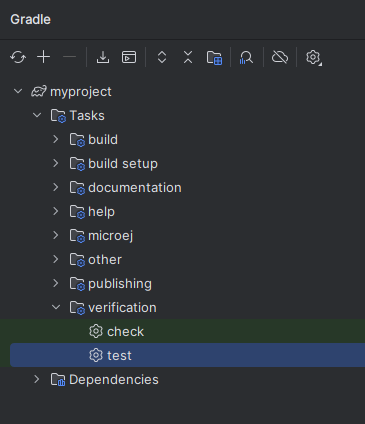

.. _sdk_6_test_project:

Test a Project
==============

The SDK provides the capabilities to implement tests for a project.
There are different types of tests:

- test on the Simulator
- test on a J2SE VM
- test on a device
- project test on a device

The SDK currently supports only the tests on the Simulator.

Test on Simulator
-----------------

Create a Test
~~~~~~~~~~~~~

JUnit testing can be enabled for Add-On Library projects (plugin ``com.microej.gradle.library``) 
or Application projects (plugin ``com.microej.gradle.application``).

- add the following dependency in the ``build.gradle.kts`` file of the project:

.. code-block:: xml

   dependencies {
      testImplementation("ej.library.test:junit:1.7.1")
   }

- create a JUnit class in the ``src/test/java`` folder.
  This can be done manually or with IDE menu:
  
  - Eclipse: right-clicking on the ``src/test/java`` folder 
    and select :guilabel:`New`` > :guilabel:`Other…` > :guilabel:`Java` > :guilabel:`JUnit` > :guilabel:`New JUnit Test Case`
  - IntelliJ IDEA: right-clicking on the ``src/test/java`` folder 
    and select :guilabel:`New` > :guilabel:`Java Class``, then press ``Alt`` + ``Insert`` and select ``Test Method``.

Setup a Platform
~~~~~~~~~~~~~~~~

Before running tests, a target platform must be configured using one of the methods described in the :ref:`sdk_6_platform_selection` page.

Execute the Tests
~~~~~~~~~~~~~~~~~

The SDK provides the Gradle task ``testOnSimulator`` to execute tests on the Simulator.
This task is plugged to the ``test``, which is part of the default Gradle lifecycle.
It means that the tests can be executed by launching the task ``testOnSimulator``, ``test`` 
or even ``build`` since the ``build`` task depends on the ``test`` task.

It can be executed with the command line interface::

   gradle test

or from Eclipse and IntelliJ IDEA, by double-clicking on the task in the Gradle tasks view:

|pic1| |pic2|

Run a Single Test Manually
~~~~~~~~~~~~~~~~~~~~~~~~~~

Each test can be run independently by using the ``--tests`` option of the ``test`` task::

   gradle test --tests com.mycompany._AllTests_MyTest

The test must be referenced by the Full Qualified Name of the generated class.

The test is executed on the Platform defined in the project build file 
and the output result is dumped into the console.

..
   | Copyright 2022, MicroEJ Corp. Content in this space is free 
   for read and redistribute. Except if otherwise stated, modification 
   is subject to MicroEJ Corp prior approval.
   | MicroEJ is a trademark of MicroEJ Corp. All other trademarks and 
   copyrights are the property of their respective owners.
