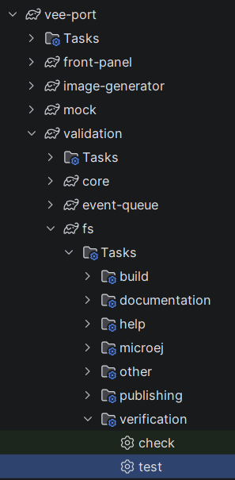
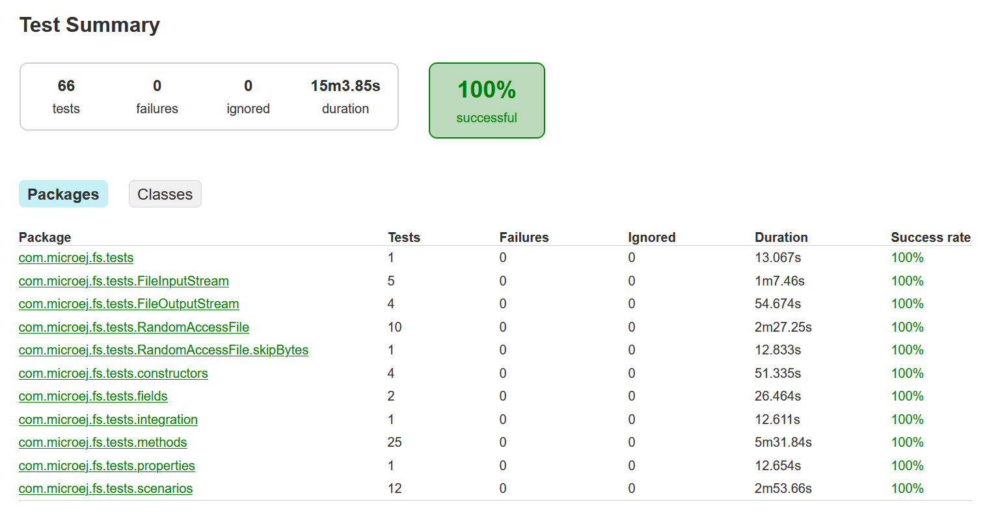
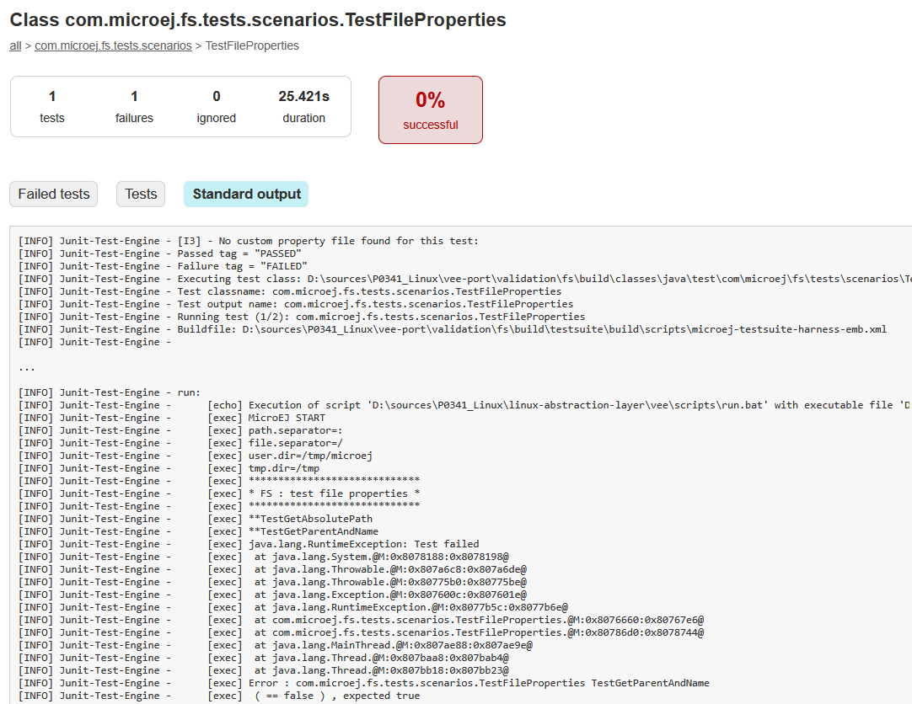

.. _sdk_6_veeport_test:

===============
Test a VEE Port
===============

The SDK provides the capability to test a VEE Port.
While you can create your own tests, 
MicroEJ provides a set of tools and pre-defined projects aimed at simplifying the steps for validating VEE Ports 
in the form of the ``VEE Port Qualification Tools``.

This page guides you through the steps to add, configure and execute a testsuite on an existing VEE Port project.
It takes the example of the testsuite for the :ref:`FS <pack_fs>` Foundation Library.

To learn more on Foundation Libraries and their Qualification, refer to :ref:`veeport_qualification`.

Import the Test Suite
---------------------

It is assumed here that the VEE Port project already exists, 
with the same structure as the `VEE Port Project Template <https://github.com/MicroEJ/Tool-Project-Template-VEEPort/tree/1.4.0>`__, especially these folders and files::

   |- vee-port/
   |   |- validation/
   |   |- build.gradle.kts
   |   |- configuration.properties
   |- settings.gradle.kts

The first step is to import the testsuite in the VEE Port project:

- Clone or download the `VEE Port Project Template
  <https://github.com/MicroEJ/Tool-Project-Template-VEEPort/releases/tag/1.4.0>`__.
- Copy the ``vee-port/validation/fs`` folder into the ``vee-port/validation`` folder of the VEE Port project.
- Add the following line in the ``settings.gradle.kts`` root file::

   include("vee-port:validation:fs")

At this stage, the VEE Port project structure should look like this::

   |- vee-port/
   |   |- validation/
   |   |   |- fs/
   |   |       |- validation/
   |   |           |- microej-testsuite-common.properties
   |   |       |- build.gradle.kts
   |   |       |- config.properties.tpl
   |   |- build.gradle.kts
   |   |- configuration.properties
   |- settings.gradle.kts

Configure a Testsuite
---------------------

Select the Testsuite Target
~~~~~~~~~~~~~~~~~~~~~~~~~~~

A Testsuite can be executed on the Simulator or on the Device.
The target can be configured in the ``build.gradle.kts`` file of the Testsuite project 
(so in the ``vee-port/validation/fs/build.gradle.kts`` file for our example), in the ``testing > suites > test`` block,
thanks to the ``microej.useMicroejTestEngine`` function.
The second argument of this function can be either ``TestTarget.SIM`` (on the Simulator) or ``TestTarget.EMB`` (on the Device).
For example, to execute the tests on the Device, the configuration is:

.. code-block::

   testing {
      suites {
         val test by getting(JvmTestSuite::class) {
            microej.useMicroejTestEngine(this, TestTarget.EMB)

            ...
         }
      }
   }

Select the Testsuite Version
~~~~~~~~~~~~~~~~~~~~~~~~~~~~

For a given Foundation Library version, a specific Testsuite version should be used to validate the Abstraction Layer implementation.
Refer to :ref:`test_suite_versioning` to determine the correct Testsuite version to use.

The Testsuite version must be set in the ``build.gradle.kts`` file of the Testsuite project 
(so in the ``vee-port/validation/fs/build.gradle.kts`` file for our example), in the ``testing > suites > test > dependencies`` block.
For example, to use the FS Testsuite ``3.0.8``:

.. code-block::

   testing {
      suites {
         val test by getting(JvmTestSuite::class) {
            dependencies {
               implementation("com.microej.pack.fs:fs-testsuite:3.0.8")

               ...
            }
         }
      }
   }

Adjust the Testsuite Configuration
~~~~~~~~~~~~~~~~~~~~~~~~~~~~~~~~~~

The SDK provides several properties to adjust the Testsuite behavior, as well as the Tests being executed.
These configuration properties can be defined in the ``config.properties`` file located at the root of the Testsuite project.
A configuration properties file template is provided, named ``config.properties.tpl``, which contains all the available properties. 
This file must be renamed to ``config.properties``. Then it can be updated, for example to change the timeout and the number of retries::

   # The testsuite timeout (in seconds)
   microej.testsuite.timeout=600

   # The number of times we'll retry a test if it fails
   microej.testsuite.retry.count=1

Also, the Application options used for each test can be defined in the 
``vee-port/validation/fs/validation/microej-testsuite-common.properties`` file located.
For example::

   # Java memory settings
   core.memory.immortal.memory=RAM
   core.memory.immortal.size=64000

Configure the VEE Port BSP Connection
~~~~~~~~~~~~~~~~~~~~~~~~~~~~~~~~~~~~~

Several configuration properties must be defined depending on the type of BSP Connection used by the VEE Port.
These properties are defined in the ``config.properties`` file located at the root folder of the Test Suite, as described in the section above.
They all start by the prefix ``microej.testsuite.properties.deploy.*``. 
See the comments in the ``config.properties`` file for a description of each property, or refer to :ref:`bsp_connection` for a detailed explanation.

Configure the Execution Trace Redirection
~~~~~~~~~~~~~~~~~~~~~~~~~~~~~~~~~~~~~~~~~

When the Test Suite is executed, the Test Suite Engine must read the trace to determine the result of the execution. 
The SDK provides 2 ways to read these traces: either from a socket, or from a file.

- If the VEE Port does not support the redirection of the traces to a file,
   
   - the ``microej.testsuite.properties.testsuite.trace.ip`` and ``microej.testsuite.properties.testsuite.trace.port`` properties must be configured to listen to the socket, for example::

      microej.testsuite.properties.testsuite.trace.ip=localhost
      microej.testsuite.properties.testsuite.trace.port=5555

   - the Serial to Socket tool must be started to redirect from the Serial Port to a socket configured above. 
     Refer to :ref:`sdk6_tool_serial_to_socket` to learn how to configure and start it.

- If it does,

   - the ``microej.testsuite.properties.launch.test.trace.file`` property must be set to ``true``.

Run the Test Suite
------------------

To run the Test Suite, launch the ``test`` Gradle task of the Testsuite project:

Or from the command line, you must execute the following command at the root folder of the VEE Port project::

   ./gradlew :vee-port:validation:fs:test

Examine the Test Suite Report
-----------------------------

Once the Test Suite is completed, open the HTML Test Suite Report stored at ``vee-port/validation/fs/build/reports/tests/test/index.html``.

The first page displays a summary of the test results: number of tests executed, number of tests failed, ...
Then you can click on the tests links to check the details and the logs of each test.

If necessary, the binaries produced and ran on the device by the Test Suite Engine are available at ``vee-port/validation/fs/build/testsuite/output/<timestamp>/bin/<testClassName>/application.out``.

The following image shows the test suite report fully passed:

If at least one test fails, the build fails and the report displays the list of failed tests:

.. image:: ./images/testsuite_fs_tests_failed.png

You can click on a failing test, then on the Standard Output tab to get its full logs:

Refer to :ref:`this chapter <sdk_6_veeport_test_decrypt_stacktrace>` to decrypt the stack traces.

Rerun Tests
-----------

When nothing has changed in the VEE Port or Testsuite project, 
running again the ``test`` task does not have any effect since the task is considered ``UP-TO-DATE`` by Gradle.
If you want to force a new execution of the tests in this case, you can use the option ``--rerun``::

   ./gradlew :vee-port:validation:fs:test --rerun

You can also filter the tests to execute, either in the ``build.gradle.kts`` file or 
with the ``--tests`` options, as described in :ref:`sdk_6_test_filter`.

Debug Tests on Simulator
------------------------

Tests can be debugged when running on the Simulator by following these steps:

- Make sure the Testsuite is configured to run on the Simulator by checking that 
  the call to the ``microej.useMicroejTestEngine`` function in the testsuite configured in the ``build.gradle.kts``.
  The second argument must be set to ``TestTarget.SIM``, for example::

   microej.useMicroejTestEngine(this, TestTarget.SIM, TestMode.MAIN)

- Copy the Implementation JAR of the Library you want to debug from the VEE Port located in ``build/testVee`` (the Testsuite 
  must be executed once before to have this folder) into the root of the Testsuite project.
  For example, to debug the FS Library, copy the JAR file ``vee-port/validation/fs/build/testVee/javaLibs/fs-X.Y.jar`` 
  into the folder ``vee-port/validation/fs``.
- Add this JAR as a dependency of the Testsuite in the ``build.gradle.kts`` file. 
  For example, add this line in the ``testing > suites > test > dependencies`` block::

   implementation(files(layout.projectDirectory.file("fs-X.Y.jar")))

- Run the Testsuite by executing the ``test`` with the debug options::

   ./gradlew :vee-port:validation:fs:test  -P"debug.mode"=true -P"debug.port"=8000

- Configure your favorite IDE as described in :ref:`sdk_6_debug_on_simulator`.

The debugger should connect to the Simulator and you should be able to debug your Testsuite.

Update Test Class of the Testsuite
----------------------------------

To help troubleshooting a problem in a Testsuite, it can be convienent to update a Test class.
This can be done by extracting the Testsuite sources in the validation project.
For example for the FS Testsuite, follow these steps:

- In the validation project (``vee-port/validation/fs``), create the ``src/test/java`` folder if it does not exist.
- Get the Testsuite RIP file. It is available in the MicroEJ Central Repository. 
  For example, for the FS Testsuite ``com.microej.pack.fs:fs-testsuite:3.0.8``, 
  the RIP file is located `here <https://repository.microej.com/modules/com/microej/pack/fs/fs-testsuite/3.0.8/fs-testsuite-3.0.8.rip>`__.
- Extrat the RIP file in the temporary folder of your choice.
- Locate the Testsuite JAR from the ``javaLibs`` folder to this RIP file. It is named ``fs-testsuite-x.y.jar``.
- Extract it into the ``src/test/java`` folder previously created.
- Remove all the ``.class`` to keep only the ``.java`` files.
- In the ``build.gradle.kts`` file of the validation, remove the dependency to the FS Testsuite module (``implementation(libs.testsuite.fs)``).
- Add the missing dependency to make everything compile successfully:

   - Copy all the other JAR files from the ``javaLibs`` RIP folder into the folder ``vee-port/validation/fs`` and add them as file dependencies in the dependencies.
     The FS Testsuite contains only the ``checkHelper.jar`` file. 
     It must be copied into the folder ``vee-port/validation/fs`` and the following line must be added: ``implementation(files(layout.projectDirectory.file("checkHelper.jar"))``.
   - Copy the JAR ``vee-port/validation/fs/build/testVee/javaLibs/resourcemanager-1.0.jar`` into the folder ``vee-port/validation/fs``,
     then add the dependency ``implementation(files(layout.projectDirectory.file("resourcemanager-1.0.jar")))``.

- Update the Test class according to your need.
- Launch the test again with::

   ./gradlew test

.. _sdk_6_veeport_test_decrypt_stacktrace:

Decrypt a Stack Trace in a Test
-------------------------------

When a stack trace is displayed in the tests logs, it can be decrypted with the `Stack Trace Reader tool <sdk6.section.stacktrace.reader.tool>`__.
This task must be launched with the System Property set to the path of the Executable of the test.
The Executable of the tests are located in the ``build/testsuite/output/<timestamp>/bin/<test-class-fullname>/application.out`` folder.
For example, if a stack trace is displayed when executing the test ``com.microej.fs.tests.scenarios.TestFileProperties``,
the Executable is located at ``build/testsuite/output/20251110-1655-36/bin/com.microej.fs.tests.scenarios.TestFileProperties/application.out``,
so the stack trace can be decrypted by executing the following command::

   ./gradlew :vee-port:validation:fs:stackTraceReader -D""application.file"=".../vee-port/validation/fs/build/testsuite/output/20251110-1655-36/bin/com.microej.fs.tests.scenarios.TestFileProperties/application.out"

Then pasting the encrypted stack trace when the ``[INFO] Paste the MicroEJ core engine stack trace here`` appears.

..
   | Copyright 2008-2025, MicroEJ Corp. Content in this space is free 
   for read and redistribute. Except if otherwise stated, modification 
   is subject to MicroEJ Corp prior approval.
   | MicroEJ is a trademark of MicroEJ Corp. All other trademarks and 
   copyrights are the property of their respective owners.
