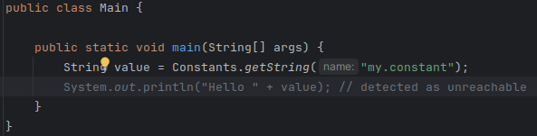
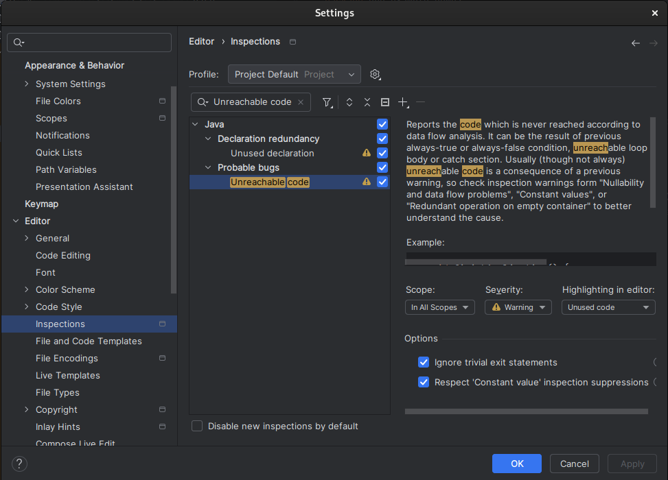

.. _sdk_6_troubleshooting:

Troubleshooting
===============

Java Compiler Version Issue
---------------------------

The SDK requires a JDK 11, so when a JDK 8 is used, the following kind of errors are raised:

- When fetching the MicroEJ Gradle plugin::

	A problem occurred configuring root project 'myProject'.
	> Could not resolve all files for configuration ':classpath'.
	> Could not resolve com.microej.gradle.plugins:plugins:0.3.0.
		Required by:
			project : > com.microej.gradle.addon-library:com.microej.gradle.addon-library.gradle.plugin:0.3.0:20221118.151454-1
		> No matching variant of com.microej.gradle.plugins:plugins:0.3.0:20221118.151454-1 was found. The consumer was configured to find a runtime of a library compatible with Java 8, packaged as a jar, and its dependencies declared externally, as well as attribute 'org.gradle.plugin.api-version' with value '7.4' but:
			- Variant 'apiElements' capability com.microej.gradle.plugins:plugins:0.3.0 declares a library, packaged as a jar, and its dependencies declared externally:
				- Incompatible because this component declares an API of a component compatible with Java 11 and the consumer needed a runtime of a component compatible with Java 8
				- Other compatible attribute:
					- Doesn't say anything about org.gradle.plugin.api-version (required '7.4')
			- Variant 'javadocElements' capability com.microej.gradle.plugins:plugins:0.3.0 declares a runtime of a component, and its dependencies declared externally:
				- Incompatible because this component declares documentation and the consumer needed a library
				- Other compatible attributes:
					- Doesn't say anything about its target Java version (required compatibility with Java 8)
					- Doesn't say anything about its elements (required them packaged as a jar)
					- Doesn't say anything about org.gradle.plugin.api-version (required '7.4')
			- Variant 'runtimeElements' capability com.microej.gradle.plugins:plugins:0.3.0 declares a runtime of a library, packaged as a jar, and its dependencies declared externally:
				- Incompatible because this component declares a component compatible with Java 11 and the consumer needed a component compatible with Java 8
				- Other compatible attribute:
					- Doesn't say anything about org.gradle.plugin.api-version (required '7.4')
			- Variant 'sourcesElements' capability com.microej.gradle.plugins:plugins:0.3.0 declares a runtime of a component, and its dependencies declared externally:
				- Incompatible because this component declares documentation and the consumer needed a library
				- Other compatible attributes:
					- Doesn't say anything about its target Java version (required compatibility with Java 8)
					- Doesn't say anything about its elements (required them packaged as a jar)
					- Doesn't say anything about org.gradle.plugin.api-version (required '7.4')

- When using the MicroEJ Gradle plugin::

	Cause: com/microej/gradle/plugins/MicroejApplicationGradlePlugin has been compiled by a more recent version of the Java Runtime (class file version 55.0), this version of the Java Runtime only recognizes class file versions up to 52.0

The solution is to use a JDK 11 or a higher LTS version (``11``, ``17`` or ``21``) to fix this error:

- For the command line interface, make sure that a supported JDK version is defined in the ``PATH`` environment.
  To check, run ``java -version``. You should see something like this::

    $ java -version
    openjdk version "11.0.14.1" 2022-02-08
    OpenJDK Runtime Environment Temurin-11.0.14.1+1 (build 11.0.14.1+1)
    OpenJDK 64-Bit Server VM Temurin-11.0.14.1+1 (build 11.0.14.1+1, mixed mode)

  Alternatively, you can set the ``JAVA_HOME`` environment variable to point to the installation directory of the JDK.

- For Android Studio and IntelliJ IDEA, go to :guilabel:`File` > :guilabel:`Settings...` > :guilabel:`Build, Execution, Deployment` > :guilabel:`Build Tools` > :guilabel:`Gradle`,
  and make sure the selected :guilabel:`Gradle JVM` is a supported JDK version:

	.. figure:: images/intellij-project-jdk.png
		:alt: Project JDK in Android Studio and IntelliJ IDEA
		:align: center
		:scale: 70%

		Project JDK in Android Studio and IntelliJ IDEA

Unresolved Dependency
---------------------

If this kind of message appears when resolving plugins or modules dependencies:

.. code:: console

   * What went wrong:
   Plugin [id: 'com.microej.gradle.application', version: '0.19.0'] was not found in any of the following sources:

or this kind:

.. code:: console

   * What went wrong:
   Execution failed for task ':compileJava'.
   > Could not resolve all files for configuration ':compileClasspath'.
     > Could not find com.mycompany:mymodule:M.m.p.
        Searched in the following locations:
          - https://my-company-first-repository/com/mycompany/mymodule/M.m.p/kf-M.m.p.pom
          - https://my-company-first-repository/com/mycompany/mymodule/M.m.p/ivy-M.m.p.xml
          - https://my-company-second-repository/com/mycompany/mymodule/M.m.p/kf-M.m.p.pom
          - https://my-company-second-repository/com/mycompany/mymodule/M.m.p/ivy-M.m.p.xml
        Required by:
            project :

First, check that either the requested plugin or module exists in your repository.

- If the plugin or module does not exist, 
  
  - if it is declared as a :ref:`direct dependency <sdk_6_add_dependency>`, the module repository is not compatible with your source code. 
    You can either check if another module version is available in the repository or add the missing module to the repository.
  - otherwise, this is likely a missing transitive module dependency. The module repository is not consistent.
    Check the module repository and make sure all the transitive dependencies exist.

- If the module exists, this may be due to a missing repository in the configuration.
  Check that your repository appears in the list of URLs below the error line:

  .. code:: console

     Searched in the following locations:
  
  If the URL of your repository is not listed, add it to :ref:`the list of the repositories <sdk_6_configure_repositories>`.

- If the repository is correctly configured, this may be a network connection error. 
  We can check in the debug logs, by adding the ``--debug`` arguments in the Gradle command line.

Otherwise, if your module repository is an URL, check for an :ref:`sdk_6_troubleshooting_invalid_certificate` issue.

.. _sdk_6_troubleshooting_invalid_certificate:

Invalid SSL Certificate
-----------------------
         
If a dependency cannot be retrieved from a remote repository, this may be due to a missing or incorrect SSL certificate.
It can be checked in the debug logs, by adding the ``--debug`` and ``-Djavax.net.debug=all`` arguments in the Gradle command line, for example::

  ./gradlew build --debug -Djavax.net.debug=all

If the SSL certificate is missing or incorrect, the following line should appear:

  .. code:: console

	PKIX path building failed: sun.security.provider.certpath.SunCertPathBuilderException: unable to find valid certification path to requested target

This can be raised in several cases, such as:

- an artifact repository configured in the MicroEJ Module Manager settings using a self-signed SSL certificate or a SSL certificate not trusted by the JDK.
- the requests to an artifact repository configured in the MicroEJ Module Manager settings are redirected to a proxy server using a SSL certificate not trusted by the JDK.

In all cases, the SSL certificate (used by the artifact repository server or the proxy) must be added to the JDK trust store that is running Gradle.

Before updating the SSL certificate, it is recommended to exit all your IDE projects and `stop Gradle daemons <https://docs.gradle.org/current/userguide/gradle_daemon.html#sec:stopping_an_existing_daemon>`_ (all versions).
One simple way is to list all Java processes and kill the ones named ``GradleDaemon``:

.. code-block:: console
   :emphasize-lines: 3,6

	./jps
	12768
	17792 GradleDaemon
	16920
	4712 Jps
	1820 GradleDaemon

Also, if you don't know which JDK is running Gradle, you can first fix the JDK used by Gradle by following :ref:`sdk_6_howto_gradle_java_home`.

Ask your System Administrator, or retrieve the SSL certificate and add it to the JDK trust store:

- on Windows

  #. Install `Keystore Explorer <http://keystore-explorer.org/downloads.html>`_.
  #. Start Keystore Explorer, and open file ``[JRE_HOME]/lib/security/cacerts`` or ``[JDK_HOME]/jre/lib/security/cacerts`` with the password ``changeit``.
     You may not have the right to modify this file. Edit rights if needed before opening it or open Keystore Explorer with admin rights.
  #. Click on :guilabel:`Tools`, then :guilabel:`Import Trusted Certificate`.
  #. Select your certificate.
  #. Save the ``cacerts`` file.

- on Linux/macOS

  #. Open a terminal.
  #. Make sure the JDK's ``bin`` folder is in the ``PATH`` environment variable.
  #. Execute the following command::

      keytool -importcert -v -noprompt -trustcacerts -alias myAlias -file /path/to/the/certificate.pem -keystore /path/to/the/truststore -storepass changeit

If the problem still occurs, there should be a trace which indicates the beggining of the handshake phase of the SSL negotiation::

	 2023-12-15T17:32:47.442+0100 [DEBUG] [org.apache.http.conn.ssl.SSLConnectionSocketFactory] Starting handshake

The error very probably occurs during this phase.
There should be the following trace before the error::

   Consuming server Certificate handshake message

The traces below this one indicates the SSL certificate (or the SSL certificates chain) presented by the server.
This certificate or one of the root or intermediate certificates must be added in the JDK truststore as explained previously.

Failing Resolution in ``adp`` Task
----------------------------------

During the build of a project, the error ``Cannot locate module version for non-maven layout`` may be raised::

	Execution failed for task ':adp'.
	> Could not resolve all files for configuration ':addonProcessorClasspath'.
		> Could not download binary-nls-processor-2.4.2.adp (com.microej.tool.addon.runtime:binary-nls-processor:2.4.2)
			> Cannot locate module version for non-maven layout.
		> Could not download js-processor-0.13.0.adp (com.microej.tool.addon.runtime:js-processor:0.13.0)
			> Cannot locate module version for non-maven layout.
		> Could not download junit-processor-1.7.1.adp (ej.tool.addon.test:junit-processor:1.7.1)
			> Cannot locate module version for non-maven layout.

This is due to a wrong pattern in the declaration of the Ivy repositories.
Check your Ivy repositories and make sure the value of the ``artifact`` of the ``patternLayout`` block is set to ``[organisation]/[module]/[revision]/[artifact]-[revision](-[classifier])(.[ext])``.
For example::

	ivy {
		url = uri("https://repository.microej.com/5/artifacts/")
		patternLayout {
			artifact("[organisation]/[module]/[revision]/[artifact]-[revision](-[classifier])(.[ext])")
			ivy("[organisation]/[module]/[revision]/ivy-[revision].xml")
			setM2compatible(true)
		}
	}

Missing Version for Publication
-------------------------------

If the following message is displayed when publishing a module::

	The project version must be defined.

It means the ``version`` property is missing and should be defined in the module build file.
See :ref:`sdk_6_publish_project` for more information.

Fail to load a VEE Port as dependency
-------------------------------------

When a VEE Port is defined as a dependency, the build of the project can fail with the following message::

	> No 'release.properties' and 'architecture.properties' files found.
  The given file <path/to/file> is not a VEE Port archive.

If the dependency is a valid VEE Port, this error probably means that several artifacts of the VEE Port have been published
with the ``default`` Ivy configuration.
To fix this issue, you can select the right artifact by adding information on the one to fetch in the ``artifact`` block, for example::

	microejVee("com.mycompany:myveeport:1.0.0") {
		artifact {
			name = "artifact-name"
			type = "zip"
		}
	}

This will select the artifact with the name ``artifact-name`` and with the type ``zip``.

Slow Build because of File System Watching
------------------------------------------

In some cases, Gradle may take a lot of time to execute its build.
One of the possible reasons is the file system watching feature which allows Gradle to track any change on the file system.
Depending on your environment, this feature can impact the build execution time significantly.
For example, when network drives are mapped and the network connection experiences instability.

This feature can be disabled for a build by passing the ``--no-watch-fs`` option in the command line, for example::

	./gradlew build --no-watch-fs

or for all builds by setting the following property in the ``$USER_HOME/.gradle/gradle.properties`` file::
	
	org.gradle.vfs.watch=false

Missing Tasks in the Gradle view of Android Studio
--------------------------------------------------

In some cases, Android Studio may not build all the Gradle tasks, the :guilabel:`Task list not built...` message is displayed:

	.. figure:: images/android-studio-gradle-tasks.png
		:alt: Incomplete Gradle tasks list in Android Studio
		:align: center
		:scale: 70%

To build all the Gradle tasks in Android Studio:

- Go to :guilabel:`File` > :guilabel:`Settings` > :guilabel:`Experimental`,
- Enable the option: :guilabel:`Configure all Gradle tasks during Gradle Sync (...)`.

Back in the Gradle task view:

- Right-click on the project name,
- Select :guilabel:`Reload Gradle Project`.

	.. figure:: images/android-studio-reload-gradle-project.png
		:alt: Reload the Gradle Project in Android Studio
		:align: center
		:scale: 70%

.. note::

  By default, all supported IDEs require the user to explicitly trigger the reload of a Gradle project when its configuration has changed.
  However you can configure your IDE to automatically reload your project. 
  Refer to the :ref:`sdk_6_howto_gradle_autoreloading` section for more information.

Code Detected as Unreachable in IntelliJ
----------------------------------------

When opening MicroEJ project with IntelliJ ``2024.1``, code is displayed in grey (dead code style) after a call to a MicroEJ Foundation API.

This happens because Foundation API dependencies do not include implementation code but only throw ``RuntimeException``. IntelliJ thus infers
that the code that comes after is unreachable.

The detection of unreachable code can be disabled by going in :guilabel:`Settings...` > :guilabel:`Editor` > :guilabel:`Inspections`
and unchecking the option :guilabel:`Unreachable code` in :guilabel:`Java` > :guilabel:`Probable bugs`.

You can also disable unreachable code detection locally by using ``@SuppressWarnings("UnreachableCode")`` on the method or on the class.

..
   | Copyright 2008-2024, MicroEJ Corp. Content in this space is free 
   for read and redistribute. Except if otherwise stated, modification 
   is subject to MicroEJ Corp prior approval.
   | MicroEJ is a trademark of MicroEJ Corp. All other trademarks and 
   copyrights are the property of their respective owners.