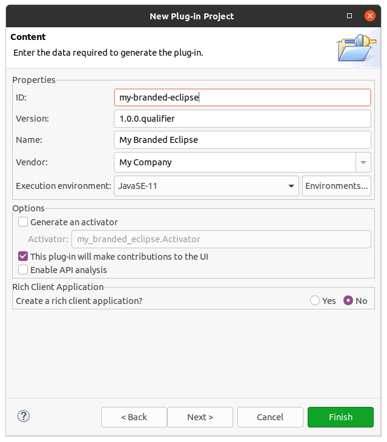

.. _sdk_6_brand_eclipse:

Branding an Eclipse IDE
=======================

Eclipse IDE allows to create custom versions of its distribution.
This can be very convenient if you need to redistribute your own unique Eclise IDE version, customized to your brand.

This tutorial will guide you through the steps to create such a branded Eclipse IDE.

Install Eclipse and the MicroEJ Plugin
--------------------------------------

- Download the `Eclipse IDE for RCP and RAP Developers Edition <https://www.eclipse.org/downloads/packages/release/2023-09/r/eclipse-ide-rcp-and-rap-developers>`__.
- Install and launch it.
- Install the MicroEJ plugin as described in the ``Eclipse`` tab of the :ref:`sdk_6_install_ide_plugin` chapter.

Create the Project
------------------

Once everything is installed, the first step is to create the project:

- Click on :guilabel:`File` > :guilabel:`New` > :guilabel:`Plug-in Project`.
- Fill the :guilabel:`Project name` field, for example ``my-branded-eclipse``.
- Click on the :guilabel:`Next` button.
- Change the version, the name and the vendor if necessary.

    Creation of a Branding Eclipse Project

- Click on the :guilabel:`Finish` button.
- Create a folder named ``images`` at the root of the project. 
  It will contain the branding resources described later in this tutorial.

Configure the Product
---------------------

- Right-click on the project, then click on :guilabel:`New` > :guilabel:`Other...`.
- Select :guilabel:`Plug-in Development` > :guilabel:`Product Configuration`.
- Click on the :guilabel:`Next` button.
- Set a file name, for example ``eclipse``.
- Click on the :guilabel:`Finish` button. The Product configuration file should be created and opened now.

- In the :guilabel:`Overview` tab

  - In the :guilabel:`Product` field, click on :guilabel:`New...`.
  - Set a value in the :guilabel:`Product Name` field, for example ``My Branded Eclipse``.
  - Select the project in the :guilabel:`Defining Plug-in` field.
  - Set a value in the :guilabel:`Product ID` field, for example ``product``.
  - In the :guilabel:`Application` field, select ``org.eclipse.ui.ide.workbench``.
  - Click on the :guilabel:`Finish` button.
  
- In the :guilabel:`Contents` tab

  - For each of the following terms, click on :guilabel:`Add...`, type the term in the field, 
    then select all the items in the list and click on the :guilabel:`Add` button::

      jdt
      microej
      egit
      buildship
      mpc
      mylyn
      org.eclipse.ui.ide.application
      <plugin-name> (``my-branded-eclipse`` for the example values used previously)

  - Click on :guilabel:`Add Required Plug-ins`.

- In the :guilabel:`Configuration` tab

  - Click on the :guilabel:`Add Recommended...` button.
  - Click on the :guilabel:`OK` button.

- In the :guilabel:`Launching` tab

  - If you want to change the default name of the Eclipse launch executable (defaults to ``eclipse``), set the :guilabel:`Launcher Name` field with the new name.
  - If you want to change the icon files of the Eclipse launch executable file,

    - Copy the image file(s) of the IDE launcher in the ``images`` folder. 
      The image format depends on the Operating System: 
      
        - ``icon.xpm`` for Linux
        - ``icon.icns`` for macOS
        - ``icon.ico`` file or ``icon.bmp`` files for Windows. 

      For Windows, if ``bmp`` files are used, it is required to provide one ``bmp`` file for each one of the following resolutions: 
      16x16 (8-bit), 16x16 (32-bit), 32x32 (8-bit), 32x32 (32-bit), 48x48 (8-bit), 48x48 (32-bit), 256x256 (32-bit).

    - Select the icon files for the targeted Operating Systems. Make sure the paths are the relative paths from the project root folder.

- In the :guilabel:`Splash` tab

  - If you want to change the default splash screen displayed at startup,

      - Copy the image file of the splash screen at the root of the project. The following name and image types are supported:

        - ``splash.png``
        - ``splash.jpg``
        - ``splash.jpeg``
        - ``splash.gif``
        - ``splash.bmp``

        The recommended size for the splash screen is 455x295.

      - In the :guilabel:`Plug-in` field, click on the :guilabel:`Browse...` button.
      - Select the plugin of the project (``my-branded-eclipse`` in our example).
  - If you want to change the splash screen behavior, adapt the other options in the  :guilabel:`Customization` section to your need. 
    For example you may want to add a progress bar in the splash screen by checking the option :guilabel:`Add a progress bar`.

- In the :guilabel:`Branding` tab (make sure the image paths are the relative paths from the project root folder)

  - If you want to change the default application window icon (visible in the Windows dock for example),

    - Copy the image files associated with the application window in the ``images`` folder. 
      The image format must be ``png``, with one ``png`` file for each one of the following resolutions: 16x16, 32x32, 48x48, 64x64, 128x128, 256x256.
    - For each field in the :guilabel:`Window Images` section, select the corresponding image.

  - If you want to content of the ``About`` dialog (visible in :guilabel:`Help` > :guilabel:`About...`),

    - Copy the ``About`` dialog image in the ``images`` folder. 
      This image must be in ``png`` format and should not exceed 500x330.
    - In the :guilabel:`About Dialog` section, select the image and fill the text.
      The text is not shown if the image exceeds 250x330.

    .. figure:: images/eclipse-branding-window-images.png
        :alt: Branding Tab of a Branding Eclipse Project
        :align: center
        :scale: 70%

        Branding Tab of a Branding Eclipse Project

- Save the Product file.
- Go back to the :guilabel:`Overview` tab and click on :guilabel:`Synchronize` in the :guilabel:`Testing` section.

Your project should look like this at this stage:

  .. figure:: images/eclipse-branding-project-structure.png
      :alt: Structure of a Branding Eclipse Project
      :align: center
      :scale: 70%

      Structure of a Branding Eclipse Project

Advanced Options
----------------

Eclipse provides several other options to customize an Eclipse Product 
that can be defined in the ``plugin_customization.ini`` file located at the root of the project.
Create this file if it does not exist in your project.

Then you can define any option, for example to set the default perspective to the Java perspective::

  org.eclipse.ui/defaultPerspectiveId=org.eclipse.jdt.ui.JavaPerspective

Here is a list of interesting options:

.. list-table:: 
    :widths: 25 65 15
    :header-rows: 1

    * - Name
      - Description
      - Default
    * - org.eclipse.ui/SHOW_PROGRESS_ON_STARTUP
      - Show progress bar in the splash screen.
      - ``false``
    * - org.eclipse.ui/defaultPerspectiveId
      - Perspective that the workbench opens initially.
      - ``org.eclipse.ui.resourcePerspective``

Export the Product
------------------

The final step is to export the project as an Eclipse Product:

- Open the ``build.properties`` file, and make sure to select the :guilabel:`Build` tab.
- In the :guilabel:`Binary Build` section, select:

  - ``META-INF`` folder
  - ``plugin.xml`` file
  - ``splash.bmp`` file
  - ``images`` folder
  - ``plugin_customization.ini`` file (if exists)

- Save your changes in the ``build.properties`` file.

- Right-click on the project, then click on :guilabel:`Export...`.
- Select :guilabel:`Plug-in Developement` > :guilabel:`Eclipse product`, then click on the :guilabel:`Next` button.
- In the :guilabel:`Configuration` field, select the ``.product`` file.
- In the :guilabel:`Synchronization` section, make sure the :guilabel:`Synchronize before exporting` option is checked.
- In the :guilabel:`Directory` field of the :guilabel:`Destination` section, select the destination folder.
- Click on the :guilabel:`Finish` button.

Once the process is done, you should find the new branded Eclipse IDE in the destination folder.

..
   | Copyright 2008-2023, MicroEJ Corp. Content in this space is free 
   for read and redistribute. Except if otherwise stated, modification 
   is subject to MicroEJ Corp prior approval.
   | MicroEJ is a trademark of MicroEJ Corp. All other trademarks and 
   copyrights are the property of their respective owners.
