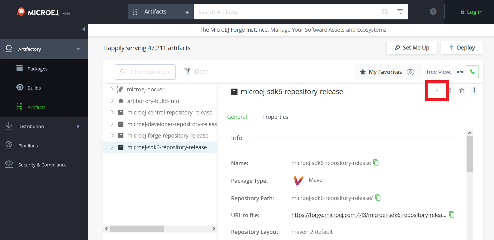

.. _sdk_6_offline_repository:

Creating and Using an Offline Repository
========================================

Developing MicroEJ projects requires the Gradle plugins used for the build, 
as well as the modules (Add-On Libraries, Foundation Libraries, ...) used by the project code.
All these artifacts must be available in artifact repositories.

MicroEJ provides them as online repositories which can be used directly, 
thanks to the configuration described in the :ref:`sdk_6_configure_repositories` section.
However, it is not always possible to rely on these online repositories.
Gradle allows to use repositories packaged as a set of local folders and files, called Offline Repositories.

This tutorial explains how to create and use Offline Repositories for your MicroEJ project.

Offline Repository for the Gradle Plugins
-----------------------------------------

The first step is to create an Offline Repository for the Gradle plugins.
The artifacts of the Gradle plugins are available in the SDK 6 Forge repository.

- Go to the `SDK 6 repository <https://forge.microej.com/ui/repos/tree/General/microej-sdk6-repository-release>`__.
- Click on the :guilabel:`Download` button:

    Download SDK 6 Gradle Plugins Repository

- In the upcoming popup, check the :guilabel:`Include Checksum Files` checkbox.
- Click on :guilabel:`Download`.

Now that the Offline Repository of the Gradle plugins has been retrieved, you can configure your projects to use it:

- Unzip the downloaded archive at the location of your choice, for example in the ``C:\sdk6-repository`` folder.
- Add the following repositories declaration in :ref:`your repositories configuration script <sdk_6_configure_repositories>`, 
  inside the ``pluginManagement > repositories`` block:

.. code:: java

  pluginManagement {
    repositories {
  
      ...

      maven {
          name = "offlineSDKRepositoryMaven"
          url = uri("C:\\sdk6-repository")
      }
      ivy {
          name = "offlineSDKRepositoryIvy"
          url = uri("C:\\sdk6-repository")
          patternLayout {
              artifact("[organisation]/[module]/[revision]/[artifact]-[revision](-[classifier])(.[ext])")
              ivy("[organisation]/[module]/[revision]/ivy-[revision].xml")
              setM2compatible(true)
          }
      }

      ...

    }
  }

Offline Repository for the Modules
----------------------------------

There are 2 ways to create an Offline Repository containing the required modules:

- download an existing online repository.
- create a SDK 5 offline repository project to create a custom repository.

Download an existing online repository
######################################

A quick way to get an Offline Repository for the modules is to download an existing online repository.
MicroEJ provides several repositories, the main one being the :ref:`Central Repository <central_repository>`.

If this online repository, or another one, contains all the module required for your project, download it. 
For example for the Central Repository, go to `its location <https://forge.microej.com/ui/repos/tree/General/microej-central-repository-release>`__ 
and click on the :guilabel:`Download` button.

Now go to :ref:`this section <sdk_6_use-offline-modules-repository>` to configure your project to use it.

Custom Offline Repository
#########################

If you need a custom Offline Repository (for example because the available online repositories 
does not contain all the modules required by your project, or you want to control exactly what contains the repository),
you can create your own.
This can be done only with SDK 5 for the moment, so refer to :ref:`this page <module_repository>`.

Once done, go to :ref:`this section <sdk_6_use-offline-modules-repository>` to configure your project to use it.

.. _sdk_6_use-offline-modules-repository:

Use an Offline Modules Repository
#################################

When the Offline Repository of the modules has been retrieved or created, you can configure your projects to use it:

- Unzip the Offline Repository archive at the location of your choice, for example in the ``C:\modules-repository`` folder.
- Add the following repositories declaration in :ref:`your repositories configuration script <sdk_6_configure_repositories>`, 
  inside the ``repositories`` block:

.. code:: java

  repositories {

    ...

    maven {
        name = "offlineModulesRepositoryMaven"
        url = uri("C:\\modules-repository")
    }
    ivy {
        name = "offlineModulesRepositoryIvy"
        url = uri("C:\\modules-repository")
        patternLayout {
            artifact("[organisation]/[module]/[revision]/[artifact]-[revision](-[classifier])(.[ext])")
            ivy("[organisation]/[module]/[revision]/ivy-[revision].xml")
            setM2compatible(true)
        }
    }

    ...

  }

..
   | Copyright 2008-2024, MicroEJ Corp. Content in this space is free 
   for read and redistribute. Except if otherwise stated, modification 
   is subject to MicroEJ Corp prior approval.
   | MicroEJ is a trademark of MicroEJ Corp. All other trademarks and 
   copyrights are the property of their respective owners.
